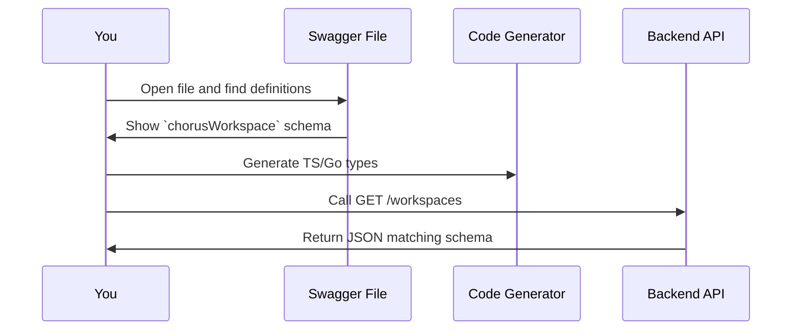

# Chapter 1: Domain Model Schemas

Welcome! In this first chapter we’ll learn about **Domain Model Schemas**—the blueprints that describe all the data shapes our backend sends and receives. Understanding these schemas is like having the floor plan before building a house: you know exactly what rooms (fields) to expect.

## Why Domain Model Schemas Matter

Imagine you want to display a list of workspaces on your frontend. What fields does each workspace have? Names, IDs, creation dates? Domain Model Schemas spell this out for you:

- They live in each Swagger (OpenAPI) file under a `definitions:` section.
- They list core objects like `chorusUser`, `chorusApp`, `chorusWorkspace`, and more.
- They tell you each field’s name, data type, and format.

With schemas in hand, you won’t guess what data arrives—you’ll know.

## Key Concepts

1. **Swagger File**  
   A YAML file (e.g., `api/openapiv2/v1-tags/user-service/apis.swagger.yaml`) that describes endpoints and schemas.

2. **definitions**  
   A section where each domain object is defined:
   ```yaml
   definitions:
     chorusUser:
       type: object
       properties:
         id:
           type: string
           format: uint64
         firstName:
           type: string
         lastName:
           type: string
         username:
           type: string
   ```
   Here `chorusUser` has four fields.

3. **Property**  
   Each field has:
   - a **name** (`firstName`)
   - a **type** (`string`)
   - sometimes a **format** (`date-time`, `uint64`)

## Reading a Schema: A Tiny Example

Say you open the `chorusWorkspace` schema:
```yaml
chorusWorkspace:
  type: object
  properties:
    id:
      type: string
      format: uint64
    name:
      type: string
    description:
      type: string
    createdAt:
      type: string
      format: date-time
```
That tells you every workspace object will come with:
- `id` (a numeric string)
- `name` and `description` (text)
- `createdAt` (timestamp)

### Real-world JSON Response

If you call `GET /api/rest/v1/workspaces`, you might see:
```json
{
  "result": [
    {
      "id": "42",
      "name": "Research Lab",
      "description": "Lab for experiments",
      "createdAt": "2023-07-01T12:34:56Z"
    }
  ]
}
```
Everything matches the schema you just read!

## How It Works Internally

### Step-by-Step Walkthrough

1. **Client (you)** reads the Swagger file.
2. You find the `definitions` section and pick the object you care about (e.g., `chorusWorkspace`).
3. Armed with field names and types, you write code or generate types.
4. When you call an endpoint, data arrives matching that blueprint.

#### Sequence Diagram



### Peek Under the Hood

Inside `api/openapiv2/v1-tags/workspace-service/apis.swagger.yaml` you’ll see:
```yaml
definitions:
  chorusWorkspace:
    type: object
    properties:
      id:
        type: string
        format: uint64
      name:
        type: string
      createdAt:
        type: string
        format: date-time
```
The Swagger generator reads that and can produce a Go struct or TypeScript interface like:
```go
type ChorusWorkspace struct {
  ID          string    `json:"id"`
  Name        string    `json:"name"`
  CreatedAt   time.Time `json:"createdAt"`
}
```

## Summary

- **Domain Model Schemas** live in Swagger definitions and list every field on core objects.  
- They help you know exactly what to expect from the API so you can write safe, type-aware code.  
- Next, we’ll see how these definitions connect to actual API endpoints in [Chapter 2: Service API Definitions](02_service_api_definitions_.md).  

Happy coding!

---

Generated by [AI Codebase Knowledge Builder](https://github.com/The-Pocket/Tutorial-Codebase-Knowledge)