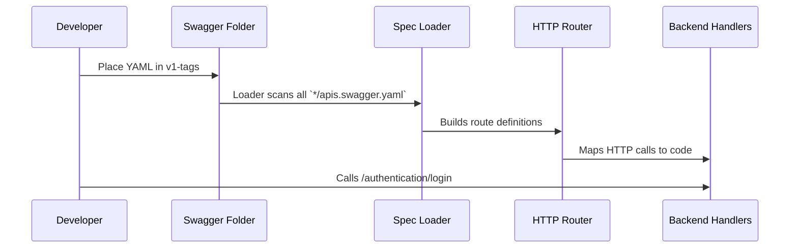

# Chapter 2: Service API Definitions

In [Chapter 1: Domain Model Schemas](01_domain_model_schemas_.md) we learned how each data shape (like `chorusUser` or `chorusWorkspace`) is defined. Now it’s time to discover **Service API Definitions**—the part of our backend that lists all the available “dishes” (endpoints), how to order them (parameters), what you get back (responses), and any “restaurant rules” (security).

## Why Service API Definitions Matter

Imagine you walk into a restaurant. You don’t know what’s available until you see the menu. Service API Definitions are that menu for your frontend:

- They live as Swagger (OpenAPI v2) YAML files under `api/openapiv2/v1-tags`.
- Each folder (e.g. `authentication-service`, `user-service`) holds a file called `apis.swagger.yaml`.
- They describe each endpoint, how to call it, what it returns, and security requirements.
- Frontend and tooling use these files as a **contract**—no guessing, just follow the spec.

## A Simple Use Case: Calling the Login Endpoint

Suppose you need to add a “Log In” button. How do you know:

1. Which URL to call?
2. What HTTP method?
3. What body to send?
4. What response to expect?

All of this lives in the **AuthenticationService** Swagger file.

### 1. Find the Right Folder

```bash
$ ls api/openapiv2/v1-tags
authentication-service  user-service  app-service  …  
```

This shows all services. We pick `authentication-service`.

### 2. Open the Swagger File

```yaml
# api/openapiv2/v1-tags/authentication-service/apis.swagger.yaml
swagger: "2.0"
info:
  title: chorus authentication service
paths:
  /api/rest/v1/authentication/login:
    post:
      summary: Authenticate
      parameters:
        - in: body
          name: body
          schema:
            $ref: '#/definitions/chorusCredentials'
      responses:
        "200":
          description: Returns a token
          schema:
            $ref: '#/definitions/chorusAuthenticationReply'
      security: []          # public endpoint
```

Explanation:
- Path `/api/rest/v1/authentication/login` with HTTP method `post`.
- It takes a JSON body referring to `chorusCredentials` (username & password).
- On success you get back a `chorusAuthenticationReply` (which holds a token).
- `security: []` means no token is needed to call it.

## Key Concepts Breakdown

1. **swagger**  
   Declares the OpenAPI version (always `"2.0"` here).

2. **info**  
   Title, version, contact—metadata you can mostly leave alone.

3. **paths**  
   Each URL path and its supported HTTP methods (`get`, `post`, `put`, etc.).

4. **parameters**  
   Where to put each input:
   - `in: path` for URL segments
   - `in: query` for `?limit=10`
   - `in: body` for JSON payloads

5. **responses**  
   Status codes (`"200"`, `default`) and which schema they return.

6. **securityDefinitions** & **security**  
   Define authentication methods (e.g., Bearer token in header).

## How to Use This in Your Frontend

1. Read the Swagger spec for your service.
2. Find the path and method you need.
3. Generate or write a client call matching parameters.
4. Handle the response according to the schema.

Example: calling login in JavaScript:

```js
fetch('/api/rest/v1/authentication/login', {
  method: 'POST',
  headers: { 'Content-Type': 'application/json' },
  body: JSON.stringify({ username:'alice', password:'secret' })
})
  .then(res => res.json())
  .then(data => console.log('Got token:', data.result.token));
```

This code exactly matches the spec we saw.

## What Happens Under the Hood

When the backend runs, it loads all these Swagger files, wires up HTTP handlers, and enforces the rules you saw. Here’s a high-level walkthrough:



### A Peek at the Loader Code

Here’s a **simplified** snippet showing how the backend might load specs:

```go
// main.go (simplified)
func loadAllSpecs() {
  files, _ := filepath.Glob("api/openapiv2/v1-tags/*/apis.swagger.yaml")
  for _, path := range files {
    doc, _ := loads.Spec(path)        // parse YAML
    api := operations.NewMyAPI()      // create API object
    restapi.ServeSwaggerFile(doc)     // mount routes
  }
}
```

Explanation:
- `Glob` finds every Swagger file.
- `loads.Spec` reads and parses each YAML.
- The router uses that spec to know which URLs exist and how to validate them.
- Behind the scenes, handlers are hooked based on `operationId`.

## Summary

- **Service API Definitions** are your menu of endpoints, parameters, responses, and security.
- They live under `api/openapiv2/v1-tags/{service}/apis.swagger.yaml`.
- Reading them tells you exactly how to call our backend.
- Next, we’ll set up your **development database** so those calls have data to work with.

Onward to [Chapter 3: Development Database Setup](03_development_database_setup_.md)!

---

Generated by [AI Codebase Knowledge Builder](https://github.com/The-Pocket/Tutorial-Codebase-Knowledge)