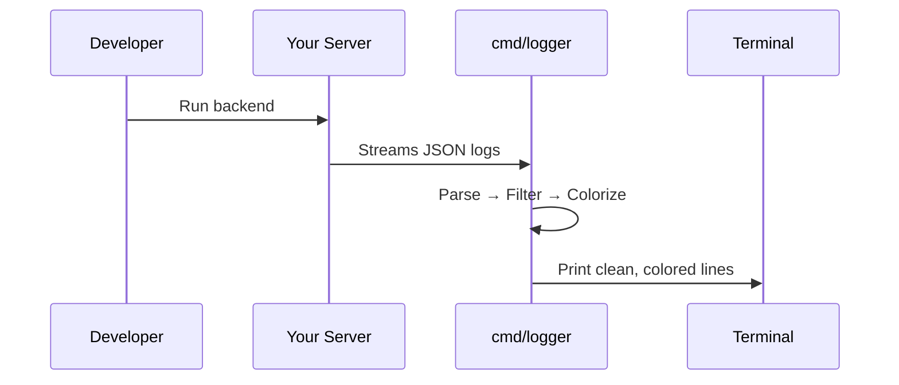

# Chapter 4: Logger Tool

In [Chapter 3: Development Database Setup](03_development_database_setup_.md) we learned how to spin up a local Postgres database for our backend. Now let’s tackle another everyday pain point: reading and understanding the flood of JSON logs your server spits out. Enter the **Logger Tool**!

## Why a Logger Tool?

Imagine you’re planting a garden and every time you water a plant you scribble down a note in a notebook. Soon you have a pile of pages with tiny handwriting—hard to scan and find the important warnings (“plants dying!”). Our backend writes each log as a JSON object with many fields. Reading raw JSON is like reading that messy notebook. We need a helper that:

- Highlights critical messages (`error`, `fatal`) in red.
- Marks general info in green.
- Hides boring noise (timestamps for every database field, metadata you don’t care about).
- Shows only the keys and values you actually need.

That’s exactly what **cmd/logger** does: it reads JSON logs from stdin, filters out noisy fields, applies colors by log level, and prints clean, human-friendly lines to your console.

## Key Concepts

1. **Reading from stdin**  
   The tool listens on standard input—so you can pipe logs into it.

2. **JSON parsing**  
   Each line is parsed into a map of key/value pairs.

3. **Blacklisting & Whitelisting**  
   We maintain two sets:
   - **blacklist**: fields to hide (e.g., `grpc_log`, `user_agent`).
   - **whitelist**: extra fields to always show (e.g., `errorVerbose`).

4. **Color mapping**  
   Depending on the log’s `level`, we choose a terminal color:
   - `error`, `fatal` → red  
   - `warn` → yellow  
   - `info` → green  
   - `debug` → cyan  

5. **Formatted output**  
   We print the timestamp (`ts`), the main message (`msg`), then any extra fields you care about.

## Using the Logger Tool

Here’s a simple example. Suppose your app writes this raw JSON log:

```json
{"level":"error","ts":"2023-07-01T12:00:00Z","msg":"Failed to load user","detail":"File not found","grpc_log":"..." }
```

To run the logger:

```bash
cat server.log \
  | go run cmd/logger/main.go
```

Output in your terminal (colors shown conceptually):

  *[red]*2023-07-01T12:00:00Z - Failed to load user*[end]*
      detail
      File not found

Notice how:
- The `error` message is red.
- We only see the `detail` field, not every metadata key.

## Inside the Logger: Step-by-Step

Below is a high-level sequence of what happens when you pipe logs into `cmd/logger`:



1. **Scan stdin** line by line.  
2. **Parse** each line as JSON.  
3. **Determine color** by `level`.  
4. **Print summary** (`ts - msg`) with color.  
5. **Loop over fields**:
   - Skip anything in **blacklist**.
   - Always show **whitelisted** fields at the end.
   - Print key/value in a dim gray color.  
6. **Blank line** for readability.

## A Peek at the Code

Let’s break `cmd/logger/main.go` into bite-sized pieces.

### 1. Scanning & Parsing

```go
scanner := bufio.NewScanner(os.Stdin)
for scanner.Scan() {
    line := scanner.Text()
    var entry map[string]interface{}
    if err := json.Unmarshal([]byte(line), &entry); err != nil {
        // If it's not valid JSON, just print it raw
        fmt.Println(line)
        continue
    }
    // entry now holds our log fields
    // …next: color and print…
}
```

This loop reads each line, tries to parse JSON, and skips to the next if parsing fails.

### 2. Picking a Color

```go
var color string
switch entry["level"] {
case "fatal", "error":
    color = colorMap["red"]
case "warn":
    color = colorMap["yellow"]
case "info":
    color = colorMap["green"]
case "debug":
    color = colorMap["cyan"]
default:
    color = ""
}
endColor := colorMap["end"]
```

Depending on `level`, we tag our output with ANSI codes for color.

### 3. Printing the Header

```go
ts  := entry["ts"]
msg := entry["msg"]
fmt.Printf("%s%s%s - %s\n", color, ts, endColor, msg)
```

This shows:
  [color]timestamp[end] - main message

### 4. Filtering Extra Fields

```go
for key, value := range entry {
    // Skip keys we don’t want
    if _, hide := blacklist[key]; hide {
        continue
    }
    // Will handle whitelisted fields later
    if _, special := whitelist[key]; special {
        continue
    }
    // Only print non-empty string values
    if str, ok := value.(string); ok && str != "" {
        fmt.Printf("    %s: %s\n", key, str)
    }
}
// Now print whitelisted fields at the end
for key := range whitelist {
    if v, ok := entry[key].(string); ok && v != "" {
        fmt.Printf("    %s: %s\n", key, v)
    }
}
fmt.Println("") // blank line between logs
```

We hide the clutter, then show any extra bits you really asked for.

## Conclusion

You’ve learned how **cmd/logger** makes your JSON logs human-friendly by filtering out noise, colorizing by severity, and neatly formatting each entry. With cleaner logs, debugging feels more like reading a friendly guide than deciphering a codebook.

Next up: see how all this plugs into our server’s startup in [Chapter 5: Main Application Entrypoint](05_main_application_entrypoint_.md).

---

Generated by [AI Codebase Knowledge Builder](https://github.com/The-Pocket/Tutorial-Codebase-Knowledge)