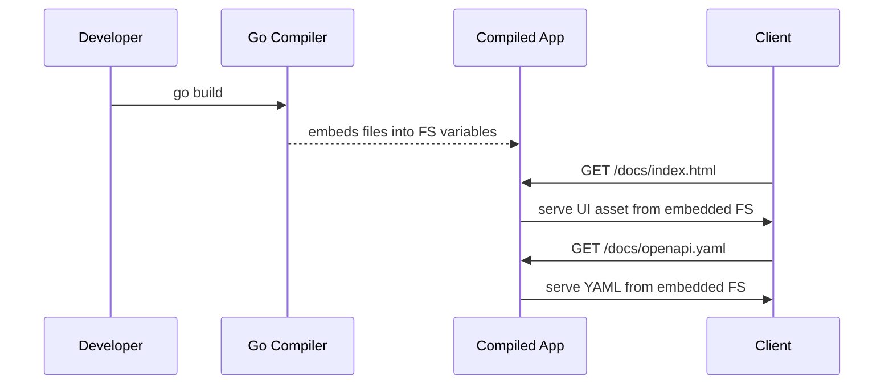

# Chapter 6: OpenAPI & UI Embedding

In [Chapter 5: Main Application Entrypoint](05_main_application_entrypoint_.md) we learned how to start our server. Now let’s make our lives even easier by **packing our API docs and Swagger UI right inside the binary**. No more hunting for files on disk—just build once and your docs travel with you.

## Why Embed OpenAPI & UI?

Imagine you want to show your team a live API playground. Normally you’d need to copy a folder of HTML/CSS/JS and YAML files onto each server. That’s like packing loose papers in your suitcase that might fall out. With Go’s `embed.FS`, you tuck everything neatly inside the binary—your docs become part of the executable, ready to serve at `/docs` without any extra setup.

## Key Concepts

1. **embed.FS**  
   A filesystem in Go that lives inside your compiled program.

2. **//go:embed directive**  
   A special comment that tells the compiler which files or folders to include.

3. **fs.Sub**  
   A helper to select a subfolder inside an `embed.FS`.

4. **http.FileServer**  
   The standard way in Go to serve static files over HTTP.

## How to Use It: A Step-by-Step Guide

### 1. Declare Embedded Files

Create a file `api/embed.go`:

```go
package embed

import (
  "embed"
)

//go:embed openapiv2/ui/*
// UIEmbed holds all Swagger UI web assets
var UIEmbed embed.FS

//go:embed openapiv2/v1-tags/*
// APIEmbed holds the raw YAML definitions
var APIEmbed embed.FS
```

This tells Go to bundle everything under those two folders into the binary.

### 2. Register HTTP Handlers

In your initialization code (for example in `internal/api/swagger.go`), mount two routes:

```go
import (
  "io/fs"
  "net/http"
  "github.com/your/module/api/embed"
)

// RegisterSwaggerUI adds routes to serve UI and YAML
func RegisterSwaggerUI(mux *http.ServeMux) error {
  // Serve UI at /docs/
  uiFS, _ := fs.Sub(embed.UIEmbed, "openapiv2/ui")
  mux.Handle("/docs/",
    http.StripPrefix("/docs/", http.FileServer(http.FS(uiFS))),
  )

  // Serve main API YAML at /docs/openapi.yaml
  apiFS, _ := fs.Sub(embed.APIEmbed, "openapiv2/v1-tags/1_swagger_annotations")
  mux.HandleFunc("/docs/openapi.yaml", func(w http.ResponseWriter, r *http.Request) {
    data, _ := apiFS.ReadFile("apis.swagger.yaml")
    w.Header().Set("Content-Type", "application/yaml")
    w.Write(data)
  })
  return nil
}
```

Explanation:
- We extract sub-directories from the embedded FS.
- We mount static UI at `/docs/`.
- We serve the YAML file at `/docs/openapi.yaml` so Swagger UI knows where to load the spec.

### 3. Hook It Into Startup

In your main setup (`cmd/chorus`), after you build the HTTP mux:

```go
mux := http.NewServeMux()
// ... register other handlers ...
_ = RegisterSwaggerUI(mux)
http.ListenAndServe(":8080", mux)
```

Now when you run:
```
go run cmd/chorus/main.go
```
browsing to http://localhost:8080/docs will show the Swagger UI, loading the embedded YAML automatically.

## What Happens Under the Hood?



1. **Compile time**: `//go:embed` packages folders into `embed.FS`.  
2. **Run time**: HTTP handlers wrap that FS so requests are served from within the binary.  
3. **User** sees a live Swagger UI without any external files.

## Summary

In this chapter you learned how to:

- Use Go’s `embed.FS` and `//go:embed` to bundle static assets and API specs.  
- Mount an embedded filesystem with `fs.Sub` and `http.FileServer`.  
- Serve a self-contained Swagger UI at `/docs` with zero extra setup.

Next up: learn how to talk to your backend over gRPC from a client in [Chapter 7: gRPC Client Example](07_grpc_client_example_.md).

---

Generated by [AI Codebase Knowledge Builder](https://github.com/The-Pocket/Tutorial-Codebase-Knowledge)