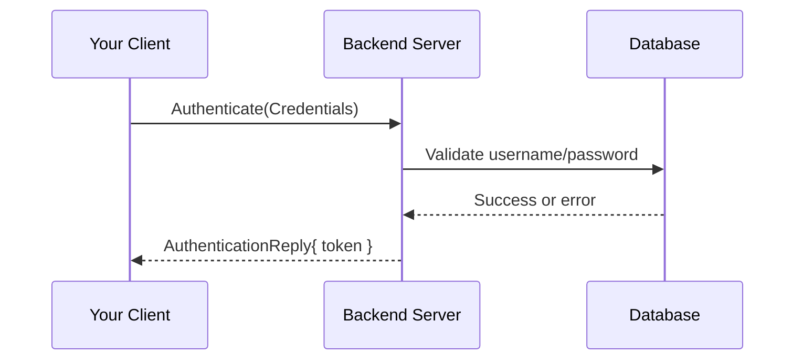

# Chapter 7: gRPC Client Example

In [Chapter 6: OpenAPI & UI Embedding](06_openapi___ui_embedding_.md) we saw how to serve our REST docs and UI. Now let’s explore how an external program can talk to our backend over **gRPC**. We’ll build a tiny Go client that connects to the gRPC server and calls the **Authenticate** method to log in and retrieve a token.

## Why a gRPC Client?

Imagine you have a mobile app or another service that needs to log in programmatically. Instead of writing raw HTTP calls, gRPC gives you:

- **Typed methods** (no guessing JSON shapes).
- **Auto-generated stubs** so you call Go functions directly.
- **High performance** with HTTP/2 and binary frames.

Our use case:  
> Write a command-line tool that sends user credentials and prints the returned token.

We’ll use the code in `cmd/grpc-client/main.go` as our guide, but simplify it step by step.

---

## Key Concepts

1. **Connection (grpc.Dial)**  
   Opens a channel to the server (host:port).

2. **Generated Stub**  
   Code under `internal/api/v1/chorus` gives you a Go interface:
   ```go
   type AuthenticationServiceClient interface {
     Authenticate(ctx context.Context, in *Credentials, opts ...grpc.CallOption) (*AuthenticationReply, error)
   }
   ```

3. **Context with Timeout**  
   Ensures the call won’t hang forever.

4. **Request & Response Messages**  
   Protobuf structs like `Credentials` and `AuthenticationReply`.

---

## Building the Client: Step by Step

### 1. Parse Flags for Server Address

```go
address := flag.String("server", "localhost:9090", "gRPC server host:port")
flag.Parse()
```
This lets you run:
```
go run cmd/grpc-client/main.go --server localhost:9090
```

### 2. Dial the Server

```go
conn, err := grpc.Dial(*address, grpc.WithInsecure())
if err != nil {
  log.Fatalf("could not connect: %v", err)
}
defer conn.Close()
```
We use `WithInsecure()` for simplicity (no TLS).

### 3. Create the Service Client

```go
client := chorus.NewAuthenticationServiceClient(conn)
```
Here, `chorus` is the Go package generated from our Protobuf definitions.

### 4. Prepare Context and Request

```go
ctx, cancel := context.WithTimeout(context.Background(), 5*time.Second)
defer cancel()

req := &chorus.Credentials{
  Username: "chorus-admin",
  Password: "superpassword",
}
```
A 5-second timeout ensures we fail fast if the server is unreachable.

### 5. Call Authenticate and Print Result

```go
res, err := client.Authenticate(ctx, req)
if err != nil {
  log.Fatalf("authentication failed: %v", err)
}
log.Printf("Token: %s", res.Result.Token)
```
On success you’ll see:
```
2023/08/15 14:00:00 Token: eyJhbGciOiJIUzI1Ni...
```

---

## What Happens Under the Hood



1. **Client** calls `Authenticate` stub.  
2. gRPC server decodes the request, invokes our handler.  
3. Handler checks credentials in the database.  
4. Server returns a token in `AuthenticationReply`.  
5. Client prints the token.

---

## Peek at the Generated Stub

In `internal/api/v1/chorus/authentication.pb.go` you’ll find something like:

```go
// AuthenticationServiceClient is the client API for AuthenticationService.
type AuthenticationServiceClient interface {
  Authenticate(ctx context.Context, in *Credentials, opts ...grpc.CallOption) (*AuthenticationReply, error)
}
```

- **Credentials** and **AuthenticationReply** are simple Go structs with your fields.  
- You never hand-write serialization: gRPC does it for you.

---

## Complete Example in One File

Below is a minimal `cmd/grpc-client/main.go`. It fits under 20 lines by focusing only on essentials:

```go
package main

import (
  "context"; "flag"; "log"; "time"
  "github.com/CHORUS-TRE/chorus-backend/internal/api/v1/chorus"
  "google.golang.org/grpc"
)

func main() {
  addr := flag.String("server", "localhost:9090", "")
  flag.Parse()
  conn, _ := grpc.Dial(*addr, grpc.WithInsecure())
  client := chorus.NewAuthenticationServiceClient(conn)
  ctx, cancel := context.WithTimeout(context.Background(), 5*time.Second)
  defer cancel()
  req := &chorus.Credentials{"chorus-admin", "superpassword"}
  res, err := client.Authenticate(ctx, req)
  if err != nil { log.Fatal(err) }
  log.Println("Token:", res.Result.Token)
}
```

---

## Summary

In this chapter you learned how to:

- Dial a gRPC server with `grpc.Dial`.  
- Use the generated `AuthenticationServiceClient` stub.  
- Send a `Credentials` message and receive an `AuthenticationReply`.  
- Handle contexts and timeouts for robust calls.

Next up, we’ll see how to package and copy Docker images efficiently in [Chapter 8: Docker Image Copying Tool](08_docker_image_copying_tool_.md).

---

Generated by [AI Codebase Knowledge Builder](https://github.com/The-Pocket/Tutorial-Codebase-Knowledge)