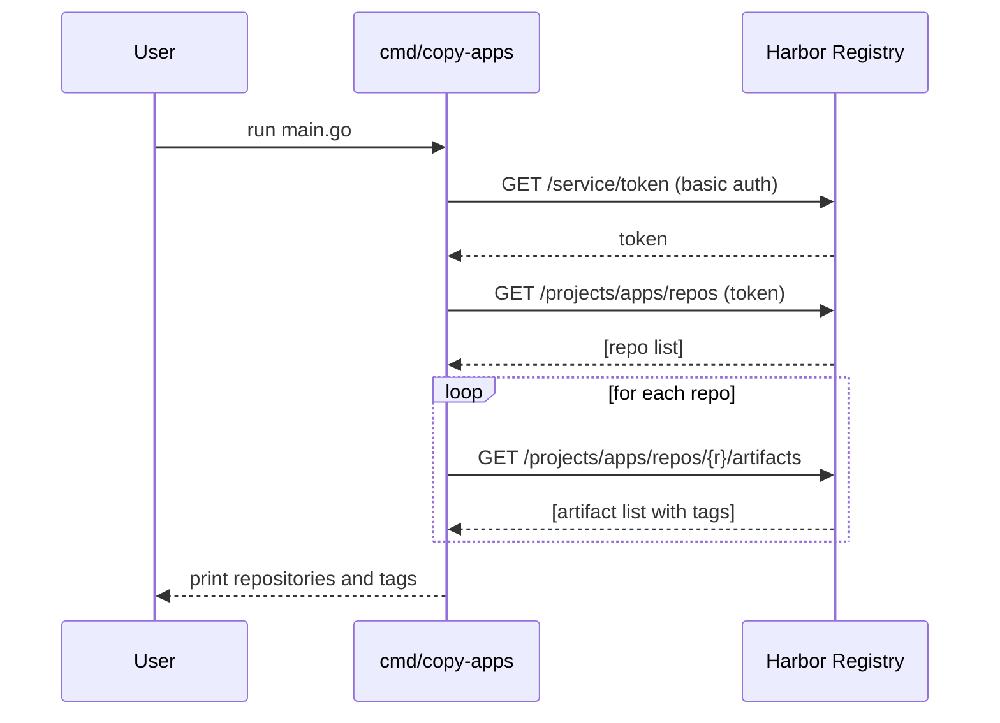

# Chapter 8: Docker Image Copying Tool

In [Chapter 7: gRPC Client Example](07_grpc_client_example_.md) we saw how to talk to our backend over gRPC. Now let’s switch gears and learn a niche but handy utility: **cmd/copy-apps**, a small Go program that “copies” or audits Docker images in a Harbor registry by listing repositories and their tags. Think of it as a librarian checking which books (tags) live on which shelves (repositories).

## Why This Tool Exists

Imagine you maintain dozens of container images under a Harbor project called `apps`. You might ask:

- Which repositories exist today?  
- Which tags does each repository have?  
- Do I need to clean up old images?

Manually clicking through a web UI is slow. Our `cmd/copy-apps` tool uses Harbor’s HTTP API to automate this check.

## Key Concepts

1. **Harbor HTTP API**  
   Harbor exposes endpoints under `/api/v2.0` to list projects, repositories, and artifacts.

2. **Authentication Token**  
   Before listing anything, we fetch a short-lived token from `/service/token` using basic auth.

3. **Listing Repositories**  
   Call `GET /api/v2.0/projects/{project}/repositories?page_size=100` to get repo names.

4. **Listing Tags**  
   For each repository, call `/artifacts?page_size=100` and collect all `tags`.

## Using the Tool

1. Clone the repo and open a terminal in project root.  
2. Set environment variables:
   ```
   export HARBOR_URL="https://harbor.mycompany.com"
   export HARBOR_PROJECT="apps"
   export HARBOR_USERNAME="myuser"
   export HARBOR_PASSWORD="mypassword"
   ```
3. Run:
   ```
   go run cmd/copy-apps/main.go
   ```
4. You’ll see output like:
   ```
   Repository: frontend, v1.0.0, v1.1.0, latest
   Repository: backend, v0.9.0, v1.0.0
   ```
   Each line shows a repository name followed by its tags.

## What Happens Under the Hood



1. **Fetch token** using your credentials.  
2. **List repositories** under the project.  
3. For each repo, **list artifacts** and extract all tag names.  
4. **Print** the results in a friendly format.

## Inside the Code

Here’s a minimal look at `cmd/copy-apps/main.go` (simplified):

```go
package main

import (
  "fmt"
  "os"
)

func main() {
  // 1. Read settings from env
  url  := os.Getenv("HARBOR_URL")
  proj := os.Getenv("HARBOR_PROJECT")
  user := os.Getenv("HARBOR_USERNAME")
  pass := os.Getenv("HARBOR_PASSWORD")

  // 2. Get all repositories
  repos, err := getRepositories(url, proj, user, pass)
  if err != nil {
    fmt.Println("Error:", err)
    return
  }

  // 3. For each repo, get tags and print
  for _, r := range repos {
    tags, _ := getTags(url, proj, r.Name, user, pass)
    fmt.Printf("Repository: %s", r.Name)
    for _, t := range tags {
      fmt.Printf(", %s", t)
    }
    fmt.Println()
  }
}
```

All the heavy lifting lives in two functions, `getRepositories` and `getTags`, which:

- Build the correct API URL.  
- Send an HTTP GET with basic auth (or token).  
- Parse the JSON response into Go structs.  

### Fetching a Token

```go
func getAuthToken(url, user, pass string) (string, error) {
  // Construct request to /service/token?...
  // Set basic auth headers
  // Read response body
  // Unmarshal {"token": "..."}
  return token, nil
}
```

### Listing Repositories

```go
func getRepositories(url, proj, user, pass string) ([]*Repository, error) {
  // Call GET /api/v2.0/projects/{proj}/repositories
  // Unmarshal into []Repository
  return repos, nil
}
```

### Listing Tags

```go
func getTags(url, proj, repo, user, pass string) ([]string, error) {
  // GET /api/v2.0/projects/{proj}/repositories/{repo}/artifacts
  // Each artifact has a .Tags slice
  // Collect all tag.Name values
  return tags, nil
}
```

If you peek at the real [code file](cmd/copy-apps/main.go), you'll see error checks and paging handling, but the core flow is as shown.

## Conclusion

In this chapter you learned how to build a small Go CLI that:

- Authenticates against Harbor’s HTTP API.  
- Lists all repositories in a project.  
- Retrieves all tags per repository.  
- Prints a neat, librarian-style audit of your container images.

This tool can be extended to actually mirror or delete images, but as-is it’s a great starting point for auditing.  

Happy exploring!

---

Generated by [AI Codebase Knowledge Builder](https://github.com/The-Pocket/Tutorial-Codebase-Knowledge)