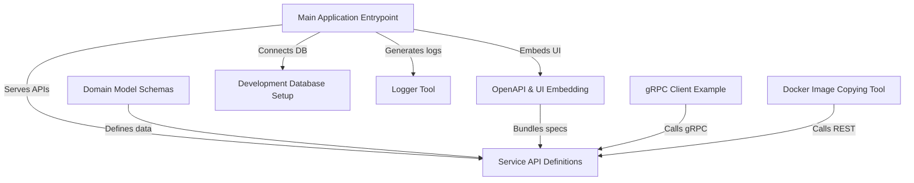

# Tutorial: chorus-backend

The **chorus-backend** is a *server application* built in Go that exposes both HTTP/REST and gRPC APIs for managing core resources like users, applications, and workspaces. It uses **OpenAPI** definitions and a **bundled Swagger UI** for interactive documentation, connects to a local or production **PostgreSQL** database, and produces structured JSON logs. Helper command-line tools illustrate how to call its APIs, process its logs, and interact with container registries.

**Source Repository:** [https://github.com/CHORUS-TRE/chorus-backend](https://github.com/CHORUS-TRE/chorus-backend)

## Chapters

1. [Domain Model Schemas
](01_domain_model_schemas_.md)
2. [Service API Definitions
](02_service_api_definitions_.md)
3. [Development Database Setup
](03_development_database_setup_.md)
4. [Logger Tool
](04_logger_tool_.md)
5. [Main Application Entrypoint
](05_main_application_entrypoint_.md)
6. [OpenAPI & UI Embedding
](06_openapi___ui_embedding_.md)
7. [gRPC Client Example
](07_grpc_client_example_.md)
8. [Docker Image Copying Tool
](08_docker_image_copying_tool_.md)

---

Generated by [AI Codebase Knowledge Builder](https://github.com/The-Pocket/Tutorial-Codebase-Knowledge)