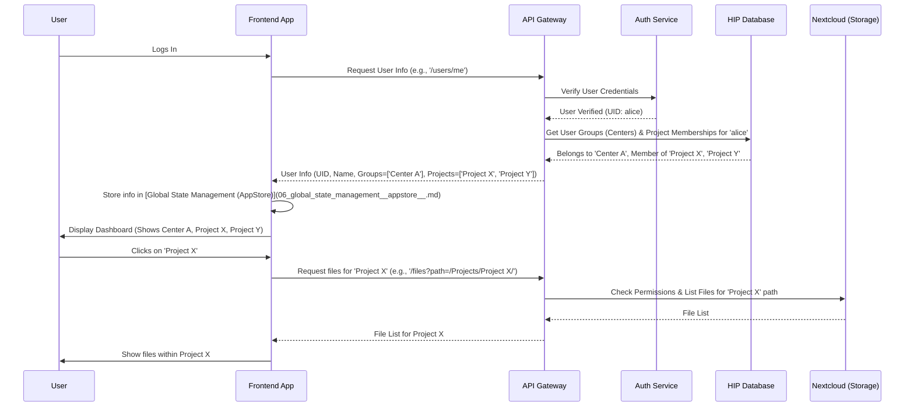

# Chapter 1: Project & Center Workspaces

Welcome to the HIP Tutorial! We're excited to guide you through the platform. Let's start with the basics: how HIP organizes your work and data.

Imagine you have a private office where you keep all your personal work files and equipment. This is your secure space. But sometimes, you need to work with colleagues on a specific task, maybe even colleagues from different departments or organizations. For this, you might use shared meeting rooms with whiteboards and projectors, accessible only to the team involved in that specific task.

HIP uses a similar idea with **Center Workspaces** and **Project Workspaces**.

## What Problem Do Workspaces Solve?

In research, especially involving sensitive data like medical images, you need different levels of access and collaboration:

1.  **Private Institutional Work:** You might have data that belongs to your institution or lab (your "Center"). You need a secure place to store, manage, and analyze this data, primarily accessible to members of your institution.
2.  **Collaborative Research:** Often, research involves teamwork across different institutions. You need a dedicated space to share specific datasets, analysis tools, and results *only* with the members of that particular collaboration (your "Project"), without giving them access to all your institution's private data.

HIP's Center and Project workspaces provide exactly this structure, ensuring data privacy while enabling flexible collaboration.

## Key Concepts: Center vs. Project

Let's break down these two types of workspaces:

### 1. Center Workspace (Your Private Office)

*   **What it is:** Think of this as your home base within HIP, usually representing your research institution, lab, or department (e.g., "University Hospital Neuroimaging Lab").
*   **Purpose:** It's primarily for managing data and resources specific to your institution. This is where your institution's private datasets might initially reside.
*   **Access:** Typically, only members verified as belonging to that institution can access its Center Workspace.
*   **Analogy:** Your secure, private office. Only you and your immediate colleagues (from the same institution) have keys.

You can see a list of participating centers in HIP. If you belong to one, you'll have access to its workspace.

```typescript
// src/components/Centers/index.tsx (Simplified)
import React, { useEffect, useState } from 'react';
import { getCenters } from '../../api/gatewayClientAPI'; // API call
import { HIPCenter } from '../../api/types'; // Data structure definition
import CenterCard from './CenterCard'; // Component to display a center

const CentersList = () => {
  const [centers, setCenters] = useState<HIPCenter[]>([]);

  useEffect(() => {
    // Fetch the list of all centers when the component loads
    getCenters()
      .then(fetchedCenters => {
        setCenters(fetchedCenters);
      })
      .catch(error => console.error("Error fetching centers:", error));
  }, []);

  return (
    <div>
      <h1>HIP Participating Centers</h1>
      {centers.map(center => (
        // Display each center using a dedicated component
        <CenterCard key={center.id} group={center} />
      ))}
    </div>
  );
};
```

This code snippet shows how the frontend might fetch (`getCenters`) and display (`CenterCard`) the list of available HIP Centers. The actual data for each center comes from the backend via the [API Client Layer](07_api_client_layer_.md).

### 2. Project Workspace (Shared Meeting Room)

*   **What it is:** A dedicated space created for a specific research study or collaboration. It has a defined goal and a specific list of members.
*   **Purpose:** To share data, metadata (information *about* the data), and computational resources (like virtual [Remote Desktops & App Management](04_remote_desktop___app_management_.md)) among collaborators, who might be from *different* Centers.
*   **Access:** Controlled by the project administrators. Only explicitly added members can access the project workspace, regardless of their home Center.
*   **Analogy:** A shared meeting room for a specific task force. You invite only the necessary people, and they get access only to what's needed for that task.

```typescript
// src/components/Projects/index.tsx (Simplified)
import React, { useEffect, useState } from 'react';
import { getProjects } from '../../api/projects'; // API call for projects
import { HIPProject } from '../../api/types'; // Data structure for projects
import ProjectCard from './ProjectCard'; // Component to display a project

const ProjectsList = () => {
  const [projects, setProjects] = useState<HIPProject[]>([]);

  useEffect(() => {
    // Fetch all visible projects
    getProjects()
      .then(fetchedProjects => {
        setProjects(fetchedProjects);
      })
      .catch(error => console.error("Error fetching projects:", error));
  }, []);

  return (
    <div>
      <h1>Collaborative Workspaces (Projects)</h1>
      {projects.map(project => (
        // Display each project
        <ProjectCard key={project.name} project={project} users={/* user list */} />
      ))}
    </div>
  );
};
```

Similar to Centers, this code fetches (`getProjects`) and displays (`ProjectCard`) available Project workspaces. Notice how Projects are designed for collaboration.

## How It Works Together: A Scenario

Let's revisit Dr. Alice from Uni A and Dr. Bob from Uni B.

1.  **Center Work:** Dr. Alice uses her "Uni A Neuro Lab" Center Workspace in HIP to upload and manage MRI scans collected at her lab. This data is only visible to members of the "Uni A Neuro Lab" group within HIP.
2.  **Starting Collaboration:** Alice and Bob decide to collaborate on a study analyzing specific types of brain scans from both their labs.
3.  **Creating a Project:** Alice creates a new "Alzheimer's Study" Project Workspace in HIP.
4.  **Adding Members:** She adds herself and Dr. Bob as members of this project.
5.  **Sharing Data:** Alice selects the relevant scans from her "Uni A Neuro Lab" Center Workspace and *imports* or *links* them into the "Alzheimer's Study" Project. Dr. Bob does the same from his "Uni B Imaging Center" Workspace. Now, this specific data is accessible within the shared project space. We'll learn more about data handling in the [BIDS Dataset Handling](02_bids_dataset_handling_.md) chapter.
6.  **Collaborative Analysis:** Both Alice and Bob can now access the shared data within the project, use shared [Remote Desktops & App Management](04_remote_desktop___app_management_.md) for analysis, and see the results, all within the secure confines of the "Alzheimer's Study" Project Workspace. Their other private Center data remains separate and secure.

## Under the Hood: Organization and Access

How does HIP manage this? It's essentially about organizing files and permissions cleverly.

*   **File Storage:** Your files ultimately live in a secure storage system, managed via the [Nextcloud Backend Integration](08_nextcloud_backend_integration_.md).
*   **Workspaces as Folders (Analogy):** You can think of Center and Project workspaces conceptually like special folders within this storage system.
*   **Access Control:** HIP uses group memberships (for Centers) and project membership lists (for Projects) to control who can "see" inside these folders and what they can do (read, write, run analyses).

When you interact with HIP (e.g., browse files or launch a desktop), the system checks which Center(s) you belong to and which Project(s) you are a member of. It then shows you only the files, data, and tools associated with those specific workspaces.

Here’s a simplified view of how accessing workspaces might work:



This diagram shows that when you log in, HIP figures out which Centers and Projects you have access to based on information stored about your user account. When you try to access a specific workspace, HIP checks your permissions before showing you the contents.

### Relevant Code Snippets

The system uses specific API calls to fetch information about these workspaces:

*   **Fetching Centers:** The `getCenters` function likely calls an endpoint that lists predefined institutional groups.

    ```typescript
    // src/api/gatewayClientAPI.tsx (Simplified)
    import { HIPCenter } from './types'; // Defines the structure of center data

    // Function to get the list of all available centers
    export const getCenters = async (): Promise<HIPCenter[]> =>
      fetch(`${API_GATEWAY}/public/data/centers.json`, {}) // Endpoint often public or semi-public
        .then(checkForError) // Handles potential errors
        .catch(catchError); // Handles network/other errors
    ```
    This function fetches a list, likely from a configuration file or a database table defining the participating centers.

*   **Fetching Projects:** The `getProjects` or `getProjectsForUser` functions call endpoints that query which projects exist and which ones the current user is a member of.

    ```typescript
    // src/api/projects.tsx (Simplified)
    import { HIPProject } from './types'; // Defines the structure of project data
    import { API_GATEWAY, checkForError, catchError } from './gatewayClientAPI';

    // Function to get projects accessible by a specific user
    export const getProjectsForUser = async (userId: string): Promise<HIPProject[]> =>
      fetch(`${API_GATEWAY}/projects/users/${userId}`, { // Specific endpoint for user's projects
        headers: { requesttoken: window.OC.requestToken }, // Security token
      })
        .then(checkForError)
        .catch(catchError);
    ```
    This function asks the backend, "Which projects does user `userId` belong to?". The `requesttoken` is important for security, proving the request comes from a logged-in user session.

*   **Data Structures:** The information about Centers and Projects is often structured like this:

    ```typescript
    // src/api/types.ts (Simplified)

    // Represents an Institutional Center
    export interface HIPCenter {
      label: string; // e.g., "University Hospital Neuroimaging Lab"
      id: string; // Unique identifier, often matching a user group, e.g., "uhnl"
      users?: User[]; // List of users belonging to this center
      // ... other details like description, logo, website
    }

    // Represents a Collaborative Project
    export interface HIPProject {
      name: string; // Unique technical name, e.g., "alzheimers-study-2024"
      title: string; // Human-readable title, e.g., "Alzheimer's Study 2024"
      description?: string; // More details about the project
      admins?: string[]; // User IDs of project administrators
      members?: string[]; // User IDs of all project members
      isMember?: boolean; // Flag indicating if the current user is a member
      // ... other details like associated datasets
    }
    ```
    These TypeScript interfaces define the expected fields for Center and Project data retrieved from the API. Components in the user interface use this structure to display information correctly.

## Conclusion

You've learned about the two fundamental ways HIP organizes your work:

1.  **Center Workspaces:** Your private, institutional home base for managing your lab's or institution's data.
2.  **Project Workspaces:** Your collaborative hubs for sharing specific data and tools with research partners, potentially from different institutions.

This separation helps maintain data privacy while enabling powerful, secure collaboration. Understanding this distinction is key to navigating HIP effectively.

In the next chapter, we'll dive into how data itself is organized and managed within these workspaces, focusing on a standard called BIDS.

Next: [BIDS Dataset Handling](02_bids_dataset_handling_.md)

---

Generated by [AI Codebase Knowledge Builder](https://github.com/The-Pocket/Tutorial-Codebase-Knowledge)