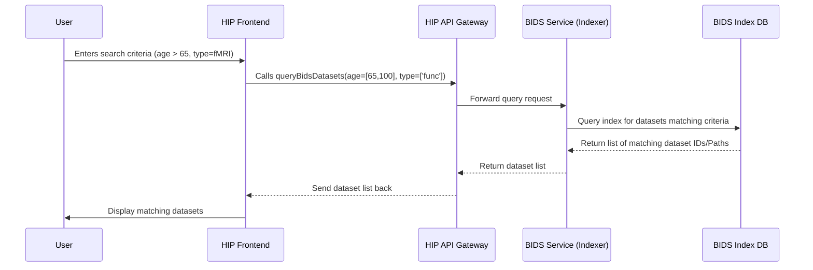

# Chapter 2: BIDS Dataset Handling

In the [previous chapter](01_project___center_workspaces_.md), we learned how HIP organizes work into **Center Workspaces** (your private institutional space) and **Project Workspaces** (for collaboration). Now, let's dive into how we manage the *actual research data* within these workspaces, especially neuroimaging data.

## The Challenge: Organizing Research Data

Imagine a large research project with hundreds of brain scans (like MRI or EEG) from many different participants. Each scan might have associated information like the participant's age, the type of scan, and when it was taken.

How do you keep all this organized? If everyone names their files differently (e.g., `John_Doe_MRI.nii`, `scan_001_T1.img`, `participant3_session1_anat.nii.gz`) and stores information in random text files, it quickly becomes a nightmare! Finding specific data (like "all T1-weighted MRIs from participants over 60") would involve manually opening and checking countless files and folders. Sharing this data with collaborators would be confusing and error-prone.

This is the problem that the **Brain Imaging Data Structure (BIDS)** standard solves.

## What is BIDS?

Think of BIDS like a standardized filing system or a very specific set of rules for organizing neuroimaging data and its accompanying information (metadata). It dictates:

1.  **Folder Structure:** How data should be organized into folders (e.g., one folder per participant, with subfolders for different sessions or data types).
2.  **File Naming:** A consistent way to name files based on participant ID, session, data type, and other relevant details (e.g., `sub-01_ses-test_T1w.nii.gz`).
3.  **Metadata Files:** Standardized files (like `dataset_description.json` and `participants.tsv`) to store information about the dataset as a whole and about the participants.

Why is this useful? When everyone follows the same rules:

*   **Computers can understand it:** Software tools (like analysis pipelines or data viewers) can automatically find and interpret the data because they know where to look and what the filenames mean.
*   **Humans can understand it:** Researchers can easily navigate datasets collected by others.
*   **Sharing is easier:** Collaborators receive data in a predictable, well-documented format.
*   **Reproducibility improves:** It's easier to re-run analyses if the data structure is clear.

## HIP's BIDS Toolkit: Your Data Librarian

HIP includes powerful tools specifically designed to work with BIDS-formatted datasets. Think of these tools as your specialized librarian for neuroimaging data collections within your HIP workspaces. They help you:

1.  **Create New BIDS Datasets:** Start a new, properly structured BIDS dataset from scratch within HIP.
2.  **Query/Search Datasets:** Find datasets based on criteria like participant age, number of participants, data types available (MRI, EEG, etc.), or keywords in the description.
3.  **View Dataset Details:** Get a summary of a dataset, including its description, authors, participant information, and available data types.
4.  **Manage Participants:** View, add, or edit information about the participants within a dataset (stored in the `participants.tsv` file).
5.  **Import Subject Data:** Add new participant data (like scans) into an existing BIDS dataset, ensuring it follows the correct naming and structure.

## Using HIP's BIDS Tools: A Scenario

Let's revisit Dr. Alice. She's working in her "Alzheimer's Study" [Project Workspace](01_project___center_workspaces_.md). This project contains several BIDS datasets.

**1. Finding a Specific Dataset**

Dr. Alice needs to find datasets containing functional MRI (fMRI) data for participants between 65 and 80 years old. She uses HIP's BIDS search interface.

*   **What Happens:** The interface uses the `queryBidsDatasets` function to ask the HIP backend.
*   **Code Example (API Call):**

```typescript
// Simplified from: src/api/bids.tsx
import { BIDSDatasetsQueryResponse } from './types';

export const queryBidsDatasets = async (
	userId?: string,
	query = '*', // Search term (e.g., 'Alzheimer')
	ageRange = [0, 100], // e.g., [65, 80]
	datatypes: string[] = ['*'] // e.g., ['func'] for fMRI
): Promise<BIDSDatasetsQueryResponse> => {
	if (!userId) return { datasets: [], total: 0 };

	// Construct the API request URL with search parameters
	const url = `${API_GATEWAY}/tools/bids/datasets/search?query=${query}&ageRange=${ageRange}&datatypes=${datatypes}&owner=${userId}`;

	// Make the request to the backend
	return fetch(url, {
		headers: { /* ... authentication ... */ },
	})
		.then( /* ... handle response ... */ )
		.catch( /* ... handle error ... */ );
};
```

*   **Explanation:** This code defines a function `queryBidsDatasets` that takes search criteria (like `query`, `ageRange`, `datatypes`) and sends a request to the HIP backend API. The backend searches its index of BIDS datasets matching these criteria.
*   **Output:** The function returns a list of datasets that match Dr. Alice's criteria. The user interface displays these, perhaps using cards.

```typescript
// Simplified from: src/components/UI/BIDS/Datasets.tsx
import React, { useEffect, useState } from 'react';
import { queryBidsDatasets } from '../../../api/bids';
import { BIDSDataset } from '../../../api/types';
import DatasetCard from './DatasetCard'; // Component to display one dataset

const DatasetsList = () => {
	const [datasets, setDatasets] = useState<BIDSDataset[]>([]);
	const [loading, setLoading] = useState(false);
	// ... other state for filters ...

	useEffect(() => {
		setLoading(true);
		// Call the API function with desired filters
		queryBidsDatasets('alice_uid', '*', [65, 80], ['func'])
			.then(response => {
				setDatasets(response.datasets || []);
				setLoading(false);
			})
			.catch(error => { /* handle error */ });
	}, [/* dependencies like filters */]);

	if (loading) return <p>Loading datasets...</p>;

	return (
		<div>
			<h1>Matching BIDS Datasets</h1>
			{datasets.map(dataset => (
				// Use DatasetCard to show each dataset's info
				<DatasetCard key={dataset.id} dataset={dataset} />
			))}
		</div>
	);
};
```

*   **Explanation:** This React component uses the `queryBidsDatasets` function when it loads (or when filters change). It then displays the results using a `DatasetCard` component for each found dataset.

**2. Viewing Dataset Details**

Dr. Alice clicks on one of the search results, "ADNI_Subset_fMRI".

*   **What Happens:** HIP displays a detailed view of this dataset, showing its description (from `dataset_description.json`), participant summary statistics, and available data types. This likely uses a component like `Dataset`.

```typescript
// Simplified from: src/components/UI/BIDS/Dataset.tsx
import React, { useEffect, useState } from 'react';
import { useParams } from 'react-router-dom'; // Gets dataset ID from URL
import { BIDSDataset } from '../../../api/types';
import { getDatasetDetails } from './someApiFunction'; // Fictional function
import DatasetInfo from './DatasetInfo'; // Shows summary info
import DatasetDescription from './DatasetDescription'; // Shows README/description

const DatasetView = () => {
	const { datasetId } = useParams(); // e.g., "adni_subset_fmri_id"
	const [dataset, setDataset] = useState<BIDSDataset | null>(null);

	useEffect(() => {
		// Fetch details for the specific datasetId
		getDatasetDetails(datasetId)
			.then(fetchedDataset => setDataset(fetchedDataset))
			.catch(error => { /* handle error */ });
	}, [datasetId]);

	if (!dataset) return <p>Loading dataset details...</p>;

	return (
		<div>
			<h1>{dataset.Name}</h1>
			<DatasetInfo dataset={dataset} /> {/* Shows stats */}
			<DatasetDescription dataset={dataset} /> {/* Shows text description */}
			{/* Tabs for Files, Participants, Import */}
		</div>
	);
};
```

*   **Explanation:** This component fetches and displays detailed information for a single dataset identified by `datasetId` from the URL. It uses sub-components like `DatasetInfo` and `DatasetDescription` to structure the view.

**3. Managing Participants**

Dr. Alice wants to check the age and sex of participants in this dataset. She clicks on the "Participants" tab.

*   **What Happens:** HIP fetches and displays the content of the `participants.tsv` file for this dataset in a user-friendly table. She can view, and potentially add or edit participant information using components like `Participants`.

```typescript
// Simplified from: src/api/bids.tsx
import { Participant } from './types';

export const getParticipants = async (
	datasetPath: string, // Path to the dataset folder
	userId: string
): Promise<Participant[]> => {
	const url = `${API_GATEWAY}/tools/bids/participants?path=${datasetPath}&owner=${userId}`;
	return fetch(url, { headers: { /* ... auth ... */ } })
		.then(checkForError) // Check for API errors
		.then(response => response.json()) // Parse the list of participants
		.catch(catchError); // Handle fetch errors
};
```

*   **Explanation:** This API function retrieves the participant data associated with a specific BIDS dataset located at `datasetPath`.

```typescript
// Simplified from: src/components/UI/BIDS/Participants.tsx
import React, { useEffect, useState } from 'react';
import { BIDSDataset, Participant } from '../../../api/types';
import { getParticipants } from '../../../api/bids';

const ParticipantsView = ({ dataset }: { dataset?: BIDSDataset }) => {
	const [participants, setParticipants] = useState<Participant[]>([]);

	useEffect(() => {
		if (dataset?.Path && user?.uid) {
			getParticipants(dataset.Path, user.uid)
				.then(data => setParticipants(data))
				.catch(error => { /* handle error */ });
		}
	}, [dataset]);

	return (
		<div>
			<h2>Participants</h2>
			{/* Display participants in a table */}
			<table>
				{/* ... Table headers based on participant keys ... */}
				<tbody>
					{participants.map(p => (
						<tr key={p.participant_id}>
							{/* ... Table cells for each participant's data ... */}
						</tr>
					))}
				</tbody>
			</table>
			{/* Button to add/edit participants */}
		</div>
	);
};
```

*   **Explanation:** This component fetches participant data using `getParticipants` and displays it, typically in a table format.

**4. Importing New Data**

Dr. Alice has a new MRI scan for participant `sub-03` that needs to be added to the "ADNI_Subset_fMRI" dataset. She uses the "Import" functionality.

*   **What Happens:** She selects the participant (`sub-03`), the type of data (e.g., `T1w` anatomical MRI), specifies any relevant details (like session `ses-02`), and points HIP to the raw scan file located elsewhere in her workspace (perhaps uploaded via the [File Browsing Components](03_file_browsing_components_.md)). HIP then copies or links the file into the correct BIDS structure within the dataset folder, naming it appropriately (e.g., `/Projects/AlzheimerStudy/ADNI_Subset_fMRI/sub-03/ses-02/anat/sub-03_ses-02_T1w.nii.gz`).

```typescript
// Simplified from: src/api/bids.tsx
import { CreateSubjectDto, Participant, BIDSFile } from './types';

export const importSubject = async (
	importDetails: CreateSubjectDto // Contains owner, dataset path, files, participant info
): Promise<CreateSubjectDto> => {
	const url = `${API_GATEWAY}/tools/bids/subject`;
	return fetch(url, {
		method: 'POST',
		headers: { /* ... auth, content-type ... */ },
		body: JSON.stringify(importDetails), // Send details to backend
	})
		.then( /* ... handle response ... */ )
		.catch( /* ... handle error ... */ );
};
```

*   **Explanation:** The `importSubject` API call sends the details of the file(s) to be imported, the target dataset, and participant information to the backend. The backend handles placing the file correctly within the BIDS structure.

## Under the Hood: Indexing and Querying

How does HIP efficiently search through potentially huge datasets? It doesn't scan every file every time you search. Instead, it maintains an **index**.

1.  **Indexing:** When a BIDS dataset is created or updated (or during a refresh), a background process scans the dataset's structure and metadata files (`dataset_description.json`, `participants.tsv`, filenames). It extracts key information (like participant count, age range, data types, dataset name, path) and stores it in a searchable database or index, managed by a specialized BIDS service.
2.  **Querying:** When you use the search interface (`queryBidsDatasets`), HIP queries this pre-built index, which is much faster than scanning the actual files on disk.
3.  **Retrieving Details:** When you view a specific dataset or participant list, HIP might read the relevant metadata files (`dataset_description.json`, `participants.tsv`) directly from the dataset's location in the [Nextcloud Backend Integration](08_nextcloud_backend_integration_.md) storage, using the path stored in the index. Importing data involves file operations within this storage.

Here's a simplified flow for querying datasets:



This diagram shows how the frontend talks to the API, which relies on a specialized BIDS Service and its index to quickly find the relevant datasets without scanning the entire file system.

### Relevant Data Structures

The information about datasets and participants is structured using types defined in the code:

```typescript
// Simplified from: src/api/types.ts

// Represents the overall description of a BIDS dataset
export interface BIDSDatasetDescription {
	Name: string;        // Dataset name (e.g., "ADNI_Subset_fMRI")
	BIDSVersion?: string; // Version of BIDS standard used
	Authors?: string[];   // List of dataset authors
	// ... other fields like License, DOI, Funding ...
}

// Represents a full BIDS dataset record in the index/query results
export interface BIDSDataset extends BIDSDatasetDescription {
	id: string;             // Unique identifier for the dataset in HIP
	Path?: string;           // Location in the file system (e.g., "/Projects/AlzheimerStudy/ADNI_Subset_fMRI")
	ParticipantsCount: number; // How many participants
	AgeMin: number[];        // Minimum age(s) found
	AgeMax: number[];        // Maximum age(s) found
	DataTypes?: string[];    // List of data types present (e.g., ["anat", "func"])
	Participants?: Participant[]; // Optional: List of participant details
	// ... other summary info like Size, FileCount, Validation status ...
}

// Represents a single participant's data (row from participants.tsv)
export interface Participant {
	participant_id: string; // e.g., "sub-01"
	age?: string;           // Participant age
	sex?: string;           // Participant sex
	[key: string]: string;  // Allows for other custom columns
}
```

*   **Explanation:** These TypeScript interfaces define the expected structure for BIDS dataset information (`BIDSDataset`) and participant data (`Participant`) used throughout the HIP application, ensuring consistency between the API and the frontend components.

## Conclusion

You've now learned about the importance of the **BIDS standard** for organizing neuroimaging data and how HIP provides a powerful toolkit for **BIDS Dataset Handling**. This includes creating, querying, viewing, and managing BIDS datasets and their participants within your workspaces. Using BIDS and HIP's tools makes your research data more organized, searchable, and easier to share and analyze.

In the next chapter, we'll look more generally at how HIP allows you to navigate and interact with *any* files within your workspaces, not just those in BIDS datasets.

Next: [File Browsing Components](03_file_browsing_components_.md)

---

Generated by [AI Codebase Knowledge Builder](https://github.com/The-Pocket/Tutorial-Codebase-Knowledge)