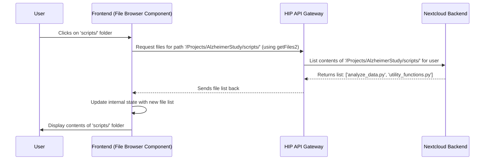

# Chapter 3: File Browsing Components

In the [previous chapter](02_bids_dataset_handling_.md), we explored how HIP helps manage specialized neuroimaging data using the BIDS standard. But what about all the *other* files you might work with? You might have analysis scripts, results tables, presentations, or just general documents stored within your HIP [Center or Project Workspaces](01_project___center_workspaces_.md).

How do you navigate and find these files within the HIP web interface? You can't just open your computer's normal File Explorer or Finder, because these files live securely within HIP's storage system.

This is where **File Browsing Components** come in.

## The Problem: Finding Your Files Inside HIP

Imagine you've uploaded a Python analysis script (`analyze_data.py`) into your "Alzheimer's Study" Project Workspace. Later, you want to select this script within HIP, perhaps to attach it to a computational job or simply to view its contents. How do you "point" HIP to the correct file within the project's folder structure?

## What are File Browsing Components?

Think of File Browsing Components as specialized, mini "File Explorer" or "Finder" windows built directly into the HIP web application. They are reusable pieces of the user interface designed specifically for:

1.  **Displaying Files and Folders:** Showing the directory structure from different places within HIP (like your personal files, shared project folders, or even structured metadata).
2.  **Navigation:** Letting you click into folders to see their contents and go back up.
3.  **Selection:** Allowing you to pick one or more files or folders for a specific action (like choosing a script to run, selecting data to transfer, or picking a destination folder).

HIP uses several variations of these components, each tailored for a slightly different task.

## Key Concepts & Examples

HIP provides different "flavors" of file browsers:

1.  **General File Browser (`FileBrowser.tsx`, `FileChooser.tsx`):**
    *   **Looks like:** A familiar tree view (like the left panel in Windows Explorer) or a list view that lets you click through folders.
    *   **Purpose:** Navigating your general files stored via the [Nextcloud Backend Integration](08_nextcloud_backend_integration_.md). Used when you need to pick *any* file or folder from your accessible workspaces.
    *   **Example Use:** Selecting an output folder when saving analysis results.

2.  **Metadata Browser (`MetadataBrowser.tsx`):**
    *   **Looks like:** Often a tree view, but specifically shows the structure derived from metadata (information *about* files, maybe extracted during an upload or inspection process).
    *   **Purpose:** Browsing files based on their metadata structure, perhaps after inspecting an uploaded archive. It helps understand the content structure without navigating the raw files directly.
    *   **Example Use:** Selecting a specific sub-directory within an uploaded dataset archive based on its logical structure.

3.  **Dataset/Subject Chooser (`DatasetSubjectChooser.tsx`):**
    *   **Looks like:** A specialized tree view often showing BIDS Datasets and the participants within them.
    *   **Purpose:** Specifically designed for selecting participants or entire datasets identified in Chapter 2 ([BIDS Dataset Handling](02_bids_dataset_handling_.md)).
    *   **Example Use:** Choosing which participant's data to load into an analysis application.

## How It Works: A Simple Scenario

Let's go back to finding your `analyze_data.py` script in the "Alzheimer's Study" project.

1.  **Action Trigger:** You click a button in HIP labeled "Select Analysis Script".
2.  **Browser Appears:** A modal window or a section of the page appears, showing a File Browsing Component (likely the General File Browser).
3.  **Navigation:** It starts at the root of your accessible files or perhaps directly within the "Alzheimer's Study" project folder. You see folders like `data/`, `scripts/`, `results/`. You click on `scripts/`.
4.  **Selection:** Inside the `scripts/` folder, you see `analyze_data.py` and maybe `utility_functions.py`. You click on `analyze_data.py`.
5.  **Confirmation:** You click an "Ok" or "Select" button. The file browser closes, and the system now knows you've chosen `/Projects/AlzheimerStudy/scripts/analyze_data.py`.

## Under the Hood: Fetching and Displaying Files

How does the file browser know what to show when you click a folder?

**Step-by-Step Walkthrough:**

1.  **User Action:** The user clicks on a folder (e.g., `scripts/`) in the File Browser UI component.
2.  **Frontend Request:** The File Browser component (written in React) detects the click. It knows the path of the clicked folder (`/Projects/AlzheimerStudy/scripts/`). It calls a function from the [API Client Layer](07_api_client_layer_.md) (like `getFiles2`) to request the contents of that path.
3.  **API Call:** The `getFiles2` function sends an HTTP request to the HIP backend API Gateway.
4.  **Backend Processing:** The API Gateway receives the request. It interacts with the [Nextcloud Backend Integration](08_nextcloud_backend_integration_.md) (which manages the actual file storage) to list the files and folders within the requested path (`/Projects/AlzheimerStudy/scripts/`) for the current user.
5.  **Backend Response:** Nextcloud returns the list of files/folders (e.g., `analyze_data.py`, `utility_functions.py`) to the API Gateway.
6.  **API Response:** The API Gateway sends this list back to the Frontend application in a structured format (like JSON).
7.  **Frontend Update:** The File Browser component receives the list of files. It updates its internal state (the list of things to display) and re-renders the UI to show the contents of the `scripts/` folder.

**Sequence Diagram:**



## Code Examples

Let's look at simplified code snippets to see how this works.

**1. Using a File Chooser Component (Simplified)**

Imagine a part of the HIP UI where you need to let the user pick a file. You might use the `FileChooser` component like this:

```typescript
// Simplified example of using FileChooser in another component
import React, { useState } from 'react';
import FileChooser from './components/UI/FileChooser'; // Import the component
import { Button } from '@mui/material';

function SelectScriptComponent() {
  const [selectedScriptPath, setSelectedScriptPath] = useState<string | undefined>();

  const handleFileSelection = (path: string) => {
    console.log("User selected:", path);
    setSelectedScriptPath(path);
  };

  const handleConfirm = () => {
    if (selectedScriptPath) {
      alert(`Proceeding with script: ${selectedScriptPath}`);
      // ... do something with the selected path ...
    }
  };

  return (
    <div>
      <p>Select your analysis script:</p>
      {/* Use the FileChooser component */}
      <FileChooser handleSelectedFile={handleFileSelection} />

      <Button onClick={handleConfirm} disabled={!selectedScriptPath}>
        Confirm Selection
      </Button>
    </div>
  );
}
```

*   **Explanation:** This component uses `<FileChooser>`. When the user selects a file *inside* the `FileChooser`, the `handleFileSelection` function is called with the path of the selected file. This path is stored, and the "Confirm Selection" button becomes active.

**2. Inside the File Browser (`FileBrowser.tsx` - Simplified)**

This component manages displaying the file tree and fetching folder contents.

```typescript
// Simplified from: src/components/Project/Files/FileBrowser.tsx
import React, { useState, useEffect } from 'react';
import { TreeView, TreeItem } from '@mui/lab'; // UI library components
import { getFiles2 } from '../../../api/gatewayClientAPI'; // API function
import { Node } from '../../../api/types'; // Data structure for files/folders

function FileBrowserComponent({ rootPath = '/' }) {
  const [files, setFiles] = useState<Node[]>([]); // Holds all loaded files/folders
  const [expanded, setExpanded] = useState<string[]>([rootPath]); // Tracks open folders

  // Function to load files for a specific path
  const loadFiles = (path: string) => {
    getFiles2(path) // Call the API function
      .then(data => {
        // Add newly loaded files to our list, avoiding duplicates
        setFiles(currentFiles => [...currentFiles, ...data.filter(newNode =>
            !currentFiles.some(existing => existing.path === newNode.path)
        )]);
      })
      .catch(error => console.error("Error loading files:", error));
  };

  // Load initial files when component starts
  useEffect(() => {
    loadFiles(rootPath);
  }, [rootPath]);

  // When a folder node is toggled (opened/closed)
  const handleToggle = (event: React.SyntheticEvent, nodeIds: string[]) => {
    setExpanded(nodeIds); // Update the list of expanded folders
    const toggledNodeId = nodeIds[0]; // The folder that was just clicked
    // Check if we already loaded children for this folder
    const childrenLoaded = files.some(f => f.parentPath === toggledNodeId);
    if (!childrenLoaded) {
      loadFiles(toggledNodeId); // If not loaded, fetch them now
    }
  };

  // ... (Code to render the TreeView and TreeItems based on 'files' state) ...
  // This part would map the 'files' array to <TreeItem> components
  // and use the 'handleToggle' function for the onNodeToggle prop.
  return <TreeView expanded={expanded} onNodeToggle={handleToggle}>...</TreeView>;
}
```

*   **Explanation:**
    *   It uses `useState` to keep track of all the `files` loaded so far and which folders are `expanded`.
    *   The `loadFiles` function calls the `getFiles2` API function (from the [API Client Layer](07_api_client_layer_.md)) to fetch directory contents.
    *   `useEffect` calls `loadFiles` initially for the starting `rootPath`.
    *   `handleToggle` is called when the user clicks the expand/collapse icon on a folder. It updates the `expanded` list and calls `loadFiles` *only if* the folder's contents haven't been loaded yet. This prevents unnecessary API calls.

**3. The API Call (`gatewayClientAPI.tsx` - Simplified)**

This is the function that actually talks to the backend.

```typescript
// Simplified from: src/api/gatewayClientAPI.tsx
import { Node } from './types'; // File/folder data structure
import { API_GATEWAY, /* ... other helpers ... */ } from './gatewayClientAPI';

// Function to get files/folders at a specific path
export const getFiles2 = async (path = '/'): Promise<Node[]> => {
  const url = `${API_GATEWAY}/files?path=${encodeURIComponent(path)}`;

  return fetch(url, {
    method: 'GET',
    headers: {
      // Important: Include authentication token to prove user is logged in
      requesttoken: window.OC.requestToken,
      // ... other headers ...
    },
  })
    .then(response => {
      if (!response.ok) throw new Error('Failed to fetch files');
      return response.json(); // Parse the JSON response from the API
    })
    .then(data => data.entries as Node[]) // Extract the file list
    .catch(error => {
      console.error(`Error fetching files for path ${path}:`, error);
      return []; // Return empty list on error
    });
};
```

*   **Explanation:**
    *   Constructs the API URL, including the desired `path`.
    *   Uses the browser's `fetch` function to make a `GET` request to that URL.
    *   Crucially, it includes a `requesttoken` in the headers. This token is provided by the underlying system (likely Nextcloud) and proves to the backend that the request comes from a valid, logged-in user session ([Global State Management (AppStore)](06_global_state_management__appstore__.md) might hold this token).
    *   It parses the JSON response containing the list of files/folders (as `Node` objects) and returns it.

**4. Data Structure (`types.ts` - Simplified)**

How file and folder information is represented.

```typescript
// Simplified from: src/api/types.ts

// Represents a file or a directory node in the browser
export interface Node {
  name: string;         // e.g., "analyze_data.py" or "scripts"
  isDirectory: boolean; // true if it's a folder, false if it's a file
  path: string;         // Full path, e.g., "/Projects/AlzheimerStudy/scripts/analyze_data.py"
  parentPath: string;   // Path of the parent folder, e.g., "/Projects/AlzheimerStudy/scripts"
  // ... other potential fields like size, modified date, etc.
}
```

*   **Explanation:** This `Node` interface defines the standard structure for file/folder information passed between the backend API and the frontend components.

## Conclusion

You've learned that **File Browsing Components** are essential UI elements within HIP, acting like specialized "Finder" or "Explorer" windows. They allow you to navigate and select files stored securely within your HIP workspaces, whether they are general user files managed by the [Nextcloud Backend Integration](08_nextcloud_backend_integration_.md), structured project metadata, or specific BIDS dataset elements. Understanding these components helps you see how HIP provides a seamless way to interact with your data directly within the web interface.

Now that we know how to find and select files, what can we *do* with them? In the next chapter, we'll explore how HIP lets you launch applications and virtual desktops to actually analyze your data.

Next: [Remote Desktop & App Management](04_remote_desktop___app_management_.md)

---

Generated by [AI Codebase Knowledge Builder](https://github.com/The-Pocket/Tutorial-Codebase-Knowledge)