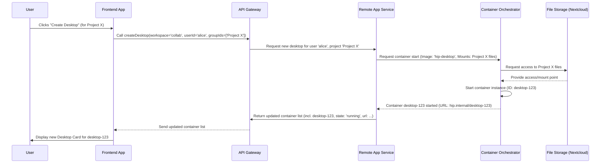

# Chapter 4: Remote Desktop & App Management

In the [previous chapter](03_file_browsing_components_.md), we learned how HIP provides tools like the `FileChooser` to help you navigate and select files within your secure workspaces. But what do you *do* with those files? Especially for complex research data like the [BIDS Datasets](02_bids_dataset_handling_.md) we discussed, you often need specialized software for analysis (like FreeSurfer for brain imaging, MATLAB for computations, or RStudio for statistics).

## The Problem: Accessing Specialized Software & Compute Power

Imagine Dr. Alice wants to analyze a BIDS dataset stored in her "Alzheimer's Study" [Project Workspace](01_project___center_workspaces_.md). She needs to use FreeSurfer, a complex software package.

*   **Challenge 1: Installation:** Installing FreeSurfer on her personal laptop can be tricky. It might require specific operating systems, libraries, or have compatibility issues.
*   **Challenge 2: Licensing:** Some software like MATLAB requires expensive licenses.
*   **Challenge 3: Compute Power:** Analyzing large datasets can take hours or days and requires powerful computers that her laptop might not match.
*   **Challenge 4: Data Access:** How does the software running on her laptop securely access the data stored inside HIP?

Doing this for *every* tool and *every* collaborator would be a huge headache! HIP solves this with **Remote Desktop & App Management**.

## What is Remote Desktop & App Management?

Think of it like having access to a fleet of powerful, pre-configured virtual computers that you can "rent" on demand through the HIP interface.

*   **Remote Desktop:** This is your base virtual computer. It runs on HIP's powerful infrastructure, not your local machine. You access it through your web browser, and it looks and feels much like a regular computer desktop (usually a simplified Linux environment). Crucially, it has secure access to the files within your HIP workspace.
*   **Managed Apps:** These virtual desktops come equipped with specialized software (like FreeSurfer, MATLAB, RStudio, etc.) that HIP administrators have pre-installed and configured. You don't need to install anything!
*   **Management:** You can easily create, start, pause (saving its state for later), resume, and delete these virtual desktops and the applications running inside them directly from the HIP web interface.

It's like having a virtual lab bench available anytime, anywhere, with all the specialized equipment ready to go, connected directly to your project data.

## Using Remote Desktops and Apps in HIP: Dr. Alice's Workflow

Let's see how Dr. Alice uses this system to run FreeSurfer.

**1. Creating a Desktop**

First, Dr. Alice needs a base virtual computer within her "Alzheimer's Study" project workspace.

*   **Action:** In the "Desktops" section of her project (likely using the `ProjectDesktops.tsx` component), she clicks a button like "Create Desktop".
*   **What Happens:** HIP needs to know *where* this desktop should run and *what* data it should access. Since she's in her project workspace, the desktop will be associated with that project.
*   **Code Example (API Call):** Behind the scenes, clicking the button triggers an API call like this:

```typescript
// Simplified from: src/api/remoteApp.tsx
import { Container, WorkspaceType } from './types';
import { API_REMOTE_APP, /* ... other helpers ... */ } from './gatewayClientAPI';

// Function to request a new desktop
export const createDesktop = (
  workspace: WorkspaceType, // 'private' or 'collab' (for project)
  userId: string,         // Who is requesting it
  groupIds: string[] = [] // For projects, the project name (e.g., ["alzheimers-study-2024"])
): Promise<Container[]> => {
  return fetch(`${API_REMOTE_APP}`, { // Sends request to the remote app service endpoint
    method: 'POST',
    headers: { /* ... authentication, content type ... */ },
    body: JSON.stringify({ workspace, userId, groupIds }), // Sends the details
  })
    .then( /* ... handle response ... */ )
    .catch( /* ... handle error ... */ );
};

// Example Usage:
// createDesktop('collab', 'alice_uid', ['alzheimers-study-2024']);
```

*   **Explanation:** This function sends a request to the HIP backend, asking it to start a new desktop (`POST` request) specifically for the `'collab'` workspace (meaning project), associated with Alice's `userId` and the project identifier `alzheimers-study-2024`. The backend service will then start provisioning the virtual machine. The function returns a promise that will eventually resolve with the updated list of containers (desktops and apps).

**2. Viewing and Opening the Desktop**

After a short wait (while the virtual computer boots up), Dr. Alice sees a new "Desktop Card" appear in her HIP interface (rendered by `DesktopCard.tsx`).

*   **Visual:** The card shows the desktop's status (e.g., "Running"), maybe a generic thumbnail, and buttons for actions.

    ```typescript
    // Simplified component structure showing a desktop card
    import { DesktopCard } from './components/UI/DesktopCard';
    import { Container } from './api/types';

    function DesktopList({ desktops, /* ... action handlers ... */ }) {
      return (
        <div>
          {desktops.map(desktop => (
            <DesktopCard
              key={desktop.id}
              desktop={desktop}
              handleOpenDesktop={openDesktop}
              handleRemoveDesktop={removeDesktop}
              // ... other handlers ...
            />
          ))}
        </div>
      );
    }
    ```

*   **Action:** She clicks the "Open" button on the card.
*   **What Happens:** HIP opens a new browser tab or an embedded view (managed by the `Desktop.tsx` component) that connects to the remote desktop's graphical interface (often using technologies like noVNC or XPra). She now sees a simple desktop environment inside her browser.

**3. Launching an Application (FreeSurfer)**

Inside the remote desktop view, Dr. Alice sees a panel or menu listing the available applications (managed by `AppList.tsx`).

*   **Visual:** A list might show icons and names: FreeSurfer, MATLAB, RStudio, Terminal, etc.
*   **Action:** She clicks on "FreeSurfer".
*   **What Happens:** This tells the remote desktop environment to start the FreeSurfer application.
*   **Code Example (API Call):** Clicking the app likely triggers another API call:

```typescript
// Simplified from: src/api/remoteApp.tsx

// Function to start an application inside a running desktop
export const createApp = (
  desktopId: string, // ID of the desktop container
  userId: string,
  appName: string    // Name of the app to launch (e.g., "freesurfer")
): Promise<Container[]> => {
  const url = `${API_REMOTE_APP}/${desktopId}/${appName}`;
  return fetch(url, {
    method: 'POST', // Request to create/start the app process
    headers: { /* ... authentication ... */ },
    body: JSON.stringify({ userId }),
  })
    .then( /* ... handle response ... */ )
    .catch( /* ... handle error ... */ );
};

// Example Usage:
// createApp('desktop-container-123', 'alice_uid', 'freesurfer');
```

*   **Explanation:** This sends a request to the backend, identifying the specific `desktopId` where the app should run and the `appName` to launch. The backend instructs the desktop container to start the FreeSurfer process.

**4. Running the Analysis**

Now, within the FreeSurfer application *running inside the remote desktop accessed via her browser*, Dr. Alice can use the application's interface. She can:

*   Browse files: Because the remote desktop is connected to her project workspace, she can easily navigate (using FreeSurfer's file menus or a terminal) to `/data/BIDS/AlzheimerStudyDataset` (or similar paths provided by HIP).
*   Select input data: She chooses the participant data she wants to analyze.
*   Run analysis: She starts the FreeSurfer processing pipeline. The computation happens on the powerful remote infrastructure, not her laptop.
*   Save results: She saves the output files back into her project workspace directory (e.g., `/data/results/FreeSurferOutput`).

**5. Managing the Desktop**

Once her analysis is running (or finished), Dr. Alice has options via the "Desktop Card" buttons:

*   **Pause/Sleep:** If the analysis takes a long time, she might want to pause the desktop. This saves the current state (running applications, open files) and stops the virtual machine, potentially saving resources. She can resume later exactly where she left off. (Uses `pauseAppsAndDesktop` API).
*   **Resume:** Restarts a paused desktop. (Uses `resumeAppsAndDesktop` API).
*   **Quit/Remove:** When she's completely finished, she can remove the desktop. This shuts down the virtual machine and deletes it. Any results saved to the workspace files remain, but the running state is gone. (Uses `removeAppsAndDesktop` API).

```typescript
// Simplified from: src/api/remoteApp.tsx

// Function to pause a desktop and its apps
export const pauseAppsAndDesktop = (desktopId: string, userId: string): Promise<Container[]> =>
  fetch(`${API_REMOTE_APP}/${desktopId}`, {
    method: 'PUT', // Update the state of the desktop
    headers: { /* ... auth ... */ },
    body: JSON.stringify({ userId, cmd: 'pause' }), // Send the 'pause' command
  }).then(/*...*/).catch(/*...*/);

// Function to remove/delete a desktop and its apps
export const removeAppsAndDesktop = (desktopId: string, userId: string): Promise<Container[]> =>
  fetch(`${API_REMOTE_APP}/${desktopId}`, {
    method: 'DELETE', // Request to delete the resource
    headers: { /* ... auth ... */ },
    body: JSON.stringify({ userId }),
  }).then(/*...*/).catch(/*...*/);
```

*   **Explanation:** These API calls send commands (`PUT` with `cmd: 'pause'` or `DELETE`) to the backend to change the state of the specified `desktopId`.

## Under the Hood: How Desktops are Managed

How does HIP actually create and manage these virtual computers?

**Step-by-Step Walkthrough (Creating a Desktop):**

1.  **User Request:** Dr. Alice clicks "Create Desktop" in the HIP Frontend.
2.  **Frontend API Call:** The frontend calls the `createDesktop` function from the [API Client Layer](07_api_client_layer_.md).
3.  **API Gateway:** The request goes to the HIP API Gateway.
4.  **Remote App Service:** The Gateway forwards the request to a specialized backend service responsible for managing desktops and apps (let's call it the "Remote App Service").
5.  **Orchestrator Interaction:** The Remote App Service communicates with a container orchestrator (like Docker Swarm or Kubernetes). It asks the orchestrator to:
    *   Start a new container based on a pre-defined "Desktop" image (which includes the operating system, necessary libraries, and remote access software).
    *   Configure the container to securely mount the correct user/project file directories from the [Nextcloud Backend Integration](08_nextcloud_backend_integration_.md).
    *   Assign network access so the user can connect.
6.  **Container Starts:** The orchestrator pulls the image and starts the container instance on the available infrastructure.
7.  **Connection Info:** The Remote App Service gets connection details (like a unique URL) for the new desktop container.
8.  **API Response:** The Service sends the updated list of containers (including the new one with its ID, state, and URL) back to the API Gateway.
9.  **Frontend Update:** The API Gateway relays this information to the Frontend. The [Global State Management (AppStore)](06_global_state_management__appstore__.md) updates, and the UI refreshes to show the new "Desktop Card".

**Sequence Diagram:**



## Code Examples & Data Structures

The system relies on specific API calls and data structures.

*   **API Functions (`src/api/remoteApp.tsx`):** We've already seen simplified versions of `createDesktop`, `createApp`, `pauseAppsAndDesktop`, and `removeAppsAndDesktop`. Another key function is `getDesktopsAndApps`, which fetches the current list of all containers (desktops and their running apps) relevant to the user and their current context (private or project workspace).

```typescript
// Simplified from: src/api/remoteApp.tsx

// Function to get the list of desktops and apps for a user/workspace
export const getDesktopsAndApps = (
  workspace: WorkspaceType, // 'private' or 'collab'
  userId: string,
  groupIds: string[],     // Project names if workspace is 'collab'
  isAdmin = false
): Promise<Container[]> => {
  // Construct query parameters...
  const queryParams = /* ... build query string ... */;

  return fetch(`${API_REMOTE_APP}?${queryParams}`, { // GET request
    headers: { requesttoken: window.OC.requestToken /* ... auth ... */ },
  })
    .then(checkForError) // Check for API errors
    .then(response => response.json() as Container[]) // Parse the list of containers
    .catch(catchError); // Handle fetch errors
};
```

*   **Data Structure (`src/api/types.ts`):** The information about each desktop or running application is stored in a `Container` object.

```typescript
// Simplified from: src/api/types.ts

// Represents a running desktop or application instance
export interface Container {
  id: string;         // Unique identifier (e.g., "desktop-container-123")
  name: string;       // Often an internal name or the app name
  userId: string;     // The user who owns/started it
  url: string;        // Connection URL for accessing the desktop/app GUI
  state: ContainerState; // Current status (e.g., RUNNING, PAUSED, LOADING)
  type: ContainerType; // Is it a DESKTOP or an APP?
  parentId?: string;   // If it's an APP, the ID of the parent DESKTOP
  workspace: WorkspaceType; // 'private' or 'collab'
  groupIds?: string[]; // Associated project group ID(s) if 'collab'
  apps?: any;         // Sometimes nested app info (might be handled differently)
  error: Error | null;// Any error messages related to this container
}

// Possible states of a container
export enum ContainerState {
  LOADING = 'loading',
  RUNNING = 'running',
  PAUSING = 'pausing',
  PAUSED = 'paused',
  STOPPING = 'stopping',
  DESTROYED = 'destroyed',
  // ... other states
}

// Type of container
export enum ContainerType {
  DESKTOP = 'server', // Base virtual machine
  APP = 'app',        // Application running inside a desktop
}

// Represents an application available to be launched
export interface Application {
	name: string;       // Technical name (e.g., "freesurfer")
	label?: string;      // User-friendly name (e.g., "FreeSurfer v7.2")
	description: string;
	icon: string;       // URL for the app's icon
	// ... other metadata like version, status ...
}
```

*   **Explanation:** The `Container` interface holds all the necessary information for the frontend to display the status of desktops and apps (using components like `DesktopCard`, `Desktop`, `AppList`) and to interact with them (using the API functions). The `ContainerState` enum defines the possible lifecycle stages, and `ContainerType` distinguishes the base desktop from the apps running within it. The `Application` interface describes the software available for launch.

## Conclusion

You've now seen how HIP's **Remote Desktop & App Management** provides a powerful solution for accessing specialized software and computational resources without local installation hassles. By providing managed virtual desktops connected to your workspace data, HIP lets you:

1.  **Create** virtual desktops on demand.
2.  **Launch** pre-configured applications like FreeSurfer or MATLAB inside them.
3.  **Interact** with these applications through your browser to analyze data stored securely in your HIP workspace.
4.  **Manage** the lifecycle of these desktops (pause, resume, delete).

This abstraction bridges the gap between your data stored in HIP and the tools you need to work with it effectively.

In the next chapter, we'll zoom out and look at the overall structure of the HIP frontend application itself – how different views are organized and navigated.

Next: [Frontend Application Core & Routing](05_frontend_application_core___routing_.md)

---

Generated by [AI Codebase Knowledge Builder](https://github.com/The-Pocket/Tutorial-Codebase-Knowledge)