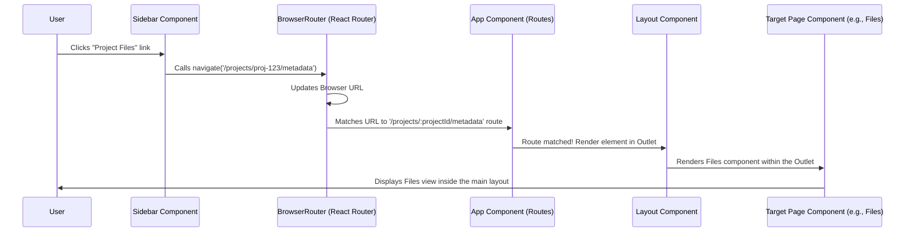

# Chapter 5: Frontend Application Core & Routing

In the [previous chapter](04_remote_desktop___app_management_.md), we saw how you can launch virtual desktops and specialized applications right within HIP to work with your data. But how does the HIP application itself organize all these different views – the project lists, file browsers, desktop managers, BIDS dataset tools, etc.? How do you move between them?

## The Problem: Organizing the House

Imagine building a large research center. You need offices (Project pages), labs (Remote Desktops), libraries (Dataset views), and maybe a reception area (Dashboard). If you just threw all these rooms together randomly, it would be chaotic! Nobody would know where to go or how to get there.

Similarly, a complex web application like HIP needs structure. We need:

1.  **A Blueprint:** A plan for how the different "rooms" (pages or sections) are laid out.
2.  **Hallways:** Clear paths to navigate between these rooms.
3.  **Consistency:** A common look and feel, maybe a helpful signpost (like a navigation menu) that's always visible.

This overall structure and navigation system is the **Frontend Application Core & Routing**.

## What is the Application Core & Routing?

Think of the HIP frontend (the part you see and interact with in your web browser) as a digital building. The Application Core & Routing is its main architectural plan:

1.  **Core Structure (The Building Frame):** This is built using a popular JavaScript library called **React**. React lets us build the user interface (UI) from reusable pieces called **Components** (like Lego bricks). We've already seen some components in previous chapters, like the `FileChooser` ([Chapter 3](03_file_browsing_components_.md)) or `DesktopCard` ([Chapter 4](04_remote_desktop___app_management_.md)). The core sets up the main layout, often including a fixed sidebar for navigation and a main area where different content is displayed.
2.  **Routing (The Hallways):** This system defines how you move between different pages or views within the application. It connects the web addresses (URLs, like `your-hip-url.com/projects/alzheimer-study`) to the specific components that should be displayed. When you click a link in the sidebar, routing figures out which "room" (component) to show in the main content area. HIP uses a library called `react-router-dom` for this.

Essentially, it's the foundation that holds the entire user interface together and makes it navigable.

## Key Concepts

*   **React:** The JavaScript library used to build the user interface components. Think of it as the construction material (bricks, beams).
*   **Components:** Reusable pieces of the UI (e.g., a button, a file list, a whole page). Like prefabricated rooms or furniture.
*   **Routing:** The mechanism that maps URLs in the browser's address bar to specific components (pages) within the application. It's the system of hallways and signs directing you.
*   **Layout Component:** A special component that defines the overall page structure, like the sidebar and the main content area. It's the main blueprint showing where the hallways and rooms connect.
*   **Sidebar (`Navigation`):** The component, usually on the left, that contains links to major sections (Centers, Projects, etc.). It's your main navigation map, always visible.
*   **Outlet:** A placeholder within the Layout component where the content of the *current* page (determined by the router) is displayed. It's the doorway where the content of the specific room you navigated to appears.

## How It Works: Navigating to Project Files

Let's follow Dr. Alice as she navigates from the list of projects to the files within her "Alzheimer's Study" project.

1.  **Initial View:** Dr. Alice is looking at the "My Collaborative Projects" list, perhaps displayed by the `Projects` component (introduced in [Chapter 1](01_project___center_workspaces_.md)). The URL in her browser might be something like `/apps/hip/projects`.
2.  **Clicking a Link:** She clicks on the "Alzheimer's Study" project link in the list or the sidebar. This link is specifically designed to navigate to `/apps/hip/projects/alzheimer-study-2024/metadata` (the "Files" view for that project).
3.  **Routing Kicks In:** The `react-router-dom` library detects that the URL has changed. It looks at its list of defined routes (the "hallway map").
4.  **Matching the Route:** It finds a route that matches the pattern `/projects/:projectId/metadata`. It understands that `alzheimer-study-2024` is the `:projectId` part. This route is configured to display the `Files` component (from [Chapter 3](03_file_browsing_components_.md)).
5.  **Rendering the View:**
    *   The main `Layout` component remains the same (the building frame and sidebar are still there).
    *   Inside the `Layout`'s `Outlet` (the content area), the router now renders the `Files` component.
    *   The `Files` component likely uses the `projectId` (`alzheimer-study-2024`) from the URL to fetch and display the correct files for that specific project using the [API Client Layer](07_api_client_layer_.md).

Dr. Alice now sees the file browser for her specific project, all within the consistent HIP application frame.

## Under the Hood: Setting Up the Structure and Routes

How is this map defined in the code?

**Step-by-Step Walkthrough:**

1.  **App Entry Point (`src/index.tsx`):** The application starts here. It sets up the necessary environment, including wrapping the entire `App` component within a `BrowserRouter`. This component from `react-router-dom` listens for URL changes in the browser.
2.  **Main App Component (`src/App.tsx`):** This component defines the main structure.
    *   It sets up the `Routes` container, which holds all the possible navigation paths.
    *   It defines a primary route (`/`) that uses the `Layout` component. This means *all* pages matching this base path will have the common layout.
    *   The `Layout` component renders the `Navigation` (sidebar) component and an `<Outlet />`. The `Outlet` is where child routes will be rendered.
    *   Inside the main route, **nested routes** are defined. For example, a route for `/projects` might contain further nested routes for `/projects/:projectId`, `/projects/:projectId/desktops`, `/projects/:projectId/metadata`, etc. Each `path` is associated with an `element` (the React component to display).
3.  **Sidebar (`src/components/Sidebar.tsx`):** This component renders the navigation links. When a user clicks a link (e.g., for a specific project's files), it uses a function provided by `react-router-dom` (like `navigate`) to programmatically change the browser's URL *without* reloading the whole page.
4.  **Routing Magic:** `BrowserRouter` detects the URL change triggered by the `navigate` function. It finds the matching route definition in `App.tsx` and tells the `<Outlet />` in the `Layout` component to render the corresponding element (e.g., the `Files` component).

**Sequence Diagram (URL Change):**



This shows how clicking a link triggers the router to find the right component (`Files`) and render it within the main `Layout`'s content area (`Outlet`).

## Code Examples

**1. Setting up the Router (`src/index.tsx` - Simplified)**

This is where the application starts and the router is enabled.

```typescript
// Simplified from: src/index.tsx
import React from 'react';
import { createRoot } from 'react-dom/client';
import { BrowserRouter } from 'react-router-dom'; // Import the router
import App from './App'; // The main application component
import { AppStoreProvider } from './Store'; // State management
import Theme from './components/theme'; // Styling

const container = document.getElementById('hip-root');
const root = createRoot(container!);

root.render(
  <React.StrictMode>
    <AppStoreProvider> {/* Provides global state */}
      <BrowserRouter> {/* Enables routing capabilities */}
        <Theme> {/* Applies visual theme */}
          <App /> {/* The core application UI */}
        </Theme>
      </BrowserRouter>
    </AppStoreProvider>
  </React.StrictMode>
);
```

*   **Explanation:** The key part here is wrapping the `<App />` component with `<BrowserRouter>`. This makes the routing features available throughout the application. We also see the setup for [Global State Management (AppStore)](06_global_state_management__appstore__.md).

**2. Defining Routes and Layout (`src/App.tsx` - Simplified)**

This file defines the "map" of the application.

```typescript
// Simplified from: src/App.tsx
import * as React from 'react';
import { Box } from '@mui/material'; // UI component library
import { Outlet, Route, Routes } from 'react-router-dom'; // Routing components
import Navigation from './components/Sidebar'; // The Sidebar component
import Projects from './components/Projects'; // Example page component
import ProjectWorkspace from './components/Project/Workspace';
import Files from './components/Project/Files'; // The file browser page
import { ROUTE_PREFIX } from './constants'; // Base URL path

// The main layout component: Sidebar + Content Area
const Layout = (): JSX.Element => {
  return (
    <Box sx={{ display: 'flex' }}> {/* Arrange sidebar and content */}
      <Navigation /> {/* Always display the sidebar */}
      <Box sx={{ flexGrow: 1, p: 3 }}> {/* Main content area */}
        <Outlet /> {/* Placeholder for the current page's content */}
      </Box>
    </Box>
  );
};

// The main App component defining the routes
const App = () => (
  <Routes> {/* Container for all route definitions */}
    {/* Routes that use the main Layout */}
    <Route path={`${ROUTE_PREFIX}/`} element={<Layout />}>
      {/* Index route (e.g., what to show at the base path) */}
      <Route index element={<Projects />} />

      {/* Nested routes for Projects section */}
      <Route path={'projects'} element={<Outlet />}> {/* Group project routes */}
        <Route index element={<Projects />} /> {/* /projects */}
        <Route path={':projectId'} element={<Outlet />}> {/* /projects/some-id */}
            <Route index element={<ProjectWorkspace />} /> {/* /projects/some-id/ */}
            <Route path={'metadata'} element={<Files />} /> {/* /projects/some-id/metadata */}
            {/* ... other project sub-routes like 'desktops' ... */}
        </Route>
      </Route>

      {/* ... other sections like 'centers', 'about' ... */}

      {/* Catch-all for unknown paths */}
      <Route path='*' element={<p>Page Not Found</p>} />
    </Route>

    {/* Routes WITHOUT the main layout (e.g., full-screen desktop view) */}
    {/* <Route path={`${ROUTE_PREFIX}/desktops/:id`} element={<Desktop />} /> */}
  </Routes>
);

export default App;
```

*   **Explanation:**
    *   `Layout` defines the consistent structure with `Navigation` (sidebar) and `<Outlet />` (content).
    *   `App` uses `<Routes>` to define the navigation hierarchy.
    *   `<Route path="..." element={<Component />}>` maps a URL path to a specific component.
    *   Nesting `<Route>` elements creates hierarchical URLs (like `/projects/:projectId/metadata`). The parent route's `element` often needs an `<Outlet />` to render the child route's component.
    *   `ROUTE_PREFIX` (from `src/constants.tsx`) is used because HIP might not run at the root of the web server domain.

**3. Navigating from the Sidebar (`src/components/Sidebar.tsx` - Simplified)**

This shows how clicking a link triggers navigation.

```typescript
// Simplified from: src/components/Sidebar.tsx
import * as React from 'react';
import { useNavigate, useLocation } from 'react-router-dom'; // Hooks for navigation
import { ListItemButton, ListItemIcon, ListItemText } from '@mui/material'; // UI components
import { Folder, Storage } from '@mui/icons-material'; // Icons
import { ROUTE_PREFIX } from '../constants';

const Sidebar = () => {
  const navigate = useNavigate(); // Hook to get the navigation function
  const { pathname } = useLocation(); // Hook to get the current URL path
  const userProjects = [ /* ... list of user's projects ... */ ]; // Assume this comes from AppStore

  // Function to handle clicks and navigate
  const handleClickNavigate = (route: string) => {
    navigate(`${ROUTE_PREFIX}${route}`); // Use navigate to change the URL
  };

  return (
    <Drawer /* ... drawer setup ... */ >
      {/* ... other sections ... */}

      {/* Example for Project Files link */}
      {userProjects?.map(project => (
        <Box key={project.name}>
          {/* Main project link */}
          <ListItemButton onClick={() => handleClickNavigate(`/projects/${project.name}`)}>
             <ListItemIcon><Folder /></ListItemIcon>
             <ListItemText primary={project.title} />
          </ListItemButton>

          {/* Collapsible section for project details */}
          <Collapse /* ... collapse logic ... */>
            <List>
              {/* Link to the Files (metadata) view */}
              <ListItemButton
                sx={{ pl: 4 }} // Indented
                selected={pathname === `${ROUTE_PREFIX}/projects/${project.name}/metadata`}
                onClick={() => handleClickNavigate(`/projects/${project.name}/metadata`)}
              >
                <ListItemIcon><Storage /></ListItemIcon>
                <ListItemText primary='Files' />
              </ListItemButton>
              {/* ... other links like Desktops ... */}
            </List>
          </Collapse>
        </Box>
      ))}

      {/* ... other sections like About, Support ... */}
    </Drawer>
  );
};

export default Sidebar;
```

*   **Explanation:**
    *   It uses the `useNavigate` hook from `react-router-dom` to get the `navigate` function.
    *   When a `ListItemButton` is clicked, its `onClick` handler calls `handleClickNavigate`.
    *   `handleClickNavigate` calls `navigate()` with the target URL (e.g., `/apps/hip/projects/alzheimer-study-2024/metadata`). This changes the browser URL and triggers the routing mechanism in `App.tsx` to display the correct component (`Files` in this case).
    *   `useLocation` is used to get the current `pathname` to highlight the active link (`selected` prop).

## Conclusion

You've now learned how the **Frontend Application Core & Routing** provides the essential structure for the HIP user interface. Using **React** components, a main **Layout**, and the **`react-router-dom`** library, HIP defines different pages and allows you to navigate between them seamlessly using URLs. The `App.tsx` file acts as the central map, defining which component corresponds to which URL path, while the `Sidebar.tsx` provides the clickable links that trigger navigation. This core structure ensures a consistent and organized user experience.

With the overall structure in place, how do different parts of the application (like the Sidebar and the main content page) share information, such as details about the currently logged-in user or the selected project? We'll explore this in the next chapter.

Next: [Global State Management (AppStore)](06_global_state_management__appstore__.md)

---

Generated by [AI Codebase Knowledge Builder](https://github.com/The-Pocket/Tutorial-Codebase-Knowledge)