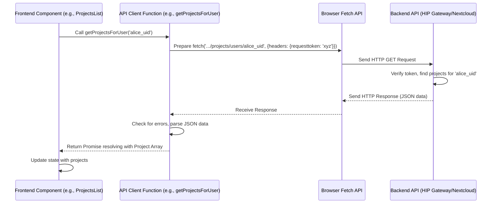

# Chapter 7: API Client Layer

In the [previous chapter](06_global_state_management__appstore__.md), we saw how the **AppStore** acts as a central hub for shared data like user details or project lists. We learned that the `AppStoreProvider` fetches this initial data when the application starts. But *how* exactly does the frontend application (running in your browser) talk to the backend servers (where the data actually lives) to fetch this information or tell the server to perform actions?

## The Problem: Talking to the Servers

Imagine you're using the HIP web interface. You click a button to see the list of your collaborative projects.

*   **Where is the data?** This list isn't stored directly in your browser. It lives on the HIP backend servers, likely in a database managed by the HIP Gateway.
*   **How does the browser get it?** The frontend application (running in your browser) needs a way to ask the backend server, "Hey, please send me the list of projects for the current user."
*   **What about actions?** Similarly, when you click "Create Desktop" ([Chapter 4](04_remote_desktop___app_management_.md)), the frontend needs to tell the backend server, "Please start a new virtual desktop for this user in this project."

Simply displaying things isn't enough; the frontend needs a reliable way to communicate back and forth with the backend systems.

## What is the API Client Layer?

Think of the **API Client Layer** as the **official messenger service** for the HIP frontend application.

*   **Role:** It handles *all* communication between the frontend UI (what you see and click) and the backend systems (the HIP Gateway and the [Nextcloud Backend Integration](08_nextcloud_backend_integration_.md)).
*   **Function:** It provides a set of pre-defined JavaScript functions that other parts of the frontend (like UI components or the [AppStore](06_global_state_management__appstore__.md)) can call.
*   **Abstraction:** It hides the complex details of how network requests are made. The UI component just needs to call a function like `getProjectsForUser()` and doesn't need to worry about constructing HTTP requests, setting authentication headers, or parsing server responses.

This layer acts as a translator and delivery service, taking simple requests from the UI components and handling the technical conversation with the servers, then delivering the results back.

## Key Concepts: How the Messenger Works

1.  **Functions as Requests:** Each task the frontend needs the backend to do (like getting data or creating something) is represented by a specific function in the API Client Layer.
    *   Example: To get the project list, you call `getProjectsForUser()`. To get files in a folder, you call `getFiles2()`. To create a desktop, you call `createDesktop()`.
2.  **Sending the Message (Request):** When a function like `getProjectsForUser(userId)` is called, the API Client Layer:
    *   Figures out the correct server address (URL endpoint) to send the request to (e.g., `https://hip.server.com/api/v1/projects/users/alice_uid`).
    *   Constructs the actual network request (an HTTP request).
    *   Includes any necessary information (like the `userId`).
    *   Adds crucial security details (like an authentication token `requesttoken` to prove the user is logged in).
    *   Sends the request over the internet to the backend server.
3.  **Receiving the Reply (Response):** The backend server processes the request and sends back a response. The API Client Layer:
    *   Receives this response.
    *   Checks if the request was successful or if there was an error.
    *   Extracts the useful data from the response (often in a format called JSON).
    *   Handles potential errors gracefully (`checkForError`, `catchError`).
4.  **Delivering the Result:** The API Client Layer function then returns the processed data (e.g., the list of projects) back to the part of the frontend that originally called it.

## Using the API Client Layer: Fetching Projects

Let's revisit the scenario from [Chapter 1](01_project___center_workspaces_.md) where we displayed a list of projects. The `ProjectsList` component needed to get this data.

**1. The UI Component's Need:** The `ProjectsList` component needs an array of `HIPProject` objects.

**2. Calling the API Client Function:** Inside the `ProjectsList` component, we use the `useEffect` hook to call the function provided by the API Client Layer when the component loads:

```typescript
// Simplified from: src/components/Projects/index.tsx
import React, { useEffect, useState } from 'react';
// Import the function from the API Client Layer
import { getProjectsForUser } from '../../api/projects';
import { HIPProject } from '../../api/types'; // Data structure
import { useAppStore } from '../../Store'; // To get user ID

const ProjectsList = () => {
  const [projects, setProjects] = useState<HIPProject[]>([]);
  const { user: [currentUser] } = useAppStore(); // Get user from global state

  useEffect(() => {
    if (currentUser?.uid) {
      // Call the API Client function
      getProjectsForUser(currentUser.uid)
        .then(fetchedProjects => {
          // The function returns the list of projects!
          setProjects(fetchedProjects);
        })
        .catch(error => console.error("Error fetching projects:", error));
    }
  }, [currentUser]); // Re-run if user changes

  // ... render the projects list ...
};
```

*   **Explanation:** The component gets the current user's ID from the [AppStore](06_global_state_management__appstore__.md). It then calls `getProjectsForUser(currentUser.uid)`. The `.then()` part shows what happens when the API Client function successfully returns the data – the component updates its local `projects` state.

**3. The Result:** The `getProjectsForUser` function handles all the communication with the backend and eventually returns a `Promise` that resolves with the array of `HIPProject` objects, which the component then uses to display the list.

## Under the Hood: Making the Network Request

What happens inside that `getProjectsForUser` function?

**Step-by-Step Walkthrough:**

1.  **Function Call:** The `ProjectsList` component calls `getProjectsForUser('alice_uid')`.
2.  **Prepare Request:** The `getProjectsForUser` function (inside `src/api/projects.tsx`) builds the specific URL needed to reach the backend endpoint (e.g., `/api/v1/projects/users/alice_uid`).
3.  **Use `fetch`:** It uses the browser's built-in `fetch` command to send an HTTP `GET` request to that URL.
4.  **Add Headers:** Crucially, it adds necessary "headers" to the request, including the `requesttoken`. This token acts like a temporary password proving that "Alice" is genuinely logged in and authorized to ask for her projects.
5.  **Send & Wait:** The browser sends the request across the network to the HIP backend server (API Gateway).
6.  **Backend Processing:** The backend server receives the request, verifies the `requesttoken`, finds the projects for 'alice_uid', and prepares a response containing the project data (usually in JSON format).
7.  **Receive Response:** The browser receives the response.
8.  **Process Response:** The `getProjectsForUser` function uses helper functions (`checkForError`, `catchError` from `src/api/gatewayClientAPI.tsx`) to:
    *   Check if the server reported success (e.g., HTTP status 200 OK).
    *   If successful, parse the JSON data into a JavaScript array of project objects.
    *   If unsuccessful, handle the error (e.g., log it, maybe show a message to the user).
9.  **Return Data:** The function returns the parsed array of projects (wrapped in a Promise) to the `ProjectsList` component.

**Sequence Diagram:**



**Code Snippets:**

Let's look at the simplified code for `getProjectsForUser`:

```typescript
// Simplified from: src/api/projects.tsx
import { API_GATEWAY, checkForError, catchError } from './gatewayClientAPI';
import { HIPProject } from './types';

// Base URL for the backend API, defined elsewhere
// e.g., const API_GATEWAY = '/api/v1';

export const getProjectsForUser = async (userId: string): Promise<HIPProject[]> => {
  // 1. Construct the specific URL endpoint
  const url = `${API_GATEWAY}/projects/users/${userId}`;

  // 2. Use the browser's fetch function
  return fetch(url, {
    method: 'GET', // Specify we want to GET data
    headers: {
      // 3. Include the essential authentication token
      'requesttoken': window.OC.requestToken,
      // Other headers like 'Content-Type' might be needed for POST/PUT
    },
  })
    // 4. Process the response when it arrives
    .then(checkForError) // Check for HTTP errors (e.g., 404 Not Found, 401 Unauthorized)
    // .then(response => response.json()) // If checkForError handles JSON parsing, this might not be needed here
    .catch(catchError); // Handle network errors or errors thrown by checkForError
};
```

*   **Explanation:**
    *   It builds the `url` by combining the base `API_GATEWAY` path with the specific endpoint for user projects.
    *   It calls `fetch` with the URL and an options object.
    *   `method: 'GET'` indicates we are retrieving data. Other methods include `POST` (create), `PUT` (update), `PATCH` (partial update), `DELETE` (remove).
    *   `headers`: This is critical. The `requesttoken` (obtained likely during login and stored, perhaps accessible via `window.OC`) authenticates the request. Without it, the backend would reject the request.
    *   `.then(checkForError)`: This passes the raw response to a helper function that checks if the request was successful (e.g., status code 200). If not, it throws an error. It might also parse the JSON data if the response is okay.
    *   `.catch(catchError)`: If `fetch` fails (e.g., network down) or `checkForError` throws an error, this catches it and handles it, preventing the application from crashing.

The helper functions `checkForError` and `catchError` (often found in a central file like `src/api/gatewayClientAPI.tsx`) handle the common logic for checking responses and dealing with errors consistently across all API calls.

```typescript
// Simplified from: src/api/gatewayClientAPI.tsx

// Helper to check the response status and parse JSON
export const checkForError = async (response: Response) => {
  // Check if the server responded with a success status (e.g., 200-299)
  if (!response.ok) {
    // If not OK, try to get an error message from the response body
    const errorData = await response.json().catch(() => null); // Try parsing error details
    const errorMessage = errorData?.message || `HTTP error! Status: ${response.status}`;
    // Throw an error to be caught by .catch()
    throw new Error(errorMessage);
  }

  // If response is OK, parse the JSON body
  // Handle cases where there might be no content
  if (response.status === 204) return null; // No Content
  return response.json(); // Parse and return the data
};

// Helper to catch errors from fetch or checkForError
export const catchError = (error: unknown) => {
  console.error("API call failed:", error); // Log the error
  // Re-throw or return a specific error format if needed
  // Returning an empty array or null might be appropriate sometimes
  return Promise.reject(error instanceof Error ? error.message : String(error));
};
```

*   **Explanation:** These functions provide reusable logic. `checkForError` checks the HTTP status code (`response.ok`) and tries to parse the response body as JSON, throwing an error if something went wrong. `catchError` logs the error and ensures a consistent rejection happens.

## Conclusion

You've now learned about the crucial role of the **API Client Layer**. It acts as the frontend's dedicated messenger, providing simple functions (`getProjectsForUser`, `getFiles2`, `createDesktop`, etc.) that components can use to interact with the backend servers.

Key takeaways:

*   It hides the complexity of network communication (HTTP, URLs, headers, errors).
*   It uses the browser's `fetch` API to send requests.
*   It handles authentication (e.g., sending `requesttoken`).
*   It processes responses and manages errors (`checkForError`, `catchError`).
*   It provides a clean interface for the rest of the frontend to get data and trigger actions.

This layer is the bridge connecting the user interface you see to the powerful backend systems that store data and perform computations. In the next chapter, we'll look more closely at one of those backend systems: the integration with Nextcloud for file storage and user management.

Next: [Nextcloud Backend Integration](08_nextcloud_backend_integration_.md)

---

Generated by [AI Codebase Knowledge Builder](https://github.com/The-Pocket/Tutorial-Codebase-Knowledge)