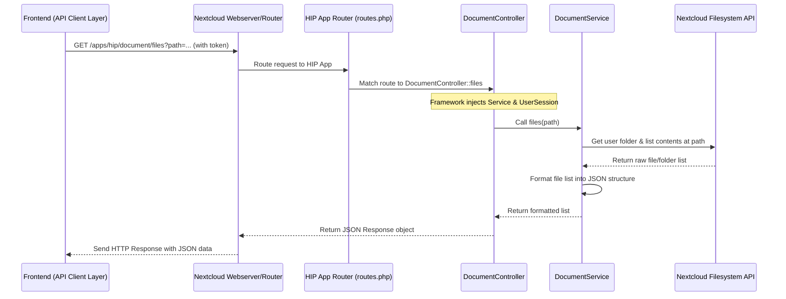

# Chapter 8: Nextcloud Backend Integration

Welcome to the final chapter of our HIP tutorial! In the [previous chapter](07_api_client_layer_.md), we learned how the **API Client Layer** acts as the frontend's messenger, sending requests to the backend to fetch data or perform actions. But where do these messages go? Who receives them and actually does the work on the server side?

That's the role of the **Nextcloud Backend Integration**.

## The Problem: Where Does the Server Magic Happen?

Imagine the [API Client Layer](07_api_client_layer_.md) sends a request like, "Please list the files in the 'MyProjectData' folder for user Alice." This request travels across the internet.

*   **Who receives it?** There needs to be a specific piece of software listening for these requests.
*   **How does it know it's Alice?** The system needs to securely identify the user making the request.
*   **How does it access files?** The software needs permission and the right tools to interact with the file storage system where 'MyProjectData' lives.
*   **How does it run *inside* Nextcloud?** HIP isn't a completely separate system; it works closely with Nextcloud, the platform often used for user accounts and file storage. How does HIP's server-side logic fit into the Nextcloud environment?

## What is the Nextcloud Backend Integration?

Think of Nextcloud as a large, secure country where all your files and user accounts live. The HIP frontend application is like a visitor from another country. The **Nextcloud Backend Integration** is the **HIP application's embassy** established *inside* the Nextcloud country.

*   **Location:** This backend code runs directly within the Nextcloud server environment. It's installed as a Nextcloud "App".
*   **Language:** It's primarily written in **PHP**, the main language used by Nextcloud itself.
*   **Function:** Its main job is to act as a secure bridge between the HIP frontend (the visitor) and the core features of Nextcloud (the country's resources).
*   **Services Provided (API Endpoints):** The embassy offers specific services (API endpoints) that the [API Client Layer](07_api_client_layer_.md) can contact. These services include:
    *   Verifying user identity (checking the visitor's passport using Nextcloud's login system).
    *   Listing, reading, or modifying files (accessing the country's file storage, but only where the user has permission).
    *   Providing user information (like the user's unique ID).

It allows the custom HIP frontend to securely interact with data and functions managed by the underlying Nextcloud platform.

## Key Concepts: Inside the Embassy

How is this "embassy" structured in the code?

1.  **Nextcloud App Framework:** HIP leverages Nextcloud's built-in system for creating apps. This provides standard ways to handle requests, manage dependencies, and interact with Nextcloud features.
2.  **Routes (`appinfo/routes.php`):** This is the embassy's address book. It maps specific URL paths (like `/apps/hip/document/files`) and request types (like `GET`) to the correct internal department (a Controller action) that should handle the request.
3.  **Controllers (`lib/Controller/`):** These are like the embassy's department heads. They receive incoming requests directed by the Routes. They understand *what* is being asked (e.g., "list files at this path") but usually delegate the actual work. They also manage security aspects (like ensuring a user is logged in using `@NoAdminRequired`).
4.  **Services (`lib/Service/`):** These are the specialists who perform the actual tasks. For example, a `DocumentService` knows how to interact with Nextcloud's file system API to list files, read file content, etc. Controllers use these services to get the job done.
5.  **Authentication Bridge (`IUserSession`):** The backend automatically uses Nextcloud's own user session management. When a request arrives with the `requesttoken` (mentioned in [Chapter 7](07_api_client_layer_.md)), the Nextcloud framework verifies it and makes the logged-in user's information available to the Controllers and Services. This ensures actions are performed securely on behalf of the correct user.

## How It Works: Listing Files (Backend Perspective)

Let's revisit the use case: The HIP frontend wants to list files in a specific folder `/Projects/AlzheimerStudy`.

1.  **Frontend Request:** The [API Client Layer](07_api_client_layer_.md) sends a `GET` request to a URL like `/apps/hip/document/files?path=/Projects/AlzheimerStudy`, including the `requesttoken` header.
2.  **Nextcloud Routing:** The Nextcloud web server receives the request. It sees the `/apps/hip/` prefix and directs the request to the HIP Nextcloud App. The HIP app's `routes.php` file matches the `/document/files` part to the `files` action in the `DocumentController`.
3.  **Controller Action:** The `DocumentController`'s `files` method is called. Nextcloud automatically provides the necessary tools, including the `DocumentService` and information about the logged-in user (thanks to the `requesttoken`). The `path` parameter (`/Projects/AlzheimerStudy`) is extracted from the request URL.
4.  **Service Execution:** The `DocumentController` calls the `files` method on the `DocumentService`, passing the `path`.
5.  **File System Interaction:** The `DocumentService` uses Nextcloud's internal PHP API for file management (like `IRootFolder`, `IUserFolder`) to:
    *   Get a reference to the *current user's* folder system.
    *   Navigate to the requested `path` (`/Projects/AlzheimerStudy`).
    *   List the contents of that directory.
    *   Format the list of files and folders into a structure the frontend expects (like the `Node` type from [Chapter 3](03_file_browsing_components_.md)).
6.  **Response:** The `DocumentService` returns the formatted list of files to the `DocumentController`.
7.  **Sending Back:** The `DocumentController` packages this list into an HTTP response (usually JSON) and sends it back to the browser.
8.  **Frontend Receives:** The [API Client Layer](07_api_client_layer_.md)'s `fetch` call receives the response, parses it, and provides the file list to the UI component.

## Under the Hood: PHP Code and Flow

Let's look at the simplified flow and some code snippets.

**Step-by-Step Walkthrough (File Listing Request):**

1.  Browser sends `GET /apps/hip/document/files?path=/some/folder` (with auth token).
2.  Nextcloud server routes this to the HIP app.
3.  HIP app's `routes.php` maps `/document/files` to `DocumentController::files`.
4.  Nextcloud framework creates/finds `DocumentController` and injects dependencies (like `DocumentService` and `IUserSession`).
5.  `DocumentController::files` method is executed. It retrieves the `path` parameter.
6.  Controller calls `DocumentService::files('/some/folder')`.
7.  `DocumentService` uses Nextcloud's `IUserFolder` API for the logged-in user to list files at `/some/folder`.
8.  `DocumentService` formats the file list (name, path, type, etc.).
9.  `DocumentService` returns the list to the Controller.
10. Controller wraps the list in a JSON response and returns it.
11. Nextcloud sends the JSON response back to the browser.

**Sequence Diagram:**



**Code Examples (Simplified PHP):**

**1. Defining the Route (`appinfo/routes.php`)**

This file tells Nextcloud which controller method handles which URL.

```php
<?php // File: appinfo/routes.php (Simplified)

return [
    'routes' => [
        // ... other routes ...
        [
            'name' => 'document#files', // An internal name for the route
            'url' => '/document/files', // The URL path relative to /apps/hip
            'verb' => 'GET',            // The HTTP method (GET, POST, etc.)
            // Maps to the 'files' method in DocumentController
            // Controller name derived from 'document', action is 'files'
        ],
        [
            'name' => 'api#uid',        // Route for getting user ID
            'url' => '/api/uid',
            'verb' => 'GET',
            // Maps to the 'uid' method in ApiController
        ]
        // ... other routes ...
    ]
];
```

*   **Explanation:** This configuration maps a `GET` request to `/apps/hip/document/files` to a method named `files` inside a controller named `DocumentController`. Similarly, `/apps/hip/api/uid` maps to the `uid` method in `ApiController`.

**2. The Controller (`lib/Controller/ApiController.php`)**

Controllers handle requests and use services. This one gets the user ID.

```php
<?php // File: lib/Controller/ApiController.php (Simplified)

namespace OCA\HIP\Controller;

use OCP\AppFramework\Controller;
use OCP\IRequest;        // Represents the incoming request
use OCP\IUserSession;    // Provides access to the logged-in user

class ApiController extends Controller
{
    protected $userSession;

    // Dependencies like IUserSession are automatically provided by Nextcloud
    public function __construct(string $AppName, IRequest $request, IUserSession $userSession) {
        parent::__construct($AppName, $request);
        $this->userSession = $userSession;
    }

    /**
     * Annotation tells Nextcloud this doesn't require admin rights.
     * @NoAdminRequired
     */
    public function uid() {
        // Get the user object from the session provided by Nextcloud
        $user = $this->userSession->getUser();
        // Return the user's unique ID
        return ['uid' => $user->getUID()]; // Return as JSON: {"uid": "alice"}
    }
}
```

*   **Explanation:** The `uid` method uses the `$userSession` (provided automatically by Nextcloud because it knows the user is logged in via the `requesttoken`) to get the current `User` object and returns their unique ID (`getUID()`). The `@NoAdminRequired` annotation is important for security, allowing regular users to access this endpoint.

**3. The Document Controller (`lib/Controller/DocumentController.php`)**

This controller handles file-related requests.

```php
<?php // File: lib/Controller/DocumentController.php (Simplified)

namespace OCA\HIP\Controller;

use OCP\AppFramework\Controller;
use OCP\IRequest;
use OCA\HIP\Service\DocumentService; // Import the service

class DocumentController extends Controller
{
    private $service;

    // DocumentService is automatically injected by Nextcloud's framework
    public function __construct(string $AppName, IRequest $request, DocumentService $service) {
        parent::__construct($AppName, $request);
        $this->service = $service; // Store the injected service
    }

    /**
     * @NoAdminRequired // Regular users can list files
     * @NoCSRFRequired // Often used for GET requests that don't change data
     */
    public function files(string $path = '/') { // Get 'path' from request URL, default '/'
        // Delegate the work to the DocumentService
        $fileList = $this->service->files($path);
        // Return the result (which will be automatically JSON encoded)
        return $fileList;
    }
}
```

*   **Explanation:** The `files` method receives the requested `path` from the URL. It then calls the `files` method of the injected `DocumentService`, passing the path along. It simply returns whatever the service gives back.

**4. The Service (`lib/Service/DocumentService.php`)**

This service contains the logic for interacting with files.

```php
<?php // File: lib/Service/DocumentService.php (Simplified)

namespace OCA\HIP\Service;

use OCP\Files\IRootFolder;  // Nextcloud API for accessing file storage
use OCP\Files\NotFoundException;
use OCP\Files\FileInfo;     // Represents file/folder info

class DocumentService {
    private $userFolder;

    // IRootFolder and userId are injected by Nextcloud
    public function __construct(IRootFolder $rootFolder, string $userId = null) {
        // Get the specific folder access for the currently logged-in user
        $this->userFolder = $rootFolder->getUserFolder($userId);
    }

    // Helper to format file info for the frontend
    private function formatNodeInfo($node) {
        return [
            'name' => $node->getName(),
            'isDirectory' => $node->getType() === FileInfo::TYPE_FOLDER,
            'path' => $this->userFolder->getRelativePath($node->getPath()),
            // ... other fields like size, modified date (simplified here)
        ];
    }

    public function files(string $path) {
        try {
            // Get the folder object for the requested path
            $folder = $this->userFolder->get($path);
            // Get the list of files/folders inside
            $nodes = $folder->getDirectoryListing();

            $formattedNodes = [];
            foreach ($nodes as $node) {
                // Format each item for the frontend
                $formattedNodes[] = $this->formatNodeInfo($node);
            }
            // Return the array of formatted file/folder info
            return ['entries' => $formattedNodes]; // Match frontend expectation

        } catch (NotFoundException $e) {
            // Handle case where the path doesn't exist
            return ['entries' => []];
        }
    }
}
```

*   **Explanation:**
    *   The constructor gets access to the specific file area of the logged-in user using `IRootFolder` and the `userId` provided by Nextcloud.
    *   The `files` method uses `$this->userFolder->get($path)` to access the requested directory within the user's file space.
    *   It calls `$folder->getDirectoryListing()` to get the contents (this is the core Nextcloud file API interaction).
    *   It loops through the results, formatting each file/folder using `formatNodeInfo` into a structure the frontend expects (matching the `Node` type from [Chapter 3](03_file_browsing_components_.md)).
    *   It returns the formatted list, wrapped in an `entries` key, ready to be sent back as JSON.

## Conclusion

Congratulations on completing the HIP tutorial! In this final chapter, we've unveiled the **Nextcloud Backend Integration**, the server-side component of HIP running *within* the Nextcloud environment.

You've learned that:

*   It's written in **PHP** and acts as a Nextcloud App.
*   It serves as the **secure bridge** (the "embassy") between the HIP React frontend and Nextcloud's core features like file storage and user authentication.
*   It defines **API endpoints** using Routes, Controllers, and Services.
*   Controllers handle incoming requests, while Services perform the actual work by interacting with Nextcloud's internal APIs (like `IUserSession` and `IRootFolder`).
*   This backend is what the [API Client Layer](07_api_client_layer_.md) in the frontend communicates with to fetch data and trigger actions securely.

Understanding this backend piece completes the picture of how HIP integrates deeply with the Nextcloud platform to provide its features. We hope this journey through the different layers of HIP – from workspaces and data handling to the frontend UI, state management, API communication, and backend integration – has given you a solid foundation for understanding how the platform works!

---

Generated by [AI Codebase Knowledge Builder](https://github.com/The-Pocket/Tutorial-Codebase-Knowledge)