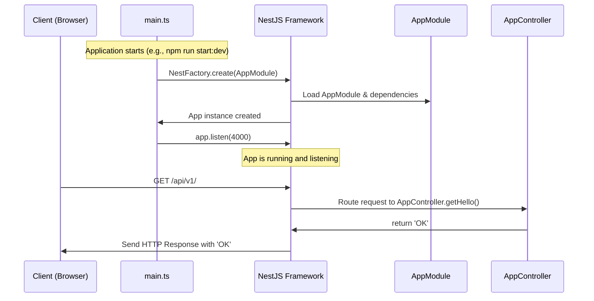

# Chapter 1: Application Module & Core Structure

Welcome to the Gateway project! This tutorial series will guide you through its different parts. In this first chapter, we'll explore the fundamental building blocks of the application – how it's organized and how everything starts up.

Imagine building something complex, like a robot. You wouldn't just throw all the wires and parts together randomly, right? You'd have a central processing unit (CPU), different modules for movement, sensors, communication, etc., and a clear way to connect them all and power it on.

Our Gateway application is similar. It has many features: managing users, handling files, connecting to other services like Nextcloud. We need a structured way to organize these features and make them work together. That's where the concepts of Modules, Controllers, Services, and the main entry point come in.

**The Problem:** How do we organize a complex web application with many features so that it's easy to manage, understand, and extend? How does the application even start running?

**The Solution:** We use the NestJS framework, which provides a modular structure. Think of it like using LEGO bricks – each brick (or module) has a specific purpose, and they snap together easily.

Let's look at the core pieces:

## Key Concepts

### 1. Modules: The Building Blocks (`*.module.ts`)

Imagine our Gateway application is a large company. A company isn't just one giant room; it's divided into departments like HR (Users), Manufacturing (Projects), Logistics (Nextcloud), etc. Each department focuses on a specific task but works with others.

In NestJS, these "departments" are called **Modules**. Each feature of our application (like user management, project handling, file operations) typically lives in its own module.

*   **`UsersModule`:** Handles everything related to users.
*   **`ProjectsModule`:** Manages project data.
*   **`NextcloudModule`:** Deals with interacting with Nextcloud.
*   ...and so on.

This separation makes the code organized and easier to maintain.

### 2. The Root Module: `AppModule` (`src/app.module.ts`)

If modules are departments, the `AppModule` is like the company's main headquarters or the central nervous system. It's the **root module** that knows about all the other major modules (departments) and connects them.

Look at this snippet from `src/app.module.ts`:

```typescript
// src/app.module.ts
import { Module } from '@nestjs/common';
import { ConfigModule } from '@nestjs/config';
// Import other feature modules
import { FilesModule } from './files/files.module';
import { UsersModule } from './users/users.module';
import { ProjectsModule } from './projects/projects.module';
import { NextcloudModule } from './nextcloud/nextcloud.module';
// ... other imports

@Module({
  imports: [ // <-- This array lists all connected modules
    ConfigModule.forRoot({ /* ... */ }), // For handling configuration
    FilesModule,          // Connects the Files feature
    UsersModule,          // Connects the Users feature
    ProjectsModule,       // Connects the Projects feature
    NextcloudModule,      // Connects the Nextcloud feature
    // ... other imported modules
  ],
  // ... controllers and providers below
})
export class AppModule {}
```

The `imports` array inside the `@Module` decorator is crucial. It tells NestJS: "Hey, this application uses the features provided by `ConfigModule`, `FilesModule`, `UsersModule`, etc." This wiring allows different parts of the application to collaborate.

### 3. Controllers: Handling Requests (`*.controller.ts`)

Controllers are like the receptionists or the front desk of each department (Module). When a request comes from the outside world (like a user clicking a button on a website, which sends an HTTP request), the controller is the first point of contact within the application.

*   It listens for specific incoming requests (e.g., requests to `/users` or `/projects/123`).
*   It understands what the request wants (e.g., get user data, create a new project).
*   It then usually delegates the actual work to a Service.

Here's a simple example from `src/app.controller.ts`:

```typescript
// src/app.controller.ts
import { Controller, Get } from '@nestjs/common';

@Controller() // This controller handles requests at the base path '/'
export class AppController {

  @Get('/') // Handles HTTP GET requests to '/'
  getHello() {
    return 'OK'; // Sends back the text "OK"
  }
}
```

This tiny controller listens for requests to the main root path (`/`) of our application and simply replies with the text "OK". This is often used as a basic health check.

### 4. Services: The Business Logic (`*.service.ts`)

Services are where the actual work happens – the "brains" behind each feature. They contain the core logic, interact with databases, call external APIs, and perform calculations.

*   Controllers *use* Services to fulfill requests.
*   For example, a `UsersController` might ask the `UsersService` to fetch a user from the database. A `ProjectsController` would use the `ProjectsService` to create a new project entry.

We'll dive deep into specific services like the [Identity & Access Management (IAM) Service](03_identity___access_management__iam__service_.md) and [Project Management (ProjectsService)](05_project_management__projectsservice_.md) in later chapters. For now, just know that services hold the important logic.

In `src/app.module.ts`, you can see some services listed in the `providers` array. This makes them available for use within the module (and sometimes globally).

```typescript
// src/app.module.ts excerpt
import { ProjectsService } from './projects/projects.service';
import { IamService } from './iam/iam.service';
// ... other imports

@Module({
  imports: [ /* ... */ ],
  controllers: [AppController], // We saw this controller earlier
  providers: [  // <-- Services are often listed here
    // ... other services
    IamService,       // Makes IamService available
    ProjectsService,  // Makes ProjectsService available
    // ...
  ],
})
export class AppModule {}
```

### 5. The Entry Point: `main.ts`

How does the whole application start? That's the job of the `src/main.ts` file. Think of it as the ignition key for our application robot or the main power switch for the company building.

It uses the `NestFactory` (provided by NestJS) to create an instance of our application, starting with the root module (`AppModule`).

```typescript
// src/main.ts
import { NestFactory } from '@nestjs/core';
import { AppModule } from './app.module'; // Import the root module
import { NestExpressApplication } from '@nestjs/platform-express';

async function bootstrap() {
  // Create the app instance using AppModule as the root
  const app = await NestFactory.create<NestExpressApplication>(AppModule, {
    // Optional settings like logging
  });

  // ... other setup like global prefix, CORS, cookies ...

  // Start listening for incoming requests on port 4000
  await app.listen(4000);
  console.log(`Application is running on: ${await app.getUrl()}`);
}
bootstrap(); // Run the bootstrap function to start the app
```

This file is executed when you run the command to start the server (e.g., `npm run start:dev`). It sets up the NestJS application, wires everything together based on `AppModule`, and starts listening for web requests on a specific port (4000 in this case).

## How it Works: A Simple Request

Let's trace what happens when you access the base URL of our running application (e.g., `http://localhost:4000/api/v1/` if running locally with the global prefix `/api/v1` configured in `main.ts`).

1.  **Start:** You run the application (e.g., `npm run start:dev`). This executes `src/main.ts`.
2.  **Bootstrap:** `main.ts` calls `NestFactory.create(AppModule)`. NestJS builds the application structure, starting with `AppModule`, loading all imported modules, controllers, and providers (services). It then starts listening on port 4000.
3.  **Request:** Your browser sends an HTTP GET request to `/api/v1/`.
4.  **Routing:** NestJS receives the request. Because of the global prefix `/api/v1` and the `@Controller()` decorator in `AppController`, it routes the request to `AppController`.
5.  **Controller Action:** Inside `AppController`, the `@Get('/')` decorator matches the request path (relative to the controller's path). The `getHello()` method is executed.
6.  **Response:** The `getHello()` method returns the string `'OK'`.
7.  **Send Back:** NestJS takes this return value and sends it back to your browser as the HTTP response.

Here's a simplified diagram:



## Under the Hood

*   **`main.ts`:** This is the non-NestJS part that kicks things off. It uses the core `NestFactory` to bridge the gap into the NestJS world. It also sets up application-wide configurations like the global prefix (`/api/v1`), enables CORS (Cross-Origin Resource Sharing), parses cookies, and importantly, starts the HTTP server to listen for requests.
*   **`AppModule` (`src/app.module.ts`):** This is the heart of the dependency injection system for NestJS. The `@Module` decorator provides metadata that NestJS uses:
    *   `imports`: Tells NestJS which other modules' exported providers are needed by this module. When `AppModule` imports `UsersModule`, it can potentially use services provided (and exported) by `UsersModule`.
    *   `controllers`: Lists the controllers that belong to this module. NestJS will instantiate these and map their routes.
    *   `providers`: Lists the services (and other providers like Guards, Interceptors) defined in this module. NestJS creates instances of these providers, making them available for injection into controllers or other services within the same module. If a provider needs to be used in *other* modules, it must also be listed in the `exports` array (not shown in the simplified `AppModule` snippet, but crucial for reusable modules).
*   **`AppController` (`src/app.controller.ts`):** The `@Controller()` decorator registers the class with NestJS's routing mechanism. Decorators like `@Get()`, `@Post()`, `@Param()`, `@Body()` provide metadata about *which* HTTP methods and URL paths the controller methods handle, and how to extract data (like URL parameters or request bodies) from the incoming request.

This structure, orchestrated by `AppModule` and started by `main.ts`, ensures that all the different features, like [User Management (UsersModule)](03_identity___access_management__iam__service_.md), [Project Management (ProjectsModule)](05_project_management__projectsservice_.md), and [Nextcloud Integration (NextcloudModule)](04_nextcloud_integration__nextcloudservice_.md), are properly initialized and connected when the application starts.

## Conclusion

We've seen the fundamental structure of the Gateway application built with NestJS:

*   **`main.ts`:** The entry point that bootstraps and starts the application.
*   **Modules (`*.module.ts`):** Organize code into features (like departments).
*   **`AppModule`:** The root module connecting all major feature modules (the headquarters).
*   **Controllers (`*.controller.ts`):** Handle incoming web requests (receptionists).
*   **Services (`*.service.ts`):** Contain the core business logic (the specialist teams).

Understanding this core structure is essential because it forms the backbone upon which all other features are built. It promotes organization, maintainability, and scalability.

In the next chapter, we'll look at how the application manages its settings and secrets using [Configuration Management](02_configuration_management_.md).

---

Generated by [AI Codebase Knowledge Builder](https://github.com/The-Pocket/Tutorial-Codebase-Knowledge)