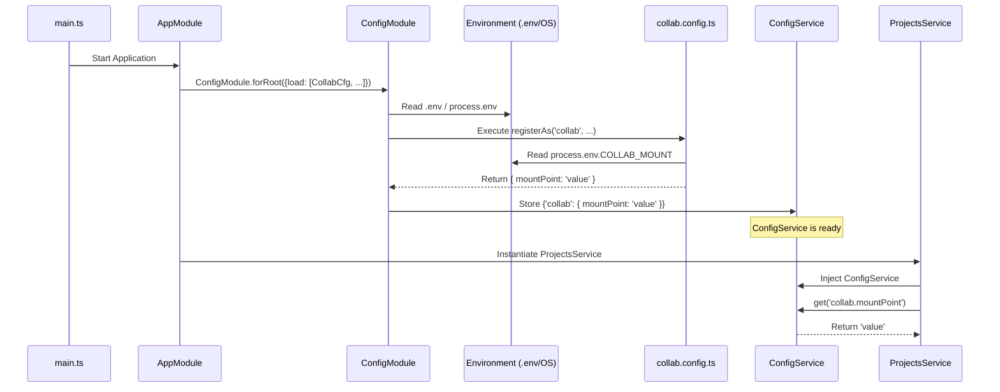

# Chapter 2: Configuration Management

Welcome back! In [Chapter 1: Application Module & Core Structure](01_application_module___core_structure_.md), we saw how the Gateway application is organized using modules, controllers, and services, and how it starts up with `main.ts` and `AppModule`.

Now, let's think about how applications handle settings that might change. Imagine our Gateway needs to connect to a database. The database connection details (like address, username, password) will be different on your local computer compared to the live server where real users access the application. How do we manage these changing settings without rewriting the code every time?

**The Problem:** How can we manage application settings like database passwords, API keys, server addresses, or file paths that vary between development, testing, and production environments? Hardcoding these values directly into our services is insecure and inflexible.

**The Solution:** We use **Configuration Management**. Think of it as the application's control panel. We define settings outside the main code, usually in environment variables, and use a special tool within NestJS to read and provide these settings wherever needed in a structured way.

In the Gateway project, we use NestJS's built-in `ConfigModule`.

## Key Concepts

### 1. Environment Variables: Settings Outside the Code

Imagine the dashboard of a car. You have gauges and dials for speed, fuel, temperature, etc. These aren't part of the engine itself, but they tell the driver (or the car's computer) important information about the current state or configuration.

**Environment variables** are like these dials for our application. They are variables set *outside* the application's code, in the environment where the application runs (your computer, a server, etc.).

*   **Example:** You might have an environment variable `POSTGRES_PASSWORD=mysecretdevpassword` on your local machine, but on the production server, it might be `POSTGRES_PASSWORD=aVeryStrongP@ssw0rd!`.

A common way to manage these in development is using a `.env` file in the project root (which should *not* be committed to version control like Git, especially if it contains secrets!).

```bash
# .env file example (DO NOT COMMIT SECRETS!)
POSTGRES_HOST=localhost
POSTGRES_PORT=5432
POSTGRES_USER=postgres
POSTGRES_PASSWORD=pass123
POSTGRES_DATABASE=mydatabase

IAM_CLIENT_ID=my-local-iam-client
IAM_CLIENT_SECRET=supersecretlocaltoken

COLLAB_MOUNT=/Users/myname/hip/collab
```

### 2. NestJS `ConfigModule`: The Settings Reader

NestJS provides a module called `ConfigModule` specifically designed to read environment variables (including those from a `.env` file) and make them easily accessible within our application. We saw this being imported in `AppModule` in Chapter 1.

```typescript
// src/app.module.ts (Simplified Excerpt)
import { Module } from '@nestjs/common';
import { ConfigModule } from '@nestjs/config';
// ... other imports and configuration loading files ...

@Module({
  imports: [
    ConfigModule.forRoot({ // <-- Initialize the ConfigModule
      isGlobal: true,     // <-- Make ConfigService available everywhere
      envFilePath: ['.env'], // <-- Tell it to load the .env file
      load: [/* ... configuration files listed here ... */], // <-- Load structured configs
    }),
    // ... other modules (UsersModule, ProjectsModule, etc.)
  ],
  // ... controllers and providers
})
export class AppModule {}
```

*   `ConfigModule.forRoot()` sets up the configuration system.
*   `isGlobal: true` means we don't have to import `ConfigModule` into every single feature module; its services become available application-wide.
*   `envFilePath: ['.env']` tells it to look for and load a `.env` file.
*   `load: [...]` is where we link our specific configuration files.

### 3. Configuration Files (`src/config/*.config.ts`): Organizing Settings

Instead of just reading raw environment variables everywhere, we organize them into logical groups using special configuration files, typically placed in `src/config/`. We have files like:

*   `db.postgres.config.ts`: For PostgreSQL database settings.
*   `api.iam.config.ts`: For Identity & Access Management API settings.
*   `collab.config.ts`: For settings related to the collaboration workspace mount point.
*   `instance.config.ts`: For general instance settings like hostname.

### 4. `registerAs`: Creating Namespaces

Inside these configuration files, we use a function called `registerAs` provided by `@nestjs/config`. This function takes two arguments:

1.  A **namespace** string (like `'postgres'`, `'iam'`, `'collab'`). Think of this as labeling a section on our control panel.
2.  A function that reads specific environment variables (using `process.env.VARIABLE_NAME`) and returns an object containing the related settings.

```typescript
// src/config/db.postgres.config.ts (Simplified)
import { registerAs } from '@nestjs/config';

export default registerAs('postgres', () => ({ // <-- Namespace is 'postgres'
  host: process.env.POSTGRES_HOST || 'localhost', // Read env var, provide default
  port: parseInt(process.env.POSTGRES_PORT, 10) || 5432, // Read and convert to number
  username: process.env.POSTGRES_USER || 'postgres',
  password: process.env.POSTGRES_PASSWORD, // Read env var (no default needed if required)
  database: process.env.POSTGRES_DATABASE || 'postgres',
}));
```

This creates a configuration object accessible under the `postgres` namespace. The `|| 'default'` part provides a fallback value if the environment variable isn't set.

### 5. `ConfigService`: Accessing Settings

Once `ConfigModule` is set up and our configurations are loaded using `registerAs`, NestJS provides a service called `ConfigService`. We can inject this service into any other service or controller that needs access to configuration values.

## How to Use: Getting Configuration Values

Let's say our `ProjectsService` needs to know the file path where collaboration project data is stored (the "mount point"). This setting is defined in `collab.config.ts`.

**Step 1: Define the Configuration Namespace**

We ensure `collab.config.ts` uses `registerAs` to define the `collab` namespace and reads the `COLLAB_MOUNT` environment variable.

```typescript
// src/config/collab.config.ts (Simplified)
import { registerAs } from '@nestjs/config';

export default registerAs('collab', () => ({ // <-- Namespace is 'collab'
  mountPoint: process.env.COLLAB_MOUNT || '/mnt/collab', // Read env var
  suffix: process.env.COLLAB_SUFFIX || 'dev',
}));
```

**Step 2: Load the Configuration in `AppModule`**

We make sure `collabConfig` (the default export from the file above) is included in the `load` array within `ConfigModule.forRoot` in `app.module.ts`.

```typescript
// src/app.module.ts (Simplified Excerpt)
import { ConfigModule } from '@nestjs/config';
import collabConfig from './config/collab.config'; // Import the config
import postgresConfig from './config/db.postgres.config'; // Other configs...
// ... other imports

@Module({
  imports: [
    ConfigModule.forRoot({
      isGlobal: true,
      envFilePath: ['.env'],
      load: [ // <-- List all config files to load
        collabConfig,
        postgresConfig,
        // ... iamConfig, redisConfig, instanceConfig ...
      ],
    }),
    // ... other modules
  ],
})
export class AppModule {}
```

**Step 3: Inject `ConfigService` in `ProjectsService`**

In our `ProjectsService`, we use dependency injection (which NestJS handles automatically) to get an instance of `ConfigService`.

```typescript
// src/projects/projects.service.ts (Simplified Excerpt)
import { Injectable, Logger } from '@nestjs/common';
import { ConfigService } from '@nestjs/config'; // Import ConfigService
// ... other imports

@Injectable()
export class ProjectsService {
  private readonly logger = new Logger(ProjectsService.name);
  private collabMountPoint: string;

  constructor(
    private readonly configService: ConfigService, // Inject ConfigService here!
    // ... other injected services like IamService, CacheService, etc.
  ) {
    // Get the configuration value during initialization
    this.collabMountPoint = this.configService.get<string>('collab.mountPoint');
    this.logger.log(`Collab mount point is: ${this.collabMountPoint}`);
  }

  // ... other methods in ProjectsService that might use this.collabMountPoint ...

  async someProjectMethod(projectName: string) {
    const projectPath = `${this.collabMountPoint}/__groupfolders/${projectName}`;
    this.logger.log(`Accessing project data at: ${projectPath}`);
    // ... do something with the path ...
  }
}
```

**Step 4: Use `configService.get()`**

Inside the `ProjectsService` constructor (or any method), we call `this.configService.get<string>('collab.mountPoint')`.

*   `'collab.mountPoint'` uses "dot notation": `namespace.settingKey`.
*   `get<string>` tells `ConfigService` we expect the value to be a string (this helps with type safety).
*   `ConfigService` looks up the `mountPoint` setting within the `collab` namespace (which was loaded from the `COLLAB_MOUNT` environment variable) and returns its value.

If our `.env` file contained `COLLAB_MOUNT=/data/shared`, the `this.collabMountPoint` variable would hold the string `'/data/shared'`.

## Under the Hood

Let's trace the flow when the application starts and a service requests a configuration value:

1.  **App Start:** You run `npm run start:dev`. `src/main.ts` executes.
2.  **NestJS Init:** `NestFactory.create(AppModule)` initializes the NestJS application based on `AppModule`.
3.  **ConfigModule Init:** NestJS sees `ConfigModule.forRoot({...})` in `AppModule`'s imports.
4.  **Env Load:** `ConfigModule` reads the `.env` file (because of `envFilePath: ['.env']`). The environment variables are now available via `process.env`.
5.  **Namespace Loading:** `ConfigModule` iterates through the `load` array (`[collabConfig, postgresConfig, ...]`).
6.  **`registerAs` Execution:** For each item in `load`, it calls the exported function (e.g., the one from `collab.config.ts`). This function executes `registerAs('collab', () => ({ mountPoint: process.env.COLLAB_MOUNT || '...' }))`.
7.  **Value Reading:** The function inside `registerAs` reads `process.env.COLLAB_MOUNT` and returns the structured object `{ mountPoint: '/data/shared' }`.
8.  **Storage:** `ConfigModule` stores this object internally, associated with the `'collab'` namespace. It repeats this for all namespaces (`'postgres'`, `'iam'`, etc.).
9.  **`ConfigService` Ready:** The `ConfigService` is now populated with all the namespaced configuration data.
10. **Service Injection:** When NestJS creates an instance of `ProjectsService`, it sees `ConfigService` in the constructor parameters.
11. **Injection:** NestJS provides the already initialized `ConfigService` instance to the `ProjectsService`.
12. **Value Request:** Inside `ProjectsService`, the code calls `this.configService.get<string>('collab.mountPoint')`.
13. **Lookup:** `ConfigService` looks up the `mountPoint` key within its internal storage for the `collab` namespace.
14. **Return Value:** `ConfigService` returns the found value (`'/data/shared'`).

Here's a simplified diagram showing the loading and retrieval:



This system ensures that configuration is loaded early, centrally managed, organized logically, and easily accessible throughout the application in a type-safe way.

## Conclusion

We've learned how the Gateway project uses NestJS's `ConfigModule` to manage application settings:

*   Settings are stored externally (often in environment variables and `.env` files).
*   `ConfigModule` loads these settings at startup.
*   `registerAs` in files like `src/config/*.config.ts` organizes settings into **namespaces** (e.g., `postgres`, `iam`, `collab`).
*   The `ConfigService` allows any part of the application to easily retrieve these settings using `configService.get('namespace.key')`.

This approach makes our application adaptable to different environments (dev, test, prod) without changing the code, keeps sensitive data like passwords out of the source code, and organizes settings cleanly.

Now that we understand how the application is structured and configured, we can dive into its specific features. In the next chapter, we'll explore how the application manages users and permissions using the [Identity & Access Management (IAM) Service](03_identity___access_management__iam__service_.md).

---

Generated by [AI Codebase Knowledge Builder](https://github.com/The-Pocket/Tutorial-Codebase-Knowledge)