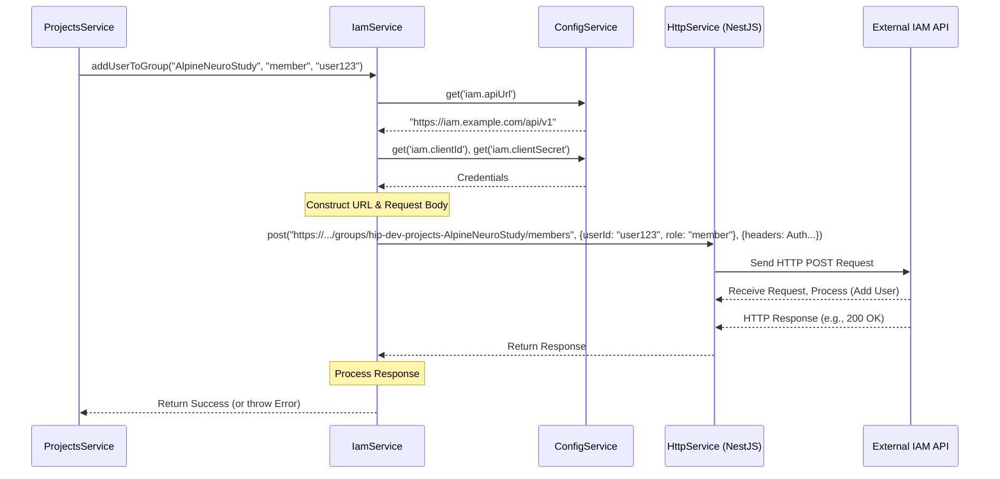

# Chapter 3: Identity & Access Management (IAM) Service

Welcome back! In [Chapter 2: Configuration Management](02_configuration_management_.md), we learned how the Gateway manages different settings for various environments using the `ConfigModule`. Now, let's tackle a crucial aspect of any collaborative platform: controlling who can do what.

Imagine you're working on a team project using the Gateway. You need to make sure only team members can see the project files, and maybe only a couple of people (the admins) can add or remove other members. How does the Gateway know who is who and what permissions they have?

**The Problem:** How do we securely manage user identities, group memberships (like project teams), and permissions (like who can create projects or manage members) within the Gateway application, especially when collaborating with external systems like EBrains?

**The Solution:** We use a dedicated service called the **Identity & Access Management (IAM) Service** (`IamService`). Think of it as the Gateway's specialized security guard. This guard doesn't decide the rules (who gets access) but communicates with a central security office (an external IAM system, likely EBrains IAM) to verify identities and enforce the access rules defined there.

## Key Concepts

### 1. External IAM System (e.g., EBrains IAM)

The Gateway doesn't manage user accounts (usernames, passwords) or the primary definition of permissions itself. It relies on an **external Identity and Access Management (IAM) system**. For the HIP project, this is typically the central EBrains IAM.

*   **Analogy:** Think of the external IAM system as the main Human Resources (HR) department and security office for a large organization (like EBrains). It holds the official employee directory (user accounts) and defines security groups and roles.

### 2. Groups for Projects

In the IAM world, access is often managed through **groups**. In our Gateway, each collaborative project typically corresponds to a specific group within the external IAM system.

*   **Example:** If you create a project named "AlpineNeuroStudy", the `IamService` might ask the external IAM system to create a group called something like `hip-dev-projects-AlpineNeuroStudy`.

### 3. Roles within Groups (Permissions)

Being in a group isn't always enough. You might have different **roles** within that group, granting different permissions. Common roles in our projects might be:

*   **Member:** Can view project resources.
*   **Administrator:** Can manage project members and potentially other settings.

*   **Analogy:** Just being part of the "AlpineNeuroStudy" team (group) doesn't mean everyone has the same keys. Some are 'Members' with basic access, while others are 'Administrators' with master keys.

### 4. The `IamService`: Our Gateway's Communicator

The `IamService` (`src/iam/iam.service.ts`) is the part of our Gateway application that knows how to talk to the external IAM system. It acts as an intermediary or a translator.

*   It takes requests from other parts of the Gateway (like the [Project Management (ProjectsService)](05_project_management__projectsservice_.md)).
*   It formats these requests correctly for the external IAM system's API (Application Programming Interface - a way for programs to talk to each other).
*   It sends the requests (e.g., "create group X", "add user Y to group X as member", "is user Z an admin of group X?").
*   It receives the responses and passes them back or uses them to make decisions.

*   **Analogy:** Our security guard (`IamService`) doesn't have the master list of all employees and permissions. When someone tries to enter a restricted area (access a project), the guard calls the central security office (External IAM) via a specific protocol (API) to check their credentials and permissions. The guard can also ask the central office to update the access lists (add/remove users).

## How to Use: Adding a User to a Project

Let's look at a common scenario: A project administrator wants to add a new member to their project.

1.  The administrator interacts with the Gateway's user interface (not covered here).
2.  This triggers a request to the Gateway backend, likely handled by a controller within the `ProjectsModule`.
3.  The `ProjectsController` calls a method in the [Project Management (ProjectsService)](05_project_management__projectsservice_.md), maybe named `addUserToProject`.
4.  Inside `ProjectsService`, to actually grant the permissions, it needs to tell the external IAM system. So, it uses the `IamService`.

Here's a *simplified* example of how `ProjectsService` might use `IamService`:

```typescript
// Simplified snippet from hypothetical ProjectsService
import { Injectable, Logger } from '@nestjs/common';
import { IamService } from '../iam/iam.service'; // Import IamService

@Injectable()
export class ProjectsService {
  private readonly logger = new Logger(ProjectsService.name);

  constructor(
    private readonly iamService: IamService, // Inject IamService
     // ... other services like ConfigService ...
  ) {}

  async addUserToProject(projectName: string, userIdToAdd: string, requestingUserId: string) {
    this.logger.log(`Attempting to add user ${userIdToAdd} to project ${projectName}`);

    // (First, maybe check if requestingUserId is actually an admin of projectName
    // using another IamService method like iamService.isUserAdmin(projectName, requestingUserId))

    try {
      // Ask IamService to add the user to the corresponding group
      const result = await this.iamService.addUserToGroup(
        projectName, // The logical project name (becomes part of the group name)
        'member',    // The role to assign
        userIdToAdd  // The ID of the user to add
      );

      this.logger.log(`User ${userIdToAdd} added successfully.`);
      // Return some success status or updated project info
      return { success: true, details: result };
    } catch (error) {
      this.logger.error(`Failed to add user ${userIdToAdd}: ${error.message}`);
      // Handle error appropriately
      throw new Error(`Could not add user to project.`);
    }
  }
  // ... other methods
}
```

**Explanation:**

1.  **Import & Inject:** We import `IamService` and make it available inside `ProjectsService` through the constructor (dependency injection, handled by NestJS).
2.  **Call `addUserToGroup`:** The core action is calling `this.iamService.addUserToGroup(...)`.
3.  **Parameters:**
    *   `projectName`: The name of the project, which `IamService` will likely use to figure out the actual IAM group name (e.g., `hip-dev-projects-AlpineNeuroStudy`).
    *   `'member'`: The desired role for the user in this group.
    *   `userIdToAdd`: The unique identifier of the user being added.
4.  **Expected Outcome:** The `IamService` communicates with the external IAM system. If successful, the external system updates its records, granting the specified user 'member' access to the project's group. The `addUserToGroup` method might return details about the operation or simply confirm success. If it fails (e.g., user doesn't exist, network error), it throws an error.

## Under the Hood: How `IamService` Works

So, what happens inside `IamService` when `addUserToGroup` is called? It doesn't magically update permissions; it acts as a client to the external IAM system's API.

**Non-Code Walkthrough:**

1.  **Receive Request:** `IamService.addUserToGroup` receives the project name, role, and user ID from `ProjectsService`.
2.  **Get Configuration:** It retrieves necessary details like the IAM system's API URL, client ID, and client secret (credentials to authenticate the Gateway itself) using the [Configuration Management](02_configuration_management_.md) (`ConfigService`). These were likely loaded from environment variables via `src/config/api.iam.config.ts`.
3.  **Construct API Request:** It builds the specific API request needed by the external IAM system. This usually involves:
    *   Figuring out the exact API endpoint URL (e.g., `https://iam.example.com/api/v1/groups/hip-dev-projects-AlpineNeuroStudy/members`).
    *   Creating the data payload (often JSON) specifying the user ID and the role (e.g., `{ "userId": "new_user_123", "role": "member" }`).
    *   Adding authentication headers using the credentials obtained in step 2.
4.  **Send Request:** It uses NestJS's built-in `HttpService` (a wrapper around the `axios` library) to send an HTTP request (likely a `POST` or `PUT` request) to the constructed URL with the payload and headers.
5.  **Handle Response:** It waits for the response from the external IAM API.
    *   **Success:** If the API confirms the user was added (e.g., returns a `200 OK` or `201 Created` status), `IamService` returns successfully to `ProjectsService`.
    *   **Failure:** If the API indicates an error (e.g., `404 Not Found` if the group doesn't exist, `403 Forbidden` if the Gateway's credentials lack permission, `409 Conflict` if the user is already there), `IamService` throws an error, which `ProjectsService` then catches.

**Sequence Diagram:**



**Code Snippets (Simplified):**

First, `IamService` needs access to `HttpService` (for making requests) and `ConfigService` (for settings). This is set up in the module and constructor:

```typescript
// src/iam/iam.module.ts (Simplified)
import { Module } from '@nestjs/common';
import { HttpModule } from '@nestjs/axios'; // Import HttpModule
import { IamService } from './iam.service';
// CacheService might also be used, but omitted for simplicity here

@Module({
  imports: [HttpModule], // Make HttpService available
  providers: [IamService /*, CacheService*/], // Provide IamService
  exports: [IamService] // Export IamService so other modules (like ProjectsModule) can use it
})
export class IamModule {}
```

```typescript
// src/iam/iam.service.ts (Simplified Constructor)
import { Injectable, Logger } from '@nestjs/common';
import { HttpService } from '@nestjs/axios'; // Import HttpService
import { ConfigService } from '@nestjs/config'; // Import ConfigService
import { firstValueFrom } from 'rxjs'; // Needed to work with HttpService Observables

@Injectable()
export class IamService {
  private readonly logger = new Logger(IamService.name);
  private iamApiUrl: string;
  private iamClientCreds: any; // Simplified type

  constructor(
    private readonly httpService: HttpService, // Inject HttpService
    private readonly configService: ConfigService // Inject ConfigService
  ) {
    // Get IAM config at startup
    this.iamApiUrl = this.configService.get<string>('iam.apiUrl');
    this.iamClientCreds = { // Simplified structure
      id: this.configService.get<string>('iam.clientId'),
      secret: this.configService.get<string>('iam.clientSecret'),
    };
    this.logger.log(`IAM Service configured for URL: ${this.iamApiUrl}`);
  }

  // ... other methods like addUserToGroup ...
}
```

Now, a simplified look inside the `addUserToGroup` method:

```typescript
// src/iam/iam.service.ts (Simplified addUserToGroup method)
import { /* ... */ HttpException, HttpStatus } from '@nestjs/common';
// ... other imports

export class IamService {
  // ... constructor ...

  async addUserToGroup(projectName: string, role: string, userId: string) {
    // Note: Real implementation likely maps projectName to a full group name
    const groupName = `hip-${this.configService.get('collab.suffix')}-projects-${projectName}`;
    const url = `${this.iamApiUrl}/groups/${groupName}/members`; // Construct specific API endpoint

    this.logger.debug(`Adding user ${userId} with role ${role} to group ${groupName} via URL: ${url}`);

    try {
      const payload = { userId: userId, role: role }; // Data to send

      // Use HttpService to make the POST request
      // (Authentication details would be added in headers, simplified here)
      const response = await firstValueFrom(
        this.httpService.post(url, payload, {
          /* headers: { Authorization: ... using this.iamClientCreds ... } */
        })
      );

      this.logger.log(`IAM API response status: ${response.status}`);
      if (response.status >= 200 && response.status < 300) {
        return response.data; // Return data from IAM API on success
      } else {
        throw new HttpException(`IAM API Error: ${response.status}`, response.status);
      }
    } catch (error) {
      this.logger.error(`Error adding user to group ${groupName}: ${error.message}`);
      // Rethrow or handle specific errors
      throw new HttpException(`Failed to add user via IAM: ${error.message}`, HttpStatus.INTERNAL_SERVER_ERROR);
    }
  }

  // ... other methods like createGroup, deleteGroup, getGroup, getUser, etc. ...
}

```

**Explanation:**

1.  **URL Construction:** It builds the target API endpoint URL using the base URL from config and the specific group name.
2.  **Payload:** It creates the data object (`payload`) required by the external API.
3.  **`httpService.post`:** It uses the injected `httpService` to send a `POST` request. We pass the URL, the `payload`, and configuration (like authentication headers, omitted here for brevity). `firstValueFrom` converts the Observable returned by `httpService` into a Promise.
4.  **Response/Error Handling:** It checks the HTTP status code of the response. If it's a success code (2xx range), it returns the data. Otherwise, it logs the error and throws an `HttpException`, which can be handled further up the call stack (e.g., back in `ProjectsService` or the controller).

The `IamService` contains many similar methods (`createGroup`, `deleteGroup`, `getGroup`, `getUser`, `removeUserFromGroup`, etc.) that all follow this pattern: get config, build request, send request via `HttpService`, handle response/error.

## Conclusion

We've learned that the Gateway doesn't manage user identities or permissions directly. Instead, the **`IamService`** acts as a dedicated communicator, interacting with an **external IAM system** (like EBrains IAM) to:

*   Verify user roles and permissions.
*   Manage group memberships (e.g., adding/removing users from project groups).
*   Create or delete groups corresponding to projects.

It uses configuration loaded via [Configuration Management](02_configuration_management_.md) to know how to talk to the external IAM API and utilizes NestJS's `HttpService` to perform the actual communication. This keeps the core application logic separate from the specifics of the external identity provider.

In the next chapter, we'll explore another external integration: how the Gateway interacts with file storage using the [Nextcloud Integration (NextcloudService)](04_nextcloud_integration__nextcloudservice__.md).

---

Generated by [AI Codebase Knowledge Builder](https://github.com/The-Pocket/Tutorial-Codebase-Knowledge)