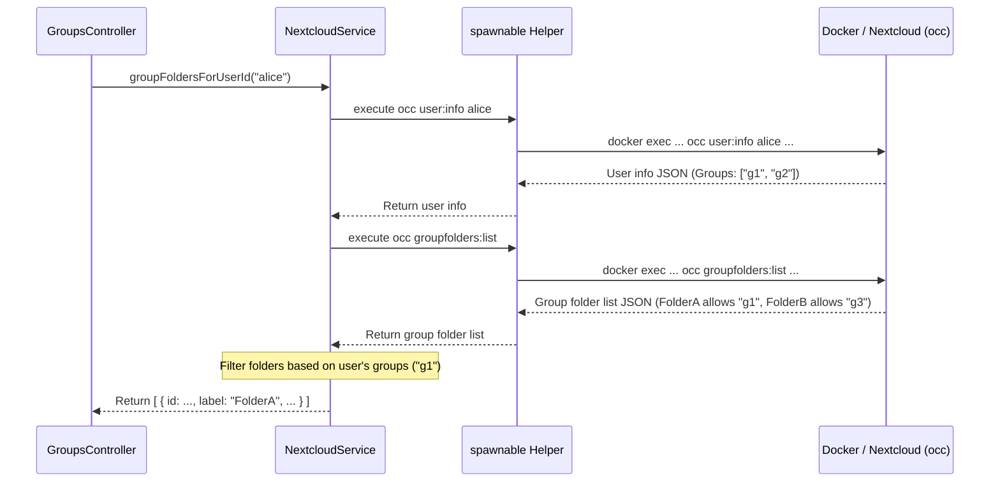

# Chapter 4: Nextcloud Integration (NextcloudService)

Welcome back! In [Chapter 3: Identity & Access Management (IAM) Service](03_identity___access_management__iam__service_.md), we saw how the Gateway uses the `IamService` to communicate with an external system to manage user permissions and group memberships.

Now, let's think about where the actual project *files* live. Our Gateway application needs to work closely with a file storage system, which, in this project, is Nextcloud. How does the Gateway find out information *about* Nextcloud, like which users exist there, what shared folders they can access, or even ask Nextcloud to rescan its files?

**The Problem:** The Gateway needs information directly from the underlying Nextcloud instance (like user details, group folders, file listings) to provide context to other services, but it shouldn't contain all the Nextcloud logic itself. How can we interact with Nextcloud cleanly and efficiently?

**The Solution:** We use a dedicated service called **`NextcloudService`**. Think of `NextcloudService` as the Gateway's **liaison officer** assigned specifically to the Nextcloud installation. This officer knows exactly how to talk to Nextcloud using its specific languages (APIs and command-line tools) and retrieve the necessary information or trigger actions within Nextcloud.

## Key Concepts

### 1. Nextcloud: The File Storage Backend

Nextcloud is the powerful, self-hosted software used by this project to store user files, manage shared project folders (often called "Group Folders" in Nextcloud), and handle file synchronization. It's the underlying platform where all the collaborative data resides.

*   **Analogy:** If the Gateway is the control tower for our collaborative projects, Nextcloud is the vast warehouse complex where all the physical goods (files) are stored and organized.

### 2. `NextcloudService`: The Gateway's Liaison

The `NextcloudService` (`src/nextcloud/nextcloud.service.ts`) is a module within the Gateway specifically designed to handle *all* communication with the Nextcloud instance. It acts as a bridge.

*   It takes requests from other parts of the Gateway (like "Get me the list of users" or "Find the shared folders for this user").
*   It translates these requests into commands Nextcloud understands.
*   It sends these commands to Nextcloud.
*   It receives the response from Nextcloud and translates it back into a format the Gateway can use.

### 3. How it Communicates: APIs and `occ` Commands

`NextcloudService` uses two main methods to talk to Nextcloud:

*   **Nextcloud APIs (HTTP):** For some tasks, like checking if a user is currently logged into the Nextcloud web interface (`/isLoggedIn`) or getting the logged-in user's ID (`/uid`), it uses Nextcloud's web-based APIs. This often involves forwarding the user's browser cookies and request tokens. It uses NestJS's `HttpService` (seen in [Chapter 3](03_identity___access_management__iam__service_.md)) for this.
*   **`occ` Command-Line Tool (via Docker):** For many administrative tasks or retrieving internal information (like listing all users (`/users`), getting group folder details (`/groups`), or triggering file scans (`/scanUserFiles`)), `NextcloudService` uses Nextcloud's powerful command-line tool called `occ`. Since Nextcloud often runs inside a Docker container, the `NextcloudService` executes these `occ` commands using `docker exec`. It has a helper function (`spawnable`) to manage this.

*   **Analogy:** Our liaison officer (`NextcloudService`) has two ways to talk to the warehouse complex (Nextcloud). Sometimes, they use the official front desk API (HTTP API) for simple checks. Other times, for more detailed internal information or actions, they use a special radio (`occ` command) to talk directly to the warehouse managers running operations inside (via Docker).

## How to Use: Getting a User's Group Folders

Let's say we want to display a list of shared project folders (Group Folders) that a specific user has access to. The `GroupsController` would handle the incoming web request, but it needs to ask `NextcloudService` to get this information.

**Step 1: Inject `NextcloudService`**

The `GroupsController` needs access to the `NextcloudService`. This is done via dependency injection in the constructor.

```typescript
// src/groups/groups.controller.ts (Simplified)
import { Controller, Get, Param, Logger } from '@nestjs/common';
import { NextcloudService, GroupFolder } from 'src/nextcloud/nextcloud.service'; // Import service and type

@Controller('groups')
export class GroupsController {
  private readonly logger = new Logger('GroupsController');

  constructor(
    private readonly nextcloudService: NextcloudService // Inject NextcloudService
  ) {}

  // ... methods below ...
}
```
*   **Explanation:** We import `NextcloudService` and list it in the `constructor`. NestJS automatically provides an instance of `NextcloudService` when creating `GroupsController`.

**Step 2: Call the Service Method**

The controller defines a route (e.g., `/groups/:userid`) and calls the relevant method on the injected `nextcloudService`.

```typescript
// src/groups/groups.controller.ts (Method Added)

  @Get(':userid') // Handles requests like GET /groups/alice
  async findGroups(@Param('userid') userid: string): Promise<GroupFolder[]> {
    this.logger.debug(`Finding group folders for user: ${userid}`);

    // Ask NextcloudService for the group folders this user can access
    const groupFolders = await this.nextcloudService.groupFoldersForUserId(userid);

    this.logger.debug(`Found folders: ${JSON.stringify(groupFolders)}`);
    return groupFolders; // Return the list
  }
```
*   **Input:** The `userid` (e.g., `"alice"`) is passed to `nextcloudService.groupFoldersForUserId`.
*   **Output:** The method is expected to return a Promise that resolves to an array of `GroupFolder` objects, each containing details like the folder's ID, display name (`label`), and internal path. For example: `[{ id: 12, label: "ProjectAlpha", path: "__groupfolders/12" }, { id: 15, label: "SharedDocs", path: "__groupfolders/15" }]`.

## Under the Hood: How `groupFoldersForUserId` Works

What happens inside `NextcloudService` when `groupFoldersForUserId` is called? It orchestrates several steps, mostly using the `occ` command.

**Non-Code Walkthrough:**

1.  **Receive User ID:** The method gets the `userid` (e.g., "alice").
2.  **Get User's Groups:** It uses the internal `spawnable` helper function to execute a command like `docker exec ... occ user:info alice --output=json`. This asks Nextcloud for detailed information about "alice", including the list of groups she belongs to (e.g., `["projectalpha-members", "shared-docs-users", "everyone"]`).
3.  **Get All Group Folders:** It uses `spawnable` again to run `docker exec ... occ groupfolders:list --output=json`. This asks Nextcloud for a list of *all* configured Group Folders and which Nextcloud groups have access to each (e.g., Folder "ProjectAlpha" (ID 12) allows group "projectalpha-members", Folder "SharedDocs" (ID 15) allows group "shared-docs-users").
4.  **Filter and Format:** It compares Alice's groups (from step 2) with the permissions of each group folder (from step 3). If Alice is in a group allowed access to a folder, that folder is included in the results.
5.  **Return Result:** It formats the matching folders into the `GroupFolder[]` array and returns it.

**Sequence Diagram:**



**Code Dive:**

First, let's look at the `spawnable` helper function that actually runs the `docker exec ... occ` commands.

```typescript
// src/nextcloud/nextcloud.service.ts (Simplified spawnable)
import { spawn } from 'child_process'; // Node.js module to run external commands
import { Injectable, Logger, HttpStatus } from '@nestjs/common';

// Arguments needed to run 'php occ' inside the Nextcloud Docker container
const OCC_DOCKER_ARGS = [ 'exec', '--user', 'www-data:www-data', 'cron', 'php', 'occ' ];

@Injectable()
export class NextcloudService {
  private readonly logger = new Logger('NextcloudService');

  // ... constructor ...

  private spawnable = (args: string[]): Promise<string> => {
    // Combine base Docker args with specific 'occ' command args, request JSON output
    const cmdArgs = [...OCC_DOCKER_ARGS, ...args, '--output=json'];
    this.logger.debug(`Running command: docker ${cmdArgs.join(' ')}`);

    // Start the external 'docker' command
    const child = spawn('docker', cmdArgs);
    let outputData = '';
    let errorData = '';

    return new Promise((resolve, reject) => {
      child.stdout.on('data', (data) => { outputData += data.toString(); }); // Collect output
      child.stderr.on('data', (data) => { errorData += data.toString(); }); // Collect errors

      child.on('close', (code) => { // When command finishes
        if (code !== 0 || errorData.includes('Error:')) { // Check for errors
          this.logger.error(`OCC Error (Code ${code}): ${errorData || outputData}`);
          reject({ status: HttpStatus.INTERNAL_SERVER_ERROR, message: errorData || outputData });
        } else {
          this.logger.debug(`OCC Success. Output length: ${outputData.length}`);
          resolve(outputData); // Resolve with the command's output
        }
      });
    });
  }
  // ... other methods like groupFoldersForUserId ...
}
```
*   **Explanation:** This function takes an array of `occ` command arguments (like `['user:info', 'alice']`). It constructs the full `docker exec ... php occ ... --output=json` command. It uses Node.js's `spawn` to run this command, captures the output (stdout) and errors (stderr), and returns a Promise that resolves with the output string or rejects if there's an error.

Now, let's see a simplified `groupFoldersForUserId` using `spawnable`:

```typescript
// src/nextcloud/nextcloud.service.ts (Simplified groupFoldersForUserId)

  // ... User, GroupFolder, NCUser, NCGroupFolder interfaces defined earlier ...

  // Gets info about one user (including their groups)
  public async user(userid: string): Promise<User & Partial<NCUser>> {
    this.logger.debug(`Getting info for user ${userid}`);
    try {
      const args = ['user:info', userid];
      const message = await this.spawnable(args); // Use spawnable
      const ncUser: NCUser = JSON.parse(message);
      // ... map ncUser fields to our User type ...
      return { /* ... mapped user object ... */ groups: ncUser.groups };
    } catch (error) { /* ... error handling ... */ }
  }

  // Gets info about all group folders
  private async groupFolders(): Promise<NCGroupFolder[]> {
    this.logger.debug(`Getting all group folders`);
    try {
      const args = ['groupfolders:list'];
      const message = await this.spawnable(args); // Use spawnable
      const ncGroupFolders: NCGroupFolder[] = JSON.parse(message);
      return ncGroupFolders;
    } catch (error) { /* ... error handling ... */ }
  }

  // The main method we looked at
  public async groupFoldersForUserId(userid: string): Promise<GroupFolder[]> {
		this.logger.debug(`Finding group folders for user ${userid}`);
		try {
			// Step 1: Get the user's details, including their groups
			const user = await this.user(userid);
			const userGroups = user.groups || []; // e.g., ["project-a", "team-x"]

			// Step 2: Get the list of all available group folders and their permissions
			const allGroupFolders: NCGroupFolder[] = await this.groupFolders();

      // Step 3: Filter the group folders
			const accessibleFolders = allGroupFolders
        .filter(folder => {
           // Check if any group allowed for this folder is also in the user's groups
           const allowedGroups = Object.keys(folder.groups); // Groups allowed for this folder
           return allowedGroups.some(allowedGroup => userGroups.includes(allowedGroup));
        })
        .map(folder => ({ // Step 4: Format the result
            id: folder.id,
            label: folder.mount_point, // Use mount_point as the label
            path: `__groupfolders/${folder.id}` // Construct path expected by other services
         }));

			return accessibleFolders; // Return the filtered and formatted list
		} catch (error) { /* ... error handling ... */ }
	}

  // ... other methods like authenticate, users, scanUserFiles using spawnable or httpService ...
```
*   **Explanation:** This method first calls `this.user(userid)` (which uses `spawnable`) to get the user's groups. Then, it calls `this.groupFolders()` (also using `spawnable`) to get all folders. Finally, it filters the `allGroupFolders` list, keeping only those where the user's groups overlap with the folder's allowed groups, and formats the output.

Other methods in `NextcloudService` follow similar patterns:
*   `authenticate(req)` and `authUserIdFromRequest(req)` use `HttpService` to call Nextcloud API endpoints (`/isloggedin`, `/uid`), forwarding cookies from the incoming request `req`.
*   `users()` uses `spawnable` with `occ user:list`.
*   `scanUserFiles(userid)` uses `spawnable` with `occ files:scan userid`.

## Conclusion

We've learned that the `NextcloudService` is the Gateway's dedicated module for interacting with the Nextcloud instance. It acts as a **liaison officer**, using two main communication channels:

*   **HTTP APIs:** For session-related checks (using `HttpService`).
*   **`occ` command-line tool:** For administrative tasks and fetching internal data (using a `spawnable` helper function that runs `docker exec`).

This service provides crucial context about users, files, and groups stored in Nextcloud to other parts of the Gateway, allowing features like file browsing and project management to function correctly. It encapsulates the complexity of talking to Nextcloud, keeping other services cleaner.

In the next chapter, we'll see how project-specific information (beyond just files and IAM groups) is managed by the [Project Management (ProjectsService)](05_project_management__projectsservice_.md).

---

Generated by [AI Codebase Knowledge Builder](https://github.com/The-Pocket/Tutorial-Codebase-Knowledge)