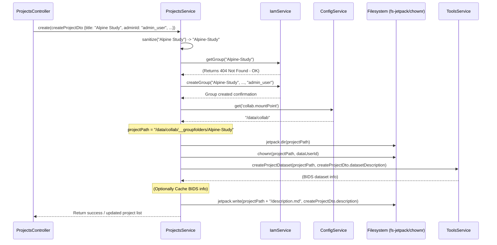

# Chapter 5: Project Management (ProjectsService)

Welcome back! In [Chapter 4: Nextcloud Integration (NextcloudService)](04_nextcloud_integration__nextcloudservice__.md), we saw how the Gateway communicates with Nextcloud to get information about files, users, and shared folders. Now, let's focus on how the Gateway manages the lifecycle of the collaborative *projects* themselves.

Imagine you want to start a new research project within the HIP platform. You need a dedicated space for your data, a way to manage who can access it, and some initial structure, maybe following the BIDS standard. How does the Gateway coordinate all these steps?

**The Problem:** How do we manage the creation, setup, membership, and eventual deletion of collaborative projects, ensuring that permissions are correctly assigned (via IAM), file structures are created on the shared storage, and necessary metadata files (like for BIDS) are initialized?

**The Solution:** We use a dedicated service called the **`ProjectsService`** (`src/projects/projects.service.ts`). Think of this service as the **Project Manager's Office** for the entire Gateway application. It doesn't do *all* the work itself, but it orchestrates the process, calling upon specialized services when needed.

## Key Concepts & Responsibilities

The `ProjectsService` is a central coordinator with several key responsibilities:

1.  **Orchestration:** It manages the overall workflow for project actions like creation, deletion, or adding users. It calls other services to perform specific tasks.
2.  **IAM Interaction:** It works closely with the [Identity & Access Management (IAM) Service](03_identity___access_management__iam__service_.md) to:
    *   Create corresponding IAM groups for new projects.
    *   Manage project membership (adding/removing users) by updating these IAM groups.
    *   Check if a user has permission to perform actions (e.g., is the user an admin of this project?).
3.  **Filesystem Interaction:** It interacts directly with the collaborative filesystem (the storage space mounted based on settings in [Configuration Management](02_configuration_management_.md)). It uses a library called `fs-jetpack` to:
    *   Create the main directory for a new project.
    *   Set the correct file/directory ownership and permissions (crucial for Nextcloud to see and manage the files).
    *   Write project-specific files like a description (`description.md`).
4.  **BIDS Initialization:** When a project is created, it often needs a standard structure for brain imaging data (BIDS). The `ProjectsService` calls the [BIDS Data Tools (ToolsService)](08_bids_data_tools__toolsservice_.md) to initialize the basic BIDS metadata file (`dataset_description.json`).
5.  **Data Import:** It provides methods to handle importing data (like subject scans or documents) into the correct location within a project's directory structure, often coordinating with the `ToolsService`.
6.  **Lifecycle Management:** It oversees the entire process from initiating project creation (`create`) to removing a project (`remove`).

## How to Use: Creating a New Project

Let's walk through the main use case: creating a new project called "AlpineStudy".

**Step 1: The Request**

A user (let's say, an administrator named "admin_user") uses the frontend interface to request the creation of a new project. This sends an HTTP POST request to the Gateway's backend API endpoint, `/projects`. The request body contains details about the project:

```json
// Example data sent in the POST /projects request
{
  "title": "Alpine Study",
  "shortDescription": "Neuroimaging study in alpine regions.",
  "description": "A detailed study focusing on cognitive functions...",
  "adminId": "admin_user", // ID of the user creating the project
  "datasetDescription": { // Initial BIDS metadata
    "Name": "AlpineStudy",
    "BIDSVersion": "1.8.0",
    "Authors": ["Admin User"],
    "DatasetType": "raw"
  }
}
```

**Step 2: The Controller (`ProjectsController`)**

The `ProjectsController` (`src/projects/projects.controller.ts`) receives this request. It first needs to verify that the user making the request (`admin_user`) actually has permission to create projects. Then, it calls the `create` method on the `ProjectsService`.

```typescript
// src/projects/projects.controller.ts (Simplified POST handler)
import { Controller, Post, Body, Request as Req, Logger, HttpException, HttpStatus } from '@nestjs/common';
import { Request } from 'express';
import { ProjectsService } from './projects.service';
import { CreateProjectDto } from './dto/create-project.dto';
import { NextcloudService } from 'src/nextcloud/nextcloud.service'; // To get current user

@Controller('projects')
export class ProjectsController {
  private readonly logger = new Logger('ProjectsController');

  constructor(
    private readonly projectsService: ProjectsService,
    private readonly nextcloudService: NextcloudService // Inject NextcloudService
  ) {}

  @Post() // Handles POST requests to /projects
  async create(@Req() req: Request, @Body() createProjectDto: CreateProjectDto) {
    this.logger.debug(`create(${JSON.stringify(createProjectDto.title)})`);

    // 1. Identify the user making the request
    const userId = await this.nextcloudService.authUserIdFromRequest(req);

    // 2. Check if this user is allowed to create projects
    const isAdmin = await this.projectsService.isProjectsAdmin(userId);
    if (!isAdmin) {
      throw new HttpException('Forbidden: User cannot create projects.', HttpStatus.FORBIDDEN);
    }

    // 3. If allowed, ask ProjectsService to create the project
    // Make sure the adminId in the DTO matches the requesting user for security
    if (userId !== createProjectDto.adminId) {
         throw new HttpException('Forbidden: Mismatched adminId.', HttpStatus.FORBIDDEN);
    }
    return this.projectsService.create(createProjectDto);
  }
  // ... other route handlers (@Get, @Delete, etc.) ...
}
```

*   **Explanation:** The controller receives the request (`req`) and the project data (`createProjectDto`). It uses `NextcloudService` to find out who the logged-in user is. It then asks `ProjectsService` (`isProjectsAdmin`) if that user is allowed to create projects. If yes, it calls `projectsService.create()` with the project details.

**Step 3: The Service (`ProjectsService.create`)**

This is where the orchestration happens. The `create` method in `ProjectsService` performs the sequence of actions needed. We'll look under the hood in the next section, but the outcome is:

*   An IAM group for the project is created (e.g., `dev-projects-Alpine-Study`).
*   `admin_user` is added as an administrator to this IAM group.
*   A directory `/mnt/collab/__groupfolders/Alpine-Study` (or similar, depending on configuration) is created on the shared filesystem.
*   The file `/mnt/collab/__groupfolders/Alpine-Study/dataset_description.json` is created with the initial BIDS metadata.
*   The file `/mnt/collab/__groupfolders/Alpine-Study/description.md` is created.
*   The controller receives a confirmation (perhaps the updated list of projects for the user) and sends it back to the frontend.

**Output:** The user sees that the "Alpine Study" project has been successfully created and is now available.

## Under the Hood: How `ProjectsService.create()` Works

Let's trace the steps inside the `ProjectsService` when the `create` method is called.

**Non-Code Walkthrough:**

1.  **Receive Data:** The `create` method gets the `CreateProjectDto` containing the title, description, admin ID, etc.
2.  **Sanitize Name:** It cleans up the project title ("Alpine Study") to create a filesystem- and group-friendly name, maybe "Alpine-Study" (`sanitize` helper function).
3.  **Check Existence (Safety First):** It might first ask the [Identity & Access Management (IAM) Service](03_identity___access_management__iam__service_.md) if a group named "Alpine-Study" already exists within the main projects container group. If it does, it stops and reports an error to prevent duplicates.
4.  **Create IAM Group:** It calls `IamService.createGroup()`, passing the sanitized name ("Alpine-Study"), description, and the initial administrator's ID ("admin_user"). The `IamService` handles the communication with the external IAM system.
5.  **Get Filesystem Path:** It asks the [Configuration Management](02_configuration_management_.md) (`ConfigService`) for the base path where group folders are stored (e.g., `configService.get('collab.mountPoint')` might return `/data/collab`).
6.  **Create Project Directory:** It constructs the full path (e.g., `/data/collab/__groupfolders/Alpine-Study`). Using `fs-jetpack` (`jetpack.dir(projectPath)`), it creates this directory on the shared filesystem.
7.  **Set Ownership (Crucial!):** It uses a helper function (`chownr`) to change the ownership of the newly created directory (and potentially its parent `__groupfolders`) to a specific system user (e.g., `www-data` or a dedicated `dataUser` defined in config). This is vital so that Nextcloud and the web server have the correct permissions to read and write files inside the project folder later.
8.  **Initialize BIDS:** It calls `ToolsService.createProjectDataset()`, passing the project path (`/data/collab/__groupfolders/Alpine-Study`) and the BIDS details from the `CreateProjectDto`. The [BIDS Data Tools (ToolsService)](08_bids_data_tools__toolsservice_.md) creates the `dataset_description.json` file inside the project directory.
9.  **(Optional) Cache BIDS Info:** It might store the returned BIDS dataset information in a cache using the [Caching (CacheService)](09_caching__cacheservice_.md) for faster retrieval later.
10. **Create Description File:** It uses `fs-jetpack` (`jetpack.write()`) to create a `description.md` file inside the project directory, containing the longer description provided in the `CreateProjectDto`.
11. **Return Success:** It indicates success, possibly by fetching and returning the user's updated list of projects.

**Sequence Diagram:**



**Code Snippets (Simplified):**

First, the `ProjectsService` needs access to other services, injected in its constructor:

```typescript
// src/projects/projects.service.ts (Constructor Example)
import { Injectable, Logger } from '@nestjs/common';
import { ConfigService } from '@nestjs/config';
import { IamService } from 'src/iam/iam.service';
import { CacheService } from 'src/cache/cache.service';
import { ToolsService } from 'src/tools/tools.service';
import * as jetpack from 'fs-jetpack'; // Filesystem library
const chownr = require('chownr');      // Ownership library
const userIdLib = require('userid');   // To get user ID number from name

@Injectable()
export class ProjectsService {
  private readonly logger = new Logger(ProjectsService.name);
  private dataUserId: number; // Numeric ID for file ownership
  private PROJECTS_GROUP: string; // Base group for all projects

  constructor(
    private readonly iamService: IamService,         // For IAM operations
    private readonly cacheService: CacheService,     // For caching (optional)
    private readonly configService: ConfigService,   // For config values
    private readonly toolsService: ToolsService      // For BIDS/Tool operations
  ) {
    // Get the username configured for data ownership (e.g., 'www-data')
    const uid = this.configService.get<string>('instance.dataUser');
    // Convert username to numeric ID
    this.dataUserId = parseInt(userIdLib.uid(uid), 10);

    // Construct the name for the main IAM group holding all projects
    const suffix = this.configService.get<string>('collab.suffix');
    this.PROJECTS_GROUP = `${suffix}-projects`; // e.g., "dev-projects"
  }
  // ... other methods ...
}
```

*   **Explanation:** The constructor uses `ConfigService` to get settings like the `dataUser` and the `suffix` for group names. It stores these and the injected services (`IamService`, `ToolsService`, etc.) for later use.

Here's a simplified `create` method showing the orchestration:

```typescript
// src/projects/projects.service.ts (Simplified create method)

  // Helper to clean up names
  private sanitize = (title: string) => `${title.replace(/[^a-zA-Z0-9]+/g, '-')}`;

  // Helper to change ownership recursively
	private async chown(path: string) {
		this.logger.debug(`${path} ownership changed to ${this.dataUserId}`);
		await chownr(path, this.dataUserId, this.dataUserId); // Use stored numeric ID
	}

  async create(createProjectDto: CreateProjectDto) {
    const { title, shortDescription, description, adminId, datasetDescription } = createProjectDto;
    const name = this.sanitize(title); // e.g., "Alpine-Study"
    this.logger.debug(`Attempting to create project: ${name}`);

    try {
      // 1. Check if project already exists (simplified check via IAM)
      try {
        await this.iamService.getGroup(this.PROJECTS_GROUP, name);
        // If getGroup succeeds, it exists - throw error
        throw new HttpException(`Project ${name} already exists.`, HttpStatus.CONFLICT);
      } catch (error) {
         // If getGroup throws 404, it doesn't exist - good, continue
        if (!/404/.test(error.message)) throw error; // Rethrow other errors
        this.logger.debug(`Project ${name} does not exist yet. Proceeding.`);
      }

      // 2. Create IAM Group
      await this.iamService.createGroup(this.PROJECTS_GROUP, name, shortDescription, adminId);

      // 3. Get filesystem paths
      const mountPoint = this.configService.get<string>('collab.mountPoint');
      const groupFolderPath = `${mountPoint}/__groupfolders`;
      const projectPath = `${groupFolderPath}/${name}`;

      // 4. Create Project Directory
      jetpack.dir(projectPath);

      // 5. Set Ownership (ensure parent __groupfolders also has correct owner)
      await this.chown(groupFolderPath); // Important for Nextcloud permissions!
      // await this.chown(projectPath); // chown on parent is often sufficient

      // 6. Initialize BIDS Dataset
      const dataset = await this.toolsService.createProjectDataset(projectPath, createProjectDto);
      // Optional: Cache the result
      // this.cacheService.set(`${CACHE_KEY_PROJECTS}:${name}:dataset`, dataset);

      // 7. Create Description File
      jetpack.write(`${projectPath}/description.md`, description);

      this.logger.log(`Project ${name} created successfully.`);
      // Return success, maybe the new project details or updated list
      return this.findOne(name); // Example: return details of the created project

    } catch (error) {
      this.logger.error(`Failed to create project ${name}: ${error.message}`);
      // TODO: Add cleanup logic here if creation fails mid-way (e.g., delete IAM group if folder creation fails)
      throw error; // Rethrow the error to be handled by the controller
    }
  }

  // ... findOne, remove, addUserToProject, importBIDSSubject etc. methods ...
```

*   **Explanation:** This simplified `create` method follows the steps outlined previously. It calls `iamService.createGroup`, gets paths from `configService`, uses `jetpack.dir` and the `chown` helper for filesystem operations, and calls `toolsService.createProjectDataset`. Error handling is simplified, but crucial cleanup logic would be needed in a real implementation if steps fail midway.

## Other Responsibilities

Besides creating projects, `ProjectsService` handles other related tasks by orchestrating different services:

*   **`remove(projectName, userId)`:** Checks permissions, then calls `IamService.deleteGroup()`. *Carefully* considers whether to also delete the project directory on the filesystem (this can be dangerous!).
*   **`addUserToProject(userId, projectName)` / `removeUserFromProject(userId, projectName)`:** Checks permissions, then calls `IamService.addUserToGroup()` or `IamService.removeUserFromGroup()`. It might also ensure a user's personal folder exists (`createUserFolder`).
*   **`importBIDSSubject(userId, dto, projectName)` / `importDocument(userId, dto, projectName)`:** Determines the correct target path within the project directory (using `ConfigService`) and then calls methods on the `ToolsService` or uses `fs-jetpack` to copy/link the data into the project's workspace, ensuring correct ownership.
*   **`metadataTree(userId, projectName, path)`:** Uses `fs-jetpack.inspectTree()` to list files and folders within a specific path inside the project directory.
*   **`createProjectsGroup()` / `createProjectsAdminsGroup()`:** These are special methods, often called once when the application starts (via `WarmupService`), to ensure the main container groups (`dev-projects`, `dev-projects-administrators`) exist in the IAM system.

## Conclusion

The `ProjectsService` acts as the central **Project Manager's Office** within the Gateway. It orchestrates the entire lifecycle of a collaborative project by:

*   Communicating with the [Identity & Access Management (IAM) Service](03_identity___access_management__iam__service_.md) for permissions and group management.
*   Interacting directly with the configured shared filesystem using `fs-jetpack` to create directories and set permissions.
*   Leveraging the [BIDS Data Tools (ToolsService)](08_bids_data_tools__toolsservice_.md) to initialize BIDS structures and handle data imports.
*   Reading necessary paths and settings from [Configuration Management](02_configuration_management_.md).

By coordinating these different components, it provides a clean interface (`create`, `remove`, `addUser`, etc.) for managing projects within the HIP platform.

In the next chapter, we'll explore how the Gateway manages interactions with remote applications that users might launch within their project workspaces, looking at the [Remote Application Management (RemoteAppService & State Machine)](06_remote_application_management__remoteappservice___state_machine_.md).

---

Generated by [AI Codebase Knowledge Builder](https://github.com/The-Pocket/Tutorial-Codebase-Knowledge)