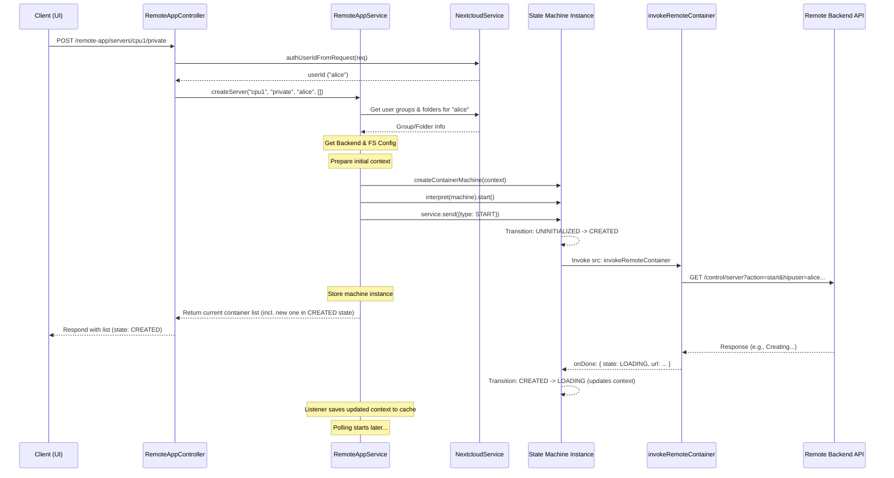

# Chapter 6: Remote Application Management (RemoteAppService & State Machine)

Welcome back! In [Chapter 5: Project Management (ProjectsService)](05_project_management__projectsservice_.md), we learned how the Gateway orchestrates the creation and management of collaborative projects, coordinating with IAM and the filesystem.

Now, imagine you have your project set up. You want to actually *do* something with the data – maybe run a Jupyter Notebook for analysis or launch a specialized visualization tool. These tools don't run *inside* the Gateway itself; they run as separate, containerized applications on powerful remote computers (backends). How does the Gateway start, stop, and keep track of these applications for you, ensuring they connect to your project data correctly?

**The Problem:** How do we manage the lifecycle (starting, stopping, pausing, checking status) of these containerized applications running on remote compute resources? We need a reliable way to control them and know their current status, connecting them securely to the user's workspace (private or collaborative project).

**The Solution:** We use a combination of the **`RemoteAppService`** and a **State Machine**.

*   Think of the **`RemoteAppService`** (`src/remote-app/remote-app.service.ts`) as the **Air Traffic Controller** for your software containers. It knows how to communicate with the remote "airport" (the compute backend API) to request takeoffs (start), landings (stop), and status updates.
*   Think of the **State Machine** (`src/remote-app/remote-app.container-machine.ts`), built using a library called XState, as the **Flight Status Board** for each individual container. It formally tracks whether a container is `LOADING`, `RUNNING`, `STOPPING`, `PAUSED`, `EXITED`, etc., based on commands given and feedback received from the backend.

Together, they provide a robust system for managing remote applications.

## Key Concepts

### 1. Remote Compute Backend

This is the actual system (like a server running Docker, or a Kubernetes cluster) where the software containers run. The Gateway doesn't run the containers itself; it just tells the backend what to do via an API.

*   **Configuration:** The address and authentication details for this backend API are configured using environment variables, which are loaded by the [Chapter 2: Configuration Management](02_configuration_management_.md). Different backends might be available (e.g., `cpu1`, `collab-backend`).

### 2. `RemoteAppService` (`src/remote-app/remote-app.service.ts`)

This NestJS service is the central hub for managing remote containers within the Gateway.

*   **Responsibilities:**
    *   Receives requests (e.g., "start a Jupyter Notebook for user X").
    *   Manages a collection of state machine instances, one for each running or starting container/session.
    *   Calls the backend API (using helper functions like `invokeRemoteContainer` and NestJS's `HttpService`) to perform actions (start, stop, pause, status).
    *   Periodically polls the backend API to get the latest status of containers and updates the corresponding state machines.
    *   Restores container states from a cache ([Chapter 9: Caching (CacheService)](09_caching__cacheservice_.md)) when the Gateway restarts.

### 3. Container Lifecycle & States

A container goes through different phases:

*   `UNINITIALIZED`: It doesn't exist yet.
*   `CREATED`: The request to create it has been sent.
*   `LOADING`: The backend is actively starting it up.
*   `RUNNING`: The container is up and healthy, ready for use.
*   `PAUSING`: A request to pause has been sent.
*   `PAUSED`: The container is paused.
*   `RESUMING`: A request to resume has been sent.
*   `STOPPING`: A request to stop has been sent.
*   `EXITED`: The container has stopped (either normally or due to an error).
*   `DESTROYED`: The container resources have been fully cleaned up on the backend.

These states are formally defined in `src/remote-app/remote-app.types.ts` (`ContainerState`).

### 4. State Machine (`src/remote-app/remote-app.container-machine.ts`)

We use the XState library to create a formal state machine definition. This precisely defines:

*   All possible states a container can be in (`ContainerState`).
*   All possible actions/events that can happen (`ContainerAction`, e.g., `START`, `STOP`, `REMOTE_STARTED`, `REMOTE_STOPPED`).
*   How the machine transitions from one state to another based on actions.
*   Which actions (like calling the backend API via `invokeRemoteContainer`) should be performed when entering certain states.

Each running container/session gets its *own instance* of this state machine, managed by `RemoteAppService`. This ensures each container's state is tracked independently and reliably.

### 5. Server Session vs. App Container

There's often a two-level structure:

*   **Server Session (`ContainerType.SERVER`):** A base container environment launched for a user or project. It sets up the initial connection to the user's data (using information from [Nextcloud Integration (NextcloudService)](04_nextcloud_integration__nextcloudservice_.md)). Think of it as the user's remote workspace session.
*   **App Container (`ContainerType.APP`):** A specific application (like Jupyter, VS Code, etc.) launched *within* an existing Server Session. It inherits the environment and data connections from its parent Server Session.

This allows multiple apps to run efficiently within the same shared session environment.

## How to Use: Starting a Server Session

Let's say a user wants to start their first remote application in their private workspace. This usually involves starting a "Server Session" first.

**Step 1: The Request**

The user clicks a button like "Start Remote Session" in the UI. This sends an HTTP POST request to the Gateway backend, maybe to `/remote-app/servers`. The request might implicitly contain the user's identity (via session cookie) and specify the desired workspace (`private`) and backend (`cpu1`).

**Step 2: The Controller (`RemoteAppController`)**

The `RemoteAppController` (`src/remote-app/remote-app.controller.ts`) handles this request. It extracts the necessary information (user ID, workspace, backend) and calls the appropriate method on `RemoteAppService`.

```typescript
// src/remote-app/remote-app.controller.ts (Simplified Snippet)
import { Controller, Post, Param, Req, Logger } from '@nestjs/common';
import { Request } from 'express';
import { RemoteAppService } from './remote-app.service';
import { NextcloudService } from 'src/nextcloud/nextcloud.service';
import { BackendId, WorkspaceType } from './remote-app.controller'; // Types defined here

@Controller('remote-app')
export class RemoteAppController {
  private readonly logger = new Logger(RemoteAppController.name);

  constructor(
    private readonly remoteAppService: RemoteAppService,
    private readonly nextcloudService: NextcloudService // Needed to identify user
  ) {}

  @Post('servers/:backendId/:workspace') // e.g., POST /remote-app/servers/cpu1/private
  async createServer(
    @Req() req: Request,
    @Param('backendId') backendId: BackendId,
    @Param('workspace') workspace: WorkspaceType,
  ) {
    this.logger.debug(`createServer request for ${backendId}/${workspace}`);

    // 1. Find out who the user is (e.g., from session)
    const userId = await this.nextcloudService.authUserIdFromRequest(req);
    // Note: In a real app, group IDs might also be needed for 'collab' workspace

    this.logger.log(`User ${userId} requests server on ${backendId}/${workspace}`);

    // 2. Ask RemoteAppService to start the server session
    const result = await this.remoteAppService.createServer(
      backendId,
      workspace,
      userId,
      [] // Placeholder for group IDs if needed
    );

    // 3. Return the current list of containers for the user
    return result;
  }

  // ... other routes for starting apps, stopping, getting status ...
}
```

*   **Explanation:** The controller gets the user ID (using `NextcloudService`), backend ID, and workspace type from the request. It then calls `remoteAppService.createServer`, passing this information.

**Step 3: The Service (`RemoteAppService.createServer`)**

The `createServer` method in `RemoteAppService` orchestrates the creation of the state machine and sends the initial `START` event. (We'll look under the hood next).

**Output:** The `createServer` method (and thus the controller) returns an array representing the current state of all containers relevant to the user. This might include the newly requested server session, initially in a state like `CREATED` or `LOADING`.

```json
// Example Output (Simplified JSON)
[
  {
    "id": "unique-server-id-123",
    "name": "1", // A simple name/number for the session
    "userId": "alice",
    "groupIds": ["users", "alice-private-group"],
    "url": null, // URL not available yet
    "error": null,
    "type": "SERVER",
    "parentId": null,
    "state": "CREATED", // <-- The initial state after the request
    "workspace": "private"
  }
  // ... other containers user might have ...
]
```

The frontend UI can use this response to show the user that their session is "Starting...". Subsequent polling requests from the frontend to a status endpoint (e.g., `GET /remote-app/containers/private/alice`) will get updated states (`LOADING`, `RUNNING` with a URL) as the state machine progresses.

## Under the Hood

### How `RemoteAppService.createServer()` Works (Non-Code Walkthrough)

1.  **Receive Request:** Gets `backendId`, `workspace`, `userId`, `groupIds`.
2.  **Generate ID:** Creates a unique `serverId` (e.g., using `uniq()`).
3.  **Gather Data:**
    *   Gets the user's detailed group memberships and accessible Nextcloud group folders using [Nextcloud Integration (NextcloudService)](04_nextcloud_integration__nextcloudservice_.md).
    *   Gets the Nextcloud filesystem URL and authentication backend URL using `fsConfig` (which reads from [Chapter 2: Configuration Management](02_configuration_management_.md)).
    *   Gets the compute backend API details (URL, auth) using `backendConfig` (also reading from config).
4.  **Prepare Context:** Creates the initial `context` object for the state machine. This includes the `serverId`, `userId`, `groupIds`, initial `state: ContainerState.UNINITIALIZED`, `type: ContainerType.SERVER`, `workspace`, the gathered `dataSource` (Nextcloud info), and `computeSource` (backend info).
5.  **Create Machine Instance:** Calls `createContainerMachine(context)` to get a new state machine definition configured with this specific context.
6.  **Start Interpreter:** Uses `interpret(machine).start()` to create a running instance (a "service") of the state machine.
7.  **Register Listener:** Attaches a listener (`handleTransitionFor(service)`) to this instance. This listener will react to state changes, for example, saving the updated context to the cache or removing the service if it reaches the `DESTROYED` state.
8.  **Store Service:** Adds the new state machine service instance to the `this.containerServices` array within `RemoteAppService`.
9.  **Send START Event:** Calls `service.send({ type: ContainerAction.START })`.
10. **State Transition:** The state machine receives the `START` event. Based on its definition (`src/remote-app/remote-app.container-machine.ts`), it transitions from `UNINITIALIZED` to the `CREATED` state.
11. **Invoke Backend Call:** The `CREATED` state has an `invoke` action configured. This action calls the `invokeRemoteContainer` function.
12. **`invokeRemoteContainer`:** This function constructs the specific API request URL and parameters needed to tell the remote compute backend to *actually start* creating the container (passing user ID, group IDs, Nextcloud details, etc.). It uses `httpService.get()` to send the request to the backend API.
13. **Return Status:** `createServer` immediately returns the current list of container states (including the new one in `CREATED`) back to the controller. The actual container startup happens asynchronously in the background, driven by the state machine and polling.

### Sequence Diagram



### Code Dive

**`RemoteAppService.createServer` (Simplified):**

```typescript
// src/remote-app/remote-app.service.ts (Simplified createServer)
import { Injectable, Logger } from '@nestjs/common';
import { interpret } from 'xstate';
import { uniq } from 'src/common/utils/shared.utils';
import { NextcloudService } from 'src/nextcloud/nextcloud.service';
import { createContainerMachine } from './remote-app.container-machine';
import { ContainerAction, ContainerContext, ContainerState, ContainerType } from './remote-app.types';
import { BackendId, WorkspaceType } from './remote-app.controller';
import { backendConfig, fsConfig } from './remote-app.service'; // Helpers to read config

@Injectable()
export class RemoteAppService {
  private readonly logger = new Logger('RemoteAppService');
  private containerServices: any[] = []; // Holds running state machine instances

  constructor(
    // Inject CacheService, NextcloudService, ConfigService...
    private readonly nextcloudService: NextcloudService,
  ) {
    // ... restore from cache on startup ...
  }

  // Listener attached to each machine instance
  private handleTransitionFor = (service: any) => { /* ... saves to cache, handles DESTROYED ... */ };

  async createServer(
    backendId: BackendId,
    workspace: WorkspaceType,
    userId: string,
    groupIds: string[] // May be empty for private
  ): Promise<any[]> { // Returns list of ResponseContext
    const serverId = uniq(); // Generate unique ID

    // 1. Get data needed for context (Simplified)
    const oidcGroupIds = await this.nextcloudService.oidcGroupsForUser(userId);
    const groupFolders = await this.nextcloudService.groupFoldersForUserId(userId);
    const fsConf = fsConfig(workspace);
    const computeConf = backendConfig(backendId);

    // 2. Prepare initial context
    const context: ContainerContext = {
      id: serverId,
      name: 'SessionNamePlaceholder', // Real logic generates a name
      userId,
      groupIds: oidcGroupIds,
      url: null,
      state: ContainerState.UNINITIALIZED, // Start state
      error: null,
      type: ContainerType.SERVER,
      workspace,
      dataSource: { fsUrl: fsConf.url, authUrl: fsConf.authurl, groupFolders },
      computeSource: { backendId },
      parentId: null
    };

    // 3. Create and start the state machine instance
    const serverMachine = createContainerMachine(context);
    const service = interpret(serverMachine).start();

    // 4. Register listener and store the service
    this.handleTransitionFor(service);
    this.containerServices.push(service); // Add to managed services

    // 5. Send the initial START event
    service.send({ type: ContainerAction.START });

    // 6. Return current state of all user's containers
    return this.getContainers(workspace, userId, groupIds);
  }

  // ... getContainers, createApp, stopAppInServer, removeAppsAndServer, pollRemoteState ...
}
```

*   **Explanation:** This method gathers all necessary information, creates the initial `context`, uses `createContainerMachine` and `interpret` from XState to start a new state machine instance, stores it, and sends the `START` event to kick things off.

**`createContainerMachine` (Simplified State Definition):**

```typescript
// src/remote-app/remote-app.container-machine.ts (Simplified Machine Definition)
import { createMachine, assign } from 'xstate';
import { invokeRemoteContainer } from './remote-app.service'; // Function to call backend
import { ContainerAction, ContainerContext, ContainerState } from './remote-app.types';

export const createContainerMachine = (context: ContainerContext) => {
  return createMachine({
    id: context.id,
    initial: context.state, // e.g., UNINITIALIZED
    context, // The specific data for this container instance

    states: {
      [ContainerState.UNINITIALIZED]: {
        on: {
          // When START action received -> transition to CREATED state
          [ContainerAction.START]: ContainerState.CREATED,
          // ... other potential transitions ...
        }
      },
      [ContainerState.CREATED]: {
        // When entering CREATED state -> invoke the backend call
        invoke: {
          id: 'startRemoteServer',
          src: invokeRemoteContainer, // The function that calls the backend API
          onDone: { // If invokeRemoteContainer succeeds...
            target: ContainerState.LOADING, // ...go to LOADING state
            actions: ['updateContext'] // ...and update context with response data (URL, etc.)
          },
          onError: { // If invokeRemoteContainer fails...
            target: ContainerState.EXITED, // ...go to EXITED state
            actions: ['updateContext'] // ...and update context with error info
          }
        }
      },
      [ContainerState.LOADING]: {
        on: {
           // Event sent by polling if backend reports container is running
          [ContainerAction.REMOTE_STARTED]: {
            target: ContainerState.RUNNING,
            actions: 'updateContext'
          },
          // Event sent by polling if backend reports container stopped/failed
          [ContainerAction.REMOTE_STOPPED]: {
            target: ContainerState.EXITED,
            actions: 'updateContext'
          }
        }
      },
      [ContainerState.RUNNING]: {
        on: {
           // If user requests STOP -> go to STOPPING state
          [ContainerAction.STOP]: { target: ContainerState.STOPPING },
          // ... transitions for PAUSE, REMOTE_STOPPED etc. ...
        }
      },
      // ... definitions for PAUSING, PAUSED, RESUMING, STOPPING, EXITED, DESTROYED states ...
    }
  }, {
    actions: {
      // Action to merge results from invokeRemoteContainer into the machine's context
      updateContext: assign((context: ContainerContext, event: any) => {
        return { ...context, ...(event.data || event.nextContext) };
      })
    }
  });
};

```

*   **Explanation:** This uses XState's `createMachine` to define the states (`UNINITIALIZED`, `CREATED`, `LOADING`, `RUNNING`, etc.) and the transitions between them based on events (`START`, `REMOTE_STARTED`, `STOP`). Crucially, the `CREATED` state uses `invoke` to trigger the `invokeRemoteContainer` function, which performs the side effect of calling the backend API. `onDone` and `onError` handle the asynchronous result of that call.

**Polling for Status (`RemoteAppService.pollRemoteState`)**

```typescript
// src/remote-app/remote-app.service.ts (Simplified Polling Method)
import { Interval } from '@nestjs/schedule'; // For periodic execution
// ... other imports ...

export class RemoteAppService {
  // ... constructor, other methods ...
  private containerServices: any[] = [];

  @Interval(5000) // Run every 5000 ms (5 seconds)
  pollRemoteState() {
    this.containerServices?.forEach(async service => {
      const currentContext = service.state.context;
      // Skip polling if machine is in a final or intermediate state
      if ([ContainerState.EXITED, ContainerState.DESTROYED, ContainerState.UNINITIALIZED].includes(service.state.value)){
         return;
      }

      try {
        // Call backend API to get the *current* status
        const remoteContext = await invokeRemoteContainer(currentContext, {
          type: ContainerAction.STATUS // Special action for polling
        });

        // Send an event to the state machine based on the polled status
        switch (remoteContext.state) {
          case ContainerState.RUNNING:
            // If backend says running, tell the machine it's started
            service.send({ type: ContainerAction.REMOTE_STARTED, nextContext: remoteContext });
            break;
          case ContainerState.EXITED:
          case ContainerState.UNINITIALIZED: // Treat unknown as stopped
             // If backend says stopped, tell the machine it's stopped
            service.send({ type: ContainerAction.REMOTE_STOPPED, nextContext: remoteContext });
            break;
          // Add cases for CREATED, PAUSED etc. if needed
        }
      } catch (error) {
        // If polling fails, maybe mark as stopped/error
        service.send({ type: ContainerAction.REMOTE_STOPPED, nextContext: { /* error context */ } });
        this.logger.error(`Polling failed for ${currentContext.id}: ${error.message}`);
      }
    });
  }
}
```

*   **Explanation:** The `@Interval(5000)` decorator makes NestJS run this method every 5 seconds. It loops through all active state machine instances (`containerServices`). For each one, it calls `invokeRemoteContainer` with a `STATUS` action to ask the backend API for the container's current status. Based on the response (e.g., the backend says it's `RUNNING` or `EXITED`), it sends a corresponding event (`REMOTE_STARTED` or `REMOTE_STOPPED`) to that specific state machine instance. This keeps the state machine's view of the world synchronized with the actual state on the remote backend.

## Conclusion

We've seen how the Gateway manages remote applications using a powerful combination:

*   **`RemoteAppService`:** Acts as the central coordinator (the "Air Traffic Controller"), managing state machine instances and interacting with configuration and other services like Nextcloud.
*   **XState State Machine (`remote-app.container-machine.ts`):** Provides a robust and predictable way to track the lifecycle state (`RUNNING`, `STOPPED`, etc.) of each individual container/session (the "Flight Status Board").
*   **`invokeRemoteContainer`:** The function that actually communicates with the remote compute backend's API.
*   **Polling:** Regularly checks the backend API to keep the state machines updated with the ground truth.

This system allows users to reliably start, stop, and monitor applications connected to their workspace data, providing the interactive computing environment essential for platforms like HIP.

In the next chapter, we'll shift focus back to data handling within the Gateway itself, looking at the [Chapter 7: File Handling (FilesService)](07_file_handling__filesservice_.md).

---

Generated by [AI Codebase Knowledge Builder](https://github.com/The-Pocket/Tutorial-Codebase-Knowledge)