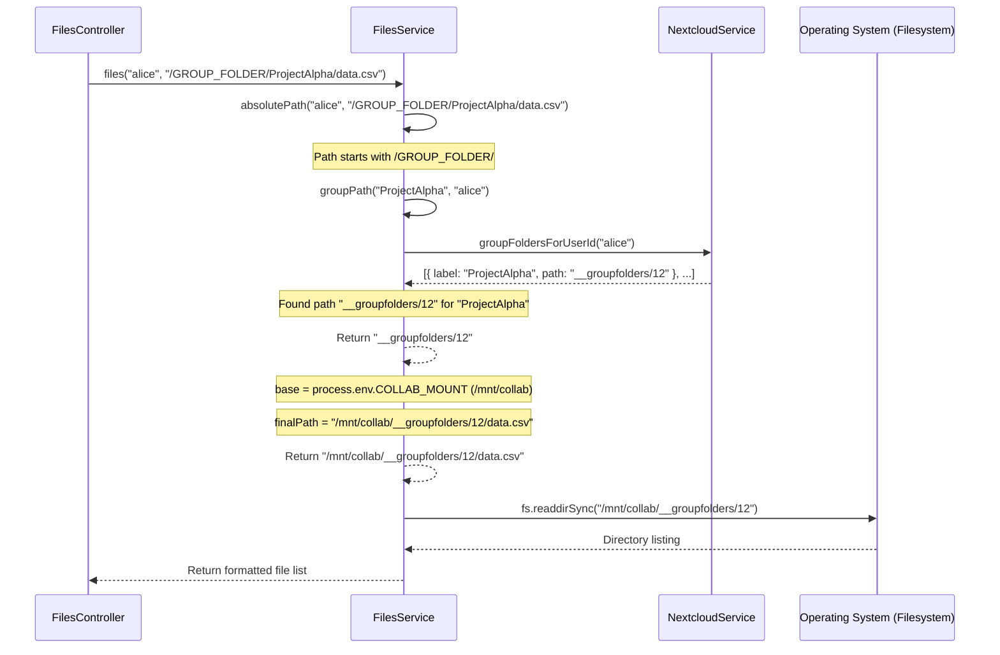

# Chapter 7: File Handling (FilesService)

Welcome back! In [Chapter 6: Remote Application Management (RemoteAppService & State Machine)](06_remote_application_management__remoteappservice___state_machine_.md), we explored how the Gateway starts and manages external applications like Jupyter notebooks running in containers. These applications often need to work with data. Now, let's dive into how the Gateway itself interacts directly with the files stored within the platform, whether they belong to a user's private space or a shared project.

Imagine you're building a simple file browser right into the Gateway's web interface. You want to be able to click on a folder (like your home directory or a project folder) and see the list of files inside. Or maybe click on a text file and see its contents displayed directly on the page. How does the Gateway backend fetch this file information?

**The Problem:** How can the Gateway securely access and provide information about files and folders stored within the Nextcloud file system? How does it know where to find a specific user's files or the files belonging to a shared group folder? How can it read file content or even search for files?

**The Solution:** We use a dedicated service called the **`FilesService`** (`src/files/files.service.ts`). Think of this service as the **Gateway's internal file explorer backend**. It knows how to navigate the file storage, list directories, read file contents, and even ask Nextcloud to perform searches, all based on the user making the request.

## Key Concepts

### 1. Logical Paths vs. Absolute Paths

When you use the file browser, you think in terms of simple paths:
*   `/`: Your home directory.
*   `/Documents/MyReport.txt`: A file inside your "Documents" folder.
*   `/MyProject/data/subject01.nii.gz`: A file within a shared project folder named "MyProject".

These are **logical paths** – user-friendly ways to refer to files. However, the actual files on the server's disk might be stored somewhere like `/mnt/data/user_files/alice/files/Documents/MyReport.txt` or `/mnt/collab/__groupfolders/123/data/subject01.nii.gz`. These are **absolute paths**.

### 2. Mount Points (Configuration)

How does the Gateway know where the base storage locations are? It uses configuration settings, often loaded from environment variables via the [Chapter 2: Configuration Management](02_configuration_management_.md). Key settings include:

*   `PRIVATE_FILESYSTEM`: The base directory on the server where individual users' private files are stored (e.g., `/mnt/data/user_files`).
*   `COLLAB_MOUNT`: The base directory where shared collaborative project folders (Nextcloud Group Folders) are stored (e.g., `/mnt/collab`).

These mount points are crucial for translating logical paths into absolute paths.

*   **Files Referenced:** `src/config/collab.config.ts`, `src/config/public.config.ts` (though `public.config.ts` might not be directly used by `FilesService`, `collab.config.ts` is relevant for group folders).

```typescript
// src/config/collab.config.ts (Simplified)
import { registerAs } from '@nestjs/config'

export default registerAs('collab', () => {
	return {
		// Tells where shared project folders are mounted
		mountPoint: process.env.COLLAB_MOUNT || '/mnt/collab',
		// ... other related settings ...
	}
})
```
*(Note: The `FilesService` code provided directly uses `process.env` for these paths. While functional, using the `ConfigService` as shown in Chapter 2 is generally preferred in NestJS for better structure and testability.)*

### 3. Path Translation: The Core Logic

The `FilesService`'s main job is to take a `userId` and a `logicalPath` and figure out the correct `absolutePath` on the server's filesystem.
*   If the path is simple like `/Documents`, it combines `PRIVATE_FILESYSTEM`, `userId`, and the path: `/mnt/data/user_files/alice/files/Documents`.
*   If the path involves a group folder (e.g., `/GROUP_FOLDER/ProjectAlpha/results.csv`), it's more complex. It needs to:
    1.  Ask the [Chapter 4: Nextcloud Integration (NextcloudService)](04_nextcloud_integration__nextcloudservice_.md) which group folders the `userId` can access.
    2.  Find the specific internal path for "ProjectAlpha" (e.g., `__groupfolders/12`).
    3.  Combine `COLLAB_MOUNT` and the internal path: `/mnt/collab/__groupfolders/12/results.csv`.

### 4. Filesystem Interaction (`fs`)

Once `FilesService` has the absolute path, it uses Node.js's built-in `fs` module (file system) to interact with the disk:
*   `fs.readdirSync`: To list the contents of a directory.
*   `fs.readFile`: To read the content of a file.

### 5. Nextcloud Search API

For searching, `FilesService` doesn't scan the disk itself (that would be slow and might miss files Nextcloud knows about but hasn't indexed locally). Instead, it acts as a client to Nextcloud's own search API. It forwards the user's search request (and their authentication tokens) directly to Nextcloud.

## How to Use

Let's see how the `FilesService` is used via its controller, `FilesController`.

### Use Case 1: Listing Directory Contents

Imagine the user clicks on their home directory (`/`) in the file browser UI.

**1. Request:** The frontend sends a `GET` request to `/api/v1/files?path=/`.

**2. Controller (`FilesController`):**
   The controller receives the request. It uses `NextcloudService` to identify the logged-in user and then calls `filesService.files`.

```typescript
// src/files/files.controller.ts (Simplified GET / handler)
import { Controller, Get, Query, Req, Logger } from '@nestjs/common';
import { Request } from 'express';
import { NextcloudService } from 'src/nextcloud/nextcloud.service';
import { FilesService } from './files.service';

@Controller('files')
export class FilesController {
	constructor(
		private fileService: FilesService,
		private nextcloudService: NextcloudService // To get user ID
	) {}

	private logger = new Logger('FilesController');

	@Get('/') // Handles GET /files?path=...
	async path(@Query('path') queryPath: string, @Req() req: Request) {
		this.logger.debug(`Request to list path: ${queryPath}`);
		// 1. Find out who the user is
		const userId = await this.nextcloudService.authUserIdFromRequest(req);
		this.logger.debug(`User identified as: ${userId}`);

		// 2. Ask FilesService to list files for this user and path
		return this.fileService.files(userId, queryPath);
	}
	// ... other methods ...
}
```
*   **Explanation:** The `@Get('/')` decorator handles the request. `@Query('path')` extracts the `path` parameter (`/` in this case). It calls `nextcloudService` to get the `userId` (e.g., "alice") and then `fileService.files("alice", "/")`.

**3. Service (`FilesService.files`):**
   The `files` method performs the path translation and uses `fs` to read the directory.

```typescript
// src/files/files.service.ts (Simplified files method signature)
	public async files(userId: string, path: string) {
		// 1. Calculate absolute path (e.g., /mnt/data/user_files/alice/files)
		const absolutePath = await this.absolutePath(userId, path);

		// 2. Read directory contents using Node.js 'fs' module
		const files = fs.readdirSync(absolutePath, { withFileTypes: true });

		// 3. Format the results
		return files.map(file => ({
			name: file.name,
			parentPath: path,
			path: `${path === '/' ? '' : path}/${file.name}`, // Construct logical path
			isDirectory: file.isDirectory()
		}));
		// ... includes error handling ...
	}
```
*   **Input:** `userId` ("alice"), `path` ("/")
*   **Output (Example):** An array of objects describing the files and folders in Alice's home directory.
    ```json
    [
      { "name": "Documents", "parentPath": "/", "path": "/Documents", "isDirectory": true },
      { "name": "Photos", "parentPath": "/", "path": "/Photos", "isDirectory": true },
      { "name": "notes.txt", "parentPath": "/", "path": "/notes.txt", "isDirectory": false }
    ]
    ```

### Use Case 2: Reading File Content

Now, the user clicks on `notes.txt`.

**1. Request:** The frontend sends a `GET` request to `/api/v1/files/content?path=/notes.txt`.

**2. Controller (`FilesController`):** Similar to listing, it gets the `userId` and calls `filesService.content`.

```typescript
// src/files/files.controller.ts (Simplified GET /content handler)
	// ... constructor, logger ...

	@Get('/content') // Handles GET /files/content?path=...
	async content(@Query('path') queryPath: string, @Req() req: Request) {
		this.logger.debug(`Request for content of path: ${queryPath}`);
		// 1. Find out who the user is
		const userId = await this.nextcloudService.authUserIdFromRequest(req);
		this.logger.debug(`User identified as: ${userId}`);

		// 2. Ask FilesService for the content
		return this.fileService.content(userId, queryPath);
	}
	// ... other methods ...
```

**3. Service (`FilesService.content`):** Performs path translation and uses `fs.readFile`.

```typescript
// src/files/files.service.ts (Simplified content method signature)
	public async content(userId: string, path: string): Promise<string> {
		// 1. Calculate absolute path (e.g., /mnt/data/user_files/alice/files/notes.txt)
		const absolutePath = await this.absolutePath(userId, path);

		// 2. Read file content using Node.js 'fs' module
		return new Promise((resolve, reject) => {
			fs.readFile(absolutePath, 'utf8', (err, data) => {
				if (err) {
					reject(err); // Handle read errors
				}
				resolve(data); // Return file content as string
			});
		});
		// ... includes error handling ...
	}
```
*   **Input:** `userId` ("alice"), `path` ("/notes.txt")
*   **Output (Example):** A string containing the text inside `notes.txt`.
    ```
    "This is the content of my note file."
    ```

### Use Case 3: Searching Files

The user types "report" into a search box.

**1. Request:** The frontend sends a `GET` request to `/api/v1/files/search/report`.

**2. Controller (`FilesController`):** Extracts the search term and the user's authentication tokens (needed for the Nextcloud API) and calls `filesService.search`.

```typescript
// src/files/files.controller.ts (Simplified GET /search/:term handler)
import { /*...,*/ Param, Response as Res } from '@nestjs/common';
import { Response } from 'express';
// ...

	@Get('/search/:term') // Handles GET /files/search/some_term
	async search(
		@Param('term') term: string, // Get search term from URL path
		@Req() req: Request,         // Get the original request
		@Res() res: Response         // Get response object to send result
	) {
		this.logger.debug(`Request to search for term: ${term}`);
		// 1. Get user's auth tokens from request headers
		const { cookie, requesttoken } = req.headers;

		// 2. Ask FilesService to perform the search via Nextcloud API
		const result = await this.fileService.search({ cookie, requesttoken }, term);

		// 3. Send the results back
		return res.status(HttpStatus.OK).json(result);
	}
```
*   **Explanation:** `@Param('term')` gets the search term. It extracts `cookie` and `requesttoken` from the incoming request headers (`req.headers`). These are needed to authenticate the subsequent call to the Nextcloud API. It calls `fileService.search` and sends the result back.

**3. Service (`FilesService.search`):** Uses `HttpService` to call the Nextcloud search API.

```typescript
// src/files/files.service.ts (Simplified search method signature)
import { HttpService } from '@nestjs/axios'; // For making HTTP requests
import { firstValueFrom } from 'rxjs';
// ... other imports ...

	public async search(
		tokens: { cookie: string; requesttoken: any }, // User's auth tokens
		term: string // Search term
	): Promise<any> { // Returns the structure defined by Nextcloud API
		const headers = { // Prepare headers for Nextcloud API
			...tokens,
			accept: 'application/json, text/plain, */*'
		};

		// Construct the Nextcloud search API URL
		const apiUrl = `${process.env.HOSTNAME_SCHEME}://${process.env.HOSTNAME}/ocs/v2.php/search/providers/files/search?term=${term}&cursor=0&limit=100`;

		this.logger.debug(`Calling Nextcloud search API: ${apiUrl}`);
		// Use HttpService to make the GET request
		const response = this.httpService.get(apiUrl, { headers });

		// Extract and return the search results data
		return firstValueFrom(response).then(r => r.data.ocs.data);
		// ... includes error handling ...
	}
```
*   **Input:** `tokens` (user's cookie/requesttoken), `term` ("report")
*   **Output (Example):** A JSON object returned directly from the Nextcloud search API, containing a list of matching files the user can access.
    ```json
    {
      "name": "Files",
      "isPaginated": true,
      "entries": [
        {
          "thumbnailUrl": "/core/preview?fileId=...",
          "title": "Annual Report.docx",
          "subline": "/Documents",
          "resourceUrl": "/apps/files/?dir=/Documents&fileid=...",
          "icon": "file-word",
          "rounded": false,
          "attributes": { "fileId": "...", "path": "/Documents/Annual Report.docx" }
        },
        // ... other matching entries ...
      ]
    }
    ```

## Under the Hood

Let's focus on the crucial path translation logic.

### Path Translation (`absolutePath` method)

**Non-Code Walkthrough:**

1.  **Receive Input:** The `absolutePath` method gets the `userId` (e.g., "alice") and the `logicalPath` (e.g., "/GROUP_FOLDER/ProjectAlpha/data.csv").
2.  **Check Path Type:** It looks at the `logicalPath`.
    *   **Is it a Group Folder?** If it starts with `/GROUP_FOLDER/`, it knows it needs to handle it specially.
        *   Extract the group folder name ("ProjectAlpha").
        *   Call the internal `groupPath` helper method.
        *   `groupPath` calls `NextcloudService.groupFoldersForUserId("alice")` to get the list of group folders Alice can access and their internal paths.
        *   It finds "ProjectAlpha" in the list and gets its real path (e.g., `__groupfolders/12`).
        *   Combine the base collaboration mount point (`COLLAB_MOUNT` from config, e.g., `/mnt/collab`), the real path (`__groupfolders/12`), and the rest of the logical path (`/data.csv`) -> `/mnt/collab/__groupfolders/12/data.csv`.
    *   **Is it a Collab Description?** If it starts with `/COLLAB_DESCRIPTION/` (a special marker used elsewhere), it replaces this with `__groupfolders/` and prepends `COLLAB_MOUNT`.
    *   **Is it a Private File?** Otherwise, assume it's a private path. Combine the base private mount point (`PRIVATE_FILESYSTEM` from config, e.g., `/mnt/data/user_files`), the `userId` ("alice"), the fixed `files` segment (part of Nextcloud's structure), and the `logicalPath`. -> `/mnt/data/user_files/alice/files/Documents/report.txt`.
3.  **Return Absolute Path:** The calculated absolute path is returned.

**Sequence Diagram (Group Folder Case):**



**Code Dive (`absolutePath` and `groupPath`):**

```typescript
// src/files/files.service.ts (Simplified path translation)
import { NextcloudService } from 'src/nextcloud/nextcloud.service';
import { BadRequestException } from '@nestjs/common';
// ... other imports ...

@Injectable()
export class FilesService {
	constructor(
		// ... HttpService ...
		private readonly nextcloudService: NextcloudService // Needed for group folders
	) {}
	private logger = new Logger('Files Service');

	// Helper to find the internal path of a group folder for a user
	private async groupPath(name: string, userId: string): Promise<string> {
		try {
			// Ask NextcloudService for folders user can access
			const groupFolders = await this.nextcloudService.groupFoldersForUserId(
				userId
			);

			// Find the folder matching the requested name (case-insensitive)
			const folder = groupFolders.find(
				g => g.label.toLowerCase() === name.toLowerCase()
			);

			if (!folder || !folder.path) { // Folder not found or no path
				throw new Error('Group folder not found or inaccessible.');
			}

			this.logger.debug(`Found group path for ${name}: ${folder.path}`);
			return folder.path; // e.g., "__groupfolders/12"
		} catch (error) {
			this.logger.error(`Error finding group path for ${name}: ${error}`);
			throw new BadRequestException('ENOTDIR: Group folder not accessible');
		}
	}

	// Main path translation logic
	private async absolutePath(userId: string, path: string): Promise<string> {
		let relativePath: string;
		this.logger.debug(`Calculating absolute path for logical path: ${path}`);

		// NOTE: Uses process.env directly. Using ConfigService is generally preferred.
		const collabMount = process.env.COLLAB_MOUNT; // e.g., /mnt/collab
		const privateMount = process.env.PRIVATE_FILESYSTEM; // e.g., /mnt/data/user_files

		if (/^\/GROUP_FOLDER\//.test(path)) { // Check if path starts with /GROUP_FOLDER/
			const pathParts = path.split('/').slice(2); // Get ["ProjectAlpha", "data.csv"]
			const groupName = pathParts[0];
			const remainingPath = pathParts.slice(1).join('/'); // "data.csv"

			// Get the internal group path (e.g., __groupfolders/12)
			const groupBasePath = await this.groupPath(groupName, userId);

			// Combine collab mount, internal path, and remaining logical path
			relativePath = `${groupBasePath}/${remainingPath}`;
			const fsPath = `${collabMount}/${relativePath}`;
			this.logger.debug(`Group folder absolute path: ${fsPath}`);
			return fsPath;

		} else if (/^\/COLLAB_DESCRIPTION\//.test(path)) { // Special case
			relativePath = path.replace('/COLLAB_DESCRIPTION/', '__groupfolders/');
			const fsPath = `${collabMount}/${relativePath}`;
			this.logger.debug(`Collab description absolute path: ${fsPath}`);
			return fsPath;

		} else { // Assume it's a private user file/folder
			// Combine private mount, user ID, 'files' segment, and logical path
			relativePath = `${userId}/files${path === '/' ? '' : path}`;
			const fsPath = `${privateMount}/${relativePath}`;
			this.logger.debug(`Private file absolute path: ${fsPath}`);
			return fsPath;
		}
	}
	// ... other methods (files, content, search) ...
}
```
*   **Explanation:** `absolutePath` checks the incoming logical `path`. If it's a group folder path, it calls `groupPath` (which in turn calls `nextcloudService`) to resolve the internal name, then constructs the absolute path using `COLLAB_MOUNT`. Otherwise, it constructs the path using `PRIVATE_FILESYSTEM` and the `userId`. It uses `process.env` directly to get the mount points.

## Conclusion

The `FilesService` acts as the Gateway's interface to the underlying Nextcloud file storage. Its key responsibilities are:

*   **Translating** user-friendly logical paths into absolute filesystem paths using configured **mount points** (`PRIVATE_FILESYSTEM`, `COLLAB_MOUNT`) and information from the [Chapter 4: Nextcloud Integration (NextcloudService)](04_nextcloud_integration__nextcloudservice_.md) for group folders.
*   Using the Node.js **`fs` module** to perform basic filesystem operations like listing directories (`fs.readdirSync`) and reading file content (`fs.readFile`).
*   Acting as a client to the **Nextcloud search API** (using `HttpService`) to allow users to search for files across their accessible storage.

This service provides the essential backend functionality needed to build file browsing and viewing features into the Gateway's user interface.

Now that we understand how the Gateway handles generic files, let's move on to a more specialized type of data. In the next chapter, we'll explore the [Chapter 8: BIDS Data Tools (ToolsService)](08_bids_data_tools__toolsservice_.md), which focuses specifically on managing and interacting with neuroimaging data formatted according to the BIDS standard.

---

Generated by [AI Codebase Knowledge Builder](https://github.com/The-Pocket/Tutorial-Codebase-Knowledge)