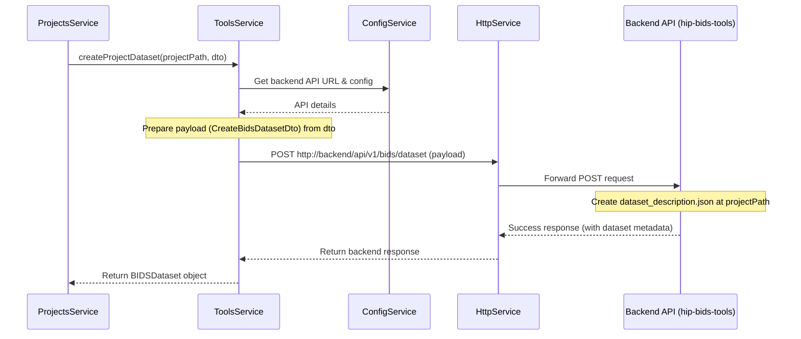

# Chapter 8: BIDS Data Tools (ToolsService)

Welcome back! In [Chapter 7: File Handling (FilesService)](07_file_handling__filesservice_.md), we saw how the Gateway interacts with the general file system to list directories and read file contents. Now, let's look at a specific, very important type of data in neuroscience research: data organized according to the **BIDS** standard.

Imagine you're working on a brain imaging study. Just dumping all the scan files into a folder isn't very helpful. You need a standard way to name files, organize directories, and describe the data (like participant ages, scanner type, task performed). This is what the Brain Imaging Data Structure (BIDS) standard helps with. How does the Gateway help you manage your data according to BIDS rules?

**The Problem:** How do we ensure that neuroscience data within our projects follows the BIDS standard? How can we create the initial BIDS structure, validate new data added to it, extract important metadata (like participant count, age range, data types), and make this metadata searchable across different projects?

**The Solution:** We use a specialized service called the **`ToolsService`** (`src/tools/tools.service.ts`). Think of this service as a **highly specialized librarian** who only deals with neuroscience data organized in the BIDS format. This librarian knows the BIDS rules inside out. However, it doesn't do all the complex checking and organizing itself; it relies heavily on a powerful backend tool (likely an external API called `hip-bids-tools`) to perform the actual BIDS operations. The `ToolsService` acts as the friendly interface between the Gateway and this backend BIDS expert system.

## Key Concepts

### 1. BIDS (Brain Imaging Data Structure)

BIDS is a widely adopted standard for organizing and describing neuroimaging data and its metadata. It defines specific folder structures and file naming conventions. Following BIDS makes data easier to understand, share, and process with automated tools.

*   **Analogy:** Think of BIDS like the Dewey Decimal System for a library, but specifically designed for brain data. It tells you exactly how to label and shelve your "books" (data files) so anyone (or any program) can find and understand them.

### 2. Backend BIDS Tools API (e.g., `hip-bids-tools`)

The `ToolsService` itself doesn't contain all the complex logic for validating BIDS datasets or extracting every piece of metadata. Instead, it communicates with a separate backend API service (we'll call it `hip-bids-tools` for this tutorial) that is specifically designed for these tasks.

*   **Analogy:** Our specialized librarian (`ToolsService`) doesn't personally read every single page of every neuroscience book. When asked to validate a new book or find all books about a specific topic, they use a powerful library catalog and analysis system (the `hip-bids-tools` API) to get the job done efficiently. `ToolsService` knows how to *ask* the right questions to this backend system.

### 3. Elasticsearch Indexing

To make datasets easily searchable, key metadata extracted by the backend BIDS tools needs to be stored somewhere optimized for searching. The `ToolsService` (or rather, the backend it communicates with) indexes this metadata into **Elasticsearch**, a powerful search engine.

*   **Mapping:** A file like `src/mappings/datasets_mapping.json` defines *how* the metadata (like `Authors`, `AgeMin`, `AgeMax`, `ParticipantsCount`, `DataTypes`) should be stored and indexed in Elasticsearch, ensuring efficient searching.

```json
// src/mappings/datasets_mapping.json (Excerpt)
{
	"mappings": {
		"properties": {
			// How to index the 'Name' field (project/dataset name)
			"Name": {
				"type": "text", // Allows full-text search
				"fields": {
					"keyword": { "type": "keyword" } // Allows exact matching/sorting
				}
			},
			// How to index participant age range
			"AgeMin": { "type": "long" }, // Store as a number
			"AgeMax": { "type": "long" },
			// How to index number of participants
			"ParticipantsCount": { "type": "long" },
			// How to index available data types (e.g., "anat", "func")
			"DataTypes": {
				"type": "text",
				"fields": { "keyword": { "type": "keyword" } }
			},
			// ... many other fields defined ...
		}
	}
}
```
*   **Explanation:** This JSON snippet tells Elasticsearch how to treat different pieces of metadata. For example, `Name` is indexed both as `text` (for searching parts of the name) and `keyword` (for exact matches). `AgeMin`, `AgeMax`, and `ParticipantsCount` are stored as numbers (`long`) for range queries. `DataTypes` are stored as `keyword`s for filtering.

### 4. Core Functions of `ToolsService`

Based on the above, the `ToolsService` provides functionalities (often by calling the backend API) to:
*   **Create BIDS Structure:** Initialize basic BIDS files like `dataset_description.json`.
*   **Import/Validate:** Add new subject data to a BIDS dataset and check if it conforms to the standard.
*   **Index Metadata:** Trigger the backend to extract metadata from a BIDS dataset and store it in Elasticsearch according to the mapping.
*   **Search Datasets:** Query Elasticsearch (via the backend) to find datasets based on criteria like age range, participant count, or data types.

## How to Use: Initializing a BIDS Dataset

Let's revisit the scenario from [Chapter 5: Project Management (ProjectsService)](05_project_management__projectsservice_.md) where a new project, "AlpineStudy", is created. As part of that process, `ProjectsService` needs to create the initial BIDS `dataset_description.json` file. It delegates this task to `ToolsService`.

**Step 1: `ProjectsService` Calls `ToolsService`**

Inside the `ProjectsService.create` method, after creating the project directory, it calls `toolsService.createProjectDataset`.

```typescript
// src/projects/projects.service.ts (Simplified Snippet from Chapter 5)
// ... imports and constructor ...

  async create(createProjectDto: CreateProjectDto) {
    // ... steps to sanitize name, create IAM group, create directory ...
    const projectPath = `${groupfolderPath}/${name}`; // e.g., /mnt/collab/__groupfolders/Alpine-Study

    try {
      // ... other steps ...

      // 6. Initialize BIDS Dataset using ToolsService
      const dataset = await this.toolsService.createProjectDataset(
          projectPath,      // Path to the new project directory
          createProjectDto  // Contains initial BIDS metadata
      );

      // Optional: Cache the result from ToolsService
      // this.cacheService.set(`${CACHE_KEY_PROJECTS}:${name}:dataset`, dataset);

      // ... create description.md, return success ...

    } catch (error) { /* ... error handling ... */ }
  }
```
*   **Explanation:** `ProjectsService` passes the absolute path to the newly created project directory (`projectPath`) and the `createProjectDto` (which includes the initial `datasetDescription`) to `toolsService.createProjectDataset`.

**Step 2: Input for `createProjectDataset`**

The `createProjectDto` contains the necessary information, especially the `datasetDescription` part.

```typescript
// Example structure of createProjectDto passed to ToolsService
const createProjectDto = {
  title: "Alpine Study",
  // ... other project fields ...
  adminId: "admin_user",
  owner: "admin_user", // Often same as adminId initially
  datasetDescription: { // <-- BIDS info
    Name: "AlpineStudy",
    BIDSVersion: "1.8.0",
    Authors": ["Admin User"],
    DatasetType": "raw"
    // ... other optional BIDS fields like License, Funding ...
  }
};
// The `projectPath` would be something like "/mnt/collab/__groupfolders/Alpine-Study"
```

**Step 3: Expected Outcome**

The `ToolsService.createProjectDataset` method (by communicating with the backend API) performs the action:

1.  A file named `dataset_description.json` is created inside the `projectPath` directory.
2.  The content of this file is based on the `datasetDescription` provided in the `createProjectDto`.
3.  The method might return an object representing the created dataset's metadata (e.g., `BIDSDataset` type).

```json
// Example content of /mnt/collab/__groupfolders/Alpine-Study/dataset_description.json
{
  "Name": "AlpineStudy",
  "BIDSVersion": "1.8.0",
  "Authors": [
    "Admin User"
  ],
  "DatasetType": "raw"
}
```

## Under the Hood: Interaction with the Backend API

How does `ToolsService.createProjectDataset` actually create the file? It doesn't directly use Node.js `fs.write`. Instead, it asks the `hip-bids-tools` backend API to do it.

**Non-Code Walkthrough:**

1.  **Receive Request:** `ToolsService.createProjectDataset` receives the `projectPath` and the `createProjectDto`.
2.  **Get Backend Config:** It retrieves the URL and any necessary authentication details for the `hip-bids-tools` API from the [Chapter 2: Configuration Management](02_configuration_management_.md) (`ConfigService`).
3.  **Construct API Payload:** It extracts the relevant information (like `owner`, `projectPath`, and the `datasetDescription` object) and formats it into a request body suitable for the backend API endpoint responsible for creating datasets. Let's assume the DTO for the backend call is `CreateBidsDatasetDto`.
4.  **Send API Request:** It uses NestJS's `HttpService` (covered in previous chapters) to send an HTTP `POST` request to the backend API endpoint (e.g., `http://hip-bids-tools-api:8000/api/v1/bids/dataset`). The request includes the payload created in step 3 and any necessary authentication headers.
5.  **Handle Response:** The `hip-bids-tools` API receives the request, performs the action (creates the `dataset_description.json` file at the specified `projectPath`), and sends back a response (e.g., confirming success and possibly returning the metadata of the created dataset). `ToolsService` receives this response.
6.  **Return Result:** `ToolsService` processes the response from the backend API and returns the relevant information (e.g., the `BIDSDataset` object) back to the caller (`ProjectsService`).

**Sequence Diagram:**



**Code Dive:**

First, `ToolsService` needs `HttpService` and potentially `ConfigService` injected.

```typescript
// src/tools/tools.module.ts (Ensures HttpService is available)
import { HttpModule } from '@nestjs/axios';
import { Module } from '@nestjs/common';
// Import NextcloudService if needed for auth/paths
import { NextcloudService } from 'src/nextcloud/nextcloud.service';
import { ToolsController } from './tools.controller';
import { ToolsService } from './tools.service';

@Module({
	imports: [HttpModule], // Make HttpService injectable
	controllers: [ToolsController],
	providers: [ToolsService, NextcloudService], // Provide services
	exports: [ToolsService] // Export ToolsService for other modules
})
export class ToolsModule {}
```

```typescript
// src/tools/tools.service.ts (Simplified Constructor)
import { HttpService } from '@nestjs/axios';
import { Injectable, Logger } from '@nestjs/common';
import { ConfigService } from '@nestjs/config'; // Optional: For backend URL
import { firstValueFrom } from 'rxjs';
import { CreateBidsDatasetDto } from './dto/create-bids-dataset.dto';
// Other DTOs and types...

@Injectable()
export class ToolsService {
    private readonly logger = new Logger(ToolsService.name);
    private backendApiUrl: string;

    constructor(
        private readonly httpService: HttpService,
        private readonly configService: ConfigService // Inject if needed
        // Inject NextcloudService if needed
    ) {
        // Get backend URL from config or use environment variable directly
        this.backendApiUrl = process.env.TOOLS_API || 'http://hip-bids-tools-api:8000/api/v1';
        this.logger.log(`ToolsService configured for backend: ${this.backendApiUrl}`);
    }
    // ... methods below ...
}
```

Now, a simplified `createProjectDataset` method:

```typescript
// src/tools/tools.service.ts (Simplified createProjectDataset)
import { CreateProjectDto } from 'src/projects/dto/create-project.dto';
// ... other imports ...

export class ToolsService {
    // ... constructor ...

    // This method is called by ProjectsService
    public async createProjectDataset(
        projectPath: string,
        createProjectDto: CreateProjectDto
    ): Promise<BIDSDataset> { // Assuming BIDSDataset is the return type

        // 1. Prepare the payload for the backend API
        const payload: CreateBidsDatasetDto = {
            owner: createProjectDto.owner,
            parent_path: projectPath, // The absolute path on the server
            dataset_dirname: '', // Backend might determine name or use parent_path
            DatasetDescJSON: createProjectDto.datasetDescription
        };

        const url = `${this.backendApiUrl}/bids/dataset`;
        this.logger.debug(`Calling backend POST ${url} with payload: ${JSON.stringify(payload)}`);

        try {
            // 2. Send request to the backend API using HttpService
            const response = await firstValueFrom(
                this.httpService.post<BIDSDataset>(url, payload, {
                    // Add headers if needed (e.g., authentication)
                })
            );

            this.logger.log(`Backend successfully created BIDS dataset.`);
            // 3. Return the data received from the backend
            return response.data;

        } catch (error) {
            this.logger.error(`Error calling backend to create dataset: ${error.message}`);
            // Handle or rethrow the error
            throw new Error(`Failed to create BIDS dataset via backend: ${error.message}`);
        }
    }

    // ... other methods like indexBIDSDataset, searchBidsDatasets, importBIDSSubject ...
}
```
*   **Explanation:** The method constructs the `payload` object expected by the backend API (`CreateBidsDatasetDto`). It builds the target `url` and uses `this.httpService.post` to send the request. The type `<BIDSDataset>` suggests we expect the backend to return an object of that type on success. The result from the backend (`response.data`) is then returned to `ProjectsService`.

### Other Example Interactions

*   **Indexing:** When needed (e.g., after importing data), `ToolsService` might have a method like `indexBIDSDataset(owner, path, id)`. This method would similarly call a specific endpoint on the `hip-bids-tools` backend API (e.g., `POST /api/v1/bids/dataset/index`). The backend would then read the dataset at `path`, extract metadata, and index it into Elasticsearch using the structure defined in `datasets_mapping.json`.
*   **Searching:** A method like `searchBidsDatasets(queryOptions)` would call a search endpoint on the backend (e.g., `GET /api/v1/bids/datasets/search?query=...&ageMin=...`). The backend performs the Elasticsearch query based on the provided parameters and returns the matching datasets. `ToolsService` simply relays the request and response.

## Conclusion

The `ToolsService` acts as the Gateway's dedicated interface for handling **BIDS-formatted neuroscience data**. It functions primarily as a **client** to a powerful backend API service (`hip-bids-tools`). Its key roles include:

*   Requesting the **creation** of BIDS dataset structures (like `dataset_description.json`).
*   Triggering data **validation** and **import** processes via the backend.
*   Initiating the **indexing** of BIDS metadata into Elasticsearch using predefined mappings (`datasets_mapping.json`).
*   Facilitating **searches** across indexed datasets based on various criteria by querying the backend.

By delegating the complex BIDS logic to a specialized backend, the `ToolsService` keeps the Gateway focused on orchestration while still providing essential BIDS management capabilities.

In the final chapter, we'll look at how the Gateway optimizes performance by temporarily storing frequently accessed data using the [Chapter 9: Caching (CacheService)](09_caching__cacheservice_.md).

---

Generated by [AI Codebase Knowledge Builder](https://github.com/The-Pocket/Tutorial-Codebase-Knowledge)