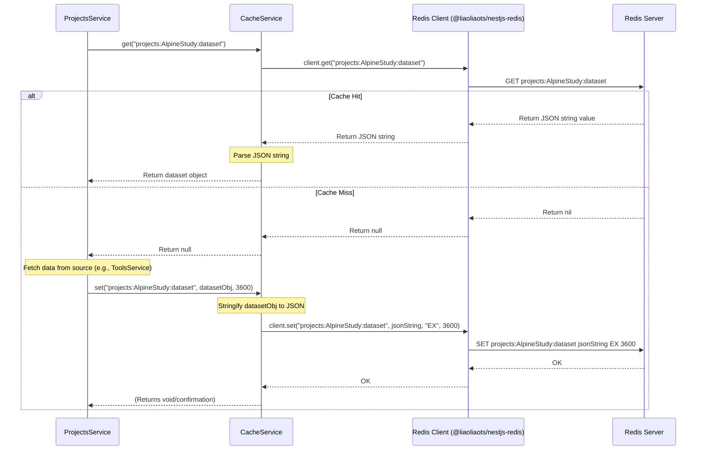

# Chapter 9: Caching (CacheService)

Welcome to the final chapter! In [Chapter 8: BIDS Data Tools (ToolsService)](08_bids_data_tools__toolsservice_.md), we explored how the Gateway handles specialized BIDS neuroscience data by communicating with a backend tool. Now, let's think about performance. Some operations, like fetching project details, getting user permissions, or calculating complex results, can be slow if we do them every single time they're needed.

Imagine you check the weather app on your phone. Does it contact the weather station *every single time* you open the app? Probably not. It likely checks once, remembers the result for a few minutes (caches it), and shows you the remembered result if you check again quickly. This makes the app feel much faster.

**The Problem:** How can we make our Gateway application faster by avoiding repetitive, time-consuming tasks? If we frequently need the same piece of information (like project details, user permissions, or remote container status), how can we fetch or calculate it once and then quickly retrieve it for a short period?

**The Solution:** We use **Caching**! Specifically, we have a **`CacheService`** (`src/cache/cache.service.ts`). Think of the `CacheService` as the Gateway's **short-term memory** or a **super-fast notepad**. It provides a simple way to store temporary data and retrieve it very quickly. This avoids re-doing slow operations over and over again. Under the hood, it uses a popular caching tool called **Redis**.

## Key Concepts

### 1. Caching: Remembering for Speed

Caching is the technique of storing frequently accessed data temporarily in a location that allows for very fast retrieval. Instead of going back to the original, slower source (like a database, a complex calculation, or an external API call), the application first checks its cache. If the data is there (a "cache hit"), it uses the cached version. If not (a "cache miss"), it fetches the data from the original source and then stores it in the cache for next time.

*   **Analogy:** Imagine you need a specific phone number. Looking it up in a huge phone book (the original source) takes time. If you write it down on a sticky note on your desk (the cache) after the first lookup, the next time you need it, you can just glance at the note – much faster!

### 2. Redis: The Fast Notepad

Our Gateway uses **Redis** as its caching system. Redis is an open-source, in-memory data structure store. "In-memory" means it keeps data primarily in the computer's RAM, which is much faster to access than data stored on a hard disk (like a traditional database).

*   **Analogy:** Redis is like a highly organized, lightning-fast digital notepad specifically designed for temporary storage and quick lookups.
*   **Configuration:** How the Gateway connects to Redis (its address, database number) is defined in `src/config/db.redis.config.ts` and read using the [Configuration Management](02_configuration_management_.md) system.

```typescript
// src/config/db.redis.config.ts (Simplified)
import { registerAs } from '@nestjs/config';

export default registerAs('redis', () => ({ // Namespace 'redis'
  host: process.env.REDIS_HOST || '127.0.0.1', // Read from environment or use default
  name: process.env.REDIS_NAME || 'containers',
  db: +process.env.REDIS_DATABASE || 1 // Which Redis DB to use
}));
```

### 3. `@liaoliaots/nestjs-redis`: The Redis Helper Library

To make talking to Redis easy within our NestJS application, we use a library called `@liaoliaots/nestjs-redis`. This library handles the connection details and provides convenient ways to interact with Redis.

### 4. `CacheService` (`src/cache/cache.service.ts`): Our Simple Interface

We don't want every service in our application to worry about the details of Redis commands. The `CacheService` provides a very simple interface with three main methods:
*   `set(key, value, expirationTime?)`: Store some `value` associated with a unique `key`. Optionally, make it expire after a certain number of seconds.
*   `get(key)`: Retrieve the value associated with a `key`. Returns `null` if the key doesn't exist or has expired.
*   `del(key)`: Remove a key and its value from the cache.

This service is used by other services like [Project Management (ProjectsService)](05_project_management__projectsservice_.md) and [Remote Application Management (RemoteAppService & State Machine)](06_remote_application_management__remoteappservice___state_machine_.md) to cache things like project metadata or the state of remote containers.

## How to Use: Caching Project Dataset Information

Let's look at an example from `ProjectsService`. Fetching and processing the BIDS dataset information for a project might involve reading files or calling the [BIDS Data Tools (ToolsService)](08_bids_data_tools__toolsservice_.md). If we need this information often (e.g., every time someone views the project page), we can cache it.

**Step 1: Inject `CacheService`**

First, the `ProjectsService` needs access to the `CacheService`. This is done through constructor injection.

```typescript
// src/projects/projects.service.ts (Simplified Constructor)
import { Injectable, Logger } from '@nestjs/common';
import { CacheService } from 'src/cache/cache.service'; // Import CacheService
import { IamService } from 'src/iam/iam.service';
import { ToolsService } from 'src/tools/tools.service';
// ... other imports

const CACHE_KEY_PROJECTS = 'projects'; // Base key for project-related cache entries

@Injectable()
export class ProjectsService {
  private readonly logger = new Logger(ProjectsService.name);

  constructor(
    private readonly iamService: IamService,
    private readonly cacheService: CacheService, // Inject CacheService here!
    private readonly toolsService: ToolsService
    // ... other injected services
  ) {}

  // ... methods below ...
}
```
*   **Explanation:** We import `CacheService` and add it as a parameter to the `constructor`. NestJS takes care of providing the actual `CacheService` instance. We also define a constant `CACHE_KEY_PROJECTS` to help create unique and consistent keys for our cache entries.

**Step 2: Check the Cache First (`get`)**

When a method needs the dataset information (e.g., `findOne`), it first tries to get it from the cache.

```typescript
// src/projects/projects.service.ts (Simplified findOne method)
import { BIDSDataset } from 'src/tools/tools.service'; // Type for dataset info

// ... inside ProjectsService class ...

  async findOne(projectName: string): Promise<Project & { dataset: BIDSDataset }> {
    try {
      // 1. Define a unique key for this project's dataset cache
      const datasetCacheKey = `${CACHE_KEY_PROJECTS}:${projectName}:dataset`;
      this.logger.debug(`Checking cache for key: ${datasetCacheKey}`);

      // 2. Try to get the dataset from the cache
      let dataset: BIDSDataset | null = await this.cacheService.get(datasetCacheKey);

      // 3. Cache Miss?
      if (!dataset) {
        this.logger.debug(`Cache miss for ${datasetCacheKey}. Fetching from source.`);
        // If not in cache, we would normally fetch it here (e.g., from ToolsService or disk)
        // For simplicity, let's assume we fetch it somehow:
        // dataset = await this.fetchDatasetFromSource(projectName); // Placeholder for actual fetch

        // **Important:** We'll store it in the cache *after* fetching (see below)
        // For this example, we'll just log that it wasn't found yet.
      } else {
        // 4. Cache Hit!
        this.logger.debug(`Cache hit for ${datasetCacheKey}! Using cached data.`);
      }

      // Fetch the main project info (e.g., from IAMService)
      const group: any = await this.iamService.getGroup(this.PROJECTS_GROUP, projectName);

      // Combine project info and (potentially cached) dataset info
      return {
        ...group,
        name: group.title,
        isMember: true, // Assuming check logic is elsewhere
        dataset: dataset // Use the dataset (either from cache or fetched)
      };
    } catch (error) {
      throw new Error(`Could not get project: ${error}`);
    }
  }
```
*   **Explanation:**
    *   We create a unique `datasetCacheKey` specific to this project (e.g., `projects:AlpineStudy:dataset`).
    *   We call `await this.cacheService.get(datasetCacheKey)`.
    *   If `dataset` is *not* `null` (cache hit), we log it and use the retrieved data.
    *   If `dataset` *is* `null` (cache miss), we log it. In a real scenario, we would proceed to fetch the data from its original source.

**Step 3: Store in Cache After Fetching (`set`)**

When data is fetched because it wasn't in the cache (a cache miss), we store it before returning it. Let's look at the `create` method where the dataset is first generated by `ToolsService`.

```typescript
// src/projects/projects.service.ts (Simplified create method - caching part)

  async create(createProjectDto: CreateProjectDto) {
    // ... (Previous steps: validate, create IAM group, create directory) ...
    const name = sanitize(createProjectDto.title); // e.g., "Alpine-Study"
    const projectPath = /* ... calculate project path ... */;

    try {
      // ...

      // Call ToolsService to create the dataset structure & get metadata
      const dataset: BIDSDataset = await this.toolsService.createProjectDataset(
          projectPath,
          createProjectDto
      );
      this.logger.debug(`Created dataset: ${JSON.stringify(dataset)}`);

      // **STORE the newly created dataset info in the cache**
      const datasetCacheKey = `${CACHE_KEY_PROJECTS}:${name}:dataset`;
      // Store it with no specific expiration (or add a time in seconds)
      await this.cacheService.set(datasetCacheKey, dataset);
      this.logger.debug(`Stored dataset info in cache with key: ${datasetCacheKey}`);

      // ... (create description.md, etc.) ...

      return this.findProjectsForUser(createProjectDto.adminId);
    } catch (error) {
      this.logger.error(`Failed to create project ${name}: ${error.message}`);
      throw error;
    }
  }
```
*   **Explanation:**
    *   After `toolsService.createProjectDataset` successfully returns the `dataset` object, we again define the unique `datasetCacheKey`.
    *   We call `await this.cacheService.set(datasetCacheKey, dataset)`. This sends the `dataset` object (which gets converted to a JSON string internally) to Redis to be stored under that key.
    *   The *next* time `findOne` is called for this project, the `cacheService.get(datasetCacheKey)` will find this value (cache hit), saving the need to re-fetch or re-calculate it.

**Step 4: Removing from Cache (`del`)**

What if the project is deleted or its dataset significantly changes? The cached data would become stale (outdated). We need to remove it.

```typescript
// src/projects/projects.service.ts (Simplified remove method - caching part)

  async remove(projectName: string, adminId: string) {
    this.logger.debug(`Removing project: ${projectName}`);
    try {
      // 1. Perform the main deletion action (e.g., delete IAM group)
      await this.iamService.deleteGroup(this.PROJECTS_GROUP, projectName);

      // 2. **Remove the associated data from the cache**
      const datasetCacheKey = `${CACHE_KEY_PROJECTS}:${projectName}:dataset`;
      await this.cacheService.del(datasetCacheKey);
      this.logger.debug(`Removed dataset info from cache for key: ${datasetCacheKey}`);
      // Remove any other related cache keys too...

      // 3. Return updated list of projects
      return this.findProjectsForUser(adminId);

    } catch (error) {
      this.logger.error(`Failed to remove project ${projectName}: ${error.message}`);
      throw error;
    }
  }
```
*   **Explanation:** After successfully deleting the project's IAM group, we determine the `datasetCacheKey` and call `await this.cacheService.del(datasetCacheKey)`. This tells Redis to remove that entry, ensuring that subsequent requests won't retrieve stale data.

## Under the Hood

How does `CacheService` actually talk to Redis?

**Non-Code Walkthrough:**

1.  **Injection:** When `CacheService` is created, NestJS (using the `@liaoliaots/nestjs-redis` library and our configuration in `AppModule`) injects a ready-to-use Redis client object.
2.  **`get(key)` called:** Another service (e.g., `ProjectsService`) calls `cacheService.get('myKey')`.
3.  **Client Command:** `CacheService` uses the injected Redis client to send the `GET myKey` command to the Redis server.
4.  **Redis Lookup:** The Redis server looks up `myKey` in its memory.
5.  **Response:**
    *   **Hit:** Redis finds the value and sends it back to the client. `CacheService` receives the JSON string, parses it back into an object/value, and returns it.
    *   **Miss:** Redis doesn't find the key (or it's expired) and sends back `nil` (or null). `CacheService` receives this and returns `null`.
6.  **`set(key, value, seconds?)` called:** Service calls `cacheService.set('myKey', { data: 123 }, 300)`.
7.  **Serialization:** `CacheService` converts the `value` object `{ data: 123 }` into a JSON string `'{"data":123}'`.
8.  **Client Command:** It uses the Redis client to send the command `SET myKey '{"data":123}' EX 300` to the Redis server (EX specifies expiration in seconds).
9.  **Redis Store:** Redis stores the string value under `myKey` and sets a timer for it to expire in 300 seconds. It sends back an "OK" confirmation.
10. **Return:** `CacheService` returns (often doesn't need to return anything specific for `set`).

**Sequence Diagram:**



**Code Dive:**

Let's look inside `CacheService`.

```typescript
// src/cache/cache.service.ts (Simplified)
import { Injectable, Logger } from '@nestjs/common';
import { InjectRedis } from '@liaoliaots/nestjs-redis'; // Import decorator
import Redis from 'ioredis'; // Import the Redis client type

@Injectable()
export class CacheService {
	private readonly logger = new Logger('CacheService');

	// Inject the configured Redis client instance
	constructor(@InjectRedis() private readonly client: Redis) {}

	// Method to store a value
	public async set(key: string, value: any, seconds?: number): Promise<any> {
		// Convert the value to a JSON string for storage in Redis
		const jsonString = JSON.stringify(value);
		this.logger.debug(`Setting cache key: ${key} (Expires in ${seconds || 'never'}s)`);

		if (!seconds) {
			// Store without expiration
			await this.client.set(key, jsonString);
		} else {
			// Store with expiration time in seconds ('EX')
			await this.client.set(key, jsonString, 'EX', seconds);
		}
		// SET command usually returns 'OK', but we don't need to return it here.
	}

	// Method to retrieve a value
	public async get(key: string): Promise<any> {
		this.logger.debug(`Getting cache key: ${key}`);
		// Ask the Redis client to get the value for the key
		const data = await this.client.get(key);

		if (data) {
			this.logger.debug(`Cache hit for key: ${key}`);
			// If data exists, parse it from JSON back into an object/value
			try {
				return JSON.parse(data);
			} catch (error) {
				this.logger.error(`Error parsing JSON from cache for key ${key}: ${error}`);
				return null; // Return null if parsing fails
			}
		} else {
			this.logger.debug(`Cache miss for key: ${key}`);
			// If data is null (key doesn't exist or expired), return null
			return null;
		}
	}

	// Method to delete a value
	public async del(key: string): Promise<any> {
		this.logger.debug(`Deleting cache key: ${key}`);
		// Ask the Redis client to delete the key
		await this.client.del(key);
		// DEL command returns the number of keys deleted, but we don't need it here.
	}

	// Other methods like sadd, smembers, srem, flushall might exist for set operations or clearing cache
}
```
*   **Explanation:**
    *   The `@InjectRedis()` decorator in the `constructor` provides the configured `Redis` client instance.
    *   `set` uses `JSON.stringify` to convert the value before calling `this.client.set()`, optionally adding the `'EX'` flag and expiration time.
    *   `get` calls `this.client.get()`. If data is returned, it uses `JSON.parse` to convert the string back to its original form. It returns `null` if the key wasn't found or if parsing fails.
    *   `del` simply calls `this.client.del()` with the key.

How does `@InjectRedis()` know *which* Redis connection to use? That's set up in the `AppModule`:

```typescript
// src/app.module.ts (RedisModule setup excerpt)
import { RedisModule } from '@liaoliaots/nestjs-redis';
import { ConfigModule, ConfigService } from '@nestjs/config';
// ... other imports ...

@Module({
  imports: [
    ConfigModule.forRoot({ /* ... loads redisConfig ... */ }),
    // ... other modules ...
    RedisModule.forRootAsync({ // Configure Redis using ConfigService
      inject: [ConfigService], // Inject ConfigService to access settings
      useFactory: (config: ConfigService) => ({ // Factory function
        config: { // Configuration object for @liaoliaots/nestjs-redis
          // Get connection details from the loaded 'redis' namespace
          host: config.get('redis.host'),
          name: config.get('redis.name'), // Optional connection name
          db: config.get('redis.db')      // Which database number
          // URL format can also be used:
          // url: `redis://${config.get('redis.host')}:${config.get('redis.port')}/${config.get('redis.db')}`
        }
      })
    }),
    // ... other modules ...
  ],
  // ... controllers, providers (including CacheService) ...
})
export class AppModule {}
```
*   **Explanation:** `RedisModule.forRootAsync` allows us to configure the Redis connection using our standard `ConfigService`. The `useFactory` function reads the Redis host and database number (loaded from environment variables via `src/config/db.redis.config.ts`) and passes them to the Redis library. This ensures `CacheService` connects to the correct Redis instance.

## Conclusion

We've learned that the **`CacheService`** provides a simple and essential function within the Gateway: **caching**.

*   It acts as a **short-term memory**, using **Redis** via the `@liaoliaots/nestjs-redis` library.
*   It offers straightforward methods: `set(key, value, expiry?)`, `get(key)`, and `del(key)`.
*   Other services use it to store results of slow or frequently repeated operations (like getting project details or remote container status).
*   This significantly **improves performance** by reducing redundant computations or calls to slower systems.

Understanding caching is crucial for building responsive and efficient applications. By strategically using the `CacheService`, the Gateway can provide a smoother experience for its users.

This concludes our tutorial series through the core components of the Gateway project. We hope this journey has given you a solid understanding of its architecture and how different parts collaborate to deliver its functionality!

---

Generated by [AI Codebase Knowledge Builder](https://github.com/The-Pocket/Tutorial-Codebase-Knowledge)