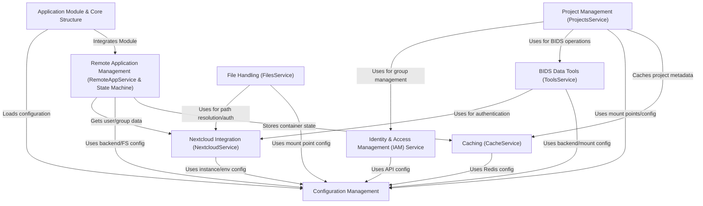

# Tutorial: gateway

This project acts as the central **gateway** API for the *HIP platform*.
It connects users to their files (*Nextcloud*), manages collaborative *projects* (using IAM for permissions and BIDS tools for data), allows running remote scientific *applications* in containers, and handles file operations.

**Source Repository:** [https://github.com/HIP-infrastructure/gateway](https://github.com/HIP-infrastructure/gateway)

## Chapters

1. [Application Module & Core Structure
](01_application_module___core_structure_.md)
2. [Configuration Management
](02_configuration_management_.md)
3. [Identity & Access Management (IAM) Service
](03_identity___access_management__iam__service_.md)
4. [Nextcloud Integration (NextcloudService)
](04_nextcloud_integration__nextcloudservice__.md)
5. [Project Management (ProjectsService)
](05_project_management__projectsservice__.md)
6. [Remote Application Management (RemoteAppService & State Machine)
](06_remote_application_management__remoteappservice___state_machine__.md)
7. [File Handling (FilesService)
](07_file_handling__filesservice__.md)
8. [BIDS Data Tools (ToolsService)
](08_bids_data_tools__toolsservice__.md)
9. [Caching (CacheService)
](09_caching__cacheservice__.md)

---

Generated by [AI Codebase Knowledge Builder](https://github.com/The-Pocket/Tutorial-Codebase-Knowledge)