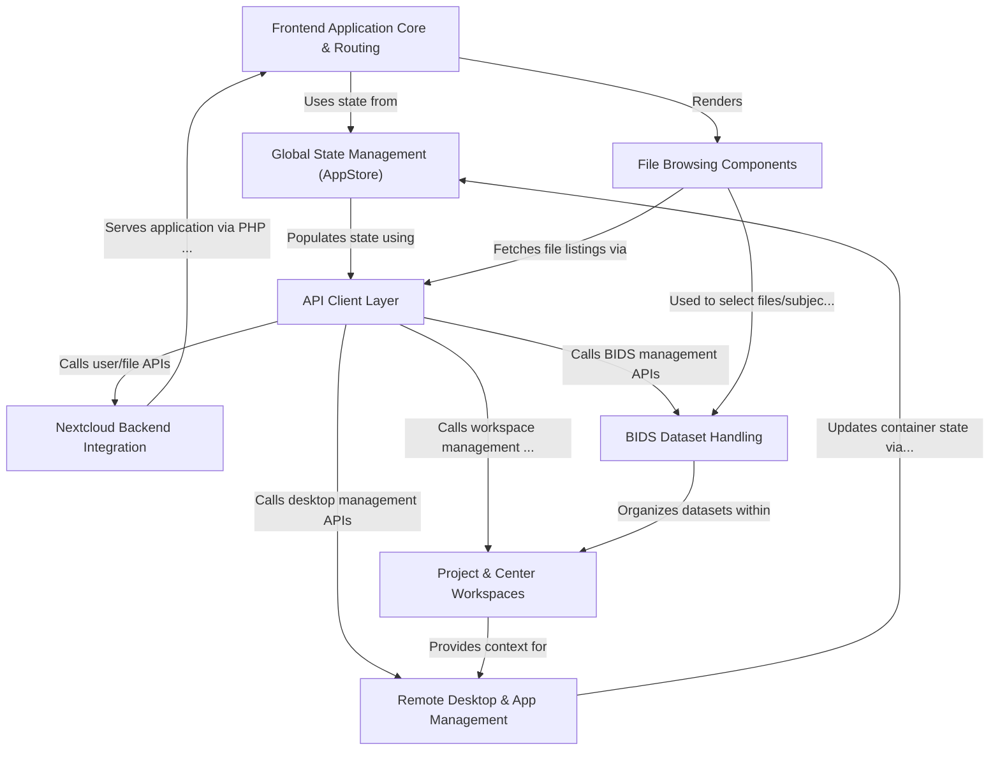

# Tutorial: hip

The **HIP** (Human Intracranial-EEG Platform) project is a *web-based application* built with React that integrates into the *Nextcloud* environment.
Its main purpose is to help researchers **manage**, **share**, and **analyze** brain imaging data, particularly data structured according to the **BIDS** (Brain Imaging Data Structure) standard.
HIP provides users with private workspaces (*Centers*) and collaborative environments (*Projects*). Within these spaces, users can browse files, manage BIDS datasets, and launch *remote virtual desktops* equipped with specialized scientific applications for data processing and analysis, all through a unified interface.

**Source Repository:** [https://github.com/HIP-infrastructure/hip](https://github.com/HIP-infrastructure/hip)

## Chapters

1. [Project & Center Workspaces
](01_project___center_workspaces_.md)
2. [BIDS Dataset Handling
](02_bids_dataset_handling_.md)
3. [File Browsing Components
](03_file_browsing_components_.md)
4. [Remote Desktop & App Management
](04_remote_desktop___app_management_.md)
5. [Frontend Application Core & Routing
](05_frontend_application_core___routing_.md)
6. [Global State Management (AppStore)
](06_global_state_management__appstore__.md)
7. [API Client Layer
](07_api_client_layer_.md)
8. [Nextcloud Backend Integration
](08_nextcloud_backend_integration_.md)

---

Generated by [AI Codebase Knowledge Builder](https://github.com/The-Pocket/Tutorial-Codebase-Knowledge)