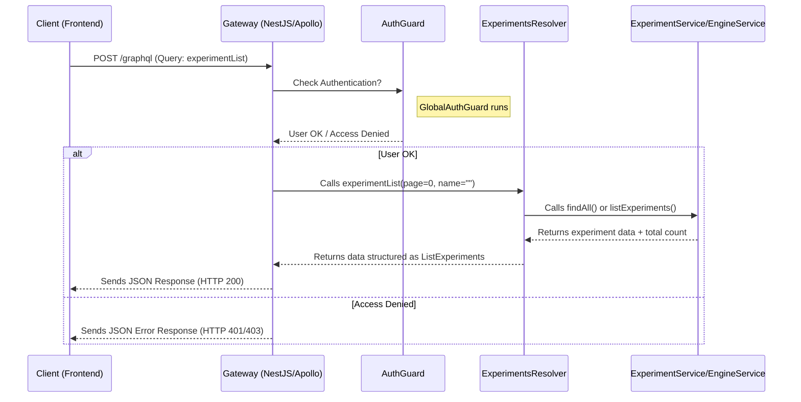

# Chapter 1: GraphQL API Layer

Welcome to the `gateway` project! This tutorial will guide you through its core components. We're starting with the very first thing any user or application interacts with: the **GraphQL API Layer**.

## What's the Big Idea? (Motivation)

Imagine you're building a web application (let's call it the "frontend") that needs to show users information about scientific experiments managed by our `gateway`. How does the frontend *ask* the `gateway` for this information? And how does it tell the `gateway` to *do* something, like create a *new* experiment?

This is where the **GraphQL API Layer** comes in. Think of the `gateway` as a sophisticated kitchen, and the GraphQL API Layer as its **menu**. This menu clearly lists:

1.  What information you can **ask for** (like "list all available experiments" or "get details for one specific experiment").
2.  What actions you can **request** (like "create a new experiment" or "log me in").

Without this "menu," the frontend wouldn't know how to communicate with the `gateway`. This layer defines the **public contract** – the rules of engagement for anyone wanting to interact with the `gateway`.

Our main goal in this chapter is to understand how this "menu" is defined and how a client (like our frontend) can use it to, for example, **fetch a list of experiments**.

## Key Ingredients of the Menu (Core Concepts)

The `gateway` uses a technology called **GraphQL** combined with **NestJS** (a framework for building server-side applications) to create this API layer. Let's break down the key terms:

1.  **GraphQL:** This is a special language for asking for data. The cool part is that the client can ask for *exactly* the data it needs, nothing more, nothing less. It's like ordering a custom pizza instead of choosing from pre-set options.

2.  **Resolvers (`@Resolver`):** Think of these as sections in our menu, like "Appetizers," "Main Courses," or "Desserts." In the `gateway` code, classes decorated with `@Resolver` group related operations. We have:
    *   `AuthResolver`: Handles logging in, logging out, refreshing tokens ([Authentication & Authorization](02_authentication___authorization_.md)).
    *   `EngineResolver`: Provides general configuration, available domains, algorithms ([Engine & Connectors](05_engine___connectors_.md)).
    *   `ExperimentsResolver`: Manages fetching, creating, editing, and deleting experiments ([Experiment Management](04_experiment_management_.md)).
    *   `UsersResolver`: Handles user-related information ([User Service & Entity](03_user_service___entity_.md)).

3.  **Queries (`@Query`):** These are like asking for information *from* the menu. They **fetch** data but don't change anything. Examples:
    *   "Get the list of all experiments." (`experimentList` in `ExperimentsResolver`)
    *   "What domains are available?" (`domains` in `EngineResolver`)

4.  **Mutations (`@Mutation`):** These are requests that **change** data. They're like placing an order that affects the kitchen's state. Examples:
    *   "Log me in with this username and password." (`login` in `AuthResolver`)
    *   "Create a new experiment with these details." (`createExperiment` in `ExperimentsResolver`)

5.  **Input Types (`@InputType`):** When you place an order (a Mutation), you often need to provide details. `@InputType` defines the *structure* of the data the client *sends to* the gateway. It's like the required fields on an order form.
    *   Example: `AuthenticationInput` specifies that the client must send a `username` and `password` for the `login` mutation.

    ```typescript
    // File: api/src/auth/inputs/authentication.input.ts
    // (Simplified - showing the concept)
    import { Field, InputType } from '@nestjs/graphql';

    @InputType() // Marks this as a structure for *input* data
    export class AuthenticationInput {
      @Field() // Exposes this field in GraphQL
      username: string;

      @Field() // Exposes this field in GraphQL
      password: string;
    }
    ```
    *Explanation:* This defines a data shape named `AuthenticationInput`. When a client calls a mutation that uses this, they *must* provide a `username` (string) and a `password` (string).

6.  **Object Types (`@ObjectType`):** When the gateway sends data *back* to the client (usually as a result of a Query or Mutation), `@ObjectType` defines the *structure* of that data. It's like the description of the dish you receive. These often represent the main data entities you'll learn about in [Core Data Models](07_core_data_models_.md).
    *   Example: `AuthenticationOutput` specifies that the gateway will return an `accessToken` and a `refreshToken` after a successful login.

    ```typescript
    // File: api/src/auth/outputs/authentication.output.ts
    import { Field, ObjectType } from '@nestjs/graphql';

    @ObjectType() // Marks this as a structure for *output* data
    export class AuthenticationOutput {
      @Field() // Exposes this field in GraphQL
      accessToken: string;

      @Field() // Exposes this field in GraphQL
      refreshToken: string;
    }
    ```
    *Explanation:* This defines a data shape named `AuthenticationOutput`. When the gateway returns this, the client knows it will contain an `accessToken` (string) and a `refreshToken` (string).

7.  **ResultUnion:** Sometimes, an operation might return different *kinds* of results. For example, running an experiment might give you a table, a chart, or just a simple message. `ResultUnion` is a special GraphQL type that says "the result will be one of these possible types (`TableResult`, `ChartResult`, etc.)." It's like the menu saying the "Chef's Special" could be either fish *or* steak today.

    ```typescript
    // File: api/src/engine/models/result/common/result-union.model.ts
    // (Conceptual - showing the union creation)
    import { createUnionType } from '@nestjs/graphql';
    // ... imports for TableResult, RawResult, etc.

    export const ResultUnion = createUnionType({
      name: 'ResultUnion', // The name in the GraphQL schema
      // Lists all possible result types
      types: () => [TableResult, RawResult, /* ... other result types */],
      // Logic to figure out *which* type the actual result is
      resolveType(value) {
        // ... (checks properties of 'value' to determine the type)
      },
    });
    ```
    *Explanation:* This defines `ResultUnion` which bundles various specific result types (`TableResult`, `RawResult`, etc.) into one umbrella type. The gateway uses `resolveType` logic to tell the client which specific type is being returned in any given response.

## How to Use the Menu (Fetching Experiments Example)

Let's go back to our use case: the frontend wants to display a list of experiments.

1.  **Look at the "Menu":** The frontend developer consults the GraphQL schema (the auto-generated menu based on our code). They find a `Query` called `experimentList` in the `ExperimentsResolver`.
2.  **Write the Order (GraphQL Query):** The frontend constructs a GraphQL query. It specifies the query name (`experimentList`) and exactly which fields it wants for each experiment (e.g., `id`, `name`, `status`).

    ```graphql
    # Example GraphQL Query sent by the client
    query GetExperimentList {
      experimentList(page: 0, name: "") { # Call the query, provide arguments
        experiments {                      # Ask for the list of experiments
          id                               # Ask for the ID of each experiment
          name                             # Ask for the name
          status                           # Ask for the status
        }
        totalExperiments                   # Also ask for the total count
        currentPage                        # And the current page number
      }
    }
    ```
3.  **Send the Order:** The frontend sends this query text over an HTTP POST request to the `gateway`'s GraphQL endpoint (e.g., `http://localhost:3000/graphql`).
4.  **Receive the Food (JSON Response):** The `gateway` processes the query using the `ExperimentsResolver` and sends back a JSON response containing *only* the requested data.

    ```json
    // Example JSON Response received by the client
    {
      "data": {
        "experimentList": {
          "experiments": [
            {
              "id": "exp-001",
              "name": "Diabetes Study",
              "status": "SUCCESS"
            },
            {
              "id": "exp-002",
              "name": "Cancer Research Trial",
              "status": "PENDING"
            }
            // ... more experiments
          ],
          "totalExperiments": 57,
          "currentPage": 0
        }
      }
    }
    ```

See how GraphQL let the client specify exactly what it needed (`id`, `name`, `status`, etc.)? This makes communication efficient.

## A Peek Inside the Kitchen (Internal Implementation)

So, what happens inside the `gateway` when it receives that `experimentList` query?

**High-Level Steps:**

1.  **Request Arrives:** The `gateway` (built with NestJS and the Apollo GraphQL server library) receives the HTTP request containing the GraphQL query.
2.  **Parsing & Routing:** The Apollo server parses the query (`experimentList`) and identifies that it corresponds to the `experimentList` method within the `ExperimentsResolver` class.
3.  **Guard Check (Optional):** Before executing the method, security checks might run. For example, the `@UseGuards(GlobalAuthGuard)` decorator ensures the user is properly logged in. You'll learn more about this in [Authentication & Authorization](02_authentication___authorization_.md).
4.  **Resolver Method Execution:** The `experimentList` method in `ExperimentsResolver.ts` is called.
5.  **Service Interaction:** The resolver method usually doesn't contain complex logic itself. It calls methods on other "service" classes to do the actual work. In this case, it might call `this.engineService.listExperiments(...)` (if configured to use an external engine) or `this.experimentService.findAll(...)` (if using the internal database). These services belong to modules like [Experiment Management](04_experiment_management_.md) or [Engine & Connectors](05_engine___connectors_.md).
6.  **Data Retrieval:** The service fetches the required data (e.g., from a database or by calling another microservice).
7.  **Formatting & Return:** The service returns the data to the resolver. The resolver returns this data. NestJS/Apollo automatically ensures the data structure matches the `ListExperiments` `@ObjectType` defined in the GraphQL schema.
8.  **Response Sent:** The Apollo server packages the formatted data into a JSON response and sends it back to the client.

**Visualizing the Flow (Sequence Diagram):**



**Code Snippets Deep Dive:**

*   **Setting up GraphQL (`app.module.ts`):** This file configures the main application module. The `GraphQLModule.forRoot` part sets up the Apollo Server.

    ```typescript
    // File: api/src/main/app.module.ts (Simplified)
    import { ApolloDriver, ApolloDriverConfig } from '@nestjs/apollo';
    import { Module } from '@nestjs/common';
    import { GraphQLModule } from '@nestjs/graphql';
    import { join } from 'path';
    // ... other imports

    @Module({
      imports: [
        // ... other modules (ConfigModule, TypeOrmModule, AuthModule, etc.)
        GraphQLModule.forRoot<ApolloDriverConfig>({
          driver: ApolloDriver, // Use Apollo server
          autoSchemaFile: join(process.cwd(), 'src/schema.gql'), // Auto-generate schema file
          context: ({ req, res }) => ({ req, res }), // Make request/response available
          // ... other configs like CORS, error formatting
        }),
        // ... EngineModule, UsersModule, AuthModule, ExperimentsModule
      ],
      // ... controllers, providers
    })
    export class AppModule {}
    ```
    *Explanation:* This configures the GraphQL server. `autoSchemaFile` is crucial – it tells NestJS to automatically generate the `schema.gql` file (our "menu") based on the `@Resolver`, `@Query`, `@Mutation`, `@InputType`, and `@ObjectType` decorators found in the code.

*   **Defining a Query (`experiments.resolver.ts`):** Here's how the `experimentList` query is defined.

    ```typescript
    // File: api/src/experiments/experiments.resolver.ts (Simplified)
    import { Args, Query, Resolver } from '@nestjs/graphql';
    import { Request } from 'express';
    import { UseGuards } from '@nestjs/common';
    import { GlobalAuthGuard } from '../auth/guards/global-auth.guard';
    import { ListExperiments } from '../engine/models/experiment/list-experiments.model';
    // ... other imports (ExperimentsService, EngineService)

    @UseGuards(GlobalAuthGuard) // Protect all queries/mutations in this resolver
    @Resolver() // Marks this class as a GraphQL Resolver
    export class ExperimentsResolver {
      constructor(
        private readonly engineService: EngineService,
        private readonly experimentService: ExperimentsService,
      ) {}

      @Query(() => ListExperiments) // Defines a GraphQL Query
      // Returns data matching the ListExperiments ObjectType
      async experimentList(
        @Args('page', { nullable: true, defaultValue: 0 }) page: number, // Input argument 'page'
        @Args('name', { nullable: true, defaultValue: '' }) name: string, // Input argument 'name'
        // ... other args like @GQLRequest
      ): Promise<ListExperiments> {
        // Logic to call either engineService or experimentService
        // based on configuration and return the results.
        // (Implementation details omitted for brevity)
        if (this.engineService.has('listExperiments')) {
           return this.engineService.listExperiments(page, name, /* req */);
        }
        // ... fallback to local service ...
        const [results, total] = await this.experimentService.findAll(/*...*/);
        return { experiments: results, totalExperiments: total, /*...*/ };
      }

      // ... other queries and mutations (@Mutation) ...
    }
    ```
    *Explanation:* `@Resolver()` marks the class. `@Query(() => ListExperiments)` defines the `experimentList` query, specifying that it returns data structured like the `ListExperiments` `@ObjectType`. `@Args` decorators define the inputs the client can provide (like `page` and `name`). The method body then delegates the work to the appropriate service.

*   **Defining a Mutation (`auth.resolver.ts`):** Here's the `login` mutation.

    ```typescript
    // File: api/src/auth/auth.resolver.ts (Simplified)
    import { Args, Mutation, Resolver } from '@nestjs/graphql';
    import { UseGuards } from '@nestjs/common';
    import { Response } from 'express';
    import { GQLResponse } from '../common/decorators/gql-response.decoractor';
    import { CurrentUser } from '../common/decorators/user.decorator';
    import { User } from '../users/models/user.model';
    import { AuthService } from './auth.service';
    import { LocalAuthGuard } from './guards/local-auth.guard';
    import { AuthenticationInput } from './inputs/authentication.input';
    import { AuthenticationOutput } from './outputs/authentication.output';

    @Resolver()
    export class AuthResolver {
      constructor(private readonly authService: AuthService /* ... */) {}

      @Mutation(() => AuthenticationOutput) // Defines a GraphQL Mutation
      // Returns data matching AuthenticationOutput ObjectType
      @UseGuards(LocalAuthGuard) // Uses a specific guard for login
      async login(
        @GQLResponse() res: Response, // Access HTTP response (for cookies)
        @CurrentUser() user: User, // Get user from LocalAuthGuard
        @Args('variables') inputs: AuthenticationInput, // Get input data
      ): Promise<AuthenticationOutput> {
        // 1. LocalAuthGuard already verified username/password and attached 'user'
        // 2. Call AuthService to generate tokens
        const tokens = await this.authService.login(user);
        // 3. Set access token in an HTTP cookie
        res.cookie(/* ... cookie details ... */);
        // 4. Return tokens in the response body
        return tokens;
      }

      // ... other mutations (refresh, logout) ...
    }
    ```
    *Explanation:* `@Mutation(() => AuthenticationOutput)` defines the `login` mutation, returning `AuthenticationOutput`. `@UseGuards(LocalAuthGuard)` is special: this guard (part of [Authentication & Authorization](02_authentication___authorization_.md)) handles validating the username/password *before* the `login` method even runs. If validation succeeds, it attaches the `user` object, which `@CurrentUser()` makes available. The method then uses `AuthService` to generate tokens and sets a cookie on the HTTP response via `@GQLResponse()`.

## Conclusion

You've just explored the **GraphQL API Layer** – the essential "menu" or public contract for the `gateway`. You learned about:

*   **Queries** (asking for data) and **Mutations** (changing data).
*   **Resolvers** (grouping related operations).
*   **Input Types** (defining data sent *to* the gateway) and **Object Types** (defining data sent *from* the gateway).
*   How a client uses this layer to interact with the `gateway`.
*   The basic internal flow from receiving a request to sending a response.

This API layer is the front door to all the `gateway`'s capabilities. But how do we make sure only the right people can open that door? That's where authentication and authorization come in.

**Next Up:** Let's dive into how the gateway verifies user identities and controls access to different parts of the API in [Chapter 2: Authentication & Authorization](02_authentication___authorization_.md).

---

Generated by [AI Codebase Knowledge Builder](https://github.com/The-Pocket/Tutorial-Codebase-Knowledge)