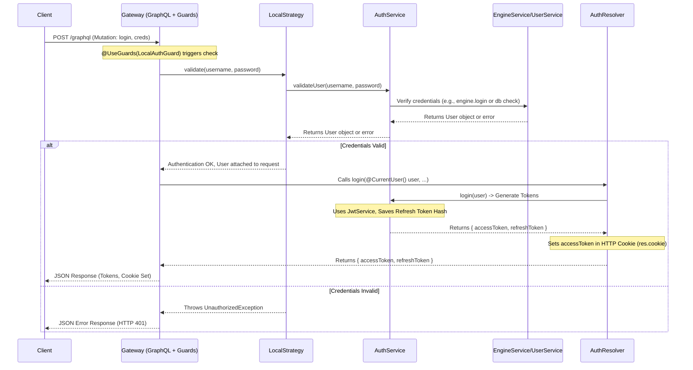

# Chapter 2: Authentication & Authorization

Welcome back! In [Chapter 1: GraphQL API Layer](01_graphql_api_layer_.md), we learned how clients can interact with the `gateway` using GraphQL queries and mutations – like using a menu to order food. But just like a fancy restaurant might have a VIP section, our `gateway` needs to control *who* can access *what*. How do we ensure only logged-in users can see their private data or perform sensitive actions like creating experiments?

That's the job of **Authentication & Authorization**.

## What's the Big Idea? (Motivation)

Imagine our `gateway` is a secure office building.

1.  **Authentication:** This is like the security guard at the front desk asking for your ID to prove **who you are**. Are you really John Doe, an employee?
2.  **Authorization:** Once the guard knows who you are, they need to check **what you are allowed to do**. Does John Doe's ID card grant him access to the 3rd floor (e.g., view experiments) or only the lobby (e.g., view public information)?

Without these checks, anyone could walk in and access sensitive company secrets! In our `gateway`, this system protects user data and ensures only permitted users can trigger certain actions (mutations) or view specific data (queries).

Our main goal in this chapter is to understand how a user **logs in** (Authentication) and how the system then **checks their permissions** for subsequent requests (Authorization).

## Key Ingredients of Security (Core Concepts)

Let's break down the main components involved in securing our gateway:

1.  **Authentication:** The process of verifying a user's identity. The `gateway` supports several ways to do this:
    *   **Username/Password:** The classic method. You provide your username and password.
    *   **Tokens (JWT):** After logging in once, the server gives you a special digital "key" (a JSON Web Token or JWT). For future requests, you just show this key instead of your password. Think of it like getting a temporary access badge after showing your main ID.

2.  **Authorization:** The process of determining if an *authenticated* user has permission to perform a specific action or access specific data. Just because you're *in* the building (authenticated) doesn't mean you can enter *every* room (authorized).

3.  **Strategies (`passport` strategies):** These are specific methods or "recipes" for performing authentication. NestJS uses a library called `passport` to handle these. The `gateway` uses:
    *   `LocalStrategy`: Handles the username/password login check.
    *   `JwtCookiesStrategy`: Looks for the JWT access token in the browser's cookies (small pieces of data websites store in your browser). This is common for web frontends.
    *   `JwtBearerStrategy`: Looks for the JWT access token in a special `Authorization` header of the request (often starting with "Bearer "). This is common for mobile apps or server-to-server communication.
    *   `EngineStrategy`: A special strategy that might delegate authentication directly to the underlying [Engine & Connectors](05_engine___connectors_.md) if configured.

4.  **`AuthService`:** This is the central "security office." It contains the main logic for:
    *   Validating username/password combinations (often by coordinating with the [User Service & Entity](03_user_service___entity_.md) or the [Engine & Connectors](05_engine___connectors_.md)).
    *   Creating (`login`) and refreshing JWT tokens.
    *   Handling logout requests.

5.  **Guards (`@UseGuards`):** These are the actual "security guards" stationed at the doors of our API endpoints (the resolvers and their methods). They use the configured Strategies to check incoming requests *before* the actual resolver code runs.
    *   `LocalAuthGuard`: Specifically used for the `/login` endpoint. It triggers the `LocalStrategy` to check username/password.
    *   `GlobalAuthGuard`: Applied *globally* (or to specific resolvers like `ExperimentsResolver` as seen in Chapter 1). It tries multiple JWT strategies (`JwtCookiesStrategy`, `JwtBearerStrategy`) and potentially the `EngineStrategy` to see if the request has a valid access token or session. If any strategy succeeds, the request is allowed; otherwise, it's blocked.

6.  **Tokens (Access & Refresh):** When you log in successfully, `AuthService` generates two JWTs:
    *   **Access Token:** A short-lived token (e.g., expires in 1 hour) that you send with every request to access protected resources. It's like a temporary keycard that grants access for a short period.
    *   **Refresh Token:** A longer-lived token (e.g., expires in 2 days) used *only* to get a new access token when the old one expires, without needing to re-enter the password. It's like a form you can use to renew your keycard.

## How to Use the Security System (Login Example)

Let's revisit the `login` mutation from [Chapter 1: GraphQL API Layer](01_graphql_api_layer_.md).

1.  **The "Order" (GraphQL Mutation):** The client (e.g., a web app's login form) sends a mutation like this:

    ```graphql
    mutation LoginUser($creds: AuthenticationInput!) {
      login(variables: $creds) { # Call the 'login' mutation
        accessToken         # Ask for the access token
        refreshToken        # Ask for the refresh token
      }
    }
    ```

2.  **Providing Details (Input):** Along with the mutation, the client sends the required input, defined by `AuthenticationInput`:

    ```json
    // Variables sent with the GraphQL mutation
    {
      "creds": {
        "username": "testuser",
        "password": "secretpassword"
      }
    }
    ```

3.  **Sending the Request:** The client sends this mutation and variables to the `gateway`'s `/graphql` endpoint.

4.  **The "Food" (Output):** If the username and password are correct, the `gateway` responds with the `AuthenticationOutput`:

    ```json
    // Example JSON Response received by the client
    {
      "data": {
        "login": {
          "accessToken": "eyJhbGciOiJIUzI1NiIsInR5cCI6IkpXVCJ9...", // A long string
          "refreshToken": "eyJhbGciOiJIUzI1NiIsInR5cCI6IkpXVCJ9..." // Another long string
        }
      }
    }
    ```
    *What happens next?* The client receives these tokens. It will typically:
    *   Store the `refreshToken` securely (e.g., in browser's `localStorage` or secure storage).
    *   The `accessToken` might be stored in memory, but more importantly, the server usually sets it in an **HTTP cookie** automatically during the login response. The browser will then automatically include this cookie (containing the `accessToken`) in subsequent requests to the same server.

Now, when the client makes another request (e.g., `experimentList`), the browser automatically sends the access token cookie. The `GlobalAuthGuard` on the `ExperimentsResolver` will see this token, validate it using `JwtCookiesStrategy`, and allow the request to proceed.

## A Peek Inside the Security Office (Internal Implementation)

What happens inside the `gateway` when that `login` mutation arrives?

**High-Level Steps (Login Flow):**

1.  **Request Arrives:** The gateway receives the HTTP POST request with the `login` mutation and credentials.
2.  **Routing:** The GraphQL layer identifies the `login` mutation and routes it to the `login` method in `AuthResolver`.
3.  **Guard Activated:** The `@UseGuards(LocalAuthGuard)` decorator on the `login` method activates the `LocalAuthGuard`.
4.  **Strategy Triggered:** `LocalAuthGuard` invokes the `validate` method of the configured `LocalStrategy`.
5.  **Credentials Check:** The `LocalStrategy.validate` method calls `AuthService.validateUser(username, password)`.
6.  **Validation Logic:** `AuthService.validateUser` checks the credentials (potentially by calling the `EngineService.login` method, which might interact with an external identity provider or database).
7.  **User Returned (or Error):** If credentials are valid, `AuthService` returns the `User` object. If invalid, it throws an `UnauthorizedException`.
8.  **Guard Success:** If `AuthService` returns a `User`, `LocalAuthGuard` considers the check successful and attaches the `User` object to the request context.
9.  **Resolver Execution:** Now, the actual `AuthResolver.login` method code runs.
10. **Get User:** The method uses the `@CurrentUser()` decorator to easily access the `User` object attached by the guard.
11. **Generate Tokens:** It calls `AuthService.login(user)` to generate the `accessToken` and `refreshToken`.
12. **Token Creation:** `AuthService.login` uses the `JwtService` (from `@nestjs/jwt`) to create and sign the JWTs. It also stores a secure hash of the `refreshToken` associated with the user (often in the database via [User Service & Entity](03_user_service___entity_.md)) for later validation during token refresh.
13. **Set Cookie:** The `AuthResolver.login` method gets access to the HTTP response object (using `@GQLResponse()`) and sets the `accessToken` in an HTTP-only cookie.
14. **Return Tokens:** The method returns the `AuthenticationOutput` containing both tokens.
15. **Response Sent:** The GraphQL layer sends the JSON response containing the tokens back to the client.

**Visualizing the Login Flow (Sequence Diagram):**



**Code Snippets Deep Dive:**

*   **The Login Mutation Handler (`auth.resolver.ts`):**

    ```typescript
    // File: api/src/auth/auth.resolver.ts (Simplified)
    import { UseGuards } from '@nestjs/common';
    import { Args, Mutation, Resolver } from '@nestjs/graphql';
    import { Response } from 'express';
    import { GQLResponse } from '../common/decorators/gql-response.decoractor';
    import { CurrentUser } from '../common/decorators/user.decorator';
    import { User } from '../users/models/user.model';
    import { AuthService } from './auth.service';
    import { LocalAuthGuard } from './guards/local-auth.guard'; // The guard for login
    import { AuthenticationInput } from './inputs/authentication.input';
    import { AuthenticationOutput } from './outputs/authentication.output';

    @Resolver()
    export class AuthResolver {
      constructor(private readonly authService: AuthService /* ... */) {}

      @Mutation(() => AuthenticationOutput)
      @UseGuards(LocalAuthGuard) // Apply the login guard HERE!
      async login(
        @GQLResponse() res: Response, // Inject response to set cookies
        @CurrentUser() user: User, // Get user validated by LocalAuthGuard
        @Args('variables') inputs: AuthenticationInput, // Get username/password input (though 'user' is primary)
      ): Promise<AuthenticationOutput> {
        // LocalAuthGuard already did the username/password check!
        // 'user' object is guaranteed to be valid here.

        const tokens = await this.authService.login(user); // Generate tokens

        // Set the access token in a secure cookie
        res.cookie('jwt-gateway', tokens.accessToken, {
          httpOnly: true, // Prevent JS access
          secure: true, // Only send over HTTPS (adjust based on env)
          sameSite: 'strict', // CSRF protection
          // Add path, domain, expires/maxAge as needed
        });

        return tokens; // Return both tokens in the response body
      }
      // ... other mutations (refresh, logout) ...
    }
    ```
    *Explanation:* The key takeaways are `@UseGuards(LocalAuthGuard)` which enforces the login check before the method runs, `@CurrentUser()` which provides the validated user, calling `authService.login` to get tokens, and using `@GQLResponse()` to set the access token cookie.

*   **The Username/Password Checker (`local.strategy.ts`):**

    ```typescript
    // File: api/src/auth/strategies/local.strategy.ts (Simplified)
    import { Injectable, UnauthorizedException } from '@nestjs/common';
    import { PassportStrategy } from '@nestjs/passport';
    import { Strategy } from 'passport-local'; // Import the base strategy
    import { User } from '../../users/models/user.model';
    import { AuthService } from '../auth.service';

    @Injectable()
    export class LocalStrategy extends PassportStrategy(Strategy, 'local') {
      constructor(private readonly authService: AuthService) {
        // We can configure options here if needed (e.g., usernameField)
        super();
      }

      // This 'validate' method is automatically called by passport
      // when LocalAuthGuard runs.
      async validate(username: string, password: string): Promise<User> {
        // Delegate the actual validation logic to AuthService
        const user = await this.authService.validateUser(username, password);
        if (!user) {
          // If user not found or password mismatch, throw error
          throw new UnauthorizedException('Invalid credentials');
        }
        // If successful, return the user object
        return user;
      }
    }
    ```
    *Explanation:* This strategy's main job is its `validate` method. It receives the username and password (extracted by `passport-local`) and uses the `AuthService` to check if they are valid. It returns the `User` object on success or throws an error on failure.

*   **Token Generation (`auth.service.ts`):**

    ```typescript
    // File: api/src/auth/auth.service.ts (Simplified)
    import { Injectable } from '@nestjs/common';
    import { JwtService } from '@nestjs/jwt'; // Service for handling JWTs
    import { UsersService } from '../users/users.service'; // To save refresh token hash
    import { User } from '../users/models/user.model';
    import { AuthenticationOutput } from './outputs/authentication.output';
    import * as hashing from 'object-hash'; // For hashing refresh token

    @Injectable()
    export class AuthService {
      constructor(
        private readonly usersService: UsersService,
        private readonly jwtService: JwtService, // Inject the JWT service
        // ... other dependencies (ConfigService, EngineService)
      ) {}

      // Called by LocalStrategy
      async validateUser(username: string, password: string): Promise<User | null> {
         // ... logic to check credentials, possibly using EngineService ...
         // return user object if valid, null otherwise
         return null; // Placeholder
      }

      // Called by AuthResolver after successful validation
      async login(user: User): Promise<AuthenticationOutput> {
        // Payload contains the data stored inside the JWT
        const payload = { context: { id: user.id, username: user.username /* other needed fields */ } };

        // Generate Access Token (short-lived)
        const accessToken = await this.jwtService.signAsync(payload, {
            secret: /* Access Token Secret from config */,
            expiresIn: /* Access Token Expiry from config e.g., '1h' */,
        });

        // Generate Refresh Token (long-lived)
        const refreshToken = await this.jwtService.signAsync(payload, {
            secret: /* Refresh Token Secret from config */,
            expiresIn: /* Refresh Token Expiry from config e.g., '7d' */,
        });

        // Store a HASH of the refresh token with the user
        const hashRefresh = hashing(refreshToken); // Simple hash
        await this.usersService.update(user.id, { refreshToken: hashRefresh });

        return { accessToken, refreshToken };
      }
       // ... logout, createTokensWithRefreshToken methods ...
    }
    ```
    *Explanation:* The `login` method uses `jwtService.signAsync` to create both tokens with different secrets and expiry times (usually loaded from configuration). Crucially, it stores a *hash* of the refresh token, not the token itself, linked to the user. This hash is used later to verify the refresh token when the user asks for a new access token.

*   **The Global Request Checker (`global-auth.guard.ts`):**

    ```typescript
    // File: api/src/auth/guards/global-auth.guard.ts (Simplified)
    import { ExecutionContext, Injectable, UnauthorizedException } from '@nestjs/common';
    import { GqlExecutionContext } from '@nestjs/graphql';
    import { AuthGuard } from '@nestjs/passport'; // Base class for guards

    @Injectable()
    // Extends AuthGuard and specifies the strategies to try IN ORDER
    export class GlobalAuthGuard extends AuthGuard([
      'jwt-cookies',  // 1. Check for JWT in cookies first
      'jwt-bearer',   // 2. If no cookie, check Authorization: Bearer header
      'engine',       // 3. If no JWT, maybe engine provides session info
    ]) {

      // This is needed to get the request object correctly from GraphQL context
      getRequest(context: ExecutionContext) {
        const ctx = GqlExecutionContext.create(context);
        return ctx.getContext().req;
      }

      // Passport calls this after trying the strategies
      handleRequest(err, user, info, context, status) {
        // user will be the payload from the validated JWT, or false/null if none worked
        if (err || !user) {
          // If any error occurred or no strategy succeeded, deny access
          throw err || new UnauthorizedException('Authentication required');
        }
        // If a strategy succeeded, 'user' contains the payload. Allow request.
        return user;
      }

       // (canActivate logic to allow @Public routes omitted for simplicity)
    }
    ```
    *Explanation:* This guard is applied broadly. It uses `AuthGuard` to automatically try validating the request using `JwtCookiesStrategy`, then `JwtBearerStrategy`, and finally `EngineStrategy`. If *any* of these successfully validate the request and return a user payload, `handleRequest` receives the user and lets the request proceed. If all fail, it throws an `UnauthorizedException`.

*   **Checking Cookies (`jwt-cookies.strategy.ts`):**

    ```typescript
    // File: api/src/auth/strategies/jwt-cookies.strategy.ts (Simplified)
    import { Injectable } from '@nestjs/common';
    import { PassportStrategy } from '@nestjs/passport';
    import { Request } from 'express';
    import { Strategy, ExtractJwt } from 'passport-jwt'; // Base JWT strategy

    @Injectable()
    export class JwtCookiesStrategy extends PassportStrategy(Strategy, 'jwt-cookies') {
      constructor(/* Inject ConfigService to get secrets */) {
        super({
          // Tell passport HOW to extract the token: from a cookie named 'jwt-gateway'
          jwtFromRequest: ExtractJwt.fromExtractors([
            (req: Request) => req?.cookies?.['jwt-gateway'], // Look in cookies
          ]),
          ignoreExpiration: false, // Fail if token is expired
          secretOrKey: /* Access Token Secret from config */,
        });
      }

      // If token is extracted and signature is valid & not expired,
      // passport calls this 'validate' method with the token's payload.
      async validate(payload: any): Promise<any> {
        // 'payload' is the object we put inside the token during login
        // We return the 'context' part which contains user info
        return payload.context;
      }
    }
    ```
    *Explanation:* This strategy tells `passport` to look for a cookie named `jwt-gateway`. If found, `passport-jwt` automatically verifies its signature and expiration using the provided secret. If valid, the `validate` method receives the token's decoded payload, and we return the user information (`payload.context`) which then gets attached to the request by the `GlobalAuthGuard`.

## Conclusion

You've now unlocked the secrets behind **Authentication and Authorization** in the `gateway`! We saw how it acts like a diligent security team:

*   **Authentication** (`LocalStrategy`, JWT Strategies) verifies *who* the user is, often involving the `AuthService`.
*   **Authorization** (implicitly handled by Guards blocking access if authentication fails) checks *what* they can do.
*   **`AuthService`** manages the core logic of validation and token handling (Access & Refresh).
*   **Guards** (`LocalAuthGuard`, `GlobalAuthGuard`) stand at the entry points, enforcing the rules using the appropriate **Strategies**.

We followed the journey of a user logging in, getting their tokens, and how subsequent requests are validated using those tokens, often stored conveniently in cookies.

With the user identified, what information do we actually store *about* them?

**Next Up:** Let's explore the data model used to represent users within the system in [Chapter 3: User Service & Entity](03_user_service___entity_.md).

---

Generated by [AI Codebase Knowledge Builder](https://github.com/The-Pocket/Tutorial-Codebase-Knowledge)