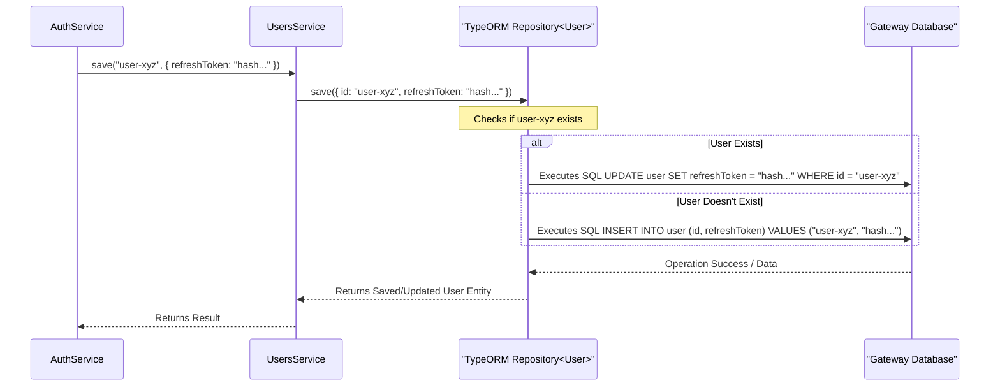

# Chapter 3: User Service & Entity

Welcome back! In [Chapter 2: Authentication & Authorization](02_authentication___authorization_.md), we learned how the `gateway` confirms *who* a user is and what they're allowed to do. We saw how users log in and get tokens to prove their identity.

But sometimes, the `gateway` needs to remember specific things about a user *for its own purposes*, separate from the information the main backend "engine" might store. For instance, how does the gateway remember if you've agreed to its Terms of Service? Or where does it securely keep track of the refresh token it gave you?

This is where the **User Service & Entity** come in.

## What's the Big Idea? (Motivation)

Think of the main backend engine as the central HR department – it knows your official employee details. The `gateway`, however, is like your local office branch. It needs its *own* small file or sticky note for each user to keep track of details relevant *only* to interacting with that specific branch.

The **User Service & Entity** provide this local "sticky note" system.

*   **Use Case:** When you log in (as seen in Chapter 2), the `AuthService` generates a long-lived `refreshToken`. This token allows you to get new `accessToken`s without re-entering your password. The `gateway` needs a secure place to store information related to this `refreshToken` (like a scrambled version or "hash" of it) so it can verify it later. The `UsersService` and `User` entity provide this storage within the gateway's own database.

Our goal is to understand how the `gateway` stores and manages this local, user-specific information.

## Key Ingredients (Core Concepts)

1.  **`User` Entity (`user.model.ts`): The Sticky Note Blueprint**
    *   This is a TypeScript class that defines the *structure* of the user information the `gateway` stores *locally* in its own database. Think of it as the template for those sticky notes.
    *   It includes fields important *to the gateway*, such as:
        *   `id`: The unique identifier for the user (often the same ID used in the engine or authentication system).
        *   `agreeNDA`: A boolean (true/false) flag indicating if the user has agreed to the Non-Disclosure Agreement or Terms of Service presented by the gateway.
        *   `refreshToken`: A field to store a *hash* (a scrambled, secure version) of the user's current refresh token. We store a hash, not the token itself, for security.
    *   It's decorated with `@Entity()` from a library called TypeORM, telling the gateway that this class corresponds to a table in its database.

    ```typescript
    // File: api/src/users/models/user.model.ts (Simplified)
    import { Field, ObjectType } from '@nestjs/graphql';
    import { Entity, PrimaryColumn, Column } from 'typeorm'; // Database mapping decorators

    @Entity({ name: 'user' }) // Tells TypeORM this class maps to a 'user' table
    @ObjectType() // Makes it available in GraphQL (as seen in Chapter 1)
    export class User {
      @PrimaryColumn() // Marks 'id' as the primary key in the database table
      @Field() // Exposes 'id' in the GraphQL API
      id: string;

      // Other fields like username, fullname, email might be populated
      // from the authentication process but are not the primary focus
      // for *local* storage, except for display or context.
      @Field()
      username: string; // Usually needed for context

      // --- Gateway-Specific Fields ---
      @Column({ nullable: true, default: false }) // Marks 'agreeNDA' as a database column
      @Field({ nullable: true }) // Exposes 'agreeNDA' in GraphQL
      agreeNDA?: boolean; // Has the user agreed to the terms?

      @Column({ nullable: true }) // Marks 'refreshToken' as a database column
      refreshToken?: string; // Stores the HASH of the refresh token
    }
    ```
    *Explanation:* This code defines the `User` entity. Decorators like `@Entity`, `@PrimaryColumn`, and `@Column` tell TypeORM how to map this class to a database table named `user`. Fields like `agreeNDA` and `refreshToken` store data specific to the gateway's operation.

2.  **`UsersService` (`users.service.ts`): The Sticky Note Manager**
    *   This service acts as the manager or librarian for the gateway's local user data. It knows how to interact with the database (via TypeORM) to handle `User` entity records.
    *   Its main jobs include:
        *   `findOne(id)`: Find a specific user's record in the gateway database by their ID.
        *   `update(id, data)`: Update specific fields (like `agreeNDA` or `refreshToken`) for an existing user record.
        *   `save(id, data)`: A convenient method that either creates a *new* user record in the gateway database if one doesn't exist for that `id`, or updates the existing one if it does. This is often used when a user logs in for the first time via the gateway.
    *   Other parts of the gateway (like `AuthService` or `UsersResolver`) use `UsersService` whenever they need to read or write this gateway-specific user data.

3.  **Gateway Database (Implicit): The Filing Cabinet**
    *   The `User` entity data needs to be stored persistently somewhere. The `gateway` project uses TypeORM, which connects to a database (like PostgreSQL, SQLite, etc., depending on configuration). The `User` entity maps to a table (e.g., `user`) in this database. This chapter focuses on the *service* and *entity*, not the database setup itself.

## How It's Used (Storing Refresh Token Hash Example)

Let's revisit the login process from [Chapter 2: Authentication & Authorization](02_authentication___authorization_.md). Remember how `AuthService.login` generated both an `accessToken` and a `refreshToken`?

1.  **Token Generation:** `AuthService` creates the `refreshToken`.
2.  **Hashing:** For security, `AuthService` creates a *hash* (a secure, one-way scramble) of this `refreshToken`. Let's say the hash is `"aBcDeF12345..."`.
3.  **Storing the Hash:** `AuthService` needs to associate this hash with the logged-in user (let's say their ID is `user-xyz`). It calls the `UsersService` to do this:

    ```typescript
    // Inside AuthService (Conceptual Example)
    import { UsersService } from '../users/users.service';
    import { User } from '../users/models/user.model';
    import * as hashing from 'object-hash'; // Assume a hashing library

    // ... inside the login method, after getting the user object ...
    const user: User = /* ... user object from validation ... */;
    const rawRefreshToken = /* ... newly generated refresh token ... */;

    // 1. Create a hash of the refresh token
    const refreshTokenHash = hashing(rawRefreshToken); // e.g., "aBcDeF12345..."

    // 2. Use UsersService to save/update the hash in the gateway's DB
    //    'save' is useful as it handles both new and existing users in the local DB.
    await this.usersService.save(user.id, { refreshToken: refreshTokenHash });

    // 3. Return the raw tokens to the client
    // return { accessToken, refreshToken: rawRefreshToken };
    ```
    *Explanation:* The `AuthService` uses the injected `UsersService`'s `save` method. It passes the user's `id` and an object containing the field to update (`refreshToken`) with its new value (the hash). `UsersService` then takes care of writing this to the gateway's database.

Later, when the user tries to *refresh* their `accessToken` using the `refreshToken`, the gateway will:
1.  Receive the raw `refreshToken` from the user.
2.  Hash the *received* token using the same hashing method.
3.  Use `UsersService.findOne(userId)` to retrieve the *stored* hash from the database.
4.  Compare the newly computed hash with the stored hash. If they match, the refresh token is valid!

## A Peek Inside the Filing System (Internal Implementation)

What happens when `AuthService` calls `usersService.save(userId, { refreshToken: hash })`?

**High-Level Steps:**

1.  **Call Received:** `UsersService.save` method is invoked with the user ID and the data payload (`{ refreshToken: '...' }`).
2.  **Database Interaction:** `UsersService` uses its injected TypeORM `Repository` for the `User` entity. The `Repository` is like a specialized tool provided by TypeORM to work with the `user` table.
3.  **Save Operation:** The `save` method of the TypeORM repository is called. TypeORM is smart:
    *   It checks if a row with the given `id` already exists in the `user` table.
    *   If it exists, TypeORM generates an SQL `UPDATE` statement to change the `refreshToken` column for that specific user row.
    *   If it *doesn't* exist, TypeORM generates an SQL `INSERT` statement to create a *new* row for this user ID, populating the `id` and `refreshToken` columns.
4.  **Database Execution:** TypeORM sends the appropriate SQL command (INSERT or UPDATE) to the connected database.
5.  **Result:** The database performs the operation. TypeORM returns the saved/updated `User` entity (or information about the operation) back to `UsersService`, which then returns it to the original caller (`AuthService`).

**Visualizing the Flow (Sequence Diagram):**



**Code Snippets Deep Dive:**

*   **Connecting Entity & Service (`users.module.ts`):** This module wires things up.

    ```typescript
    // File: api/src/users/users.module.ts (Simplified)
    import { Module } from '@nestjs/common';
    import { TypeOrmModule } from '@nestjs/typeorm'; // Import TypeOrm integration
    import { User } from './models/user.model'; // Import the entity
    import { UsersResolver } from './users.resolver';
    import { UsersService } from './users.service'; // Import the service

    @Module({
      imports: [
        // This line tells TypeORM about the User entity
        // and makes its Repository available for injection.
        TypeOrmModule.forFeature([User]),
      ],
      providers: [
        UsersResolver, // The GraphQL part (uses UsersService)
        UsersService,  // The service itself
      ],
      exports: [UsersService], // Make UsersService available to other modules (like AuthModule)
    })
    export class UsersModule {}
    ```
    *Explanation:* `TypeOrmModule.forFeature([User])` is key. It registers the `User` entity with TypeORM, allowing `UsersService` to request the `Repository` for it. `exports: [UsersService]` allows `AuthModule` to import `UsersModule` and use `UsersService`.

*   **The Service Implementation (`users.service.ts`):**

    ```typescript
    // File: api/src/users/users.service.ts (Simplified)
    import { Injectable, NotFoundException } from '@nestjs/common';
    import { InjectRepository } from '@nestjs/typeorm'; // Decorator to inject the Repository
    import { Repository } from 'typeorm'; // TypeORM Repository class
    import { User } from './models/user.model';

    // Define the type for data used in updates/saves
    export type UserDataUpdate = Partial<Pick<User, 'agreeNDA' | 'refreshToken'>>;

    @Injectable()
    export class UsersService {
      // Inject the TypeORM Repository for the User entity
      constructor(
        @InjectRepository(User)
        private readonly userRepository: Repository<User>,
      ) {}

      // Find one user by ID
      async findOne(id: string): Promise<User> {
        const user = await this.userRepository.findOneBy({ id }); // Find by primary key
        if (!user) {
          throw new NotFoundException(`User ${id} not found in gateway DB.`);
        }
        return user;
      }

      // Update existing user data
      async update(id: string, data: UserDataUpdate): Promise<void> {
         // 'update' just sends the update command, doesn't return the full entity
         await this.userRepository.update({ id }, data);
      }

      // Save (Insert or Update) user data
      async save(id: string, data: UserDataUpdate): Promise<User> {
        const userData = { id, ...data }; // Combine id and data
        // 'save' handles insert/update and returns the resulting entity
        return this.userRepository.save(userData);
      }
    }
    ```
    *Explanation:* `@InjectRepository(User)` tells NestJS to inject the TypeORM `Repository` specifically for our `User` entity. The methods (`findOne`, `update`, `save`) then use this `userRepository` object to interact with the database table corresponding to the `User` entity.

## Conclusion

You've learned about the **User Service & Entity**, the gateway's mechanism for managing its *own* local "sticky notes" about users.

*   The **`User` Entity (`user.model.ts`)** defines the structure of this local data (like `agreeNDA`, `refreshToken` hash).
*   The **`UsersService` (`users.service.ts`)** provides methods (`findOne`, `update`, `save`) to interact with the gateway's database for these user records.
*   This local storage is distinct from the main engine's user data and is crucial for gateway-specific functions like managing refresh tokens or tracking user agreements.

Now that we understand how the gateway identifies users ([Authentication & Authorization](02_authentication___authorization_.md)) and stores specific details about them locally, we can move on to one of the core functions: managing scientific experiments.

**Next Up:** Let's explore how the gateway handles creating, finding, and managing experiments in [Chapter 4: Experiment Management](04_experiment_management_.md).

---

Generated by [AI Codebase Knowledge Builder](https://github.com/The-Pocket/Tutorial-Codebase-Knowledge)