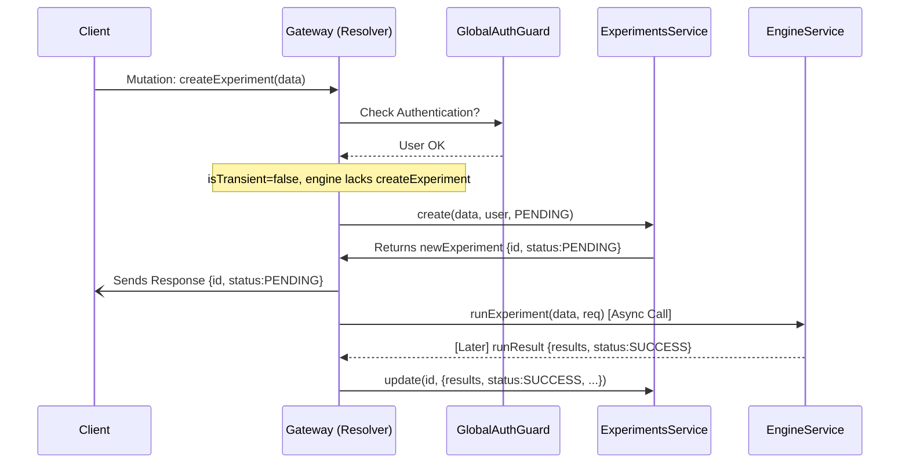

# Chapter 4: Experiment Management

Welcome back! In [Chapter 3: User Service & Entity](03_user_service___entity_.md), we saw how the `gateway` can keep track of its own information about users, like storing a secure hash of their refresh token. Now, let's get to the core scientific purpose of the `gateway`: managing computational tasks, which we call **Experiments**.

## What's the Big Idea? (Motivation)

Imagine you're a scientist using a web platform powered by our `gateway`. You want to run an analysis – maybe compare two different treatments using a specific statistical method on a particular dataset. How do you tell the system:

*   *What* analysis to run (e.g., T-test)?
*   *Which* data to use (e.g., `patient_data_v2.csv`)?
*   *What* parameters to use for the analysis?
*   And later, how do you *check* if it finished and *see* the results?

This whole process of defining, running, tracking, and retrieving these computational tasks is handled by **Experiment Management**. Think of it as your digital lab notebook combined with a remote control for running the actual computations.

Our main goal here is to understand how a user can **define and start a new experiment** through the `gateway`.

## Key Ingredients (Core Concepts)

1.  **Experiment:** The central idea. An "Experiment" represents a single computational task. It holds all the information about the task:
    *   What you named it (e.g., "Initial Diabetes Treatment Comparison").
    *   What data it uses (`datasets`, `variables`).
    *   What algorithm or analysis was performed (`algorithm`).
    *   Any specific settings (`parameters`, `formula`).
    *   Who ran it (`author`).
    *   Its current status (`status`: PENDING, SUCCESS, ERROR).
    *   The results, once it's finished (`results`).
    *   You'll learn more about the detailed structure in [Chapter 7: Core Data Models](07_core_data_models_.md).

2.  **`ExperimentCreateInput` (GraphQL Input Type): The Order Form**
    *   When you want to create a *new* experiment, you need to provide all the details. This GraphQL Input Type defines the structure of the information you must send to the `gateway`. It's like filling out an order form for your analysis. (See Chapter 1 for Input Types).

    ```graphql
    # Simplified view of what the client sends
    input ExperimentCreateInput {
      name: String!           # You must give it a name
      datasets: [String!]!    # Which datasets to use
      variables: [String!]!   # Which variables from the datasets
      algorithm: AlgorithmInput! # What analysis to run and its parameters
      # ... other fields like domain, coVariables, filters ...
    }

    input AlgorithmInput {
      id: String!             # Name/ID of the algorithm (e.g., "ttest")
      parameters: [ParameterInput!] # Specific settings for the algorithm
    }

    input ParameterInput {
      id: String!             # Parameter name (e.g., "alpha_level")
      value: String!          # Parameter value (e.g., "0.05")
    }
    ```
    *Explanation:* This defines the "shape" of data the client must send when calling the `createExperiment` mutation. It requires a name, datasets, variables, and details about the algorithm and its parameters.

3.  **`ExperimentsResolver` (GraphQL Resolver): The Control Panel**
    *   This is the part of the [GraphQL API Layer](01_graphql_api_layer_.md) that handles all requests related to experiments. It's like the main control panel in your digital lab. It has buttons (mutations) for:
        *   `createExperiment`: Start a new experiment.
        *   `editExperiment`: Change details of an existing experiment (if allowed).
        *   `removeExperiment`: Delete an experiment.
    *   It also has displays (queries) for:
        *   `experimentList`: Show a list of your past experiments.
        *   `experiment`: Show the detailed status and results of one specific experiment.

4.  **`ExperimentsService` (Local Management): The Gateway's Lab Notebook**
    *   Sometimes, the `gateway` needs to manage the experiment's lifecycle *itself*, especially if the backend engine doesn't keep a long-term record.
    *   `ExperimentsService` interacts with the gateway's *own database* (using the `Experiment` entity, similar to how `UsersService` uses the `User` entity from Chapter 3).
    *   It can:
        *   `create`: Save the initial details of a new experiment in the gateway's database with a status like `PENDING`.
        *   `update`: Update the status and save the results once the computation is done.
        *   `findAll`: Retrieve the list of experiments stored locally.
        *   `findOne`: Get details of one specific locally stored experiment.

5.  **`EngineService` (Execution & Potential Management): The Core Lab Equipment**
    *   This service acts as the bridge to the actual computational backend (the "engine"). You'll learn more about this in [Chapter 5: Engine & Connectors](05_engine___connectors_.md).
    *   For Experiment Management, `EngineService` is crucial because it might:
        *   `createExperiment`: If the backend engine is sophisticated, it might handle the creation and tracking entirely. The gateway just tells it what to do.
        *   `runExperiment`: This method *always* triggers the actual computation on the backend engine. It might return results immediately (for simple tasks) or just acknowledge that the task has started.

**Two Main Approaches:** How an experiment is managed depends on the connected backend engine's features:

*   **Engine-Managed:** The backend engine handles everything. The `gateway`'s `ExperimentsResolver` mainly calls methods like `engineService.createExperiment` and `engineService.getExperiment`. The gateway doesn't store much locally.
*   **Gateway-Managed (using `ExperimentsService`):** The engine might only *run* the computation (`engineService.runExperiment`). The `gateway` uses `ExperimentsService` to store the experiment's definition, track its status (e.g., PENDING -> SUCCESS/ERROR), and store the final results in its own database.

## How to Use It (Creating a New Experiment Example)

Let's imagine a user wants to run a T-test named "Drug A vs Placebo" using the "clinical_trials" dataset and the "response_level" variable.

1.  **Prepare the "Order" (GraphQL Mutation & Input):** The client application (e.g., a web UI) constructs the `createExperiment` mutation, filling in the details using the `ExperimentCreateInput` structure.

    ```graphql
    # GraphQL Mutation sent by the client
    mutation StartMyAnalysis($details: ExperimentCreateInput!) {
      createExperiment(data: $details) { # Call the mutation
        id      # Ask for the ID of the newly created experiment
        name    # Ask for its name
        status  # Ask for its initial status
      }
    }
    ```

    ```json
    // Variables sent with the mutation
    {
      "details": {
        "name": "Drug A vs Placebo",
        "datasets": ["clinical_trials"],
        "variables": ["response_level"],
        "domain": "medical_studies", // Which area of data
        "algorithm": {
          "id": "ttest",
          "parameters": [
            { "id": "grouping_variable", "value": "treatment_group" },
            { "id": "alternative", "value": "two.sided" }
          ]
        }
        // Other fields omitted for brevity
      }
    }
    ```

2.  **Send the Request:** The client sends the mutation and variables to the `gateway`'s `/graphql` endpoint.

3.  **Receive Initial Confirmation (Output):** The `gateway` processes the request. What happens next depends on the configuration (Engine-Managed vs. Gateway-Managed) and whether the experiment is meant to be "transient" (quick calculation, no saving) or persistent. Let's assume the **Gateway-Managed (Persistent)** approach for this example:

    *   The `gateway` immediately saves a record of the experiment in its database via `ExperimentsService` with a status of `PENDING`.
    *   It *simultaneously* tells the `EngineService` to start the actual T-test computation in the background.
    *   The `gateway` sends a response back to the client *right away*, confirming the experiment has been created and is pending.

    ```json
    // Example JSON Response received by the client
    {
      "data": {
        "createExperiment": {
          "id": "exp-uuid-12345", // A unique ID generated by the gateway
          "name": "Drug A vs Placebo",
          "status": "PENDING" // The experiment is created but not finished yet
        }
      }
    }
    ```

*What happens next?* The user's web UI might show "Experiment 'Drug A vs Placebo' is running...". The client can later use the returned `id` ("exp-uuid-12345") to query the `experiment(id: "...")` endpoint to check the status again and retrieve the results once the status changes to `SUCCESS` or `ERROR`.

## A Peek Inside the Lab (Internal Implementation - Gateway-Managed Persistent)

Let's trace the **Gateway-Managed (Persistent)** flow when the `createExperiment` mutation arrives:

**High-Level Steps:**

1.  **Request Arrives:** Gateway receives the GraphQL mutation `createExperiment` with the `ExperimentCreateInput` data.
2.  **Routing & Guards:** The request is routed to the `ExperimentsResolver.createExperiment` method. The `GlobalAuthGuard` ([Chapter 2: Authentication & Authorization](02_authentication___authorization_.md)) runs first to ensure the user is logged in. The `@CurrentUser()` decorator provides the user object.
3.  **Resolver Logic:** The `createExperiment` method in `ExperimentsResolver` checks its configuration. Since we're assuming a Gateway-Managed (Persistent) setup:
    *   It sees that `engineService` doesn't have a dedicated `createExperiment` method.
    *   It sees the `isTransient` argument is `false` (the default).
4.  **Local Creation (Sync):** It calls `this.experimentService.create(data, user, ExperimentStatus.PENDING)`.
5.  **Database Save:** `ExperimentsService` uses its TypeORM repository to create a new `Experiment` record in the gateway's database with the provided details and status `PENDING`. It returns the newly created experiment object (with its generated ID).
6.  **Background Execution (Async):** The resolver *immediately* after step 4 also calls `this.engineService.runExperiment(data, req)`. This call happens *asynchronously* (doesn't block the response). `EngineService` sends the task to the backend engine.
7.  **Immediate Response:** The resolver returns the experiment object it got from `experimentService.create` (from step 5) back to the GraphQL layer. The gateway sends the JSON response (like the one shown above) to the client.
8.  **Background Update (Later):** When the `engineService.runExperiment` call eventually finishes (could be seconds or minutes later), it returns the results and final status (e.g., `SUCCESS` or `ERROR`). The callback logic within the resolver then calls `this.experimentService.update(experiment.id, { ...results, status: finalStatus, finishedAt: now }, user)` to save the results and update the status in the gateway's database.

**Visualizing the Flow (Sequence Diagram):**


*Explanation:* The client gets a response quickly after the experiment is saved locally (`ESvc.create`). The actual computation (`EngSvc.runExperiment`) and the final update (`ESvc.update`) happen in the background.

**Code Snippets Deep Dive:**

*   **The Resolver Method (`experiments.resolver.ts`):**

    ```typescript
    // File: api/src/experiments/experiments.resolver.ts (Simplified)
    import { Args, Mutation, Query, Resolver } from '@nestjs/graphql';
    import { Request } from 'express';
    import { UseGuards } from '@nestjs/common';
    import { GlobalAuthGuard } from '../auth/guards/global-auth.guard';
    import { CurrentUser } from '../common/decorators/user.decorator';
    import EngineService from '../engine/engine.service';
    import { Experiment, ExperimentStatus } from '../engine/models/experiment/experiment.model';
    import { User } from '../users/models/user.model';
    import { ExperimentsService } from './experiments.service'; // Local DB service
    import { ExperimentCreateInput } from './models/input/experiment-create.input';

    @UseGuards(GlobalAuthGuard) // Ensure user is logged in
    @Resolver()
    export class ExperimentsResolver {
      constructor(
        private readonly engineService: EngineService,
        private readonly experimentService: ExperimentsService,
      ) {}

      @Mutation(() => Experiment) // Defines the mutation
      async createExperiment(
        @GQLRequest() req: Request, // Access underlying request if needed by engine
        @CurrentUser() user: User,  // Get logged-in user (from Auth Guard)
        @Args('data') data: ExperimentCreateInput, // Get input from client
        @Args('isTransient', { /* ... */ defaultValue: false }) isTransient: boolean,
      ): Promise<Experiment> {

        // --- Gateway-Managed (Persistent) Path ---
        if (!this.engineService.has('createExperiment') && !isTransient) {
          // 1. Create experiment locally first (SYNC)
          const experiment = await this.experimentService.create(
            data,
            user,
            ExperimentStatus.PENDING, // Initial status
          );

          // 2. Start engine execution (ASYNC - using .then())
          this.engineService.runExperiment(data, req).then((runResult) => {
            // 3. Update local record when engine finishes (LATER)
            this.experimentService.update(
              experiment.id,
              { // Data to update
                results: runResult.results,
                status: runResult.status ?? ExperimentStatus.SUCCESS,
                finishedAt: new Date().toISOString(),
              },
              user,
            );
          });

          // 4. Return the initial PENDING experiment immediately (SYNC)
          return experiment;
        }

        // --- Other paths (Engine-Managed or Transient) ---
        // if (this.engineService.has('createExperiment')) { ... }
        // if (isTransient) { ... }

        // (Simplified - logic for other paths omitted)
        throw new Error('Configuration not handled in this example');
      }
      // ... other methods: experimentList, experiment, editExperiment, removeExperiment ...
    }
    ```
    *Explanation:* This shows the `createExperiment` mutation handler. It uses `@CurrentUser` to get the author, takes `ExperimentCreateInput` as `data`, and implements the Gateway-Managed Persistent flow: call `experimentService.create` first, then trigger `engineService.runExperiment` asynchronously using `.then()` for the callback, and return the initial pending experiment right away.

*   **Local Database Interaction (`experiments.service.ts`):**

    ```typescript
    // File: api/src/experiments/experiments.service.ts (Simplified)
    import { Injectable, NotFoundException } from '@nestjs/common';
    import { InjectRepository } from '@nestjs/typeorm';
    import { Repository } from 'typeorm'; // TypeORM tool for DB interaction
    import { Experiment, ExperimentStatus } from '../engine/models/experiment/experiment.model';
    import { User } from '../users/models/user.model';
    import { ExperimentCreateInput } from './models/input/experiment-create.input';
    import { ExperimentUpdateDto } from './dto/experiment-update.dto';

    @Injectable()
    export class ExperimentsService {
      constructor(
        @InjectRepository(Experiment) // Inject the DB repository for Experiment
        private readonly experimentRepository: Repository<Experiment>,
      ) {}

      // Method to prepare data for saving
      dataToExperiment(data: ExperimentCreateInput, user: User, status?: ExperimentStatus): Partial<Experiment> {
        return {
          // Map fields from Input to Entity structure
          name: data.name,
          datasets: data.datasets,
          variables: data.variables,
          domain: data.domain,
          algorithm: { /* Map algorithm data */ name: data.algorithm.id, /*...*/ },
          status: status, // Set initial status
          author: { username: user.username, fullname: user.fullname ?? user.username },
          createdAt: new Date().toISOString(),
          // ... other fields ...
        };
      }

      // Method called by Resolver to create initial record
      async create(data: ExperimentCreateInput, user: User, status: ExperimentStatus): Promise<Experiment> {
        const experimentData = this.dataToExperiment(data, user, status);
        // Use TypeORM repository to create an instance
        const experiment = this.experimentRepository.create(experimentData);
        // Save the instance to the database
        return this.experimentRepository.save(experiment);
      }

      // Method called later to update status and results
      async update(id: string, data: ExperimentUpdateDto, user: User): Promise<Experiment> {
        // First, ensure the experiment exists and user has access (simplified findOne)
        const experiment = await this.experimentRepository.findOneBy({ id, author: { username: user.username } });
        if (!experiment) throw new NotFoundException();

        // Use repository 'save' which handles updates if ID exists
        return this.experimentRepository.save({
          ...experiment, // Existing data
          ...data,      // New data (status, results, finishedAt)
          id,           // Ensure ID is passed for update
          updateAt: new Date().toISOString(),
        });
      }

      // ... findOne, findAll, remove methods ...
    }
    ```
    *Explanation:* This service handles the gateway's local database operations for experiments. `@InjectRepository(Experiment)` provides the tool (`experimentRepository`) to talk to the `experiment` table. The `create` method takes the input data, formats it using `dataToExperiment`, and uses `experimentRepository.create` and `experimentRepository.save` to store it. The `update` method finds the existing record and uses `experimentRepository.save` again (which intelligently updates the record) to store the results and final status.

## Conclusion

You've now explored **Experiment Management**, the heart of the `gateway`'s scientific functionality. You learned:

*   An **Experiment** represents a computational task with its definition, status, and results.
*   Users define experiments via GraphQL mutations (`createExperiment`) using structured input (`ExperimentCreateInput`).
*   The **`ExperimentsResolver`** handles these API requests.
*   Depending on the backend setup, experiments might be fully managed by the engine (`EngineService`) or tracked locally by the gateway using **`ExperimentsService`** and its own database.
*   We saw how a common flow involves creating a `PENDING` record locally, starting the computation asynchronously via `EngineService`, returning an immediate response, and updating the local record later when results are ready.

This chapter showed *how* experiments are initiated and tracked. But how does the `gateway` actually *talk* to the different possible backend systems (like Exareme or others) that perform the computations?

**Next Up:** Let's dive into the abstraction layer that allows the `gateway` to communicate with various computational backends in [Chapter 5: Engine & Connectors](05_engine___connectors_.md).

---

Generated by [AI Codebase Knowledge Builder](https://github.com/The-Pocket/Tutorial-Codebase-Knowledge)