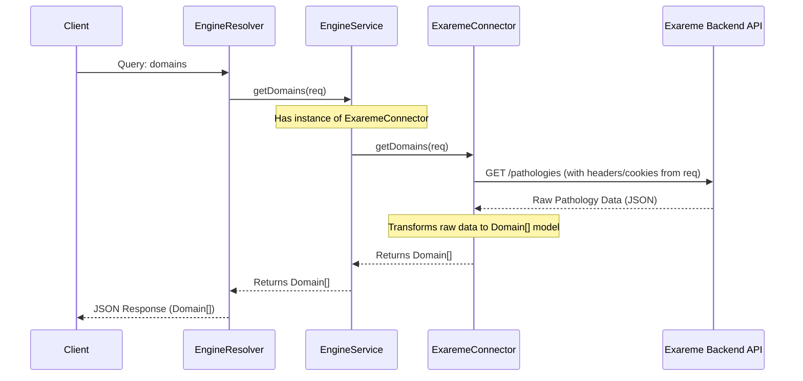

# Chapter 5: Engine & Connectors

Welcome back! In [Chapter 4: Experiment Management](04_experiment_management_.md), we saw how users can create and run computational tasks called "Experiments". We saw how the `ExperimentsResolver` often calls something called `EngineService` to actually *start* the computation or fetch experiment details.

But what *is* this `EngineService`? And how does the `gateway` talk to potentially very different backend systems (like Exareme, DataShield, or even just a local file) that actually perform the calculations or store the data?

That's where the **Engine & Connectors** concept comes in.

## What's the Big Idea? (Motivation)

Imagine you have several different devices in your living room: a TV made by Sony, a Blu-ray player made by Samsung, and a streaming box made by Roku. Each device understands different commands. How do you control them all without juggling three different remote controls?

You use a **universal remote**! You program the universal remote by telling it *what kind* of device it's talking to (Sony TV, Samsung Blu-ray, etc.). Once programmed, you use the *same buttons* on the universal remote (like "Power", "Volume Up", "Play") regardless of which device you're controlling. The remote takes care of sending the *correct* signal for that specific device.

The **Engine & Connectors** system in the `gateway` works exactly like this:

*   The **`EngineService`** is the **universal remote**. Other parts of the gateway (like the Resolvers we saw in [Chapter 1: GraphQL API Layer](01_graphql_api_layer_.md)) always talk to the `EngineService` using a standard set of commands.
*   Each **`Connector`** (like `ExaremeConnector`, `DataShieldConnector`, `CSVConnector`) is like a **device profile** for a specific backend computational system. It knows the unique language and quirks of *that specific system*.
*   When the gateway starts, it's configured to use *one* specific `Connector` (just like programming your remote for *your* TV).
*   The `EngineService` uses the currently loaded `Connector` to translate the standard gateway commands into the specific actions required by the backend.

**Use Case:** How does the `gateway` get the list of available datasets (called "Domains")? Whether the datasets are defined in an Exareme system, a DataShield setup, or even a simple CSV file, the rest of the gateway shouldn't care. It just asks the `EngineService` for the domains.

Our goal is to understand how this `EngineService` and `Connector` mechanism allows the gateway to flexibly interact with different backends.

## Key Ingredients (Core Concepts)

1.  **`EngineService` (`engine.service.ts`): The Universal Remote**
    *   This is the central point of contact for anything related to the backend computational engine.
    *   Resolvers (like `EngineResolver`, `ExperimentsResolver`) inject and use `EngineService`.
    *   It holds an instance of the currently active `Connector`.
    *   When a method like `getDomains()` is called on `EngineService`, it simply delegates the call to the *same method* on the active `Connector`.
    *   It acts as a **proxy** or **facade**, hiding the details of *which* connector is actually doing the work.

2.  **`Connector` (Conceptual) & Implementations: The Device Profiles**
    *   A `Connector` is a class specifically designed to communicate with *one type* of backend system.
    *   Examples in the `gateway` codebase:
        *   `ExaremeConnector` (`exareme.connector.ts`): Knows how to talk to the Exareme platform API.
        *   `DataShieldConnector` (`datashield.connector.ts`): Knows how to talk to a DataShield/Opal API.
        *   `CSVConnector` (`csv.connector.ts`): Knows how to read data definitions from a CSV file (often used for simpler setups or testing).
        *   `LocalConnector` (`local.connector.ts`): A basic connector, often used as a fallback or for very simple local operations.
    *   Each connector is responsible for:
        *   Making the necessary network requests (e.g., HTTP calls) or file reads for its specific backend.
        *   Translating the data received from the backend into the standard data models used *inside* the gateway (like the `Domain` or `Algorithm` models from [Chapter 7: Core Data Models](07_core_data_models_.md)).
        *   Handling authentication specifics for that backend if needed (e.g., passing specific tokens or cookies).

3.  **`Connector.interface.ts`: The Standard Buttons**
    *   This TypeScript interface defines the **standard set of methods** that *every* Connector *must* implement (or at least declare). It's the contract that the `EngineService` relies on.
    *   Think of it as defining the common buttons on the universal remote: `getDomains`, `getAlgorithms`, `runExperiment`, `getActiveUser`, `login`, `logout`, etc.
    *   By having all connectors adhere to this interface, the `EngineService` can confidently call `connector.getDomains()` knowing that the method exists, regardless of whether the connector is for Exareme, DataShield, or CSV.

    ```typescript
    // File: api/src/engine/interfaces/connector.interface.ts (Simplified)
    import { Request } from 'express';
    // ... other imports like Domain, Algorithm, Experiment ...

    // Defines the 'shape' or 'contract' for all connectors
    export default interface Connector {
      // Method to get the list of available datasets/domains
      getDomains(req?: Request): Promise<Domain[]>;

      // Method to get the list of available algorithms
      getAlgorithms(req?: Request): Promise<Algorithm[]>;

      // Method to run a computation (used if createExperiment isn't implemented)
      runExperiment?(data: ExperimentCreateInput, req?: Request): Promise<RunResult>;

      // Method to create a persistent experiment (used if runExperiment isn't)
      createExperiment?(data: ExperimentCreateInput, isTransient: boolean, req?: Request): Promise<Experiment>;

      // ... other methods like getExperiment, listExperiments, login, logout, getActiveUser ...
    }
    ```
    *Explanation:* This interface lists the functions (like `getDomains`) that any class wanting to be a `Connector` must provide. The `EngineService` uses this interface to know what functions it can call on its loaded connector.

4.  **Abstraction: The Big Benefit**
    *   This whole setup provides **abstraction**. The rest of the gateway code (Resolvers, other services) doesn't need to know or care about the specific details of Exareme's API versus DataShield's API.
    *   It makes the gateway **flexible**. To support a new backend system, you primarily need to create a new `Connector` implementation and configure the gateway to use it. You generally don't need to change the core `EngineService` or the Resolvers.

## How to Use It (Fetching Domains Example)

Let's look at the `domains` query in the `EngineResolver`.

1.  **The GraphQL Query:** A client sends a query to get the list of domains.

    ```graphql
    query GetAvailableDomains {
      domains { # The query name defined in EngineResolver
        id
        label
        datasets {
          id
          label
        }
      }
    }
    ```

2.  **Resolver Code:** The `EngineResolver` handles this query. Notice how it just calls `engineService.getDomains`. It has no idea *which* connector is active.

    ```typescript
    // File: api/src/engine/engine.resolver.ts (Simplified)
    import { Query, Resolver } from '@nestjs/graphql';
    import { Request } from 'express';
    import { GQLRequest } from '../common/decorators/gql-request.decoractor';
    import EngineService from './engine.service'; // Import the universal remote
    import { Domain } from './models/domain.model';

    @Resolver()
    export class EngineResolver {
      constructor(
        // NestJS dependency injection provides the configured EngineService
        private readonly engineService: EngineService,
      ) {}

      @Query(() => [Domain]) // Defines the GraphQL query
      async domains(
         @GQLRequest() req: Request // Get the request object, might be needed by connector
      ): Promise<Domain[]> {
        // Just call the universal remote's getDomains button!
        return this.engineService.getDomains(req);
      }

      // ... other queries like algorithms, configuration ...
    }
    ```
    *Explanation:* The `EngineResolver` simply uses the injected `EngineService` and calls its `getDomains` method. It doesn't need any `if (config === 'exareme')` logic.

3.  **The Result:** The `EngineService`, using its configured `Connector`, fetches the data from the *actual* backend, translates it into the standard `Domain[]` format, and returns it. The client receives a JSON response like:

    ```json
    {
      "data": {
        "domains": [
          {
            "id": "medical_studies:v1",
            "label": "Medical Studies v1",
            "datasets": [
              { "id": "clinical_trials_2023", "label": "Clinical Trials 2023" }
              // ... other datasets ...
            ]
          }
          // ... other domains ...
        ]
      }
    }
    ```

The beauty is that this flow works the same way whether the backend is Exareme, DataShield, or something else, thanks to the Engine & Connector abstraction.

## A Peek Inside the Remote Control (Internal Implementation)

How does the magic happen when `engineService.getDomains(req)` is called?

**High-Level Steps:**

1.  **Configuration:** When the `gateway` application starts, the `EngineModule` is configured (usually based on environment variables or config files) with the `type` of connector to use (e.g., 'exareme', 'datashield') and the `baseurl` for that backend's API.
2.  **Connector Instantiation:** Inside `EngineService`'s constructor, it dynamically imports and creates an instance of the *specific* connector class corresponding to the configured `type` (e.g., `new ExaremeConnector(...)`). This instance is stored internally (e.g., in `this.connector`).
3.  **Resolver Call:** The `EngineResolver` calls `engineService.getDomains(req)`.
4.  **Delegation:** The `EngineService.getDomains` method simply turns around and calls `this.connector.getDomains(req)`, passing the request object along.
5.  **Specific Connector Logic:** Now, the code inside the *specific* connector (e.g., `ExaremeConnector`) runs:
    *   It constructs the correct API request for *its* backend (e.g., an HTTP GET to `http://exareme-backend/pathologies`). It might need information from the `req` object, like authentication headers or cookies.
    *   It makes the network call using `HttpService`.
    *   It receives the raw response from the backend API (which might be in a unique format).
    *   It **transforms** this raw response into the standard `Domain[]` array structure defined by the `gateway` (using models from [Chapter 7: Core Data Models](07_core_data_models_.md)).
    *   It returns the transformed `Domain[]` array.
6.  **Return Value:** The `EngineService` receives the `Domain[]` array from the connector and returns it to the `EngineResolver`.
7.  **Response:** The `EngineResolver` returns the data, which is then formatted as JSON and sent back to the client.

**Visualizing the Flow (Sequence Diagram - Fetching Domains with Exareme):**



**Code Snippets Deep Dive:**

*   **Configuring the Engine (`engine.module.ts`):**

    ```typescript
    // File: api/src/engine/engine.module.ts (Simplified)
    import { HttpModule } from '@nestjs/axios';
    import { DynamicModule, Module } from '@nestjs/common';
    import { ENGINE_MODULE_OPTIONS } from './engine.constants';
    import EngineService from './engine.service';
    import EngineOptions from './interfaces/engine-options.interface';

    @Module({})
    export class EngineModule {
      // This static method allows configuring the engine when importing the module
      static forRoot(options?: Partial<EngineOptions>): DynamicModule {
        // 'options' contains { type: 'exareme', baseurl: 'http://...' }
        const optionsProvider = {
          provide: ENGINE_MODULE_OPTIONS, // A token to identify the options
          useValue: { // The actual options object
            ...options,
            type: options?.type.toLowerCase(), // Ensure type is lowercase
          },
        };

        return {
          global: true, // Makes EngineService available everywhere
          module: EngineModule,
          imports: [HttpModule], // Needed for making HTTP calls in connectors
          providers: [
            optionsProvider, // Make the options available for injection
            EngineService,   // The main service
            // EngineResolver is also usually here
          ],
          exports: [EngineService], // Allow other modules to import EngineService
        };
      }
    }
    ```
    *Explanation:* The `forRoot` method takes the configuration (`type` and `baseurl`) and makes it available via the `ENGINE_MODULE_OPTIONS` token. This allows `EngineService` to know which connector type it should load.

*   **Loading the Connector (`engine.service.ts` - Constructor):**

    ```typescript
    // File: api/src/engine/engine.service.ts (Simplified Constructor)
    import { HttpService } from '@nestjs/axios';
    import { Inject, Injectable, InternalServerErrorException } from '@nestjs/common';
    import { ENGINE_MODULE_OPTIONS } from './engine.constants';
    import Connector from './interfaces/connector.interface';
    import EngineOptions from './interfaces/engine-options.interface';

    @Injectable()
    export default class EngineService { // Implements Connector for proxying
      private connector: Connector; // Holds the loaded connector instance

      constructor(
        // Inject the options provided in EngineModule.forRoot
        @Inject(ENGINE_MODULE_OPTIONS) private readonly options: EngineOptions,
        // Inject HttpService to pass to connectors
        private readonly httpService: HttpService,
        // Inject CacheManager, ConfigService etc. (omitted for simplicity)
      ) {
        // Dynamically import the connector based on the configured 'type'
        // Example: options.type might be 'exareme'
        import(`./connectors/${options.type}/${options.type}.connector`)
          .then((connectorModule) => {
            // Create an instance of the imported connector class
            // Pass options, httpService, and 'this' (EngineService itself)
            const instance = new connectorModule.default(options, httpService, this);
            this.connector = instance; // Store the instance
          })
          .catch((err) => {
            throw new InternalServerErrorException(`Failed to load connector: ${options.type}`, err);
          });
      }
      // ... rest of the methods ...
    }
    ```
    *Explanation:* The constructor receives the `options` (telling it the `type` like 'exareme'). It uses a dynamic `import()` to load the code file for that specific connector (e.g., `connectors/exareme/exareme.connector.js`). It then creates an instance of the connector class found in that file and stores it in `this.connector`.

*   **Delegating the Call (`engine.service.ts` - `getDomains`):**

    ```typescript
    // File: api/src/engine/engine.service.ts (Simplified getDomains)
    import { Injectable } from '@nestjs/common';
    import { Request } from 'express';
    import Connector from './interfaces/connector.interface';
    import { Domain } from './models/domain.model';

    @Injectable()
    export default class EngineService implements Connector {
        private connector: Connector;
        // ... constructor ...

        async getDomains(req: Request): Promise<Domain[]> {
          // Check if connector is loaded and has the method (optional check)
          if (!this.connector || !this.connector.getDomains) {
              throw new Error('Connector not loaded or getDomains not implemented');
          }
          // Simply call the SAME method on the LOADED connector instance
          return this.connector.getDomains(req);
        }

        // Helper to check if a method exists on the loaded connector
        has(name: keyof Connector): boolean {
            return this.connector && this.connector[name] !== undefined;
        }

        // ... other methods delegate similarly (e.g., getAlgorithms, runExperiment) ...
    }
    ```
    *Explanation:* The `getDomains` method in `EngineService` is very simple. It just calls `this.connector.getDomains(req)`. All the hard work is done inside the specific connector's implementation. The `has` method is useful elsewhere (like in `ExperimentsResolver`) to check if the configured connector supports optional features (like `createExperiment` vs `runExperiment`).

*   **Connector Interface (`connector.interface.ts`):** (Shown earlier) - It ensures all connectors *have* a `getDomains` method signature.

*   **Specific Connector Implementation (`exareme.connector.ts` - Simplified `getDomains`):**

    ```typescript
    // File: api/src/engine/connectors/exareme/exareme.connector.ts (Simplified getDomains)
    import { HttpService } from '@nestjs/axios';
    import { Request } from 'express';
    import { firstValueFrom } from 'rxjs';
    import Connector from '../../../engine/interfaces/connector.interface';
    import EngineOptions from '../../../engine/interfaces/engine-options.interface';
    import { Domain } from '../../../engine/models/domain.model';
    import { Pathology } from './interfaces/pathology.interface'; // Exareme-specific raw data type
    // Import transformation functions (dataToGroup, dataToDataset etc.)

    export default class ExaremeConnector implements Connector {
      constructor(
        private readonly options: EngineOptions, // Gets baseurl etc.
        private readonly httpService: HttpService,
        // ... other dependencies
      ) {}

      async getDomains(request: Request): Promise<Domain[]> {
        // 1. Define the specific API endpoint for Exareme
        const path = this.options.baseurl + 'pathologies';
        const headers = { /* Extract relevant headers/cookies from request if needed */ };

        try {
          // 2. Make the HTTP GET request to the Exareme backend
          const response = await firstValueFrom(
            this.httpService.get<Pathology[]>(path, { headers: headers })
          );
          const rawPathologies = response.data; // Raw data from Exareme

          // 3. Transform Exareme's raw 'Pathology[]' into gateway's 'Domain[]'
          const domains: Domain[] = rawPathologies.map((p) => {
            // ... complex transformation logic using dataToGroup, dataToVariable etc. ...
            // (Simplified for brevity)
            return {
              id: `${p.code}:${p.version}`,
              label: p.description || p.code,
              version: p.version,
              datasets: p.datasets?.map(/* dataToDataset */) ?? [],
              variables: this.flattenVariables(p.metadataHierarchy, /*...*/),
              groups: this.flattenGroups(p.metadataHierarchy),
              rootGroup: /* dataToGroup */(p.metadataHierarchy),
              // ... other Domain fields
            };
          });

          return domains; // Return the standard Domain[] array
        } catch (error) {
          // Handle errors appropriately
          console.error("Error fetching domains from Exareme:", error);
          throw error;
        }
      }

      // Helper methods like flattenVariables, flattenGroups (omitted)

      // ... other required methods: getAlgorithms, runExperiment/createExperiment etc. ...
    }
    ```
    *Explanation:* This shows the `getDomains` implementation *specific* to Exareme. It knows the correct API path (`/pathologies`), makes the HTTP call, gets the raw `Pathology[]` data, and then performs the crucial step of **transforming** that specific data structure into the standard `Domain[]` structure that the rest of the `gateway` expects.

*   **Another Connector (`datashield.connector.ts` - Simplified `getDomains`):**

    ```typescript
    // File: api/src/engine/connectors/datashield/datashield.connector.ts (Conceptual getDomains)

    // ... imports ...
    import { transformToDomain, dataToGroups } from './transformations'; // DataShield specific transformations

    export default class DataShieldConnector implements Connector {
      // ... constructor ...

      async getDomains(request: Request): Promise<Domain[]> {
        // 1. Get user session info (e.g., SID cookie) needed for DataShield API
        const user = request.user as User;
        const cookie = /* Construct cookie string from user.extraFields['sid'] */;

        // 2. Define the specific API endpoint for DataShield
        const path = this.options.baseurl + 'getvars'; // Different endpoint!

        // 3. Make the HTTP GET request with the required cookie
        const response = await firstValueFrom(
            this.httpService.get(path, { headers: { cookie } })
        );
        const rawData = response.data; // Raw data might be different shape

        // 4. Transform DataShield's raw data into gateway's 'Domain[]'
        // Uses DIFFERENT transformation functions specific to DataShield!
        const dsDomain = transformToDomain.evaluate(rawData);
        dataToGroups(dsDomain, rawData['groups']); // More transformation

        return [dsDomain]; // Return the standard Domain[] array
      }

      // ... other methods ...
    }

    ```
    *Explanation:* Notice how the DataShield connector uses a *different* API endpoint (`/getvars`), requires specific authentication (cookies), and uses *different* transformation logic (`transformToDomain`, `dataToGroups`) to achieve the *same goal*: returning a standard `Domain[]` array. This highlights the power of the connector abstraction.

## Conclusion

You've now learned about the **Engine & Connectors** system, the gateway's clever way of talking to diverse backend systems.

*   The **`EngineService`** acts as a central **universal remote**, providing a consistent interface to the rest of the gateway.
*   **Connectors** (`ExaremeConnector`, `DataShieldConnector`, etc.) act as **device profiles**, containing the specific logic to interact with a particular backend API.
*   The **`Connector.interface.ts`** defines the standard set of **buttons** (methods) that the `EngineService` expects every connector to have.
*   This **abstraction** makes the gateway flexible and easier to extend – supporting a new backend mainly involves writing a new connector.

We saw how fetching domains (`engineService.getDomains()`) works seamlessly regardless of the backend, because the complexity is hidden within the specific connector's implementation.

These connectors often receive complex results from the backend engines. How are these varied results handled and presented consistently through the API?

**Next Up:** Let's explore how connectors deal with different kinds of computational results in [Chapter 6: Result Handlers (Engine Connectors)](06_result_handlers__engine_connectors__.md).

---

Generated by [AI Codebase Knowledge Builder](https://github.com/The-Pocket/Tutorial-Codebase-Knowledge)