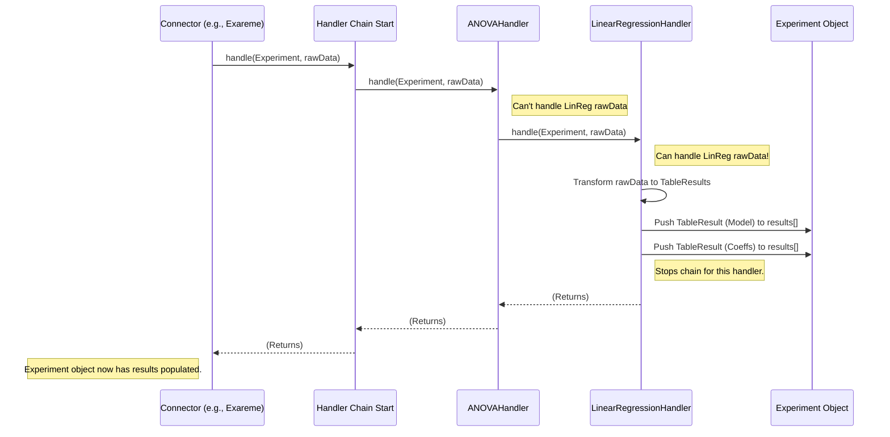

# Chapter 6: Result Handlers (Engine Connectors)

Welcome back! In [Chapter 5: Engine & Connectors](05_engine___connectors_.md), we saw how the `EngineService` acts like a universal remote, using specific `Connectors` (like `ExaremeConnector` or `DataShieldConnector`) to talk to different backend computational systems.

Now, imagine one of those backend systems (like Exareme) finishes running a statistical analysis (an Experiment) and sends back the results. Great! But... what format are those results in? Exareme might send a complex JSON structure specific to its internal workings. DataShield might send something completely different for the *same* type of analysis! How can our frontend web application possibly understand all these different formats? It needs data in a consistent, predictable structure.

This is the problem that **Result Handlers** solve.

## What's the Big Idea? (Motivation)

Think of the raw results coming back from a backend engine like a scientific paper written in a highly specialized, technical language (Exareme-ese or DataShield-ian). The frontend application, however, only understands a few standard formats, like simple tables, heatmaps, or alert messages.

**Result Handlers** act as **expert translators** living *inside* each specific [Engine Connector](05_engine___connectors_.md). Their job is to:

1.  **Inspect** the raw, technical results coming from *their specific* backend engine.
2.  **Translate** these results into one of the standardized formats the frontend understands.

**Use Case:** A user runs a Linear Regression analysis using the Exareme backend. Exareme returns a complicated JSON object containing coefficients, statistics, p-values, etc., all nested in its own unique way. The `ExaremeConnector` receives this raw JSON. It then uses its internal Result Handlers. One handler recognizes "Ah, this looks like the raw output for Linear Regression from Exareme!" It then extracts the relevant numbers and transforms them into a standard `TableResult` format that the frontend knows how to display neatly.

Our goal is to understand how these handlers, working inside the connectors, ensure consistent result structures for the rest of the gateway and the frontend.

## Key Ingredients (Core Concepts)

1.  **Raw Backend Output:** The data exactly as it comes from the computational engine (e.g., Exareme API, DataShield API). This format is often complex and specific to that engine.

2.  **GraphQL `ResultUnion`:** As we saw briefly in [Chapter 1: GraphQL API Layer](01_graphql_api_layer_.md), this is a special GraphQL type representing the **standardized formats** the frontend expects. It's a collection of possible result types, such as:
    *   `TableResult`: For displaying data in rows and columns.
    *   `HeatMapResult`: For displaying matrix data visually.
    *   `AlertResult`: For showing simple messages, warnings, or errors.
    *   `RawResult`: A fallback for data that doesn't fit other types.
    *   *(... and others like `BarChartResult`, `LineChartResult`, etc.)*

    ```typescript
    // File: api/src/engine/models/result/common/result-union.model.ts (Conceptual)
    // Remember this from Chapter 1? It bundles the standard result types.
    export const ResultUnion = createUnionType({
      name: 'ResultUnion',
      // Lists all possible standard result types
      types: () => [
        TableResult,
        HeatMapResult,
        AlertResult,
        RawResult,
        // ... other types
      ],
      // Logic to tell GraphQL which specific type a result object is
      resolveType(value) {
        if (value.headers) return TableResult; // If it has headers, it's a table
        if (value.matrix) return HeatMapResult; // If it has a matrix, it's a heatmap
        if (value.message) return AlertResult; // If it has a message, it's an alert
        // ... other checks ...
        return RawResult; // Otherwise, treat it as raw data
      },
    });
    ```
    *Explanation:* `ResultUnion` acts as the "dictionary" of standard formats the translators (Result Handlers) aim to produce.

3.  **Result Handlers (`handler.ts` files): The Translators**
    *   These are classes located *within* specific connectors (e.g., `api/src/engine/connectors/exareme/handlers/`).
    *   Each handler is usually specialized in translating the raw output of *one specific algorithm* (like Linear Regression) or *one specific type* of result (like detecting errors) *for that particular backend*.
    *   Example Handlers:
        *   `ExaremeConnector` might have `LinearRegressionHandler`, `ANOVAHandler`, `ErrorHandler`.
        *   `DataShieldConnector` might have its *own* `DescriptiveHandler`, `LinearRegressionHandler`, etc., because DataShield's raw output is different from Exareme's.

4.  **Chain of Responsibility Pattern (`BaseHandler`, `setNext`): The Assembly Line**
    *   How does the connector know which handler to use for a given raw result? It uses a common design pattern called the **Chain of Responsibility**.
    *   Imagine an assembly line for translations:
        *   The raw result arrives at the start of the line.
        *   The first translator (handler) looks at it. "Can I translate this specific type of result (e.g., Exareme Linear Regression)?"
        *   If yes, they translate it into a standard `ResultUnion` type (like `TableResult`) and add it to the final package. They might then stop, or pass the *original* raw result down the line in case other handlers can extract *additional* information (like warnings).
        *   If no, they pass the raw result untouched to the *next* translator in line.
        *   This continues until a handler processes the result, or it reaches the end of the line (where a default handler, like `RawHandler`, might just package the raw data as-is).
    *   This is implemented using:
        *   A `BaseHandler` class that provides a `next` property (pointing to the next handler) and a `setNext` method to link handlers together.
        *   Each specific handler implementing a `handle` method containing the logic: check if I can handle it -> if yes, process -> if no, call `this.next.handle(...)`.

## How It's Used (Connector's Internal Process)

You, as a developer working on the main GraphQL resolvers or services, generally **don't interact directly** with Result Handlers. They are an internal implementation detail hidden *inside* the Connectors from [Chapter 5: Engine & Connectors](05_engine___connectors_.md).

Here's the effect you see:

1.  You call a method on `EngineService`, like `engineService.runExperiment(...)` or `engineService.getExperiment(...)`.
2.  The `EngineService` delegates to the active connector (e.g., `ExaremeConnector`).
3.  The connector communicates with the backend engine and gets the raw results.
4.  **Internally**, the connector uses its chain of Result Handlers to process these raw results.
5.  The connector returns an `Experiment` object (see [Chapter 7: Core Data Models](07_core_data_models_.md)).
6.  Crucially, the `experiment.results` array within that object is now populated with instances of the standardized `ResultUnion` types (`TableResult`, `HeatMapResult`, etc.), thanks to the handlers.

The frontend can then confidently receive this `Experiment` object via the GraphQL API and know how to display the items in the `results` array because they adhere to the predefined `ResultUnion` structures.

## A Peek Inside the Translation Office (Internal Implementation)

Let's trace what happens inside a connector (e.g., `ExaremeConnector`) when it receives raw results for a finished Linear Regression experiment.

**High-Level Steps:**

1.  **Raw Results Received:** The `ExaremeConnector` gets a raw JSON object from the Exareme API.
2.  **Prepare Experiment Object:** It fetches or uses the existing `Experiment` object associated with this computation. This object has an initially empty `results` array.
3.  **Start the Chain:** The connector calls the `handle` method of the *first* handler in its pre-configured chain, passing the `Experiment` object and the `rawData`.
4.  **Handler 1 Check (e.g., `ANOVAHandler`):** `ANOVAHandler.handle(experiment, rawData)` runs. It checks if the `experiment.algorithm.name` is 'ANOVA' or if `rawData` matches the ANOVA structure. Let's say it doesn't match Linear Regression. It calls `this.next.handle(experiment, rawData)`.
5.  **Handler 2 Check (e.g., `LinearRegressionHandler`):** `LinearRegressionHandler.handle(experiment, rawData)` runs.
    *   It checks: `experiment.algorithm.name === 'linear_regression'`? Yes.
    *   It checks: Does `rawData` have the expected fields for Exareme's linear regression output (like `rse`, `f_stat`)? Yes.
    *   **Match!** It proceeds to translate.
6.  **Translation:** The `LinearRegressionHandler` extracts data from the raw JSON and creates *new* objects conforming to the standard structures:
    *   Creates a `TableResult` object for the model summary.
    *   Creates another `TableResult` object for the coefficients.
7.  **Add to Results:** It pushes these `TableResult` objects into the `experiment.results` array.
8.  **Continue or Stop?** The handler might decide to stop the chain here for this specific algorithm, or it might call `this.next.handle(...)` just in case other handlers (like an `ErrorHandler`) need to inspect the raw data too. Let's assume it stops for this specific algorithm handler.
9.  **Return Populated Experiment:** The initial call (in step 3) finishes. The connector now has the `Experiment` object with its `results` array populated with standard `TableResult` objects.
10. **Return to EngineService:** The connector returns this populated `Experiment` object to the `EngineService`, which returns it up the call stack (e.g., to the `ExperimentsResolver`).

**Visualizing the Chain (Sequence Diagram):**



**Code Snippets Deep Dive:**

*   **Result Handler Interface (`result-handler.interface.ts`):** Defines the contract for all handlers.

    ```typescript
    // File: api/src/engine/connectors/exareme/handlers/result-handler.interface.ts (Simplified)
    import { Experiment } from '../../../models/experiment/experiment.model';
    import { Domain } from '../../../models/domain.model'; // Domain might be needed for context

    // Defines the 'shape' for all result handlers within this connector
    export default interface ResultHandler {
      // Link to the next handler in the chain
      setNext(h: ResultHandler): ResultHandler;
      // The main processing method
      handle(experiment: Experiment, data: unknown, domain?: Domain): void;
    }
    ```
    *Explanation:* Very simple interface ensuring each handler knows how to link to the next (`setNext`) and how to process data (`handle`).

*   **Base Handler Implementation (`base.handler.ts`):** Provides common functionality.

    ```typescript
    // File: api/src/engine/connectors/exareme/handlers/base.handler.ts (Simplified)
    import { Logger } from '@nestjs/common';
    import { Experiment } from '../../../models/experiment/experiment.model';
    import { Domain } from '../../../models/domain.model';
    import ResultHandler from './result-handler.interface';

    // An abstract class providing the basic chain mechanism
    export default abstract class BaseHandler implements ResultHandler {
      protected next: ResultHandler = null; // Holds the next handler

      setNext(h: ResultHandler): ResultHandler {
        this.next = h;
        return h; // Return the handler that was just added, for easy chaining
      }

      // Default handle: just pass to the next handler if one exists
      handle(experiment: Experiment, data: unknown, domain?: Domain): void {
        this.next?.handle(experiment, data, domain); // Optional chaining '?.' is important
      }

      // Abstract method (or specific implementation) for checking if handler applies
      // abstract canHandle(experiment: Experiment, data: unknown): boolean;
    }
    ```
    *Explanation:* Implements `setNext` to build the chain. Provides a default `handle` method that simply passes the request to the `next` handler. Specific handlers will *override* this `handle` method.

*   **Example Handler (`linear-regression.handler.ts`):** Specializes in one algorithm.

    ```typescript
    // File: api/src/engine/connectors/exareme/handlers/algorithms/linear-regression.handler.ts (Simplified)
    import { Experiment } from '../../../../models/experiment/experiment.model';
    import { TableResult, TableStyle } from '../../../../models/result/table-result.model';
    import BaseHandler from '../base.handler';
    // ... other imports (Domain, isNumber, etc.)

    const ALGO_NAME = 'linear_regression';

    export default class LinearRegressionHandler extends BaseHandler {
      // Check if this handler should process the data
      canHandle(exp: Experiment, data: any): boolean {
        return (
          exp.algorithm.name.toLowerCase() === ALGO_NAME &&
          data && data[0] && data[0].rse && data[0].f_stat // Check for specific Exareme keys
        );
      }

      // Override the handle method
      handle(experiment: Experiment, data: any, domain: Domain): void {
        // 1. Check if we can handle this data
        if (!this.canHandle(experiment, data)) {
          // If not, pass to the next handler in the chain
          return super.handle(experiment, data, domain);
        }

        // 2. We CAN handle it - Extract the relevant part of raw data
        const rawResultData = data[0];

        // 3. --- Transformation Logic ---
        // (Highly simplified - real code uses mapping, loops, formatting)
        const modelTable: TableResult = {
          name: 'Model Summary',
          tableStyle: TableStyle.DEFAULT,
          headers: [{ name: 'Stat', type: 'string' }, { name: 'Value', type: 'string' }],
          data: [ /* Transform rawResultData fields like rse, f_stat into rows */ ],
        };
        const coefTable: TableResult = {
          name: 'Coefficients',
          tableStyle: TableStyle.DEFAULT,
          headers: [ /* headers like 'Variable', 'Coef.', 'Std.Err.', 'P>|t|' */ ],
          data: [ /* Transform rawResultData coefficient arrays into rows */ ],
        };

        // 4. Add the standardized results to the experiment object
        experiment.results.push(modelTable);
        experiment.results.push(coefTable);

        // 5. Decide whether to continue the chain (optional, often stops here)
        // super.handle(experiment, data, domain); // Call if other handlers might apply
      }
    }
    ```
    *Explanation:* This handler first checks if the algorithm name matches and if the raw `data` has expected keys (`canHandle`). If it matches, the `handle` method extracts information from the `data` (specific to how Exareme formats linear regression results) and creates standard `TableResult` objects, adding them to `experiment.results`. If it doesn't match, it calls `super.handle`, which invokes the `BaseHandler`'s default behavior of passing the request to the `next` handler.

*   **Setting up the Chain (`index.ts`):** Linking the handlers together.

    ```typescript
    // File: api/src/engine/connectors/exareme/handlers/index.ts (Simplified)
    import { Experiment } from '../../../../engine/models/experiment/experiment.model';
    import { Domain } from '../../../../engine/models/domain.model';
    // Import all the specific handlers for Exareme
    import ANOVAHandler from './algorithms/anova.handler';
    import LinearRegressionHandler from './algorithms/linear-regression.handler';
    import ErrorHandler from './error.handler';
    import RawHandler from './algorithms/raw.handler'; // A fallback handler

    // Create instances of handlers
    const errorHandler = new ErrorHandler();
    const anovaHandler = new ANOVAHandler();
    const linearRegressionHandler = new LinearRegressionHandler();
    const rawHandler = new RawHandler(); // Usually last

    // Link them together using setNext()
    // Order matters! More specific handlers usually come first.
    errorHandler
      .setNext(anovaHandler)
      .setNext(linearRegressionHandler)
      // ... setNext(other specific handlers) ...
      .setNext(rawHandler); // Fallback handler at the end

    // Export a function that starts the chain
    export default (exp: Experiment, data: unknown, domain: Domain): Experiment => {
      errorHandler.handle(exp, data, domain); // Start the chain with the first handler
      return exp; // Return the experiment, now potentially with results
    };
    ```
    *Explanation:* This file imports all the handler classes for this connector, creates instances, and then links them into a chain using `setNext`. The order is important. It exports a single function that the connector can call to start the processing chain.

*   **Connector Using the Chain (Conceptual):**

    ```typescript
    // Inside ExaremeConnector (Conceptual)
    import processResults from './handlers'; // Import the chain starting function

    async runExperiment(/* ... */): Promise<Experiment> {
        // ... make API call to Exareme ...
        const rawData = await /* ... get raw result from Exareme API ... */;
        const experiment = /* ... get Experiment object ... */;

        // Use the handler chain to process rawData and populate experiment.results
        const populatedExperiment = processResults(experiment, rawData, domain);

        return populatedExperiment;
    }
    ```
    *Explanation:* The connector calls the exported function from the handlers' `index.ts`, which starts the chain. The function returns the `Experiment` object, hopefully now with standardized results added by the handlers.

## Conclusion

You've learned about **Result Handlers**, the internal translators within [Engine Connectors](05_engine___connectors_.md). They solve the crucial problem of converting diverse, complex raw outputs from backend computational engines into standardized formats (`ResultUnion` types) that the frontend can understand.

*   They live inside specific connectors (e.g., `ExaremeConnector`, `DataShieldConnector`).
*   They often use a **Chain of Responsibility** pattern (`BaseHandler`, `setNext`, `handle`) to process results efficiently.
*   Each handler typically specializes in a specific algorithm or result type for its particular backend.
*   Their work ensures that the `experiment.results` array always contains predictable, standardized objects (`TableResult`, `HeatMapResult`, etc.).

These handlers transform raw data into standard *structures*. But what exactly do those standard structures (like `TableResult`, `Domain`, `Experiment` itself) look like in detail?

**Next Up:** Let's take a closer look at the common data structures used throughout the gateway in [Chapter 7: Core Data Models](07_core_data_models_.md).

---

Generated by [AI Codebase Knowledge Builder](https://github.com/The-Pocket/Tutorial-Codebase-Knowledge)