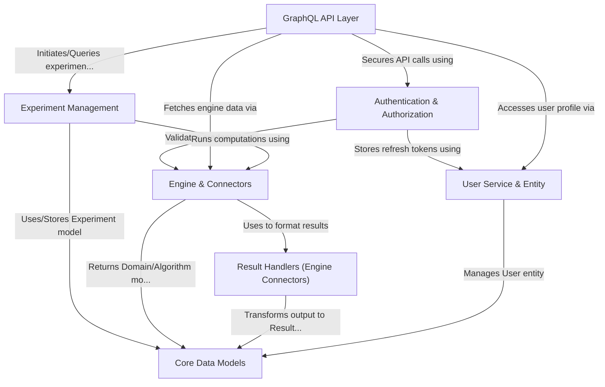

# Tutorial: gateway

This project is a **gateway** application acting as a central hub.
It connects user interfaces (like a web app) to various backend *computational systems* (called **Engines**, e.g., Exareme or DataShield).
Users can *log in*, browse available *datasets* and *algorithms*, and run *computational tasks* (called **Experiments**).
The gateway standardizes how users interact with different backends and how results are presented, managing user sessions and experiment details through a **GraphQL API**.

**Source Repository:** [https://github.com/HBPMedical/gateway](https://github.com/HBPMedical/gateway)

## Chapters

1. [GraphQL API Layer
](01_graphql_api_layer_.md)
2. [Authentication & Authorization
](02_authentication___authorization_.md)
3. [User Service & Entity
](03_user_service___entity_.md)
4. [Experiment Management
](04_experiment_management_.md)
5. [Engine & Connectors
](05_engine___connectors_.md)
6. [Result Handlers (Engine Connectors)
](06_result_handlers__engine_connectors__.md)
7. [Core Data Models
](07_core_data_models_.md)

---

Generated by [AI Codebase Knowledge Builder](https://github.com/The-Pocket/Tutorial-Codebase-Knowledge)