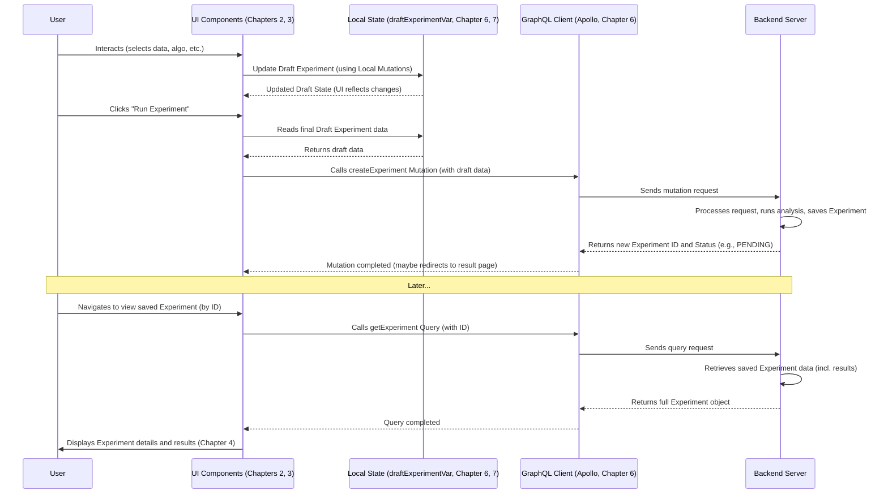

# Chapter 1: Experiment Data Structure

Welcome to the `portal-frontend` tutorial! We're excited to guide you through the core concepts of this powerful data analysis platform.

Let's start with the very foundation: how we keep track of an analysis you want to perform.

## What's the Big Idea? The Recipe Card for Analysis

Imagine you're a scientist (or just curious!) wanting to analyze some data. Maybe you want to see if age affects blood pressure using patient data. You need a way to record:

*   **What data are you using?** (e.g., "Patient Data 2023")
*   **What specific pieces of data matter?** (e.g., "Age", "Blood Pressure")
*   **What analysis method are you applying?** (e.g., "Descriptive Statistics", "Linear Regression")
*   **Are there any special settings for that method?** (e.g., specific parameters for the regression)
*   **Are you filtering the data somehow?** (e.g., "Only include patients over 40")
*   **What were the results?** (e.g., charts, tables showing the findings)

Trying to remember all this for every analysis would be tough! We need a structured way to store this information.

In `portal-frontend`, we call this structure the **`Experiment`**. Think of it like a detailed **recipe card** for your scientific analysis. It holds all the "ingredients" (data, variables), the "instructions" (algorithm, parameters, filters), and eventually, the "final dish" (the results).

## Anatomy of an Experiment

An `Experiment` object is like a container holding several key pieces of information. Let's look at the most important ones:

*   `id`: A unique identifier, like a recipe card number, especially once it's saved.
*   `name`: A descriptive name you give it, like "Age vs Blood Pressure Study".
*   `domain`: The general area of study (e.g., 'Cardiology', 'Genomics'). This helps organize data and algorithms.
*   `datasets`: A list of the specific data files or tables you selected (e.g., `['patient_data_2023', 'hospital_admissions']`).
*   `variables`: The main columns or data points you are analyzing (e.g., `['age', 'systolic_bp']`). These are often called dependent variables.
*   `coVariables`: Other columns that might influence the main variables (e.g., `['gender', 'smoker_status']`). Often called independent variables or covariates.
*   `algorithm`: The specific analysis method chosen. This includes its `name` (like `'descriptive_stats'`) and any `parameters` it needs.
*   `filter`: Rules you set up to include only specific rows of data (e.g., `"age > 40 AND gender = 'Female'"`).
*   `formula`: Special instructions for how variables interact or should be transformed (e.g., calculating `bmi = weight / height^2`).
*   `results`: Once the analysis runs, the output (tables, charts, etc.) is stored here.
*   `status`: Tracks whether the experiment is just starting (`INIT`), running (`PENDING`), finished successfully (`SUCCESS`), or encountered a problem (`ERROR`).

Here's a simplified look at what the structure might contain, using TypeScript types (don't worry if this looks complex now, we'll break it down):

```typescript
// From: src/components/API/GraphQL/types.generated.ts (Simplified)
export type Experiment = {
  __typename?: 'Experiment'; // Internal GraphQL identifier
  id: string;                // Unique ID (empty for drafts)
  name: string;              // User-given name
  domain: string;            // e.g., 'Cardiology'
  datasets: Array<string>;   // List of dataset IDs
  variables: Array<string>;  // List of main variable IDs
  coVariables?: Maybe<Array<string>>; // Optional list of covariate IDs
  filter?: Maybe<string>;     // Filter rules
  formula?: Maybe<Formula>;   // Transformations/interactions
  algorithm: AlgorithmResult;// Chosen analysis method + parameters
  results?: Maybe<Array<ResultUnion>>; // The outcomes
  status?: Maybe<ExperimentStatus>;   // PENDING, SUCCESS, ERROR...
  // Other fields like author, createdAt, shared, viewed...
};

// Helper types (Simplified examples)
export type Formula = {
  transformations?: Maybe<Array<{ id: string; operation: string; }>>;
  interactions?: Maybe<Array<Array<string>>>;
};

export type AlgorithmResult = {
  name: string;
  parameters?: Maybe<Array<{ name: string; value: string; }>>;
  // ... preprocessing info
};
```

This `Experiment` structure is the central piece of information that defines a single analysis run within the application.

## Two States: Draft vs. Saved

An `Experiment` typically exists in two states:

1.  **Draft State:** This is the "work-in-progress" state. As you use the application's interface ([Experiment Workflow UIs](02_experiment_workflow_uis_.md)) to select datasets, pick variables, choose an algorithm, and set parameters, you are building up a *draft* experiment. This draft lives temporarily in the application's memory.
2.  **Saved State:** When you decide to run the analysis or explicitly save it, the information from your draft experiment is sent to a backend server. The server performs the computation, saves the complete experiment definition (including results), and gives it a permanent `id`. Later, you can retrieve this saved experiment to view the results or even duplicate it to start a new analysis.

## How It's Used: Building an Analysis Recipe

Let's revisit our example: analyzing 'Age' and 'Blood Pressure' from 'Patient Data 2023' in the 'Cardiology' domain using descriptive statistics.

1.  **Starting Fresh:** When you begin creating a new analysis, the application initializes an empty "draft" experiment. We use a special tool called Apollo Client's Reactive Variables ([Apollo Client & Reactive Variables](06_apollo_client___reactive_variables_.md)) to manage this draft state.

    ```typescript
    // From: src/components/API/GraphQL/cache.tsx
    // This is the starting point for any new analysis
    export const initialExperiment: Experiment = {
      id: '', // No ID yet, it's just a draft
      algorithm: {
        name: '', // No algorithm chosen yet
        parameters: [],
      },
      datasets: [], // No datasets selected yet
      domain: '', // No domain selected yet
      name: 'New experiment', // Default name
      shared: false,
      viewed: false,
      variables: [], // No variables selected yet
      // coVariables, filter, formula are initially empty too
    };

    // This reactive variable holds the current draft
    export const draftExperimentVar = makeVar<Experiment>(initialExperiment);
    ```
    This `draftExperimentVar` holds our initial, empty recipe card.

2.  **Making Choices:** As you click through the UI ([Experiment Workflow UIs](02_experiment_workflow_uis_.md)):
    *   You select the 'Cardiology' domain.
    *   You choose the 'Patient Data 2023' dataset.
    *   You pick 'Age' and 'Systolic BP' as variables.
    *   You select the 'Descriptive Statistics' algorithm.

    Each of these actions triggers small updates to the `draftExperimentVar`. These updates are handled by what we call Local State Mutations ([Local State Mutations](07_local_state_mutations_.md)).

    ```typescript
    // Example of using a local mutation (Simplified concept)
    // In a UI component, when a dataset 'pd_2023' is clicked:
    localMutations.toggleDatasetExperiment('pd_2023');

    // This function (defined elsewhere) updates draftExperimentVar:
    // It might look something like this internally:
    const currentDraft = draftExperimentVar(); // Get current draft
    draftExperimentVar({ // Set a *new* draft object
        ...currentDraft, // Copy existing properties
        datasets: ['pd_2023'] // Update the datasets list
    });
    ```
    Now, `draftExperimentVar` holds `{ name: 'New experiment', domain: 'Cardiology', datasets: ['pd_2023'], variables: ['age', 'systolic_bp'], algorithm: { name: 'descriptive_stats', ... }, ... }`. Our recipe card is filling up!

3.  **Running the Analysis:** You click "Run". The application takes the current state of `draftExperimentVar` and sends it to the backend using a GraphQL Mutation.

    ```graphql
    # From: src/components/API/GraphQL/queries.ts (Simplified)
    mutation createExperiment($data: ExperimentCreateInput!, $isTransient: Boolean = false) {
      createExperiment(data: $data, isTransient: $isTransient) {
        id       # The backend gives us the ID of the saved experiment
        name
        status   # Tells us if it's running, succeeded, etc.
        # results (if transient/quick analysis)
      }
    }
    ```
    The `$data` variable in this mutation would contain the information currently held in `draftExperimentVar`. `$isTransient` indicates if this is just a quick preview (like in descriptive analysis) or a full, saved experiment run.

4.  **Viewing Results:** Later, you want to see this analysis again. You navigate to your list of experiments and click on it. The application uses a GraphQL Query to fetch the *saved* experiment data from the backend using its unique `id`.

    ```graphql
    # From: src/components/API/GraphQL/queries.ts (Simplified)
    query getExperiment($id: String!) {
      experiment(id: $id) {
        # Request all the details needed to display the experiment
        id
        name
        domain
        datasets
        variables
        coVariables
        algorithm { name parameters { name value } }
        results {
           # ... details about different result types (tables, charts)
           __typename # Helps identify the type of result
           ... on TableResult { headers data }
           ... on BarChartResult { xAxis yAxis barValues }
        }
        status
        # ... other fields like author, dates, etc.
      }
    }
    ```
    The application receives the complete `Experiment` object, including the `results`, and displays them ([Result Dispatcher & Visualizations](04_result_dispatcher___visualizations_.md)).

## Under the Hood: The Lifecycle

Let's visualize the journey of an `Experiment` data structure:



Key Takeaways from the Diagram:

1.  The `draftExperimentVar` in the Local State ([Apollo Client & Reactive Variables](06_apollo_client___reactive_variables_.md), [Local State Mutations](07_local_state_mutations_.md)) is crucial for building the experiment interactively.
2.  GraphQL Mutations (`createExperiment`) send the draft data to the backend for processing and saving.
3.  GraphQL Queries (`getExperiment`) retrieve the complete, saved experiment data (including results) from the backend.
4.  The UI components ([Experiment Workflow UIs](02_experiment_workflow_uis_.md), [Result Dispatcher & Visualizations](04_result_dispatcher___visualizations_.md)) are responsible for letting the user interact with and view the experiment data.

## Conclusion

You've just learned about the `Experiment` data structure – the fundamental "recipe card" that holds all the information about a single analysis in `portal-frontend`. We saw how it captures everything from datasets and variables to the chosen algorithm and its results, and how it exists in both a temporary 'draft' state and a permanent 'saved' state.

Understanding this structure is key, as it's the central piece of information passed around between different parts of the application.

Now that we know *what* an experiment looks like structurally, let's move on to *how* the user actually builds this structure piece by piece using the application's interface.

Next up: [Chapter 2: Experiment Workflow UIs](02_experiment_workflow_uis_.md)

---

Generated by [AI Codebase Knowledge Builder](https://github.com/The-Pocket/Tutorial-Codebase-Knowledge)