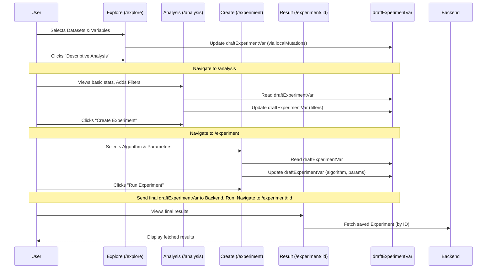

# Chapter 2: Experiment Workflow UIs

In [Chapter 1: Experiment Data Structure](01_experiment_data_structure_.md), we learned about the "recipe card" for our analysis – the `Experiment` object that holds all the details. But how do we actually *fill out* that recipe card? Clicking buttons and selecting options in a user interface seems much easier than writing code!

This chapter explains how `portal-frontend` organizes the user interface (UI) into logical steps, making the process of creating an analysis smooth and intuitive.

## The Problem: Analysis is a Process, Not One Big Step

Setting up a data analysis isn't usually done all at once. You typically follow a series of steps:

1.  **Look** at what data and variables are available.
2.  **Explore** some basic characteristics of the data (like averages or ranges).
3.  Maybe **filter** the data to focus on a specific group.
4.  **Choose** a specific analysis method (like a statistical test or a machine learning model).
5.  **Set** any special options for that method.
6.  **Run** the analysis.
7.  **View** the results.

Trying to put all the buttons and options for *every* possible step onto a single screen would be overwhelming! We need a way to guide the user through this process step-by-step.

## The Solution: Different "Rooms" for Different Tasks

Think of the `portal-frontend` application like a scientific lab designed for data analysis. Instead of one giant room with everything crammed inside, we have different rooms, each dedicated to a specific part of the workflow:

1.  **The Exploration Room (`Explore`)**: This is where you start. You browse through your available datasets and variables, like looking through sample jars in a lab. You pick the ones you're interested in studying. The main tool here is often a visual one, like the [Variable Exploration UI (D3 Circle Pack)](03_variable_exploration_ui__d3_circle_pack__.md).
2.  **The Initial Analysis Room (`Analysis`)**: Here, you get a first look at the variables you selected. You can see basic descriptive statistics (averages, counts, etc.) and maybe apply some initial filters (e.g., "only patients over 40"). It's like doing a quick check on your chosen samples before the main experiment.
3.  **The Experiment Setup Room (`Create`)**: This room has the sophisticated machinery. You choose the main analysis algorithm (e.g., 'Linear Regression', 't-test') and configure its specific settings (parameters). It's like setting up the dials and inputs on your main analysis machine.
4.  **The Results Viewing Room (`Result`)**: After the analysis is run (either a quick one from the 'Analysis' room or the main one from the 'Create' room), you come here to see the outcome. Charts, tables, and summaries are displayed here, like looking at the final printout from your experiment.

Each of these "rooms" is actually a major UI component (often called a "container" component) in our React application. They manage the specific interactions needed for that stage of the workflow.

## How It Works: Following the Workflow

Let's walk through how a user might interact with these workflow UIs to build an analysis:

1.  **Start Exploring (`/explore` URL):**
    *   The user lands on the **Explore** page.
    *   They use components like [DataSelection](src/components/ExperimentExplore/DataSelection.tsx) to pick datasets and the [Variable Exploration UI (D3 Circle Pack)](03_variable_exploration_ui__d3_circle_pack__.md) (shown within [Explore.tsx](src/components/ExperimentExplore/Explore.tsx)) to select variables (e.g., 'Age', 'Blood Pressure').
    *   As they click, these choices update the `draftExperimentVar` we learned about in [Chapter 1: Experiment Data Structure](01_experiment_data_structure_.md), using functions provided by [Local State Mutations](07_local_state_mutations_.md).

    ```typescript
    // Simplified concept from src/components/ExperimentExplore/Explore.tsx
    // When a variable node is clicked to be added as a 'variable':
    const handleAddVariable = (node) => {
      const variableIds = node.leaves().map(leaf => leaf.data.id);
      // This updates the draftExperimentVar behind the scenes
      localMutations.toggleVarsDraftExperiment(variableIds, VarType.VARIABLES);
    };
    ```

    *   Once done, they click a button like "Descriptive Analysis".

2.  **Initial Analysis (`/analysis` URL):**
    *   The app navigates to the **Analysis** page, managed by [DescriptiveAnalysis/Container.tsx](src/components/DescriptiveAnalysis/Container.tsx).
    *   This component reads the current `draftExperimentVar` to see which variables were selected.

    ```typescript
    // Simplified from src/components/DescriptiveAnalysis/Container.tsx
    import { useReactiveVar } from '@apollo/client';
    import { draftExperimentVar } from '../API/GraphQL/cache';
    // ... inside the component
    const draftExperiment = useReactiveVar(draftExperimentVar);
    // Now 'draftExperiment' holds the selections made in the Explore step
    // ... uses draftExperiment.variables, draftExperiment.coVariables etc.
    ```

    *   It often automatically runs a *transient* (temporary) `descriptive_stats` analysis by sending a request to the backend (using `createExperiment` mutation but marked as transient).
    *   The results (like histograms or tables) are displayed using the [Result Dispatcher & Visualizations](04_result_dispatcher___visualizations_.md).
    *   The user might add filters here, which also update the `draftExperimentVar`.
    *   They then decide to proceed to set up a more specific analysis and click "Create Experiment".

3.  **Setting Up the Experiment (`/experiment` URL - Create Mode):**
    *   The app navigates to the **Create** page, handled by [ExperimentCreate/Container.tsx](src/components/ExperimentCreate/Container.tsx).
    *   This component again reads `draftExperimentVar` to know the context (datasets, variables, filters).
    *   It displays available algorithms (using [AvailableAlgorithms](src/components/ExperimentCreate/AvailableAlgorithms.tsx)). The user selects one (e.g., 'linear_regression').
    *   They configure parameters for the chosen algorithm using [AlgorithmParameters](src/components/ExperimentCreate/AlgorithmParameters.tsx).
    *   All these choices update the `draftExperimentVar` via [Local State Mutations](07_local_state_mutations_.md).

    ```typescript
    // Simplified from src/components/ExperimentCreate/Container.tsx
    import { draftExperimentVar } from '../API/GraphQL/cache';
    import { localMutations } from '../API/GraphQL/operations/mutations';
    // ... inside the component
    const experiment = useReactiveVar(draftExperimentVar);

    const handleAlgorithmSelect = (algo) => {
      // Update the algorithm part of the draft experiment
      localMutations.updateDraftExperiment({
        algorithm: { name: algo.id, parameters: [] /* Default params */ },
      });
      // ... (rest of UI updates)
    };
    ```

    *   Finally, the user clicks "Run Experiment". This triggers the `createExperiment` GraphQL mutation, sending the *final* state of `draftExperimentVar` to the backend to be saved and executed permanently.

4.  **Viewing the Results (`/experiment/:id` URL - Result Mode):**
    *   After the backend finishes, the user is often redirected to the **Result** page, managed by [ExperimentResult/Container.tsx](src/components/ExperimentResult/Container.tsx). This page shows a *specific, saved* experiment identified by its unique ID in the URL.
    *   This component *doesn't* primarily use `draftExperimentVar`. Instead, it uses a GraphQL query (`getExperiment`) to fetch the *saved* experiment details (including the computed results) from the backend.

    ```typescript
    // Simplified from src/components/ExperimentResult/Container.tsx
    import { useGetExperimentQuery } from '../API/GraphQL/queries.generated';
    // ... inside the component
    const { uuid } = props.match.params; // Get experiment ID from URL
    const { data, loading, error } = useGetExperimentQuery({
      variables: { id: uuid },
      fetchPolicy: 'network-only', // Always get the latest from server
    });
    // 'data.experiment' contains the saved experiment with results
    ```

    *   The fetched results are then displayed using the [Result Dispatcher & Visualizations](04_result_dispatcher___visualizations_.md).

## Under the Hood: Navigation and State

How does the application switch between these "rooms"?

*   **React Router:** We use a standard library called `react-router-dom` to define different URL paths (like `/explore`, `/analysis`, `/experiment`, `/experiment/:id`).
*   **Container Components:** Each path is mapped to one of the main container components we discussed (`ExperimentExplore/Container.tsx`, `DescriptiveAnalysis/Container.tsx`, etc.). These components are responsible for rendering the specific UI for that step.
*   **Shared State (`draftExperimentVar`):** The magic glue holding the user's choices together as they navigate between Explore, Analysis, and Create is the `draftExperimentVar` reactive variable managed by [Apollo Client & Reactive Variables](06_apollo_client___reactive_variables_.md). Each step reads from or writes to this shared "draft recipe card".
*   **Saved State (Backend):** The Result step primarily relies on data fetched from the backend, representing the permanently saved "recipe card" with its results.

Here's a simplified diagram showing the user's navigation and interaction with the draft state:



This workflow ensures that the user interface is focused and relevant at each stage of the analysis process, guiding them from initial exploration to final results while maintaining the state of their in-progress work via `draftExperimentVar`. The overall routing is typically set up in the [Main Application Component (`App.tsx`)](05_main_application_component___app_tsx___.md).

## Conclusion

We've seen how `portal-frontend` uses a multi-step workflow UI, like different rooms in a lab (Explore, Analysis, Create, Result), to guide users through the process of setting up and viewing data analysis. Each step has a dedicated UI container that manages its specific tasks, often interacting with the shared `draftExperimentVar` to build up the analysis recipe defined in [Chapter 1: Experiment Data Structure](01_experiment_data_structure_.md). This makes a potentially complex process feel organized and manageable.

Now that we understand the overall workflow structure, let's zoom in on a key component used in the very first step: the interactive visualization for selecting variables.

Next up: [Chapter 3: Variable Exploration UI (D3 Circle Pack)](03_variable_exploration_ui__d3_circle_pack__.md)

---

Generated by [AI Codebase Knowledge Builder](https://github.com/The-Pocket/Tutorial-Codebase-Knowledge)