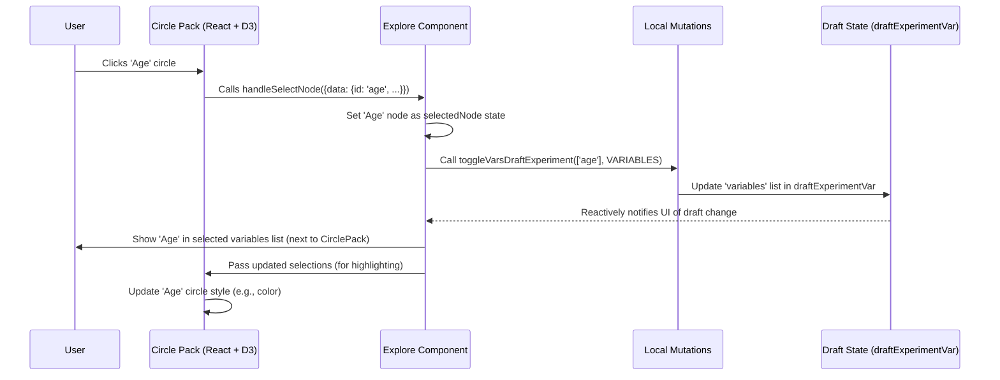

# Chapter 3: Variable Exploration UI (D3 Circle Pack)

In [Chapter 2: Experiment Workflow UIs](02_experiment_workflow_uis_.md), we saw how the application guides you through different stages of analysis using distinct UI "rooms". We mentioned that the first step, often done in the `Explore` room, involves selecting the data points (variables) you want to study.

But what if you have hundreds, or even thousands, of potential variables? Scrolling through a giant list is tedious and error-prone. How can we make browsing and selecting variables easier, especially when they are organized into groups?

## The Problem: Finding Needles in a Haystack of Variables

Imagine your data source is a large clinical study. You might have variables grouped like this:

*   **Demographics**
    *   Age
    *   Gender
    *   Ethnicity
*   **Vital Signs**
    *   Heart Rate
    *   Systolic Blood Pressure
    *   Diastolic Blood Pressure
    *   Body Temperature
*   **Lab Results**
    *   Blood Glucose
    *   Cholesterol HDL
    *   Cholesterol LDL
    *   ...and many more

If you want to select 'Age' and 'Systolic Blood Pressure', you need an efficient way to navigate these groups and pinpoint the exact variables. A flat list doesn't show the structure well, and extensive scrolling is inefficient.

## The Solution: A Visual Map of Your Variables

To solve this, `portal-frontend` uses a **Variable Exploration UI**, powered by a visualization technique called **D3 Circle Packing**.

Think of it like a visual file explorer, but instead of folders and files, you see nested circles:

*   **Big Circles:** Represent groups of variables (like 'Demographics' or 'Vital Signs').
*   **Smaller Circles Inside:** Represent sub-groups or individual variables (like 'Age' or 'Systolic Blood Pressure').

This interface lets you:

1.  **See the Structure:** Immediately grasp how variables are organized.
2.  **Zoom:** Click on a group circle to zoom in and see its contents more clearly. Click the background or a parent circle to zoom out.
3.  **Select:** Click on the innermost circles (the "leaf" variables) to select them for your analysis.

This provides an interactive and intuitive way to explore and choose the data points you need.

## Key Concepts Explained

Let's break down the ideas behind this UI:

1.  **Hierarchical Data:** Our variables aren't just a flat list; they have structure. 'Age' *belongs to* 'Demographics'. This nested relationship is called a **hierarchy**. The circle pack is excellent at visualizing hierarchies.

2.  **D3.js:** This is a popular and powerful JavaScript library specifically designed for creating data visualizations in web browsers. We use D3 to:
    *   Calculate the positions and sizes of all the circles based on the hierarchy.
    *   Draw the circles (and their labels) efficiently.
    *   Handle the smooth zooming animations.

3.  **Circle Packing Algorithm:** This is a specific layout algorithm (provided by D3) that arranges hierarchical data as nested circles. It tries to fit smaller circles (children) snugly inside their larger parent circle, minimizing wasted space.

4.  **Interaction -> State Update:** When you click on a leaf circle (an individual variable), it doesn't just look selected. This action triggers an update to our central "recipe card" – the `draftExperimentVar` ([Experiment Data Structure](01_experiment_data_structure_.md)). This update uses the mechanisms described in [Local State Mutations](07_local_state_mutations_.md) to add the selected variable's ID to the appropriate list (e.g., `variables` or `coVariables`).

## How to Use It (From Your Perspective)

When you navigate to the `Explore` section ([Experiment Workflow UIs](02_experiment_workflow_uis_.md)), you'll see the D3 Circle Pack visualization.

1.  **Browsing:** You'll see large circles representing the top-level variable groups.
2.  **Zooming In:** See a group named 'Vital Signs'? Click on its circle. The view will smoothly zoom in, making the 'Vital Signs' circle fill more of the space, revealing the smaller circles inside it like 'Heart Rate' and 'Blood Pressure'.
3.  **Selecting Variables:** Inside 'Vital Signs', you see the 'Systolic Blood Pressure' circle. Click it. It might change color slightly to show it's selected. More importantly, you'll see 'Systolic Blood Pressure' appear in the list of selected "Variables" or "Covariates" usually displayed next to the circle pack visualization. This means the `draftExperimentVar` has been updated.
4.  **Selecting More:** Click the background to zoom out slightly. Now click the 'Demographics' circle to zoom in there. Click the 'Age' circle. Now 'Age' is also added to your selected variables list.
5.  **Zooming Out:** Click the background again, or the outermost circle, to zoom back out to the top level.

This interaction allows you to quickly navigate the hierarchy and build your list of variables for analysis.

*(Code Reference: The main user interaction logic and layout connection happen within `src/components/ExperimentExplore/Explore.tsx`)*

```typescript
// Simplified concept from src/components/ExperimentExplore/Explore.tsx

// State to keep track of the currently focused node in the visualization
const [selectedNode, setSelectedNode] = useState();

// Function called when ANY circle is clicked in the D3 viz
const handleNodeClickInViz = (node) => {
  setSelectedNode(node); // Update local focus state

  // If it's a leaf node (a variable, not a group)
  if (!node.children) {
    const variableId = node.data.id;
    // Add/remove this variable from the main 'variables' list
    // This function updates draftExperimentVar behind the scenes
    localMutations.toggleVarsDraftExperiment([variableId], VarType.VARIABLES);
  } else {
    // If it's a group node, zoom is handled internally by D3 component
  }
};

// ... later in the JSX ...
<D3Container
  selectedNode={selectedNode}
  handleSelectNode={handleNodeClickInViz} // Pass the handler to the D3 component
/>
```

This snippet shows how clicking a node updates the component's state (`selectedNode`) and, crucially, calls a local mutation (`toggleVarsDraftExperiment`) if a variable leaf node is clicked, linking the UI interaction to the application's state ([Apollo Client & Reactive Variables](06_apollo_client___reactive_variables_.md)).

## Under the Hood: How It's Built

Making this interactive visualization work involves a few steps:

1.  **Preparing the Data Tree:**
    *   The application first gets the list of variable groups and variables available for the selected domain (this data is often stored in `selectedDomainVar`).
    *   This flat list of groups and variables needs to be converted into a hierarchical tree structure that D3 can understand. A helper function, `groupsToTreeView`, recursively builds this tree.
    *   *(Code Reference: `src/components/ExperimentExplore/d3Hierarchy.ts`)*

    ```typescript
    // Simplified structure of the output from groupsToTreeView
    interface NodeData {
      id: string;         // e.g., 'demographics', 'age'
      label: string;      // e.g., 'Demographics', 'Age'
      children?: NodeData[]; // Nested groups or variables
      isVariable?: boolean; // True if it's a selectable variable
    }

    // Example Tree:
    // { id: 'root', label: 'All Variables', children: [
    //   { id: 'demographics', label: 'Demographics', children: [
    //     { id: 'age', label: 'Age', isVariable: true },
    //     { id: 'gender', label: 'Gender', isVariable: true }
    //   ]},
    //   { id: 'vitals', label: 'Vital Signs', children: [...] }
    // ]}
    ```

2.  **Calculating the Layout:**
    *   The `D3Container` component takes this tree structure.
    *   It uses D3's `d3.hierarchy()` to enhance the tree with helpful methods.
    *   Then, it applies the `d3.pack()` layout algorithm. This algorithm calculates the `x`, `y` coordinates and the radius `r` for every single circle needed to represent the tree visually without overlaps within parent circles. It doesn't draw anything yet, just does the math.
    *   *(Code Reference: `src/components/ExperimentExplore/D3Container.tsx`)*

    ```typescript
    // Simplified concept from src/components/ExperimentExplore/D3Container.tsx
    import * as d3 from 'd3';
    import { groupsToTreeView, d3Hierarchy, NodeData } from './d3Hierarchy';

    // ... inside the component ...
    useEffect(() => {
      // 1. Build the tree structure
      const rootNode = groupsToTreeView(domain.rootGroup, domain.groups, domain.variables, datasets);

      // 2. Prepare it for D3 layout
      const hierarchyNode = d3Hierarchy(rootNode);

      // 3. Define the packing layout function
      const bubbleLayout = d3.pack<NodeData>().size([800, 800]).padding(1.5);

      // 4. Calculate the layout (positions and sizes)
      const layout = hierarchyNode && bubbleLayout(hierarchyNode);
      setD3Layout(layout); // Store the calculated layout in state
    }, [domain, datasets]); // Re-run if domain or datasets change
    ```

3.  **Drawing and Interaction (React + D3):**
    *   The `D3CirclePackLayer` component receives the calculated layout data (the tree nodes now have `x`, `y`, `r` properties).
    *   It uses React for the overall component structure but leverages D3's powerful drawing and manipulation capabilities for the SVG (Scalable Vector Graphics) elements.
    *   **Drawing Circles:** D3 binds the layout data to SVG `<circle>` elements. For each node in the data, it creates a corresponding circle element with the calculated `x`, `y`, and `r`.
    *   **Handling Clicks:** D3 attaches click event listeners to each circle. When a circle is clicked:
        *   The event handler (like `handleNodeClickInViz` passed down from `Explore.tsx`) is called.
        *   If the clicked node has children (it's a group), D3's zoom functions are called to smoothly animate the view transition to focus on that group.
        *   If it's a leaf node (a variable), the handler triggers the state update via `localMutations`.
    *   **Updating Styles:** D3 is also used to dynamically change the `fill` color or `opacity` of circles, for example, to highlight selected variables or color-code them based on whether they are selected as 'Variables' or 'Covariates'.
    *   *(Code Reference: `src/components/ExperimentExplore/D3CirclePackLayer.tsx`)*

    ```typescript
    // Simplified concept from src/components/ExperimentExplore/D3CirclePackLayer.tsx
    import * as d3 from 'd3';

    // ... inside useEffect for drawing ...
    const svg = d3.select(svgRef.current); // Get the SVG container

    // Bind data and create circles
    svg.append('g')
      .selectAll('circle')
      .data(layout.descendants()) // Use the calculated layout data
      .join('circle') // Create a circle for each data point
        .attr('cx', d => d.x) // Set position (D3 v4+ uses transforms)
        .attr('cy', d => d.y)
        .attr('r', d => d.r)   // Set radius
        .attr('fill', d => d.children ? 'lightblue' : 'white') // Color groups vs vars
        .on('click', (d) => { // Attach click handler
          props.handleSelectNode(d); // Call the function passed from Explore.tsx
          d3.event.stopPropagation(); // Prevent click bubbling to background
          // Internal zoom logic might be called here if d has children
        });

    // Simplified zoom logic (conceptual)
    const zoomTo = (targetView) => {
      // Use d3.interpolateZoom and d3.transition
      // to smoothly update the SVG's viewbox or circle transforms/radii
      // This creates the animated zoom effect.
    };
    ```

**Sequence Diagram: Selecting a Variable**

This diagram shows what happens when you click on a variable circle like 'Age':



## Conclusion

The D3 Circle Pack UI provides an elegant and interactive solution for exploring and selecting variables from potentially complex, hierarchical structures. By visually representing groups and variables as nested circles and allowing intuitive zoom and click interactions, it makes the first step of setting up an analysis much easier.

We saw how it transforms the underlying data into a tree, uses D3.js to calculate the layout and handle drawing/animation, and integrates with React and our application's state management ([Apollo Client & Reactive Variables](06_apollo_client___reactive_variables_.md), [Local State Mutations](07_local_state_mutations_.md)) to ensure your selections are captured in the `draftExperimentVar`.

Now that we've explored how to select variables and run initial analyses ([Experiment Workflow UIs](02_experiment_workflow_uis_.md)), what happens when the analysis is complete? How are the results displayed?

Next up: [Chapter 4: Result Dispatcher & Visualizations](04_result_dispatcher___visualizations_.md)

---

Generated by [AI Codebase Knowledge Builder](https://github.com/The-Pocket/Tutorial-Codebase-Knowledge)