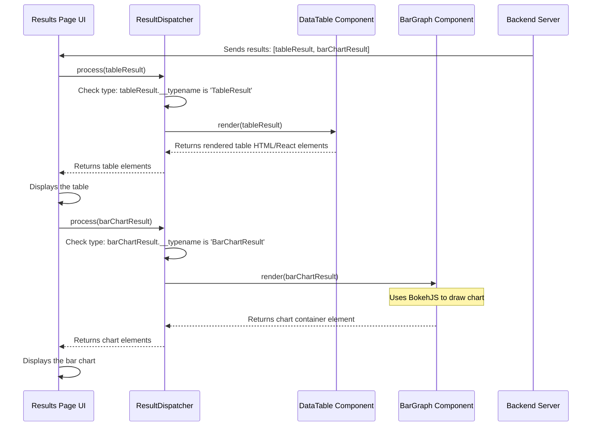

# Chapter 4: Result Dispatcher & Visualizations

In [Chapter 3: Variable Exploration UI (D3 Circle Pack)](03_variable_exploration_ui__d3_circle_pack__.md), we saw how you can visually explore and select the variables you want to analyze. You then proceed through the [Experiment Workflow UIs](02_experiment_workflow_uis_.md) to choose an analysis method and run it.

But what happens after the analysis is done? The backend server sends back the results. How does our frontend application know how to show these results to you? An analysis might produce a table of numbers, a bar chart, a complex heatmap, or maybe just a simple warning message. The frontend needs a smart way to handle all these different possibilities.

## The Problem: One Analysis, Many Result Types

Imagine you run a "Descriptive Statistics" analysis on your 'Age' variable. The results might include:

1.  A **table** showing the count, mean, median, min, and max age.
2.  A **bar chart (histogram)** showing how many people fall into different age groups.
3.  A **text alert** warning you if there are missing age values.

Our application needs to display *all* of these results, and each one needs a different kind of presentation. We can't just dump the raw data onto the screen; we need to render a proper table for the table data, draw a chart for the chart data, and show a formatted alert box for the warning.

How can the application automatically figure out that the first piece of data needs a table component, the second needs a bar chart component, and the third needs an alert component?

## The Solution: The Result Dispatcher - Your Smart Media Player

Think about a media player on your computer. You can open an MP3 file, a video file (like MP4), or even a text file. The player *knows* what kind of file it is and uses the right internal tool to play the music, show the video, or display the text. It doesn't try to play a text file like music!

The **`ResultDispatcher`** in `portal-frontend` works exactly like that. It's a central component that acts as a smart "switchboard" or "media player" for analysis results.

Here are the key ideas:

1.  **Results Have Types:** When the backend sends results, each piece of result data comes with a label or a "type indicator". This is often a special field called `__typename` (a feature of GraphQL) or a similar type property. For example:
    *   `{ __typename: 'TableResult', headers: [...], data: [...] }`
    *   `{ __typename: 'BarChartResult', name: '...', barValues: [...] }`
    *   `{ __typename: 'AlertResult', level: 'WARNING', message: '...' }`

2.  **The Dispatcher Reads the Type:** The `ResultDispatcher` receives a single piece of result data. Its first job is to look at the `__typename` (or type indicator).

3.  **Specific Components for Specific Types:** We have separate React components built specifically to display *one* kind of result.
    *   `DataTable`: Knows how to render data with `headers` and `data` into an HTML table.
    *   `BarGraph`: Knows how to use chart data (like `barValues`) to draw a bar chart (often using a library like BokehJS).
    *   `AlertDisplay`: Knows how to take an `AlertResult` and show a nicely formatted Bootstrap alert box.
    *   ...and many others (`HeatMapChart`, `LineGraph`, `MeanPlot`, etc.).

4.  **Dispatcher Makes the Connection:** Based on the `__typename` it read, the `ResultDispatcher` chooses the *correct* visualization component and passes the result data to it.

So, if `ResultDispatcher` gets data with `__typename: 'TableResult'`, it says, "Aha! This is table data. I need to use the `DataTable` component." It then renders `<DataTable data={resultData} />`. If it gets `__typename: 'BarChartResult'`, it renders `<BarGraph data={resultData} />`.

## How It's Used: Displaying Results on the Page

Typically, the main UI component responsible for showing experiment results (like `ExperimentResult/Container.tsx` mentioned in [Chapter 2: Experiment Workflow UIs](02_experiment_workflow_uis_.md)) will receive an array of results from the backend after fetching the experiment data ([Experiment Data Structure](01_experiment_data_structure_.md)).

It doesn't try to figure out how to display each result itself. Instead, it loops through the array and hands off each result item to the `ResultDispatcher`.

```typescript
// Simplified concept from a component like ExperimentResult/Container.tsx

import ResultDispatcher from './ResultDispatcher'; // Import the dispatcher
import { ResultUnion } from '../API/GraphQL/types.generated'; // Type for results

// Assume 'experimentResults' is an array fetched from the backend,
// containing objects like { __typename: 'TableResult', ... }
// or { __typename: 'BarChartResult', ... }
const experimentResults: ResultUnion[] = [
  // ... results from the backend ...
];

function DisplayExperimentResults() {
  return (
    <div>
      <h3>Analysis Results</h3>
      {experimentResults.map((result, index) => (
        // For each result, use the dispatcher!
        <ResultDispatcher key={index} result={result} />
      ))}
    </div>
  );
}
```

In this simplified example:
1.  We get an array `experimentResults`.
2.  We use `.map()` to go through each `result` in the array.
3.  For every single `result`, we render the `<ResultDispatcher />` component, passing the `result` data to it.

The `ResultDispatcher` then takes care of figuring out the *actual* component to render (Table, BarGraph, Alert, etc.) for that specific `result` object. This keeps the main results page clean and focused only on iterating through the results, not on the complex logic of *how* to display each one.

## Under the Hood: The Dispatcher's Logic

Let's peek inside the `ResultDispatcher` to see how it performs its magic trick.

**1. The Switching Mechanism:**

The core of the `ResultDispatcher` is a way to map the result type (`__typename`) to the correct visualization component. This is often done using a JavaScript object that acts like a lookup table or dictionary.

*(Code Reference: `src/components/ExperimentResult/ResultDispatcher.tsx`)*

```typescript
// Simplified version of the lookup table inside ResultDispatcher.tsx

import DataTable from '../UI/Visualization2/DataTable';
import BarGraph from '../UI/Visualization2/BarGraph';
import AlertDisplay from '../UI/Visualization2/AlertDisplay';
// ... import other visualization components

// This object maps the '__typename' string to a function
// that renders the correct component.
const children: Record<string, (data: any) => React.ReactNode> = {
  tableresult: (data) => <DataTable data={data} />,
  barchartresult: (data) => <BarGraph data={data} />,
  alertresult: (data) => <AlertDisplay data={data} />,
  // heatmapresult: (data) => <HeatMapChart data={data} />,
  // linechartresult: (data) => <LineGraph data={data} />,
  // ... add entries for all supported result types
};

// The main dispatcher component function (simplified)
const ResultDispatcher = ({ result }: { result: ResultUnion }) => {
  // 1. Get the type name (e.g., 'TableResult', convert to lowercase)
  const type = result.__typename?.toLowerCase() ?? 'error';

  // 2. Look up the rendering function in our 'children' map
  const renderFunction = children[type];

  // 3. If found, call it with the result data. Otherwise, show error.
  return (
    <div>
      {renderFunction ? renderFunction(result) : <div>Unsupported result type: {type}</div>}
    </div>
  );
};
```

This code does the following:
1.  It defines an object `children` where keys are lowercase versions of the `__typename` (like `tableresult`) and values are functions that take the result `data` and return the appropriate React component (`<DataTable />`, `<BarGraph />`, etc.).
2.  The `ResultDispatcher` component receives a `result` object.
3.  It extracts the `__typename` from the `result`, converts it to lowercase (e.g., `'TableResult'` becomes `'tableresult'`).
4.  It uses this lowercase type string to find the matching function in the `children` object.
5.  It calls that function, passing the original `result` data, which renders the correct visualization component.

**2. Example Visualization Components:**

Let's look at simplified versions of what these specific components might do.

*   **`AlertDisplay.tsx`:** This component might use a standard UI library like `react-bootstrap` to show a formatted alert.

    *(Code Reference: `src/components/UI/Visualization2/AlertDisplay.tsx`)*

    ```typescript
    // Simplified AlertDisplay.tsx
    import { Alert } from 'react-bootstrap'; // Use Bootstrap components
    import { AlertResult, AlertLevel } from '../../API/GraphQL/types.generated';

    // Map backend severity levels to Bootstrap styles
    const alertVariantMap = {
      [AlertLevel.Info]: 'info',
      [AlertLevel.Warning]: 'warning',
      [AlertLevel.Error]: 'danger',
      [AlertLevel.Success]: 'success',
    };

    const AlertDisplay = ({ data }: { data: AlertResult }) => {
      // Determine the Bootstrap variant (e.g., 'warning')
      const variant = alertVariantMap[data.level ?? AlertLevel.Info];
      const title = data.title ?? data.level; // Use provided title or level

      return (
        <Alert variant={variant}>
          <Alert.Heading>{title}</Alert.Heading>
          {data.message}
        </Alert>
      );
    };
    ```
    This component receives `data` (an `AlertResult`) and uses its `level` and `message` to render a colorful `Alert` box.

*   **`BarGraph.tsx`:** This component often uses a dedicated charting library like BokehJS (via `window.Bokeh`) or Highcharts to handle the complexities of drawing charts.

    *(Code Reference: `src/components/UI/Visualization2/BarGraph.tsx`)*

    ```typescript
    // Simplified conceptual BarGraph.tsx
    import { useEffect, useRef } from 'react';
    import { BarChartResult } from '../../API/GraphQL/types.generated';

    // Tell TypeScript that Bokeh exists on the window object
    declare let window: any;

    const BarGraph = ({ data }: { data: BarChartResult }) => {
      const chartRef = useRef(null); // Ref to the div where the chart will be drawn

      useEffect(() => {
        // This code runs after the component is added to the page
        if (chartRef.current && window.Bokeh) {
          const Bokeh = window.Bokeh;
          const plot = Bokeh.Plotting;

          // 1. Prepare data in the format Bokeh expects
          const categories = data.xAxis?.categories ?? data.barValues.map((_, i) => `${i}`);
          const counts = data.barValues;

          // 2. Create a Bokeh figure (the chart canvas)
          const p = plot.figure({ title: data.name, x_range: categories });

          // 3. Add vertical bars (vbar) to the figure
          p.vbar({ x: categories, top: counts, width: 0.8 });

          // 4. Tell Bokeh to render the plot in our div
          plot.show(p, chartRef.current);
        }

        // Cleanup function (optional, removes chart if component unmounts)
        return () => {
          if (chartRef.current) {
            chartRef.current.innerHTML = '';
          }
        };
      }, [data]); // Re-run if the data changes

      // Render a div that Bokeh will use
      return <div ref={chartRef} style={{ width: '600px', height: '400px' }} />;
    };
    ```
    This component:
    1.  Sets up a `div` using `useRef` to act as a container for the chart.
    2.  Uses `useEffect` to run the BokehJS code once the container `div` is ready.
    3.  Takes the `data` prop (a `BarChartResult`), extracts the necessary info (`categories`, `barValues`).
    4.  Uses BokehJS functions (`figure`, `vbar`, `show`) to create and render the bar chart inside the container `div`.
    *   *(Note: Other chart components like `HeatMapChart`, `LineGraph`, `MeanPlot` follow a similar pattern, using different BokehJS or Highcharts functions specific to the chart type.)*
    *   *(Code Reference: `src/components/UI/Visualization/Highchart.tsx` shows how Highcharts is used.)*

*   **`DataTable.tsx`:** This component renders a standard HTML `<table>`.

    *(Code Reference: `src/components/UI/Visualization2/DataTable.tsx`)*

    ```typescript
    // Simplified DataTable.tsx
    import { TableResult } from '../../API/GraphQL/types.generated';

    const DataTable = ({ data }: { data: TableResult }) => {
      return (
        <div>
          <h5>{data.name}</h5>
          <table style={{ borderCollapse: 'collapse', width: '100%' }}>
            <thead>
              <tr>
                {data.headers.map((header, index) => (
                  <th key={index} style={{ border: '1px solid grey', padding: '4px' }}>
                    {header.name}
                  </th>
                ))}
              </tr>
            </thead>
            <tbody>
              {data.data.map((row, rowIndex) => (
                <tr key={rowIndex}>
                  {row.map((cell, cellIndex) => (
                    <td key={cellIndex} style={{ border: '1px solid lightgrey', padding: '4px' }}>
                      {cell}
                    </td>
                  ))}
                </tr>
              ))}
            </tbody>
          </table>
        </div>
      );
    };
    ```
    This component receives `data` (a `TableResult`) and uses standard HTML tags (`<table>`, `<thead>`, `<th>`, `<tbody>`, `<tr>`, `<td>`) to render the headers and rows.

**3. Sequence Diagram:**

Here's how the process looks when the results page needs to display a table and then a bar chart:



This diagram shows the flow: The main page gets the list of results. For each result, it calls the `ResultDispatcher`. The dispatcher identifies the type and calls the *specific* visualization component (`DataTable` or `BarGraph`). That specific component then does the actual work of rendering the table or chart.

## Conclusion

The `ResultDispatcher` is a crucial component in `portal-frontend` that solves the problem of handling diverse analysis outputs. By acting like a smart switchboard, it inspects the type of each incoming result and delegates the rendering task to the appropriate specialized visualization component (`DataTable`, `BarGraph`, `AlertDisplay`, etc.). This keeps the code organized and makes it easy to add support for new result types in the future – we just need to create a new visualization component and add an entry to the dispatcher's lookup table.

We've now seen how data is structured ([Chapter 1: Experiment Data Structure](01_experiment_data_structure_.md)), how users interact with the workflow ([Chapter 2: Experiment Workflow UIs](02_experiment_workflow_uis_.md)), how variables are explored ([Chapter 3: Variable Exploration UI (D3 Circle Pack)](03_variable_exploration_ui__d3_circle_pack__.md)), and how results are displayed. How does the application tie all these different parts and pages together?

Next up: [Chapter 5: Main Application Component (`App.tsx`)](05_main_application_component___app_tsx___.md)

---

Generated by [AI Codebase Knowledge Builder](https://github.com/The-Pocket/Tutorial-Codebase-Knowledge)