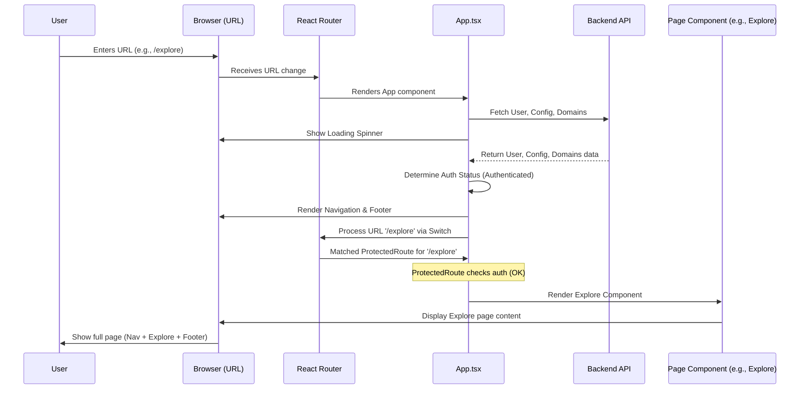

# Chapter 5: Main Application Component (`App.tsx`)

In [Chapter 4: Result Dispatcher & Visualizations](04_result_dispatcher___visualizations_.md), we saw how the application cleverly displays different types of analysis results using a "dispatcher" component. That component handles *one specific part* of the page – the results area. But what manages the *entire application*? How does the `portal-frontend` know whether to show the Explore page, the Analysis page, or the Results page? How are the navigation bar at the top and the footer at the bottom always present?

## The Problem: Orchestrating the Whole Show

Think about a big theater production. You have different scenes (Explore, Analysis, Results), actors (data, components), and props (buttons, charts). Someone needs to be in charge of the whole thing, making sure the right scene is displayed on stage, the main lights are on, and the curtains open and close correctly. Without a "stage manager," it would be chaos!

In a web application like `portal-frontend`, we have a similar need. When you type a web address (URL) like `/explore` or `/analysis` into your browser, how does the application know which collection of UI components to display? How does it ensure the main navigation menu and footer are always visible, regardless of which "scene" (page) you're viewing? How does it check if you're logged in before showing certain pages?

## The Solution: `App.tsx` - The Stage Manager

The **`App.tsx`** component is the top-level orchestrator, the "stage manager" of our `portal-frontend` application. It sits at the very top of the component tree and is responsible for:

1.  **Setting the Stage:** Rendering the overall structure, including the main navigation bar (`Navigation`), the footer (`Footer`), and the central content area (`<Main>`) where different pages will appear.
2.  **Directing the Scenes:** Using a library called `react-router-dom`, it looks at the current URL in your browser and decides which main page component (`Explore`, `Analysis`, `ExperimentResult`, `LoginPage`, etc.) to render within the `<Main>` content area. This is called **routing**.
3.  **Checking Backstage Passes:** Making sure you are logged in (`authenticated`) before allowing access to certain routes (pages) using a special component called `ProtectedRoute`.
4.  **Getting Ready:** Before the show starts, it fetches essential global information, like application configuration details, your user login status, and the list of available data domains from the backend server. It often shows a loading spinner while waiting for this information.

Think of `App.tsx` as the main frame of the application, holding everything together and deciding what specific content goes in the middle based on where you are trying to navigate.

## Key Concepts Explained

Let's break down the main jobs of `App.tsx`:

1.  **The Main Layout:** `App.tsx` renders the skeleton of every page. It always includes:
    *   A `<header>` containing the `Navigation` component (the bar at the top with links, logo, login/logout buttons).
    *   A `<Main>` section. This is the placeholder where the *content* of the specific page (Explore, Analysis, etc.) will be loaded.
    *   A `<footer>` containing the `Footer` component (the bar at the bottom with logos and version info).

2.  **Routing with `react-router-dom`:** This is the core mechanism for showing different pages. `App.tsx` uses components from this library:
    *   `<Switch>`: Looks through its children `<Route>`s and renders the *first one* whose `path` matches the current URL. It's like looking down a list of directions and taking the first match.
    *   `<Route path="/some/path">`: Defines a specific route. If the browser URL matches `/some/path`, the component defined inside this `Route` (e.g., `<Explore />`) will be rendered inside the `<Main>` area.
    *   `<ProtectedRoute path="/secret/page">`: Similar to `Route`, but *before* rendering the page component, it checks if the user is authenticated. If not, it usually redirects the user to a login page (`/access` or `/login`). This protects sensitive parts of the application.

3.  **Fetching Global Data:** When the application first loads, `App.tsx` needs some information to function correctly:
    *   **Configuration:** `useGetConfigurationQuery` fetches settings like the instance name, whether certain features are enabled, etc.
    *   **User Status:** `useActiveUserQuery` checks if you are currently logged in and gets your user details.
    *   **Domains:** `useListDomainsQuery` gets the list of available scientific domains (like 'Cardiology', 'Genomics') you can work with.
    *(These hooks use the mechanisms we'll explore in [Chapter 6: Apollo Client & Reactive Variables](06_apollo_client___reactive_variables_.md)).*

4.  **Handling Loading and Login:**
    *   While fetching the initial data, `App.tsx` usually displays a loading indicator (like a spinner) so you know something is happening.
    *   It coordinates the login and logout process, often redirecting the user to the appropriate page after these actions.
    *   It checks if the user's session has expired and redirects them to log in again if needed.

## How It Works: The Application Startup Flow

Let's trace what happens when you navigate to `/explore`:

1.  **Initial Load:** Your browser loads the main HTML file. JavaScript kicks in.
2.  **Setup (`AppContainer.tsx`):** A wrapper component, `AppContainer`, often sets up the main `Router` from `react-router-dom` and might fetch basic app configuration (like the instance name) from a static file.
3.  **`App.tsx` Mounts:** The `App` component itself is rendered.
4.  **Data Fetching:** `App.tsx` immediately triggers requests to the backend API using hooks like `useActiveUserQuery`, `useGetConfigurationQuery`, and `useListDomainsQuery`.
5.  **Loading State:** While these requests are in progress (`loading` is true), `App.tsx` renders *only* a loading spinner inside a full-page container.
6.  **Data Arrives:** The backend responds with user info, configuration, and domains. The `loading` state becomes false.
7.  **Render Layout:** `App.tsx` now renders the full layout: `<Navigation>`, `<Main>`, and `<Footer>`.
8.  **Routing Decision:** Inside `<Main>`, the `<Switch>` component looks at the current URL (`/explore`).
9.  **Match Found:** It finds a `ProtectedRoute` (or `Route`) with `path="/explore"`.
10. **Authentication Check (for `ProtectedRoute`):** The `ProtectedRoute` checks if the user is authenticated (using the data fetched earlier). Let's assume the user *is* logged in.
11. **Render Page Component:** Since the path matches and the user is authenticated, `ProtectedRoute` allows the rendering of the `<Explore />` component *inside* the `<Main>` section.
12. **Display:** The browser now shows the full application page: Navigation bar, the Explore page content in the middle, and the Footer.

## Under the Hood: Code Examples

Let's look at simplified snippets from `src/components/App/App.tsx` to see how these concepts are implemented.

**1. Main Layout Structure:**

The core `return` statement in `App.tsx` sets up the consistent structure for all pages.

```typescript
// Simplified from src/components/App/App.tsx

// Import necessary components
import Navigation from '../UI/Navigation';
import Footer from '../UI/Footer';
import Explore from '../ExperimentExplore/Container';
import DescriptiveAnalysis from '../DescriptiveAnalysis';
import ExperimentResult from '../ExperimentResult/Container';
import LoginPage from '../UI/LoginPage';
import ProtectedRoute from '../router/ProtectedRoute';
import { Switch, Route } from 'react-router-dom';
import { Spinner } from 'react-bootstrap';
import styled from 'styled-components';

// A styled component for the main content area
const Main = styled.main`
  margin: 0 auto;
  padding: 52px 8px; /* Space for fixed Nav */
  min-height: 100vh;
`;

// Simplified App component structure
const App = ({ appConfig }) => {
  // ... (hooks for fetching data, getting loading state, user state)
  const loading = /* ... logic to check if data is loading ... */;
  const authenticated = /* ... logic to check if user is logged in ... */;

  // If still loading essential data, show a spinner
  if (loading) {
    return (
      <SpinnerContainer> {/* Simple centered container */}
        <Spinner animation="border" variant="info" />
      </SpinnerContainer>
    );
  }

  // Once loaded, render the main layout
  return (
    <>
      <header>
        <Navigation authenticated={authenticated} /* ... other props */ />
      </header>

      <Main>
        {/* The Switch decides which page component to render here */}
        <Switch>
          {/* Public routes */}
          <Route path="/login"><LoginPage /></Route>
          {/* Add other public routes like /access, /tos */}

          {/* Protected routes (require login) */}
          <ProtectedRoute path={['/', '/explore']} exact={true}>
            <Explore />
          </ProtectedRoute>
          <ProtectedRoute path="/analysis">
            <DescriptiveAnalysis />
          </ProtectedRoute>
          <ProtectedRoute path="/experiment/:uuid">
            <ExperimentResult />
          </ProtectedRoute>
          {/* Add other protected routes like /experiment (create) */}

          {/* Fallback for unknown URLs */}
          <Route component={NotFound} />
        </Switch>
      </Main>

      <footer>
        <Footer appConfig={appConfig} />
      </footer>
      {/* ... (ToastContainer for notifications) ... */}
    </>
  );
};
```

This shows the basic structure:
*   A loading check first.
*   If not loading, it renders `Navigation`, `Main`, and `Footer`.
*   Inside `Main`, the `Switch` handles the routing logic based on the URL path.

**2. Routing Example:**

The `<Switch>` block is where the URL-to-component mapping happens.

```typescript
// Simplified Switch block from App.tsx

<Switch>
  {/* If URL is /login, show LoginPage */}
  <Route path="/login">
    <LoginPage />
  </Route>

  {/* If URL is / or /explore, check auth. If ok, show Explore */}
  {/* 'exact=true' means it only matches exactly / or /explore, not /explore/something */}
  <ProtectedRoute path={['/', '/explore']} exact={true}>
    <Explore />
  </ProtectedRoute>

  {/* If URL starts with /analysis, check auth. If ok, show DescriptiveAnalysis */}
  <ProtectedRoute path="/analysis">
    <DescriptiveAnalysis />
  </ProtectedRoute>

  {/* If URL matches /experiment/some-id, check auth. If ok, show ExperimentResult */}
  {/* ':uuid' is a URL parameter - it matches any ID */}
  <ProtectedRoute path="/experiment/:uuid">
    <ExperimentResult />
  </ProtectedRoute>

  {/* If none of the above match, show the NotFound component */}
  <Route component={NotFound} />
</Switch>
```

This clearly defines which component corresponds to which URL pattern and whether authentication is required (`ProtectedRoute`) or not (`Route`).

**3. Fetching Global Data:**

`App.tsx` uses GraphQL query hooks (provided by Apollo Client) to get essential data on load.

```typescript
// Simplified data fetching hooks in App.tsx
import { useActiveUserQuery, useGetConfigurationQuery, useListDomainsQuery } from '../API/GraphQL/queries.generated';
import { SessionState, sessionStateVar } from '../API/GraphQL/cache';
import { localMutations } from '../API/GraphQL/operations/mutations';

const App = ({ appConfig }) => {
  // Hook to get user status
  const { loading: userLoading, data: userData } = useActiveUserQuery({
     fetchPolicy: 'network-only', // Always check with the server
     // ... (error handling might be here)
  });

  // Hook to get app configuration from backend
  const { loading: configLoading, data: configData } = useGetConfigurationQuery({
     onCompleted: (data) => {
        if (data.configuration) {
           // Store fetched config globally (See Chapter 6)
           localMutations.setConfiguration(data.configuration);
        }
     },
  });

  // Hook to get list of domains
  const { loading: domainsLoading } = useListDomainsQuery({
     onCompleted: (data) => {
        if (data.domains?.length) {
           // Store domains and select the first one (See Chapter 6 & 7)
           localMutations.setDomains(data.domains);
           localMutations.selectDomain(data.domains[0].id);
        }
     },
  });

  // Calculate overall loading state
  const loading = userLoading || configLoading || domainsLoading;

  // Determine if user is authenticated
  const user = userData?.user;
  const userState = useReactiveVar(sessionStateVar); // Read current state (See Ch 6)
  const authenticated = !!user && userState !== SessionState.LOGGED_OUT;

  // ... rest of the component rendering logic ...
}
```

This shows how hooks like `useActiveUserQuery` are called. They return a `loading` state and the `data` once fetched. The component combines these loading states to show a spinner until *all* essential data is ready. The fetched data (like `user` or `configuration`) is then used to control authentication (`authenticated`) and potentially passed down or stored globally ([Apollo Client & Reactive Variables](06_apollo_client___reactive_variables_.md)).

**4. The `ProtectedRoute` Component:**

This component wraps the standard `Route` to add an authentication check.

*(Code Reference: `src/components/router/ProtectedRoute.tsx`)*

```typescript
// Simplified concept of ProtectedRoute.tsx
import { Route, Redirect } from 'react-router-dom';
import { useActiveUserQuery, useGetConfigurationQuery } from '../API/GraphQL/queries.generated';
import { Spinner } from 'react-bootstrap'; // For loading state

const ProtectedRoute = ({ children, ...rest }) => {
  // Check user and config status (similar to App.tsx)
  const { loading: userLoading, data: userData } = useActiveUserQuery();
  const { loading: configLoading, data: configData } = useGetConfigurationQuery();

  const loading = userLoading || configLoading;
  const isAuth = !!userData?.user; // Is there a user object?
  const skipTOS = userData?.user?.agreeNDA || configData?.configuration?.skipTos; // Has user agreed to Terms?

  if (loading) {
    return <Spinner animation="border" variant="info" />; // Show spinner while checking
  }

  return (
    <Route
      {...rest} // Pass down path, exact, etc.
      render={({ location }) => {
        if (!isAuth) {
          // Not authenticated? Redirect to access/login page
          return <Redirect to={{ pathname: '/access', state: { from: location } }} />;
        }
        if (!skipTOS) {
           // Authenticated but hasn't agreed to Terms? Redirect to TOS page
           return <Redirect to={{ pathname: '/tos', state: { from: location } }} />;
        }
        // Authenticated and agreed to TOS? Render the actual page component
        return children;
      }}
    />
  );
};
```
This component re-checks the user's authentication status (and potentially other conditions like agreeing to Terms of Service). If the checks pass, it renders the `children` (the page component like `<Explore />`). If not, it uses `<Redirect>` to send the user elsewhere (like the login page).

**5. Sequence Diagram: Page Load**



This diagram illustrates the flow: URL change triggers `App.tsx`, which fetches data, shows loading, then renders the layout and uses the router (`Switch` + `ProtectedRoute`) to determine and render the correct page component (`Explore`) based on the URL and authentication status.

## Conclusion

The `App.tsx` component is the central nervous system of the `portal-frontend`. It acts as the main entry point and orchestrator, responsible for setting up the overall page layout (navigation, footer, content area), managing routing to display different page components based on the URL, protecting routes that require authentication, and handling the initial fetching of global application state like configuration and user status. Understanding `App.tsx` helps you see how all the different parts of the application we've discussed in previous chapters ([Experiment Data Structure](01_experiment_data_structure_.md), [Experiment Workflow UIs](02_experiment_workflow_uis_.md), [Result Dispatcher & Visualizations](04_result_dispatcher___visualizations_.md)) are tied together into a cohesive user experience.

But how exactly is that global data (like user status, configuration, selected domain, and the draft experiment state) managed and shared across all these different components? That's where our next topic comes in.

Next up: [Chapter 6: Apollo Client & Reactive Variables](06_apollo_client___reactive_variables_.md)

---

Generated by [AI Codebase Knowledge Builder](https://github.com/The-Pocket/Tutorial-Codebase-Knowledge)