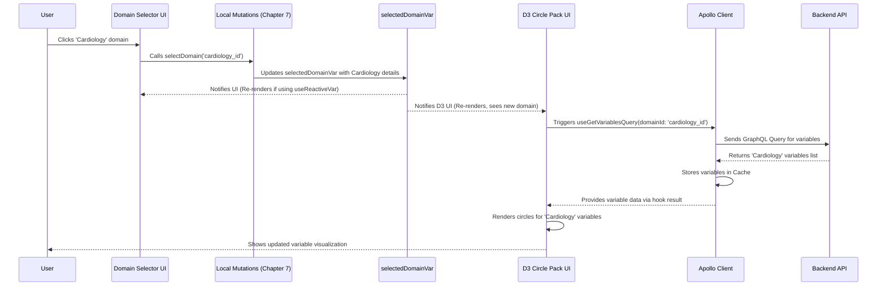

# Chapter 6: Apollo Client & Reactive Variables

In [Chapter 5: Main Application Component (`App.tsx`)](05_main_application_component___app_tsx___.md), we saw how `App.tsx` acts as the main orchestrator, setting up the overall structure and deciding which page to show. But how does the application actually talk to the backend server to fetch data like available domains or save your experiment? And how do different parts of the UI, like the variable selector and the list of selected variables, stay synchronized as you make choices?

## The Problem: Talking to the Outside World and Keeping Internal Notes

Think of our `portal-frontend` application like a busy research lab. It needs two key communication systems:

1.  **External Communication:** The lab needs to request materials (data) from a central supply (the backend server) and send finished reports (saved experiments) back to storage. How does it reliably send these requests and receive responses?
2.  **Internal Communication:** Different researchers (UI components) in the lab need to know what's currently being worked on. If one researcher selects a specific sample (dataset or variable), others working on the same project need to be aware of that selection immediately. How can they share this internal status information efficiently?

We need a system that handles both talking to the outside world (the backend API) and managing shared information *within* the application itself.

## The Solution: Apollo Client (The Post Office) & Reactive Variables (The Shared Whiteboard)

`portal-frontend` uses two main tools, working together, to manage these communication needs:

1.  **Apollo Client:** This is our application's specialized **post office** for interacting with the backend **GraphQL API**.
    *   It knows how to format requests (Queries to fetch data, Mutations to change data) in the GraphQL language that the backend understands.
    *   It sends these requests to the server.
    *   It receives the responses.
    *   It has a built-in **cache** (short-term memory) where it stores recently fetched data, which can make the app faster by avoiding repeat requests for the same information.

2.  **Reactive Variables (`makeVar`):** These are like shared **whiteboards** scattered around our lab (application). They hold pieces of information that are important for the UI's current state but don't necessarily need to be saved on the backend immediately. Examples include:
    *   Which domain is currently selected (`selectedDomainVar`).
    *   The experiment you are currently building (`draftExperimentVar`).
    *   Which variable circle the user is currently zoomed into (`zoomNodeVar`).
    *   The current login status (`sessionStateVar`).

    The key feature is that they are **reactive**: when the information on a whiteboard changes, any researcher (component) looking at that whiteboard automatically sees the update and reacts accordingly (re-renders).

Think of Apollo Client handling the formal communication with the outside world (backend), while Reactive Variables handle the dynamic, internal status updates that keep different parts of the UI in sync.

## Key Concepts Explained

Let's break these down further:

### 1. Apollo Client & GraphQL

*   **What is Apollo Client?** It's a JavaScript library that makes it easy for our frontend (built with React) to communicate with a backend that uses GraphQL. It handles sending requests, managing loading and error states, and caching data.
*   **What is GraphQL?** It's a query language for APIs. Instead of the backend deciding exactly what data to send, the frontend sends a GraphQL query asking for *specifically* the data fields it needs. This is efficient because we only transfer the data we require. We saw examples of the *structure* of data like `Experiment` in [Chapter 1: Experiment Data Structure](01_experiment_data_structure_.md); GraphQL is how we ask for that structured data.
*   **Queries:** These are requests to *fetch* data. We use special functions called "hooks" (like `useQuery` or more specific generated hooks like `useListDomainsQuery`) in our React components to trigger these requests.

    ```typescript
    // Simplified example of using a Query hook in a component
    import { useListDomainsQuery } from '../API/GraphQL/queries.generated';
    import { Spinner } from 'react-bootstrap';

    function DomainSelector() {
      const { data, loading, error } = useListDomainsQuery(); // Hook call

      if (loading) return <Spinner animation="border" />;
      if (error) return <p>Error loading domains!</p>;

      // 'data.domains' now contains the list fetched from the backend
      return (
        <select>
          {data?.domains?.map(domain => (
            <option key={domain.id} value={domain.id}>
              {domain.name}
            </option>
          ))}
        </select>
      );
    }
    ```
    This component uses the `useListDomainsQuery` hook. Apollo Client automatically sends the request, provides a `loading` status, any `error` that occurred, and finally the `data` when it arrives.

*   **Mutations:** These are requests to *change* data on the backend (create, update, delete). Similar to queries, we use hooks (like `useMutation` or generated hooks like `useCreateExperimentMutation`) to trigger these actions, usually in response to a user action like clicking a "Run" button.

    ```typescript
    // Simplified example of using a Mutation hook
    import { useCreateExperimentMutation } from '../API/GraphQL/queries.generated';
    import { Button } from 'react-bootstrap';
    import { draftExperimentVar } from '../API/GraphQL/cache'; // Our whiteboard var

    function RunExperimentButton() {
      // Get the mutation function and its loading/error state
      const [runExperiment, { loading }] = useCreateExperimentMutation();
      const currentDraft = useReactiveVar(draftExperimentVar); // Read from whiteboard

      const handleRunClick = () => {
        // Prepare the data to send (from our draft experiment)
        const experimentInput = { /* ... extract relevant fields from currentDraft ... */ };

        runExperiment({ // Call the mutation function
          variables: { data: experimentInput }
        })
        .then(response => {
          console.log("Experiment created!", response.data.createExperiment.id);
          // Maybe navigate to results page...
        })
        .catch(err => console.error("Error creating experiment:", err));
      };

      return (
        <Button onClick={handleRunClick} disabled={loading}>
          {loading ? 'Running...' : 'Run Experiment'}
        </Button>
      );
    }
    ```
    Here, clicking the button calls `runExperiment`, which Apollo Client sends to the backend as a mutation. The `variables` contain the data for the new experiment, often read from a reactive variable like `draftExperimentVar`.

*   **Cache:** Apollo Client automatically stores the results of queries in its `InMemoryCache`. If you ask for the same data again shortly after, Apollo might just give you the cached version instantly instead of asking the backend again. This makes the app feel faster. We configure how this cache behaves in `cache.tsx`.

### 2. Reactive Variables (`makeVar`)

*   **What are they?** They are a feature of Apollo Client used for managing *local* state – information that exists only within the frontend application and doesn't necessarily mirror data on the backend. They act like global variables, but with a superpower: components can subscribe to them.
*   **Creating Them:** We define reactive variables in `cache.tsx` using the `makeVar` function, giving each one an initial value.

    ```typescript
    // From: src/components/API/GraphQL/cache.tsx
    import { makeVar } from '@apollo/client';
    import { Domain, Experiment, initialExperiment } from './types.generated'; // Assuming types are defined

    // Define the 'selectedDomainVar' whiteboard, initially undefined
    export const selectedDomainVar = makeVar<Domain | undefined>(undefined);

    // Define the 'draftExperimentVar' whiteboard, starting with an empty experiment
    export const draftExperimentVar = makeVar<Experiment>(initialExperiment);

    // Define the 'sessionStateVar' whiteboard, starting in INIT state
    export const sessionStateVar = makeVar<SessionState>(SessionState.INIT);
    ```
    This creates our "whiteboards" and sets their starting content.

*   **Reading Them (`useReactiveVar`):** Components read the current value of a reactive variable using the `useReactiveVar` hook.

    ```typescript
    // Simplified component showing the currently selected domain name
    import { useReactiveVar } from '@apollo/client';
    import { selectedDomainVar } from '../API/GraphQL/cache';

    function CurrentDomainDisplay() {
      // Read the current value from the 'selectedDomainVar' whiteboard
      const currentDomain = useReactiveVar(selectedDomainVar);

      return (
        <div>
          Current Domain: {currentDomain ? currentDomain.name : 'None Selected'}
        </div>
      );
    }
    ```
    Crucially, if `selectedDomainVar` changes *anywhere* in the application, this `CurrentDomainDisplay` component will automatically re-render to show the new name.

*   **Writing Them:** We typically don't change reactive variables directly inside components. Instead, we use dedicated functions, which we call "Local State Mutations", grouped in `localMutations`. These functions contain the logic for updating the reactive variables safely. We'll dive deeper into these in [Chapter 7: Local State Mutations](07_local_state_mutations_.md). Conceptually, updating involves getting the current value and setting a new one:

    ```typescript
    // Conceptual example (Actual updates are in Chapter 7)
    import { selectedDomainVar } from './cache'; // The whiteboard variable

    function updateSelectedDomain(newDomain) {
      // Get the *function* that controls the variable
      const setDomain = selectedDomainVar;

      // Call the function with the new value to update the whiteboard
      setDomain(newDomain);
      console.log("Selected domain updated on the whiteboard!");
    }

    // Somewhere else in the UI, when a user clicks a domain button:
    // onClick={() => updateSelectedDomain(theClickedDomainObject)}
    ```

## How It's Used: Connecting Backend Data and UI State

Imagine you are in the [Experiment Workflow UIs](02_experiment_workflow_uis_.md) and you select 'Cardiology' as the domain.

1.  **User Action:** You click on the 'Cardiology' option in a dropdown.
2.  **Update Reactive Variable:** The click handler calls a function like `localMutations.selectDomain('cardiology_id')` (detailed in [Chapter 7: Local State Mutations](07_local_state_mutations_.md)). This function updates the `selectedDomainVar` reactive variable (our whiteboard) with the details of the 'Cardiology' domain.
3.  **UI Reacts:**
    *   A component displaying the current domain name (like `CurrentDomainDisplay` above) uses `useReactiveVar(selectedDomainVar)` and automatically re-renders to show "Cardiology".
    *   The [Variable Exploration UI (D3 Circle Pack)](03_variable_exploration_ui__d3_circle_pack__.md), which also uses `useReactiveVar(selectedDomainVar)`, sees the change and knows it needs to update.
4.  **Fetch Related Data:** The D3 Circle Pack component might *then* trigger an Apollo Client **Query** (e.g., `useGetVariablesForDomainQuery`) using the new `cardiology_id` from `selectedDomainVar`.
5.  **Apollo Client Fetches:** Apollo Client sends the GraphQL query to the backend, asking for the variables specific to 'Cardiology'.
6.  **Backend Responds:** The backend sends back the list of variables ('Age', 'Blood Pressure', etc.).
7.  **Apollo Client Caches & Updates:** Apollo Client receives the data, stores it in its cache, and provides it to the D3 Circle Pack component via the `useGetVariablesForDomainQuery` hook's `data` property.
8.  **UI Updates:** The D3 Circle Pack now uses this new data to draw the circles representing the 'Cardiology' variables.

In this flow, the Reactive Variable (`selectedDomainVar`) acted as the internal signal triggering UI updates, which in turn led to an Apollo Client Query fetching necessary data from the backend.

## Under the Hood: Setup and Flow

How is this system set up?

**1. Apollo Client Configuration (`apollo.config.tsx`)**

We need to tell Apollo Client where our backend GraphQL server is and how to handle things like caching and errors.

*(Code Reference: `src/components/API/GraphQL/apollo.config.tsx`)*

```typescript
// Simplified src/components/API/GraphQL/apollo.config.tsx
import { ApolloClient, from, HttpLink, InMemoryCache } from '@apollo/client';
import { graphQLURL } from '../RequestURLS'; // The backend API address
import errorLink from './links/errorLink'; // Custom error handling logic
import { cache } from './cache'; // Import the cache we define separately

// Create the main Apollo Client instance
export const apolloClient = new ApolloClient({
  // 'link' defines how requests are sent.
  // 'from' combines multiple links (like middleware).
  link: from([
    errorLink, // Handles errors globally
    new HttpLink({ // Specifies the actual HTTP connection
      uri: graphQLURL, // URL of our GraphQL backend
      credentials: 'include', // Send cookies (for sessions)
      // ... other headers
    }),
  ]),
  // Connect the client to our cache configuration
  cache: cache,
});
```
This sets up the connection (`HttpLink`) to the backend specified by `graphQLURL`, includes logic for handling errors (`errorLink`), and tells Apollo Client to use the `cache` we'll configure next.

**2. Cache and Reactive Variables Definition (`cache.tsx`)**

This is where we configure the cache behavior and, importantly, define our reactive variables ("whiteboards").

*(Code Reference: `src/components/API/GraphQL/cache.tsx`)*

```typescript
// Simplified src/components/API/GraphQL/cache.tsx
import { InMemoryCache, makeVar } from '@apollo/client';
import { SessionState } from '../../../utilities/types';
import { Configuration, Domain, Experiment, initialExperiment } from './types.generated';

// --- Reactive Variable Definitions ---
// Holds the current user session state (INIT, LOGGED_IN, etc.)
export const sessionStateVar = makeVar<SessionState>(SessionState.INIT);
// Holds the list of available domains fetched from backend
export const domainsVar = makeVar<Domain[]>([]);
// Holds the currently selected domain object
export const selectedDomainVar = makeVar<Domain | undefined>(undefined);
// Holds the experiment currently being built in the UI
export const draftExperimentVar = makeVar<Experiment>(initialExperiment);
// ... other reactive variables (zoomNodeVar, configurationVar, etc.)

// --- Cache Configuration ---
export const cacheConfig = {
  // Define possible types for GraphQL Unions (helps Apollo understand results)
  possibleTypes: {
    ResultUnion: [ /* List of possible result types, e.g., 'TableResult', 'BarChartResult' */ ],
    // ... other unions
  },
  // Specific rules for how certain types are cached
  typePolicies: {
    Query: { // Rules for caching top-level Query fields
      fields: {
        // Example: Always merge new configuration data with existing
        configuration: { merge: true },
      },
    },
    // ... rules for other types (e.g., disabling caching for weak entities)
  },
};

// Create the actual cache instance with our configuration
export const cache: InMemoryCache = new InMemoryCache(cacheConfig);
```
This file does two main things:
*   Uses `makeVar` to create each reactive variable needed for local UI state, setting its initial value.
*   Configures the `InMemoryCache` with rules about GraphQL types (`possibleTypes`) and caching behavior (`typePolicies`). This configured `cache` is then used by the `apolloClient` we saw earlier.

**3. Data Flow Diagram: Selecting a Domain**

Let's visualize the flow when a user selects a domain, updating both local state and triggering a data fetch:


This diagram shows the reactive variable (`selectedDomainVar`) update triggering UI changes, which then leads to Apollo Client fetching the necessary data from the backend.

## Conclusion

Apollo Client and Reactive Variables are the backbone of `portal-frontend`'s data management and state synchronization strategy.

*   **Apollo Client** acts as the robust communication channel to the backend GraphQL API, handling data fetching (Queries), data modification (Mutations), and caching results for better performance.
*   **Reactive Variables (`makeVar`)** provide a flexible way to manage local UI state – the dynamic information that components need to share, like user selections or draft data. Their "reactivity" ensures that components using `useReactiveVar` automatically update when the state changes, keeping the UI consistent.

Together, they form the application's central nervous system, coordinating external data flow and internal status updates. We've seen *how* to read reactive variables (`useReactiveVar`) and *what* they represent. But how do we *safely update* them when the user interacts with the UI?

Next up: [Chapter 7: Local State Mutations](07_local_state_mutations_.md)

---

Generated by [AI Codebase Knowledge Builder](https://github.com/The-Pocket/Tutorial-Codebase-Knowledge)