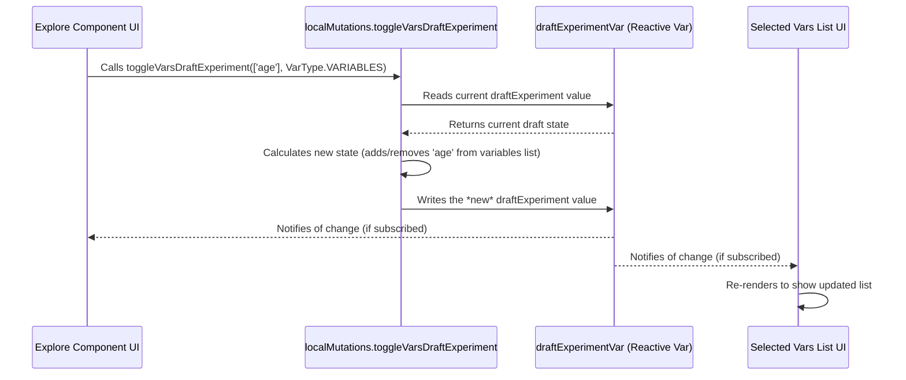

# Chapter 7: Local State Mutations

Welcome to the final chapter of our `portal-frontend` tutorial! In [Chapter 6: Apollo Client & Reactive Variables](06_apollo_client___reactive_variables_.md), we learned about Reactive Variables – the "shared whiteboards" like `draftExperimentVar` that hold the current state of our application, such as the experiment we're building.

But how should we *change* the information on these whiteboards? If every component just scribbled on them directly whenever it needed to, things could get messy and hard to track. Imagine multiple people trying to update the same whiteboard at once without any rules!

## The Problem: Keeping State Updates Organized

Let's think about our `draftExperimentVar` whiteboard, which holds the details of the analysis recipe we're creating ([Experiment Data Structure](01_experiment_data_structure_.md)). Several different UI components might need to update it:

*   The [Variable Exploration UI (D3 Circle Pack)](03_variable_exploration_ui__d3_circle_pack__.md) needs to add or remove variables when you click on the circles.
*   A dataset selection list needs to update the `datasets` field.
*   An algorithm selection component needs to update the `algorithm` field.

If each component contained its own logic for modifying `draftExperimentVar`, we'd have the same kind of update code scattered in many different files. If we ever needed to change *how* variables are added (maybe adding a new rule or validation), we'd have to find and update the code in multiple places. This is inefficient and prone to errors.

## The Solution: Dedicated State Update Functions

To keep things clean and organized, `portal-frontend` uses **Local State Mutations**.

Think of Reactive Variables like important settings for our application. Instead of letting anyone change these settings directly from anywhere, we create a specific set of **"setter" functions** – the Local State Mutations.

These are dedicated JavaScript functions designed for one purpose: to update a specific piece of our local state (a Reactive Variable) in a controlled and predictable way.

Key Ideas:

1.  **Centralized Logic:** All the code for modifying a specific piece of state (like the list of variables in `draftExperimentVar`) lives in *one place* – within its dedicated mutation function.
2.  **Clear Purpose:** Each function has a clear name indicating what it does (e.g., `toggleVarsDraftExperiment`, `selectDomain`, `updateDraftExperiment`).
3.  **Consistent Updates:** Components don't modify state directly. They *call* the appropriate local mutation function. This ensures updates always happen the same way, following the logic defined within that function.
4.  **Easier Maintenance:** If we need to change how the state is updated, we only need to modify the single mutation function, not hunt through many different UI components.

It's like having a dedicated "Settings Manager" for our application's internal state. Components tell the Settings Manager *what* change they want (e.g., "add this variable"), and the Manager handles the actual update according to the established rules.

## How to Use Local State Mutations

Using these functions from a UI component is straightforward. You typically import the collection of mutations and call the specific function you need, passing any required arguments.

Let's revisit the example of adding a variable from the [Variable Exploration UI (D3 Circle Pack)](03_variable_exploration_ui__d3_circle_pack__.md).

1.  **Import the Mutations:** First, the component needs access to the collection of local mutation functions.

    ```typescript
    // In a component like src/components/ExperimentExplore/Explore.tsx
    import { localMutations } from '../../API/GraphQL/operations/mutations';
    import { VarType } from '../../API/GraphQL/operations/mutations/experiments/toggleVarsExperiment';
    ```
    This imports the `localMutations` object, which contains all our dedicated setter functions.

2.  **Call the Mutation:** When the user clicks a variable circle (let's say the variable ID is `'age'`), the event handler calls the appropriate function from `localMutations`.

    ```typescript
    // Inside the component's event handler for clicking a variable node
    const handleAddVariableClick = (variableId: string) => {
      // Call the dedicated function to add/remove the variable
      // Pass the variable ID and specify it's for the main 'variables' list
      localMutations.toggleVarsDraftExperiment([variableId], VarType.VARIABLES);

      console.log(`Told localMutations to toggle variable: ${variableId}`);
    };

    // Example Usage:
    // Imagine a button calls this:
    // <button onClick={() => handleAddVariableClick('age')}>Toggle Age Variable</button>
    ```
    *   **Input:** We call `toggleVarsDraftExperiment` with the variable ID (`['age']`) and the type (`VarType.VARIABLES`) indicating which list within the `draftExperimentVar` should be updated.
    *   **Output (Effect):** This call doesn't directly return a value to the component. Instead, it triggers an update to the `draftExperimentVar` reactive variable behind the scenes. Any component subscribed to `draftExperimentVar` (using `useReactiveVar` as seen in [Chapter 6: Apollo Client & Reactive Variables](06_apollo_client___reactive_variables_.md)) will automatically re-render to reflect the change (e.g., the list of selected variables updates).

By calling `localMutations.toggleVarsDraftExperiment`, the component delegates the task of updating the state. It doesn't need to know the messy details of *how* the `draftExperimentVar` is modified; it just trusts the mutation function to do it correctly.

## Under the Hood: How Mutations Work

Let's peek behind the curtain to see what happens when `localMutations.toggleVarsDraftExperiment` is called.

**1. The Flow: Step-by-Step**

When a UI component calls a local mutation function:

1.  **Function Call:** The specific function (e.g., `toggleVarsDraftExperiment`) inside the `localMutations` object is executed.
2.  **Read Current State:** The function first reads the *current* value of the Reactive Variable it's designed to modify (e.g., it reads the current state of `draftExperimentVar`).
3.  **Calculate New State:** It uses the input arguments (e.g., the variable ID `'age'` and type `VarType.VARIABLES`) and the current state to figure out what the *new* state should be. For `toggleVarsDraftExperiment`, this means adding `'age'` to the `variables` array if it's not there, or removing it if it is. It might also involve other logic, like ensuring a variable isn't in both `variables` and `coVariables` simultaneously.
4.  **Write New State:** The function then writes this newly calculated state back to the Reactive Variable. This is the crucial step that triggers the "reactivity" – Apollo Client notifies all subscribed components about the change.

**2. Sequence Diagram: Toggling a Variable**

This diagram shows the interaction:



The UI component initiates the change by calling the Local Mutation. The mutation function handles the read-calculate-write cycle on the Reactive Variable, and the reactive system ensures other interested components (like the `VarListUI`) are updated.

**3. Code Implementation: Inside the Mutations**

*   **Central Hub (`index.tsx`):** The `localMutations` object itself is assembled in one place, making it easy to see all available mutations. It imports factory functions (`create...`) that set up the actual mutation logic, injecting the necessary Reactive Variables.

    *(Code Reference: `src/components/API/GraphQL/operations/mutations/index.tsx`)*

    ```typescript
    // Simplified src/components/API/GraphQL/operations/mutations/index.tsx

    // Import the reactive variables ("whiteboards")
    import { draftExperimentVar, selectedDomainVar, /* ... other vars */ } from '../../cache';

    // Import factory functions that create the actual mutation logic
    import createSelectDomain from './common/selectDomain';
    import createToggleVarsExperiment from './experiments/toggleVarsExperiment';
    import createUpdateExperiment from './experiments/updateExperiment';
    // ... other factory imports

    // Create the specific mutation functions, passing the relevant reactive vars
    const selectDomain = createSelectDomain(selectedDomainVar, /* ... other needed vars */);
    const toggleVarsDraftExperiment = createToggleVarsExperiment(draftExperimentVar);
    const updateDraftExperiment = createUpdateExperiment(draftExperimentVar);

    // Assemble the final object that components will import and use
    export const localMutations = {
      selectDomain, // Function to select a domain
      toggleVarsDraftExperiment, // Function to add/remove variables from draft
      updateDraftExperiment, // Function to update other draft properties
      // ... other mutation functions
    };
    ```
    This file acts as an export hub. It uses `create...` functions (factories) to generate the actual mutation logic, ensuring each mutation function knows which Reactive Variable(s) it needs to interact with.

*   **Mutation Logic (`toggleVarsExperiment.tsx`):** Let's look at a simplified version of the function that handles adding/removing variables.

    *(Code Reference: `src/components/API/GraphQL/operations/mutations/experiments/toggleVarsExperiment.tsx`)*

    ```typescript
    // Simplified src/components/API/GraphQL/operations/mutations/experiments/toggleVarsExperiment.tsx
    import { ReactiveVar } from '@apollo/client';
    import { Experiment } from '../../../types.generated';

    // Enum to define which list to modify
    export enum VarType {
      VARIABLES = 'variables',
      COVARIATES = 'coVariables',
      // ... other types
    }

    // Factory function: takes the reactive var and returns the actual mutation function
    export default function createToggleVarsExperiment(
      experimentVar: ReactiveVar<Experiment> // The draftExperimentVar is passed here
    ) {
      // This is the actual function components will call via localMutations
      return (vars: string[], type: VarType): void => {
        // 1. Read current state from the reactive variable
        const currentExperiment = experimentVar();
        const oldData = currentExperiment[type] ?? []; // Get current list (e.g., variables)

        // 2. Calculate new state
        const newExperiment = { ...currentExperiment }; // Create a copy to modify
        const varsToAdd = vars.filter((v) => !oldData.includes(v));
        const varsToKeep = oldData.filter((v) => !vars.includes(v));
        newExperiment[type] = [...varsToKeep, ...varsToAdd]; // Update the list

        // Example: Ensure var isn't in both variables and coVariables
        if (type === VarType.VARIABLES) {
          newExperiment.coVariables = newExperiment.coVariables?.filter(
             v => !newExperiment.variables.includes(v)
          );
        }
        // ... (similar logic if type is COVARIATES)

        // 3. Write the new state back to the reactive variable
        experimentVar(newExperiment);
      };
    }
    ```
    This code shows the core pattern:
    1.  The `createToggleVarsExperiment` function receives the `draftExperimentVar` (as `experimentVar`).
    2.  It returns the *actual* mutation function that components will call.
    3.  This inner function reads the current experiment state using `experimentVar()`.
    4.  It calculates the `newExperiment` state by adding/removing the specified `vars` from the correct list (`type`). It also includes extra logic (like preventing duplicates across lists).
    5.  It writes the `newExperiment` back using `experimentVar(newExperiment)`, triggering the reactive update.

## Conclusion

Local State Mutations provide a clean, centralized, and predictable way to manage updates to our application's local state (held in [Apollo Client & Reactive Variables](06_apollo_client___reactive_variables_.md)). Instead of components directly manipulating state, they call dedicated "setter" functions (like `toggleVarsDraftExperiment` or `selectDomain`) located in `localMutations`. This encapsulates the update logic, making the application easier to understand, debug, and maintain.

Throughout this tutorial, we've journeyed through the core concepts of `portal-frontend`:

*   How analysis information is structured ([Experiment Data Structure](01_experiment_data_structure_.md))
*   How users navigate the analysis setup process ([Experiment Workflow UIs](02_experiment_workflow_uis_.md))
*   How interactive tools help explore data ([Variable Exploration UI (D3 Circle Pack)](03_variable_exploration_ui__d3_circle_pack__.md))
*   How diverse results are displayed ([Result Dispatcher & Visualizations](04_result_dispatcher___visualizations_.md))
*   How the application is orchestrated ([Main Application Component (`App.tsx`)](05_main_application_component___app_tsx___.md))
*   How data is managed internally and fetched externally ([Apollo Client & Reactive Variables](06_apollo_client___reactive_variables_.md))
*   And finally, how local state changes are handled cleanly ([Local State Mutations](07_local_state_mutations_.md)).

Understanding these key pieces provides a solid foundation for working with and contributing to the `portal-frontend` project. Happy coding!

---

Generated by [AI Codebase Knowledge Builder](https://github.com/The-Pocket/Tutorial-Codebase-Knowledge)