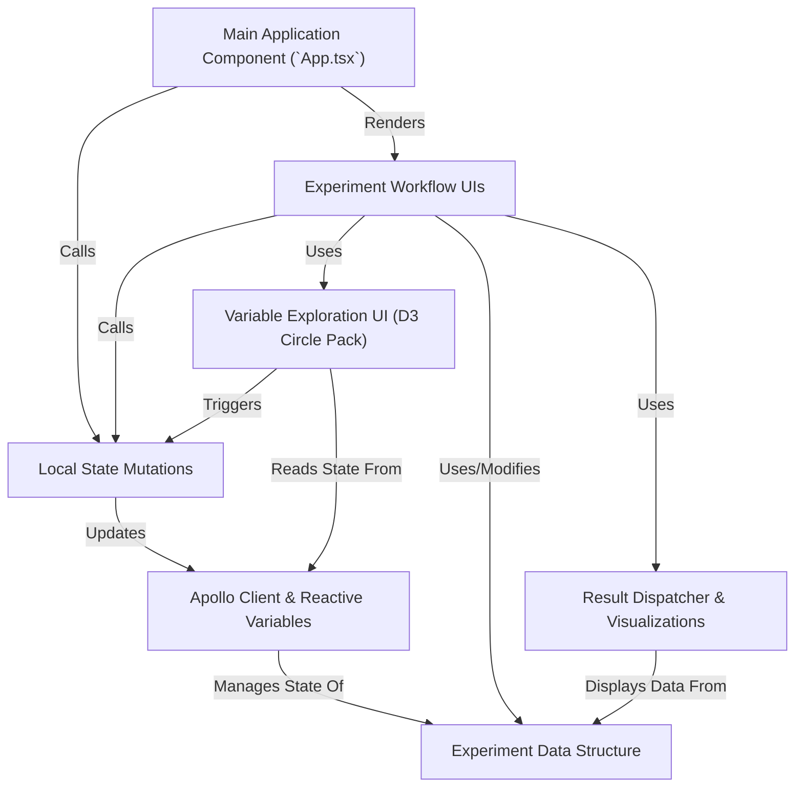

# Tutorial: portal-frontend

This project is a **web interface** for performing data analysis, referred to as *Experiments*.
Users can visually **explore** available data and variables, select datasets, define analysis steps including algorithms and parameters, and finally **view** the *results* presented through various visualizations like tables and charts.
It uses *Apollo Client* to communicate with a backend server and manage the application's **state**, such as the *experiment* currently being configured.

**Source Repository:** [https://github.com/HBPMedical/portal-frontend](https://github.com/HBPMedical/portal-frontend)

## Chapters

1. [Experiment Data Structure
](01_experiment_data_structure_.md)
2. [Experiment Workflow UIs
](02_experiment_workflow_uis_.md)
3. [Variable Exploration UI (D3 Circle Pack)
](03_variable_exploration_ui__d3_circle_pack__.md)
4. [Result Dispatcher & Visualizations
](04_result_dispatcher___visualizations_.md)
5. [Main Application Component (`App.tsx`)
](05_main_application_component___app_tsx___.md)
6. [Apollo Client & Reactive Variables
](06_apollo_client___reactive_variables_.md)
7. [Local State Mutations
](07_local_state_mutations_.md)

---

Generated by [AI Codebase Knowledge Builder](https://github.com/The-Pocket/Tutorial-Codebase-Knowledge)